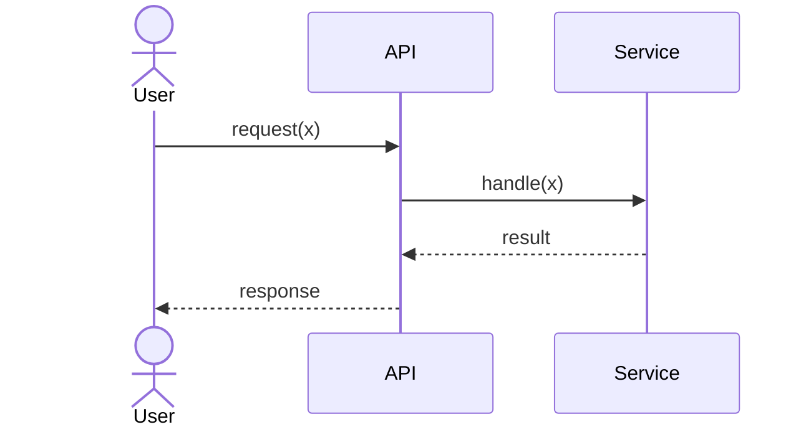
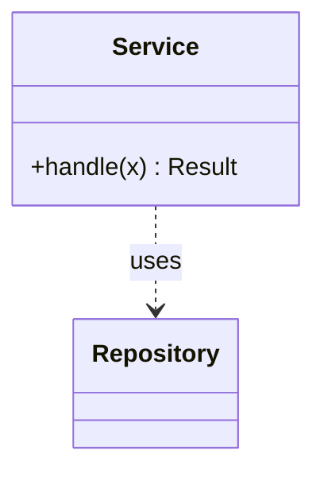
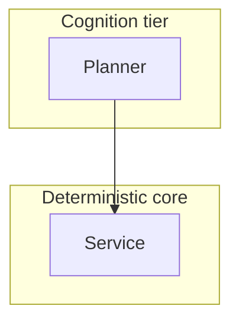
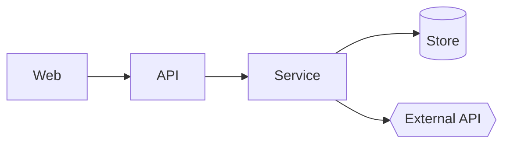

# Documentation bundle — structure & freshness wiring

*Template for the `/document` skill. The Documentation Steward emits this layout, then keeps it current via the hook or CI job below. Replace placeholders; delete what does not apply.*

## Bundle layout

```
docs/
├─ index.md                  # entry point: what this is, how to read it, coverage % + confidence summary
├─ architecture.md           # prose overview + the layered & component diagrams (Mermaid)
├─ api/                       # JavaDoc-style API reference, one file per namespace/module/package
│  ├─ <module-a>.md           #   per public type/member: summary · params · returns · throws · examples · remarks · see-also
│  └─ <module-b>.md
├─ diagrams/
│  ├─ sequence-<flow>.md      # one per key flow (Mermaid sequenceDiagram)
│  ├─ class-<module>.md       # type relationships (Mermaid classDiagram)
│  ├─ layered-architecture.md # LOA tiers / layers with dependency direction (Mermaid)
│  └─ component.md            # modules + real dependency edges + external systems (Mermaid)
├─ index.html                # the Docs Explorer — the MAP of the whole graph (from
│                             #   docs-explorer.template.html; hierarchy · graph · mind map)
├─ docs-index.js             # the graph: one typed entry per artifact, every type — the
│                             #   single source the Explorer renders (knowledge-visualization.md V2)
├─ _site/
│  └─ index.html             # self-contained close-up view of THIS bundle (from doc-viewer.template.html)
└─ _meta.json                # { "documented_sha": "...", "generated": "ISO-8601",
                              #   "coverage": { "public_members": N, "documented": M },
                              #   "doc_roots": ["src/**"], "gate": "warn" | "fail" }
```

## API entry shape (JavaDoc-style, language-neutral)

```markdown
### `TypeName.MemberName(params)`            <!-- signature -->
One-line summary (from the code's own doc comment — not invented).

**Parameters** — `name` (`Type`): description · …
**Returns** — `Type`: description
**Throws / Errors** — `ErrorType`: when it occurs · …
**Example**
​```<lang>
// a real, compilable/runnable example
​```
**Remarks** — caveats, thread-safety, complexity, lifecycle.
**See also** — `RelatedType`, `docs/diagrams/sequence-<flow>.md`.
```

Source the prose from the language's doc comments: **C#** XML-doc (`///`), **TS/JS** JSDoc/TSDoc, **Python** docstrings, **Kotlin** KDoc, **Swift** doc comments. A public member with no doc comment is a recorded **coverage gap**, never fabricated.

## Diagram families (Mermaid — renders on GitHub and in `_site`)

````markdown
<!-- sequence -->


<!-- class -->


<!-- layered architecture (map to LOA tiers T0–T4 if used) -->


<!-- component -->

````

---

## Freshness wiring — pick ONE (the team's choice, recorded in `_meta.json.gate`)

The check is **deterministic**: compare source changed since `documented_sha` against whether `docs/` was updated in the same range — `docs/docs-index.js` is part of the bundle, so a stale index fails the same gate. *Regeneration itself is performed by the assistant running `/document --changed`* (the Documentation Steward) — e.g. `claude -p "/document --changed"` headless, or the Copilot prompt. The hook/CI is the trigger and the gate.

### Option A — git hook (`.git/hooks/pre-push`, or `post-commit` for a softer nudge)

```bash
#!/usr/bin/env bash
# Fails the push (gate=fail) or warns (gate=warn) when source changed but docs did not.
set -euo pipefail
meta="docs/_meta.json"
[ -f "$meta" ] || { echo "docs: no bundle yet — run /document"; exit 0; }
base="$(grep -o '"documented_sha"[ ]*:[ ]*"[^"]*"' "$meta" | sed 's/.*"\([0-9a-f]\{7,\}\)".*/\1/')"
gate="$(grep -o '"gate"[ ]*:[ ]*"[^"]*"' "$meta" | sed 's/.*"\(warn\|fail\)".*/\1/')"; gate="${gate:-warn}"
[ -n "$base" ] || exit 0
# doc roots: read from _meta.json (default src/**). Compare changed source vs docs.
src_changed="$(git diff --name-only "$base"..HEAD -- 'src/**' '*.cs' '*.ts' '*.py' '*.kt' '*.swift' 2>/dev/null | grep -v '^docs/' || true)"
docs_changed="$(git diff --name-only "$base"..HEAD -- 'docs/**' 2>/dev/null || true)"
# time-based + graph health (V13/V16/V18): stale review-by, pending flags, orphans
python3 docs/ai-forward-pack/scripts/docs-graph.py freshness --gate "$gate" || exit 1
if [ -n "$src_changed" ] && [ -z "$docs_changed" ]; then
  echo "docs: source changed since $base but the documentation bundle was not updated."
  echo "      run:  /document --changed   (then commit docs/)"
  [ "$gate" = "fail" ] && { echo "      (gate=fail) blocking push."; exit 1; }
  echo "      (gate=warn) allowing push."
fi
exit 0
```

Install: `cp this docs/hooks/pre-push .git/hooks/pre-push && chmod +x .git/hooks/pre-push` (or wire via your hook manager / `core.hooksPath`).

### Option B — CI (`.github/workflows/docs.yml`, on push)

```yaml
name: docs-freshness
on: { push: { branches: ["**"] } }
jobs:
  docs:
    runs-on: ubuntu-latest
    steps:
      - uses: actions/checkout@v4
        with: { fetch-depth: 0 }
      - name: Check bundle freshness
        run: bash docs/hooks/pre-push   # same deterministic check; gate=fail blocks the build
      # Optional regeneration step (requires an assistant runner / token configured by the team):
      # - name: Regenerate docs
      #   run: claude -p "/document --changed"
      # - name: Commit refreshed bundle
      #   run: |
      #     git config user.name  "docs-bot"
      #     git config user.email "docs-bot@users.noreply.github.com"
      #     git add docs/ && git commit -m "docs: refresh bundle" && git push || echo "nothing to refresh"
```

After a successful `/document` run, write the current `HEAD` into `_meta.json.documented_sha` so the next check has a clean baseline.

---

## Browsable views — the map and the close-up
- **The map:** `docs/index.html` is the **Docs Explorer** (from `templates/docs-explorer.template.html`) — the standard toolkit that renders `docs-index.js` as hierarchy, graph, and mind-map projections with typed links and Mermaid diagrams (knowledge-visualization.md V4–V9). It navigates *everything* — specs, architecture, ADRs, designs, investigations, proofs, knowledge, and this bundle.
- **The close-up:** `docs/_site/index.html` is generated from `templates/doc-viewer.template.html` — a self-contained file that renders this bundle's markdown + Mermaid with navigation and opens via `file://` (no build, no server). The Explorer's `doc` entries link to it.
