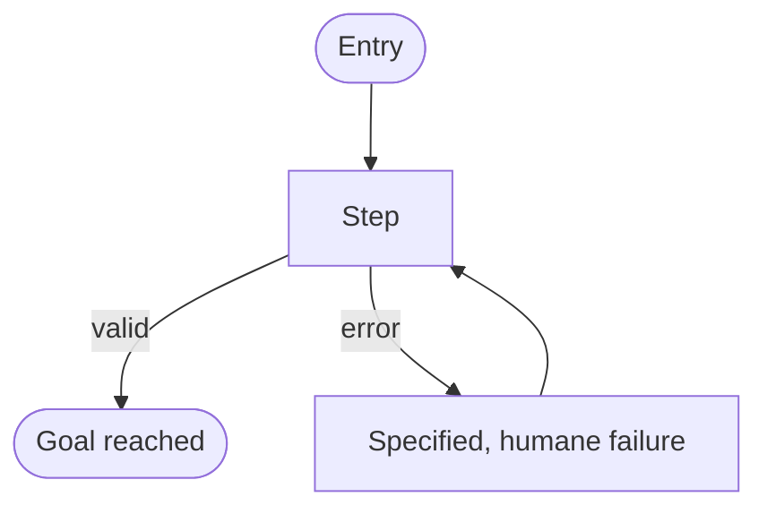

<!--
TEMPLATE: Product Specification — produced by /specify
Copy to docs/specs/<feature>.md. The spec is the *what* and *why*, never the *how*.
It is a committed artifact and the unit of governance everything downstream answers to.
Delete these comments as you fill each section. Every load-bearing claim carries a
confidence label: [Verified] (sourced/executed), [Inferred] (reasoned, not confirmed),
[Flagged] (unknown/at-risk). No Confident Guesses.
-->

# Spec: <feature name>

<!-- ONE spec, THREE explicit layers (UI & Interaction Design Standard + the formal models):
  • FUNCTIONAL — what & why (ISO/IEC/IEEE 29148 + user stories / Gherkin; ISO 25010 NFRs). Always present.
  • UX SPECIFICATION — how it WORKS (Garrett Structure+Skeleton: information architecture, user flows,
    wireframe-level structure). Present when the change has a user-facing surface; else marked N/A with reason.
  • UI SPECIFICATION — how it LOOKS (Garrett Surface + the U-standard: visual design, tokens, component
    states, motion). Present when there is a visual UI; gated behind a settled UX spec; else N/A with reason.
  UX precedes UI: do not specify the Surface before the Structure is sound. Different owners:
  Functional → Product Strategist; UX → UX Researcher / IA; UI → UX & Accessibility. -->

- **Status:** Draft | In review | Accepted
- **Tier (cost-of-error):** T0 | T1 | T2  <!-- Rules of the Road §0.2 -->
- **Author(s) / date:**
- **Supersedes / related:**

## Part A — Functional specification
*What the product must do and why. Governing model: ISO/IEC/IEEE 29148 (requirements) + user stories with Gherkin acceptance criteria. Owner: Product Strategist.*

### Problem
<!-- The user's problem, stated independently of any solution. If the prompt arrived
as a solution, state the underlying problem it was trying to solve. -->

### Target users & personas
<!-- Who this is for and the job-to-be-done. If multiple, name the primary. The UX Researcher / IA
lens deepens these into full personas in Part B when there is a user-facing surface. -->
<!-- Who this is for. If multiple, name the primary. -->

### Core scenario
<!-- BoK §II.1. The one path that, if it works end to end, the product is worth building.
Write it as a concrete narrative, not a feature list. -->

### In scope / Out of scope (explicit non-goals)
- **In:**
- **Out (non-goals):**  <!-- Explicit non-goals are as load-bearing as goals. -->

### User stories & acceptance criteria (testable)
<!-- Functional requirements as user stories, each with falsifiable acceptance criteria in
**Gherkin** (Given / When / Then) — context, action, observable outcome. Prefer specific thresholds
("p95 < 500 ms") over adjectives ("fast"). Cover the happy path AND the error/denial cases. Each
criterion is traceable to a future test (Engineering Governance §1: requirement → spec → test); the
Test Architect must be able to accept each. If a story needs ≥4 criteria, consider splitting it. -->

**US-1 — As a `<user type>`, I want `<action>` so that `<benefit>`.**
- **Given** `<context>` **When** `<action>` **Then** `<observable, checkable outcome>`
- **Given** `<error/edge context>` **When** `<action>` **Then** `<humane, specified failure>`

**US-2 — …**

### Non-functional requirements (ISO/IEC 25010 checklist)
<!-- One line per applicable attribute — the cheap insurance against rework. Each as a measurable
threshold, not an adjective. Mark N/A explicitly where it truly does not apply. -->
| Attribute | Requirement (measurable) |
|---|---|
| Performance efficiency | "<p95 latency / throughput / resource budget>" |
| Reliability | "<availability / recovery / fault tolerance>" |
| Security | "<authn/z, data protection — ties to Part A threat lens>" |
| Usability | "<learnability / error-prevention — deepened in Part B>" |
| Compatibility | "<interop / platform support>" |
| Maintainability | "<modularity / testability>" |
| Portability | "<adaptability / installability>" |

### Boundary set
<!-- The inputs that define correctness at the edges: empty, max, malformed, hostile,
concurrent, the unhappy paths. These become the test matrix downstream. -->

### Comparables & user evidence (sourced)
<!-- What existing products do for this problem, and the real user need — each NAMED,
with a source and a confidence label. A comparable recalled from memory is [Flagged],
not [Verified], until a source confirms it. -->
| Claim | Source | Confidence |
|---|---|---|
|  |  |  |

### Applicable governance lenses
<!-- Walk the Engineering Governance checklist. Mark which SDLC lenses apply; a lens
that applies but has no answer is a gap to close, not a line to delete. -->
- [ ] Quality attributes / NFRs
- [ ] Threat model (STRIDE) — required if identity, PII, money, or irreversible action
- [ ] Privacy & data governance
- [ ] Accessibility
- [ ] Performance budget
- [ ] Release / rollback / migration
- [ ] Observability

### AI-integrated allocation (if applicable)
<!-- LOA Part VI. Name the archetype and the capability tier allocation for any part
that uses a model; justify the cheapest sufficient tier (LOA P1). -->
- **Archetype:**
- **Tier allocation:**

## Part B — UX specification
*How it **works** — the experience beneath the visual surface. Governing model: Garrett **Structure + Skeleton** (information architecture, interaction design, user flows, wireframe-level structure). Owner: **UX Researcher / Information Architect**. Present when the change has a user-facing surface on any medium; otherwise: **N/A — `<reason>`** (e.g. "backend-only; no human-facing surface").*

<!-- This layer GATES Part C: do not specify the Surface (Part C) before this Structure is coherent.
The UX-specification veto blocks a user-facing change that lacks evidenced need, a coherent IA, and
user flows covering the alternate/error/recovery paths — not just the happy one. Draw the flows; do
not describe them in prose. If this layer grows large, promote it to docs/specs/<feature>-ux.md (type
spec, `documents` link back) and summarize here. -->

### Personas & jobs-to-be-done (deepened)
<!-- The real progress a person is trying to make, evidenced (research/comparables), not assumed.
Deepen the Part A personas: context, expertise, constraints, the success definition from the USER's side. -->

### Information architecture
<!-- Categorization (how content/functions group), hierarchy (order & importance), navigation
(the pathways), labeling (the words for things — these feed the glossary, V14). -->

### User flows (happy + alternate + error + recovery)
<!-- The sequence of steps and decision points from entry to task completion. Cover the happy path
AND the alternate, empty, error, permission-denied, interrupted, and recovery paths. Drawn as a
Mermaid flowchart — the codified form — not prose. The "buried export button" findability test lives
here: can the target user reach the goal without guessing? Where are the dead ends? -->

### Wireframe-level structure (Skeleton)
<!-- What goes where and WHY — the arrangement of information and interface elements, deliberately
WITHOUT visual styling, so the UI layer applies Surface to a sound structure. A simple block list or
ASCII sketch per key view is enough; fidelity is low by intent. -->

### UX acceptance criteria (falsifiable)
<!-- Each a checkable statement about how the experience WORKS, traceable to a flow above and to a
future test. E.g. "the user reaches checkout in ≤ 2 steps from any product page"; "every flow has a
specified recovery path from its error state". -->

## Part C — UI specification
*How it **looks** — the visual surface. Governing model: Garrett **Surface** + the **UI & Interaction Design Standard** (`ui-interaction-design.md`, U1–U20). Owner: **UX & Accessibility**. Present when there is a visual UI; **gated behind a settled Part B**; otherwise: **N/A — `<reason>`** (e.g. "CLI only — see Part B for CLI interaction; no visual surface").*

<!-- This layer is specified to U1–U20; it does not duplicate them. It carries the UI INTENT and
acceptance criteria — the full visual design is produced in /design and built in /implement. The
UX & Accessibility lens holds the U16 accessibility (WCAG 2.2 AA) veto. -->

### UI Archetype Signature (the determinism selector)
<!-- The chosen UI archetype from the UI Archetype Catalog (ui-archetype-catalog.md), recorded as its
canonical Archetype Signature (ui-archetype-grammar.md), with any facet deviations noted (G9). -->
- **Archetype:** <e.g. A2 · Secure Checkout Pipeline>
- **Signature:** `<the Archetype Signature, with deviations noted>`
- **Selection:** <"user-specified" — or, when auto-selected because no UX template was named:
  **"auto-selected from the JTBD"** + the one-line rationale mapping the dominant job-to-be-done to
  this archetype family/row. This rationale is also surfaced in the /specify summary to the user.>

### Medium(s) & platform guidelines
<!-- web / native desktop / mobile / CLI / voice — and the authoritative HIG per medium (Apple HIG,
Material, Fluent, GNOME, CLI conventions). Excellence is judged relative to the medium (U2). -->

### Visual intent & tokens
<!-- The token references this UI uses, or the new primitive/semantic/component tokens it introduces —
no arbitrary values (U3–U5). The experience qualities the surface must hit (defining adjectives and
their opposites). -->

### Key screens & complete component states
<!-- Per key screen: the focal point and hierarchy (U6). The COMPLETE per-component state set —
default / hover / focus / active / disabled / loading / empty / error / success + first-run / overflow
(U9, the most common place polish is missing). -->

### Motion, copy, accessibility & performance
<!-- Motion intent + reduced-motion (U10); the real in-voice UI copy for load-bearing strings (U11);
WCAG 2.2 AA approach (U16); the performance budget for the medium (U17). -->

### AI-UX (AI-facing UIs only)
<!-- Applicable HAX guidelines (G1–G18) and Shape-of-AI patterns (Wayfinders / Tuners / Governors /
Trust builders / Identifiers); the wrong answer and uncertainty designed as first-class states
(U13–U15). -->

### UI acceptance criteria (falsifiable)
<!-- E.g. "all interactive targets meet contrast AA"; "the empty state guides the user to first action";
"the AI shows an action plan before any irreversible step". -->

## Flagged risks & residual unknowns
<!-- Everything still [Flagged]. For each, the cheapest next probe that would resolve it. -->

## Gate record
<!-- Rules of the Road §3.2. Adversarial review: Simplifier (scope/gold-plating),
Test Architect (functional criteria verifiable — hard veto), UX Researcher/IA (UX layer: flow integrity, IA, unhappy-path coverage — veto, if user-facing), UX & Accessibility (UI layer: state completeness, tokens, WCAG AA — veto, if visual UI), Security (if identity/PII — hard veto).
Authors did NOT clear their own hard veto. -->
`GATE specify · <date> · <personas> · criteria met: <…> · verdict: <pass/block> · vetoes→resolution: <…>`

---
**Handoff:** → `/define-architecture` (new/load-bearing system) or → `/design` (feature within an existing architecture).
