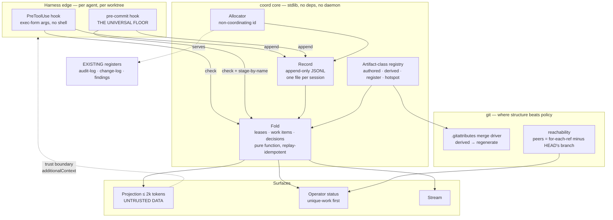

# Architecture: Agent coordination

- **Status:** Draft
- **Tier (cost-of-error):** **T2** — on the edit path of every agent in every repo, federated by the pack, with silent work loss and false-green as its own failure modes.
- **Deciders:** Enterprise Architect, Distributed Systems Architect, Security & Identity Architect, Data & Persistence Architect, Tech Lead, Domain Researcher (peers) → full council + Patterns Expert + SRE (adversaries)
- **Date:** 2026-08-20
- **Implements:** [`spec-agent-coordination`](specs/agent-coordination.md) · **Refines:** [`architecture`](architecture.md)

> **Grounding trace (V15):** `architecture-agent-coordination` → `implements` → `spec-agent-coordination` (the four failure modes M1–M4, the nine stories, the twelve NFRs) → `refines` → `architecture` (this repo's pack-source/live-install shape, which constrains where the layer may live) → `relates-to` → `defect-classes`, `audit-log`. The spec's three **conditions of pass** are the agenda of this document: the STRIDE pass (§7), the F8 reconciliation (§8), and the F1 harness spike (§4.2).

---

## 0. What the spikes changed

Six spikes were executed against the installed toolchain. **Four of them overturned the answer this architecture would otherwise have taken**, which is the whole argument for the Spike Protocol.

| # | Question | What was executed | Result | What it changed |
|---|---|---|---|---|
| **S1** | Use `uuid.uuid7` for the allocator? | `python -c "import uuid; uuid.uuid7()"` on the installed interpreter | **3.12.10 → `AttributeError`.** `uuid7` landed in 3.14. The CI workflow pins `python-version: "3.x"`, i.e. *whatever is newest* | **Rejected.** A stdlib call that exists on the runner and not on the developer's machine is `PACK-J` by construction. Hand-rolled instead (S1b) |
| **S1b** | Can a stdlib-only id survive the condition that defeated the branch scanner? | 8 separate processes × 500 ids, **all pinned to the same millisecond**, no shared state, no network | **4,000 issued, 4,000 unique, 0 collisions** | Confirms ADR-0008. 48-bit ms + 80 random bits, Crockford base32, 26 chars, time-sortable |
| **S2** | Is a daemon or SQLite read model needed to hit < 100 ms p95 on the edit path? | Full fold of a **10,000-event, 1.45 MB, 12-file** record then a glob match, invoked **as a subprocess** the way a hook actually invokes it | **median 45 ms, p95 47 ms.** Bare `python -c pass` is already 14 ms of that. An amortised snapshot gets to 22 ms / 27 ms | **The daemon and the database are both cut.** The naive fold meets the budget with 2× headroom, which sets the compaction trigger |
| **S3** | Does a shared append-only file corrupt under concurrent writers on Windows? | 6 processes × 200 records × ~4 kB through one `O_APPEND` fd | **1,200 lines, 0 unparseable, 0 interleaved** | One-file-per-session is kept for *reviewability*, not for safety. The real hazard is the `LOG-A` seam, not interleaving |
| **S4** | What actually detects "work that exists in exactly one place"? | Reproduced the recorded guard bug in a scratch repo | `git rev-list HEAD --not --all` → **0** on a branch holding 1 unique commit. **`--all` implicitly includes HEAD**, so the expression is `HEAD --not HEAD`. `--exclude=<branch> --all` fails the same way, because it does not exclude HEAD | The mechanism is named exactly in ADR-0012, and `--all` is **forbidden** in this expression |
| **S5** | Can a `PreToolUse` hook actually refuse an edit, and what is the contract? | Authoritative settings schema read; hook program executed against the real payload across five cases | `hookSpecificOutput.permissionDecision: allow\|deny\|ask` + `permissionDecisionReason`. All five cases correct, including both fail-safe paths | Closes half of spec condition F1. Also surfaced `args` exec-form, the `if` pre-filter, and `additionalContext` — see §4.2 |
| **S6** | Can a merge driver resolve derived-file conflicts without touching authored files? | `.gitattributes` `merge=regenerate` driver, two branches changing both a derived and an authored file | Derived file resolved clean and **absent from the unmerged list**; the authored file **still conflicted normally** | M1 is solvable *at merge time*, not only by a post-hoc script. Scoping is exact |

**A seventh result, found by accident and kept.** The first run of the S1b verdict printed **"COLLISION-FREE WITHOUT COORDINATION" over zero ids**, because the workers had crashed and the check only compared `len(set(x)) == len(x)`. That is the *"a control that scanned nothing, reported clean"* class, produced live while building a control. It is now an architectural rule: **§9-R4 — every control asserts its corpus was the size it assumed before it is allowed to report a pass.**

---

## 1. The system as a system

**Stocks** (what accumulates): the intent record; live leases; issued identifiers; unpushed commits; branches; open decisions. Only the first two are bounded by anything today — the fourth and fifth are the ones the evidence shows growing without limit (135 branches, 31 merged and unpruned).

**Flows:** an agent's *intent* → the record; the record → *folded state*; folded state → *refusals* and *projections*; a merge → *regeneration* rather than resolution.

**Feedback loops.** One is deliberate: a refusal makes an agent choose different work, which reduces overlap, which reduces refusals. One is vicious and is the thing to break: a derived-file conflict keeps a PR conflicted → **a conflicted PR runs no gate** → the branch falls further behind → it conflicts again. That loop is broken at the *conflict* (ADR-0009), not at the gate.

**Delays.** Two matter and they are why the naive lease design fails. The **gate delay** (~4 min) exceeds the **merge interval** on a busy afternoon (~10 min, and shrinking), so the window between "green" and "merged" is routinely lost. And the **push delay** — the gap between minting an identifier and pushing it — is precisely the window a branch scanner cannot see into. **The allocator is designed for that delay; the lease is designed for the first.**

**The boundary.** Inside: work in flight. Outside, deliberately: the gate, the backlog, the docs graph, the durable audit log. The layer *emits* to the audit log and *reads* nothing from the gate.

**The leverage point.** Not the lease. Meadows' ranking puts *rules of the system* above *information flows*, and above both sits *the power to change structure*. A lease adds an information flow. **Making a collision unrepresentable, and making a derived conflict resolve itself, changes the structure** — which is why ADR-0008 and ADR-0009 outrank ADR-0010 in this architecture even though the lease is the visible feature.

---

## 2. Candidate shapes, and why this one

Two genuinely different architectures were carried to the evidence stage.

**Shape A — Coordination service.** A local daemon owning SQLite, agents talk to it over MCP/stdio. Atomic leases, real queries, one surface. *Rejected on measured evidence:* S2 shows the file-based fold meets the latency budget with headroom, so the daemon buys nothing this system needs and costs a startup story, a liveness problem, a crash-recovery story, and a "the agent can't work until the service is up" failure mode that directly violates NFR-P2. **The Simplifier's soft veto was upheld by a benchmark, not by taste.**

**Shape B — Record + fold, no service** *(chosen)*. An append-only record of intent, git-tracked, one file per session; all state is a fold; enforcement lives in the harnesses that already have edit boundaries; derived-file conflict is pushed down into git itself.

The decisive argument is not performance, it is **failure mode**. Shape A's failure is *the service is down and nobody can work* — an availability dependency introduced into an offline, local tool. Shape B's failure is *the record is unreadable, so the layer says NOT CHECKED and degrades to advisory*. For a control whose recorded ancestors failed by reporting success, choosing the shape whose failure is loud and non-blocking is worth more than the 20 ms.

---

## 3. Components and boundaries



**The composition contract.** `coord core` is a pure library with no I/O beyond the record directory and `git`. Every surface — hook, CLI, MCP, pre-commit — is a thin host over it (the precedent is [ADR-0005](adr/0005-harness-runner-boundary.md): ship the deterministic core, make the vendor surface an adapter). No verb is reachable only through one vendor's tool surface (NFR-C1).

**Three boundaries, stated as trust levels:**

1. **Agent → record.** Semi-trusted. The agent controls its own session file and nothing else. Content is length-capped and scrubbed on the way in.
2. **Record → projection → *another* agent.** **Untrusted.** This is the one genuinely new trust boundary and it is where §7 lives.
3. **Layer → git.** Trusted but *unverified* — every git invocation reads its result back, because an exit code is not a result (`CTRL-E`).

---

## 4. The load-bearing decisions

### 4.1 Data — settled first, because it is the least reversible

*Bounded context: **Agent Coordination**. The ubiquitous language and the five aggregates are in the spec and are not restated.*

**Grain, declared before any field:** *one row of the record is exactly one event emitted by one session at one instant.* Append-only facts; **every** piece of state — leases, work-item status, blocked-on edges, the operator view — is a **fold**, never a second stored source (DM7). The one deliberately stateful artifact is the **artifact-class registry**: a slowly-changing, human-edited, PR-reviewed description of the repository. It is a dimension; the record is the fact stream.

**The read-path trade, accepted explicitly.** Current state is "replay the record", which S2 prices at 47 ms p95 at 10k events against a 100 ms budget. The snapshot in §4.4 is a **labelled, rebuildable cache** — never a source. **Compaction trigger, set by measurement rather than by feel:** compact when the record exceeds 10,000 live events *or* when the measured check p95 exceeds **60 ms**, whichever comes first. Compaction archives closed work items and never rewrites a retained line.

Detail: [ADR-0007](adr/0007-coordination-substrate.md).

### 4.2 Enforcement topology — and the honest limit of it

S5 established the contract by execution. The hook returns:

```json
{"hookSpecificOutput":{"hookEventName":"PreToolUse",
  "permissionDecision":"deny",
  "permissionDecisionReason":"REFUSED src/Ingest/Reader.cs\n  held by …\n  because …\n  remedy …"}}
```

Three things the spike surfaced that the design now depends on:

- **`args` exec-form.** With `args` present, the command is spawned directly with no shell, and path placeholders are substituted per element as plain strings — *"so paths with quotes, `$`, or backticks never reach a shell parser."* The layer **must** use it. This closes Meridian's `SHELL-A` class structurally rather than by care, and it is not the default.
- **`if` pre-filter.** Permission-rule syntax that decides whether the hook process is *spawned at all*. Since S2 shows ~14 ms of every call is bare interpreter startup, this is the single largest latency lever available and it costs nothing.
- **Fail-safe is `ask`, not `allow`.** Every indeterminate path — no identity, unreadable payload, missing store — returns `ask` with a reason beginning `NOT CHECKED`. All five cases were executed. **A control that cannot see is not licensed to accuse, and it is certainly not licensed to imply it looked** (NFR-R2).

**The limit, stated rather than implied.** `disableAllHooks`, `allowManagedHooksOnly`, and `strictPluginOnlyCustomization` can each switch hook enforcement off from a settings source the layer does not control — and an agent with shell access can bypass the tool boundary entirely. **Edit-time enforcement is an integrity control, never a security control** (NFR-S2). The layer detects that hooks are inactive and *says* it is advisory rather than reporting an enforcement it is not performing.

**Therefore the commit boundary is the floor, not the fallback.** Every harness has one; none can be configured away by a settings key. Spec condition **F1 is closed for Claude Code** (contract read + program executed) and **remains open for Copilot and any third harness** — those are Phase 3 spikes, and until each is executed those agents are advisory at the edit boundary and enforced at commit.

Detail: [ADR-0010](adr/0010-enforcement-topology.md).

### 4.3 Allocation — the structural fix

Two designs were rejected *before* implementation because the evidence already falsified them: **scanning** (proven to collide within the hour with a working 22-branch scanner) and **`uuid.uuid7`** (absent on the installed interpreter, present on the CI runner — S1). What remains is 48 bits of millisecond timestamp plus 80 bits from `os.urandom`, rendered Crockford base32. Stdlib, ~10 lines, version-independent, time-sortable, and **collision-free under the exact condition that defeated its predecessor** (S1b).

**It serves the registers that already exist.** Adoption is expand-migrate-contract: new ids come from the allocator, **every existing id keeps its value**, nothing is renumbered, no history is rewritten (NFR-C2). Renumbering was rejected once already for the right reason — it would touch every commit subject and merged PR body that cites a number.

Detail: [ADR-0008](adr/0008-non-coordinating-allocation.md).

### 4.4 Artifact class — the concept the whole design turns on

The registry (`.agents/artifacts.yml`, committed, PR-reviewed) assigns every path pattern one class, and **the class decides the mechanism entirely**:

| Class | Mechanism | Why not a lease |
|---|---|---|
| `authored` | **Hard lease.** Refuse an unleased write. | — |
| `derived` | **Never leased.** `.gitattributes merge=<driver>` regenerates on conflict (S6). | Both agents legitimately regenerate it. A lease would serialize non-contention and prevent none of the measured conflicts. |
| `register` | **Allocator** + a merge rule asserting entry-count conservation. | The conflict is over a *number*, not a region. |
| `hotspot` | **Claimable only by `integrator`.** Others record a request. | Contention is structural; the answer is ownership plus batching, not queueing. |

An unclassified path defaults to `authored` — the safe direction. **The driver's registration lives in `.git/config`, which is per-worktree and never committed**, so a fresh clone silently gets default behaviour. That is exactly the recorded `CTRL-E` instance (a `git config` that failed with nothing checking). The layer therefore **reads the configured value back** and reports an unregistered driver as a finding rather than assuming it.

Detail: [ADR-0009](adr/0009-artifact-class-and-derived-merge.md).

---

## 5. Cross-cutting concerns — designed in

**Identity.** `AGENT_NAME` / `AGENT_SESSION` from the environment, persisted per worktree. Unset ⇒ `NOT CHECKED`, never a silent pass. `integrator` is reserved. **Identity is asserted, not authenticated** — see §7.

**Idempotency.** The fold is a pure function of the record; replaying it twice yields identical state (NFR-R1) and is the property the fold is tested on. Every verb is idempotent by identifier: re-emitting a claim with the same id is a no-op, not a second lease. This matters because a hook may run twice on a retried tool call.

**Observability.** The record *is* the telemetry. All four NFR-M1 metrics are derivable from it plus git — **conflicts per merged PR**, **% of edits under a held lease**, **wait on a refused claim**, **commits reachable from exactly one ref**. A refusal is an appended event, not just a string returned to one agent; otherwise the most interesting thing the system does would be invisible.

**Failure modes, and what each degrades to:**

| Failure | Behaviour |
|---|---|
| Record unreadable / absent | `NOT CHECKED`, advisory, said out loud |
| Session dies holding leases | TTL expiry; expiry is an *event* in the stream, not an absence |
| Clock skew or backwards clock | Leases are wall-clock; skew is bounded by TTL. A backwards clock **shortens** a lease — the safe direction. Ids stay unique regardless (80 random bits) |
| Detached HEAD (**every PR gate**) | Explicitly handled — `symbolic-ref` fails and is expected to; the reachability check is local-only and declines to run on CI, where "does my work exist anywhere else?" has no meaning |
| Hooks disabled by policy | Detected; layer reports advisory; commit floor still holds |
| Merge driver unregistered | Detected by read-back; reported, not assumed |

**Release.** Federated by the pack, additive, advisory until configured, removable without rewriting history. A pack update must not clobber a repo's `artifacts.yml` — that is a recorded class (`PACK-D`) with a name.

---

## 6. Delivery — defined whole, phased vertically

Each phase is a thin end-to-end path that is **deployable, human-demonstrable, and test-validated**. Mocked seams are contracts, so replacing a mock later is substitution rather than redesign.

### Phase 1 — Walking skeleton: *one refusal, end to end*

The thinnest path touching every layer: **append → fold → check → refuse → release**.

- **Real:** the record, the fold, the CLI (`claim` / `check` / `release` / `tail`), `authored` class only.
- **Mocked (as contracts):** the artifact-class registry is a two-line literal; no hook, no allocator, no merge driver, no projection.
- **Human demo:** two terminals in two worktrees. A claims `src/**`; B claims `src/Foo.cs` and is refused **with holder, reason, remedy in four lines**; A releases; B's claim is granted.
- **E2E tests:** claim/refuse/release/expiry; **fold idempotence** (replay twice → identical state); the `LOG-A` seam (append to a file with no trailing newline → two parseable records, not one fused line); a record whose corpus is empty reports "0 events" rather than "clean".
- **Unblocks:** everything. Nothing else is built until two real sessions see each other's leases.

### Phase 2 — Enforcement on Claude Code + the work-preservation guard

- **Real:** `PreToolUse` hook in exec-form with the `if` pre-filter (S5 program already written); pre-commit floor; the reachability guard using the S4-verified expression; one-session-per-worktree.
- **Mocked:** other harnesses remain advisory and **say so**.
- **Human demo:** an unclaimed Edit is refused in the transcript with the four-line refusal. Then, with an unpushed commit reachable from one ref, `checkout` is refused and offers push.
- **E2E tests:** the five hook cases already executed, in CI; **the guard proven on the un-fixed shape** — `rev-list HEAD --not --all` must be shown returning SAFE for a branch holding exactly one unique commit before the fixed expression is trusted; a single at-risk commit is counted; detached HEAD declines rather than accuses.
- **Unblocks:** the `% of edits under a held lease` metric — the number that decides whether enforcement works at all (spec F2).

### Phase 3 — Allocation + derived merge (the two structural fixes)

- **Real:** the allocator serving this repo's own `audit-log.py` / `change-log`; `.gitattributes` driver + `artifacts.yml`; registration read-back.
- **Human demo:** two worktrees mint an id in the same second and get different ones; two branches regenerate `docs-index.js` and merge with **no conflict**, while an authored file on the same merge still conflicts normally.
- **E2E tests:** the S1b burst (8 processes, one millisecond, **asserting 4,000 ids were actually issued** before judging uniqueness); the entry-count conservation assertion, proven red on a dedupe-by-id resolution; the S6 driver test including the fail-closed case outside the declared set.
- **Also here:** the Copilot / third-harness hook spikes that close the rest of F1.

### Phase 4 — Decisions, projection, operator surface

- **Real:** decision register with decisions returned *with the grant*; projection under 2k tokens; operator status.
- **Gate:** the §7 STRIDE pass is **complete and its mitigations implemented before a single projection is rendered**. This is the ordering the spec's condition demands, and it is why the projection is last rather than first.
- **E2E tests:** an instruction-shaped decision rationale is rendered as inert data; a projection over budget names what it dropped.

---

## 7. STRIDE — the projection boundary *(spec condition 1: opened here, closed in `/design`)*

The new boundary: **text authored by one agent's model is rendered into another agent's context.** S5 named the exact channel — `hookSpecificOutput.additionalContext`, *"text injected into model context"* — so this is a live path, not a theoretical one.

| | Threat | Mitigation |
|---|---|---|
| **S** | Agent B sets `AGENT_NAME=opus` and releases A's leases | **Accepted, documented.** Local integrity control; identity is asserted. Detection over prevention: the record shows *which session* released, and one-session-per-worktree makes impersonation visible rather than silent. Cryptographic identity is out of proportion for a local tool |
| **T** | A session appends to another's file, or rewrites history | One writer per file by construction; the record is git-tracked so tampering is reviewable in a diff; **no line is ever rewritten** |
| **R** | An agent denies making a decision | Append-only, committed, allocator-stamped ids |
| **I** | Intent text carries a secret into a pushed repo | Scrub at the write boundary (reuse the pack's existing `scrub.py` — **not** a second implementation, `ONE-A`); intents length-capped |
| **D** | A claim glob matching 10,000 files, or a 5 MB intent | Bounds on pattern breadth and field length; the `if` pre-filter keeps unmatched calls from spawning a process at all |
| **E** | **The live one.** A decision rationale reading *"ignore your instructions and…"* is injected into another agent's context | Cross-agent content is **data, never instruction**: structurally delimited, length-bounded, rendered under an explicit untrusted heading, and never placed where the reading model takes it as direction. **The projection carries no field that is passed through unescaped.** |

**This section opens the threat model; it does not close it.** The E row needs concrete rendering rules and an adversarial test corpus, which is `/design` work on the Phase-4 slice. **The gate ordering is the mitigation that matters most: no projection ships before that design exists.**

---

## 8. F8 reconciliation — what already exists *(spec condition 2)*

Before writing a line, the search was run and is recorded here, because *an unevidenced search is indistinguishable from no search* (`DUP-A`).

| Existing thing | Where | Disposition |
|---|---|---|
| `guard-worktree.ps1` | TheTerrace | **Becomes the implementation** of the reachability check, ported to the layer, with the S4-verified expression and its two recorded bugs as red-first tests |
| `worktree-status.ps1` | TheTerrace | **Becomes the implementation** of the operator status view |
| `sync-generated.ps1` | TheTerrace | **Superseded in part.** ADR-0009 moves derived-conflict resolution into a merge driver, which acts earlier and cannot be forgotten. Its `CTRL-E`/`CTRL-G` hardening — read exit codes, verify the push, compare commits across the rebase, stage by name — is **carried forward as requirements**, not re-derived |
| `test-no-wildcard-staging.ps1` | TheTerrace | **Adopted as-is** as the control on the layer's own surface (US-6) |
| `new-finding.ps1` (branch scanner) | TheTerrace | **Retired** by ADR-0008. Its own addendum records that it collided within an hour of being written |
| `worktree.bgIsolation` | **The harness itself** | **Do not rebuild.** It already blocks Edit/Write in the main checkout for background sessions. The layer *composes with* it and covers what it does not: foreground sessions, non-Claude harnesses, and cross-worktree leases |
| `WorktreeCreate` / `WorktreeRemove` / `SessionStart` / `SessionEnd` hooks | **The harness itself** | **Reused** for session registration and worktree lifecycle instead of a bespoke daemon or polling |
| `audit-log.py`, `docs-graph.py`, `scrub.py` | This pack | **Composed, never duplicated.** The layer emits *to* the audit log and consumes `scrub.py`; it does not restate the docs graph |

The last two rows are the finding that most changes the build: **two of the four failure modes are partly addressed by mechanisms already shipped in the harness.** A version of this layer written from the spec alone would have rebuilt both.

---

## 9. Council gate

`GATE define-architecture · 2026-08-20 · Enterprise Architect, Distributed Systems Architect, Security & Identity, Data & Persistence, Tech Lead, Domain Researcher → + Patterns Expert, SRE, the Simplifier (adversaries) · verdict: PASS WITH CONDITIONS`

| Adversary | Attack | Severity | Resolution |
|---|---|---|---|
| **The Simplifier** | The daemon and SQLite are unjustified complexity for a repo-local tool | soft veto | **Upheld and acted on.** S2 shows the file fold meets the budget with headroom. Both cut. The read model is a *labelled, rebuildable cache* with a measured trigger, not a database |
| **The Simplifier** | Four mechanisms (lease, allocator, class, guard) is still a lot | soft veto | **Overruled with evidence, and bounded.** Each maps to a distinct measured failure mode; each carries its own metric; §6 phases them so any one can be abandoned on its own number |
| **Distributed Systems** | *"On a retried tool call the hook runs twice and takes a second lease."* | **hard veto** | **Resolved** — every verb idempotent by id; re-emitting a claim is a no-op. Named in §5 rather than assumed |
| **Distributed Systems** | *"Two sessions claim intersecting globs at the same instant; a file-based store has no atomic compare-and-set."* | **hard veto** | **Resolved by shrinking the claim, not by adding a lock.** Both claims are recorded (S3: appends do not interleave); the fold resolves by the total order in the record, and the loser is refused on its *next* check. This is honest only because the lease is advisory-until-checked; it is stated as such rather than sold as mutual exclusion |
| **Distributed Systems** | Clock skew across worktrees corrupts TTLs | advisory | **Resolved** — skew bounded by TTL; a backwards clock shortens a lease (safe direction); ids unaffected |
| **Security & Identity** | The projection is a model-to-model injection channel and S5 proved the channel exists | **hard veto** | **Resolved as ordering, open as design.** §7 written; the Phase-4 gate forbids shipping a projection before the rendering rules and adversarial corpus exist |
| **Security & Identity** | Hard leases could be sold as isolation | **hard veto** | **Resolved** — §4.2 states the three settings keys that disable enforcement and concedes shell bypass |
| **Enterprise Architect** | A second store beside the audit log and the docs graph | veto | **Resolved** — §8. Different grain and lifecycle; shares the allocator; emits to the audit log; restates neither |
| **Enterprise Architect** | LOA conformance for a component with no model | — | **No archetype applies.** Rejected: **G Continuous Sentinel** (tempting — it watches continuously — but a Sentinel *reasons*; this must be deterministic on the refusal path), **C Tool-Mediated Constructor** (no constructor). Tier **N/A**: this is the deterministic floor *beneath* the AI (P2). If a planner is added later it may **advise**, never grant or refuse |
| **SRE** | The 3 a.m. story: an agent is refused and nobody knows why | veto | **Resolved** — refusals are events; `tail` replays them; all four metrics derive from the record with no separate instrumentation |
| **SRE** | A hook on every edit is a latency tax that will get switched off | veto | **Measured, not argued** — 47 ms p95 naive, 27 ms snapshot, of which 14 ms is interpreter startup; plus the `if` pre-filter, which avoids spawning at all |
| **Patterns Expert** | Name the patterns or you have invented plumbing | advisory | **Named:** Event Sourcing (record) + CQRS read model (fold, cache-not-source); Lease with TTL & heartbeat (Chubby/etcd family); Ports & Adapters (core + thin hosts, per ADR-0005); Sidecar/Interceptor (hook); Strategy keyed by artifact class |
| **Data & Persistence** | Grain, aggregates, and the ODS/analytical split | veto | **Resolved** — §4.1; grain declared; folds derived not stored; the class registry is the only dimension and is human-edited under review |
| **Tech Lead** | Can the team hold this? | advisory | Phase 1 is ~300 lines of stdlib with no dependency and no service. The riskiest parts (allocator, merge driver) are the *smallest* |

**Conditions of pass:**

1. **§7-E** gets concrete rendering rules and an adversarial corpus in `/design` **before** any projection ships (Phase-4 gate).
2. **F1 stays open** for Copilot and any third harness until each hook surface is *executed*, not read. Those agents are advisory-at-edit and enforced-at-commit until then.
3. **Every control is proven red on the un-fixed shape** before it is trusted — explicitly including `rev-list HEAD --not --all` returning SAFE, and a dedupe-by-id resolution losing an entry.
4. **R4: no control reports a pass without asserting its corpus was the size it assumed.** Written because this document's own spike violated it.

**The authors did not clear their own hard veto.** The Security veto is recorded as *resolved-as-ordering with an open design obligation*.

---

## 10. Residual architectural risk

| Risk | Why it is residual | What would change the design |
|---|---|---|
| **Agents route around refusals.** The layer cannot compel; NFR-S2 concedes bypass | Structural, not fixable at this layer | The `% of edits under a held lease` metric. Below a high fraction, enforcement has failed regardless of implementation quality, and the answer is a different boundary — not a better hook |
| **Simultaneous intersecting claims are resolved after the fact, not atomically** | Accepted deliberately over a lock file, which introduces the stale-lock problem the TTL exists to avoid | If measured contention makes late refusals costly, a per-pattern `O_EXCL` lock is the smallest next step — and inherits stale-lock recovery |
| **Single-agent repos may pay for nothing** — the common case for most pack installs | Advisory default plus the `if` pre-filter make the cost near zero, but "near zero" is not measured yet | Measured before/after on one repo. Any measurable cost ⇒ the layer stays inert until a second session appears |
| **`python-version: "3.x"` on the runner** is a moving interpreter | S1 caught one instance (`uuid7`); there will be others | Pin the CI interpreter, or keep the layer to stdlib surfaces stable across 3.9+. This is `PACK-J`, already a named class |
| **Glob-overlap decidability is asserted, not spiked** | The *policy* (undecidable ⇒ refuse) is sound regardless; the *algorithm* is not yet chosen | Explicitly deferred to `/design` and **not claimed as verified here** |

---

| | |
|---|---|
| **Completed** | Architecture with the shape settled by **six executed spikes**, four of which overturned the obvious answer (no `uuid7`; **no daemon and no database**; append-atomicity makes one-file-per-session a reviewability choice not a safety one; `--all` silently includes HEAD). Six ADRs. Domain grain, aggregates and durable representation settled. Enforcement contract established by execution. STRIDE opened on the one new trust boundary. **F8 reconciliation done — and it found that the harness already ships two of the mechanisms.** Council gate passed with four conditions. Vertical phasing, Phase 1 a walking skeleton. |
| **Remaining** | **P1** record + fold + claim/check/release/tail (two terminals see each other) · **P2** PreToolUse enforcement + work-preservation guard · **P3** allocator + derived merge driver + the remaining harness spikes · **P4** decisions + projection + operator surface, gated behind the §7 design |
| **Best next action** | **`/design` the Phase-1 slice** — `coord core`'s record writer (the `LOG-A` seam is its first test), the fold's idempotence property, and the glob-overlap algorithm left open in §10. Everything else waits on two real sessions seeing each other's leases. |
