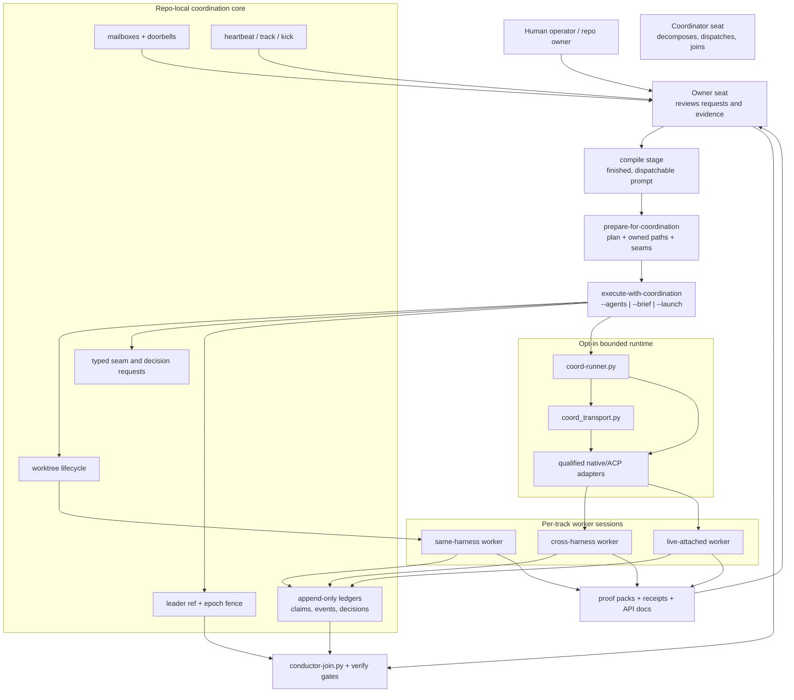
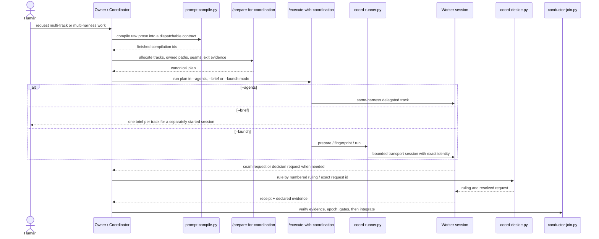
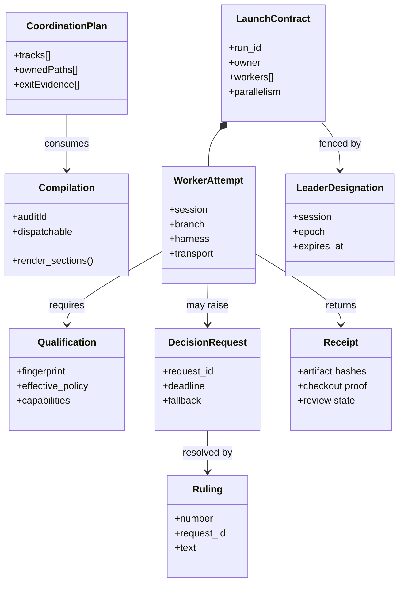
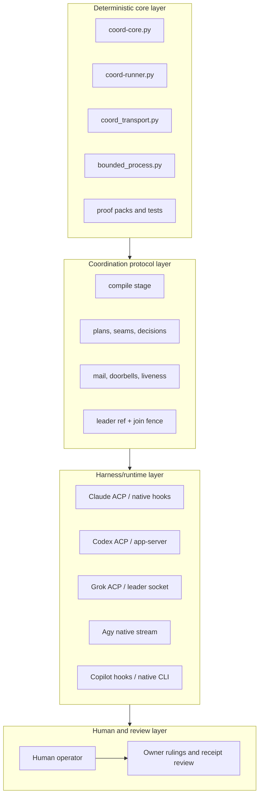
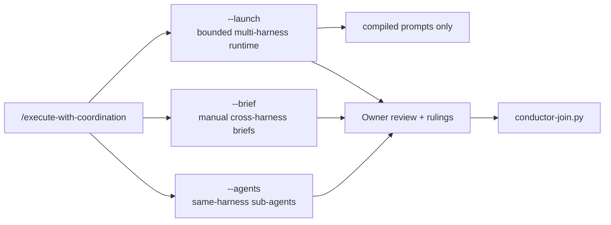

# Multi-harness coordination evolution

This is the deep narrative for the coordination surface the pack now ships. It is not a generic
survey of agent swarms. It is the repo's own history, traced to the proposal/spec/design/proof
stack and to the landed skills and scripts.

**Confidence note**

- **Verified** - proposals, specs, designs, proof packs, API docs, and the git history in this
  repository; every shipped claim below is backed by a committed artifact in this tree.
- **Flagged** - the separate 2026-09-21 implementation branch the maintainer asked this
  documentation branch to read as evidence. That work is called out explicitly as pending
  integration and is **not** described here as landed or released.

## 1. Where it started

The starting point was not "multi-harness orchestration". It was a collection of failure modes
observed in real work:

| Starting shape | Why it failed | Source |
|---|---|---|
| Shared checkout, several sessions | One session's checkout/add/commit could move or sweep another session's work. That is work loss, not a merge conflict. | `spec-agent-coordination.md`, `session-worktree-discipline.md` |
| Prompt-only coordination | A plan described in prose did not fail when ignored. The pack's own doctrine phrases it exactly: a rule that ships only as prose is a memoir. | `spec-agent-coordination.md`, `note-20260919-coordination-decisions-ratified.md` |
| One ledger for everything | A union-merged ledger can record claims and mail, but it cannot elect a leader or fence a join. Two competing leader claims both survive a union merge. | `kb-multi-agent-coordination/index.md`, `architecture-agent-coordination.md` |
| "Done" as a transport event | A worker could finish a turn while still holding an open Owner decision, missing evidence, or using the wrong checkout. Transport completion is not review readiness. | `proof-multi-harness-runner.md`, `proof-coordination-runtime-v2.md` |

That is why the pack's coordination surface did **not** become a broker, a daemon, or a
cloud relay. The work started from repo-local failures and stayed repo-local until a measured
trigger justified anything more.

## 2. The pivots

Four pivots changed the design.

| Pivot | What changed | Why it mattered |
|---|---|---|
| **Worktree isolation** | The pack moved from shared-checkout convention to one-session-per-worktree discipline. | It turns work preservation into a structural property instead of a reminder. |
| **Artifact classes** | `authored`, `derived`, `register`, `hotspot` stopped being one lease problem. | Generated files are regenerated, registers allocate, hotspots batch under an integrator, only authored files lease normally. |
| **Owner / Coordinator / Sub-Agent doctrine** | Authority, decomposition and execution became separate seats. | The reviewer/ruler stopped being conflated with the track doing the work. |
| **Compile -> coordinate -> verify** | The operator's prose is compiled before dispatch, then verified again at handback and join. | A worker no longer receives an improvised paragraph and no longer hands back a success-shaped string. |

## 3. The arc from proposal to runtime

| Phase | What the repo adopted | What it rejected or demoted | Evidence |
|---|---|---|---|
| **Manual era** | Session contracts, rulings, a join script, human-owned seams. | Shared checkout safety, free-text ACK loops, "read the standing file" as a push channel. | `docs/proposals/owner-coordinator-subagent-coordination.md` critique, ai-de readings cited there |
| **Coordination substrate** | Append-only per-session ledger, artifact classes, worktree lifecycle, claim/check/release, derived-file regeneration. | A daemon, a database, "just scan the branch list" allocation. | `adr-0007`, `adr-0008`, `adr-0009`, `0dcff48`, `architecture-agent-coordination.md` |
| **Doctrine and seams** | Owner / Coordinator / Sub-Agent roles, typed seam requests, compile stage, human rulings, board/message layer plan. | Election, auto-reassignment, phi-accrual, unbounded loops, free-text dispatch. | `1705ad3`, `4a4c0b3`, `coordination-p0-p1.md`, `coordination-p2-p8.md`, `coordination-p3-p5-p8.md` |
| **execute-with-coordination** | The coordinator skill became the front door: `--agents`, `--brief`, then opt-in `--launch`. | Writing track code from the coordinator seat; "launch" as a silent replacement for the existing modes. | `pack/commands/execute-with-coordination/SKILL.md`, `reference/launch.md` |
| **Bounded runtime** | Qualified prepare/fingerprint/run/status, explicit permission decisions, dynamic compiled mailbox input, live attach where proved. | A broker, post-dispatch replay, arbitrary terminal typing, implied cross-platform parity. | `686af28`, `proof-multi-harness-runner.md`, `proof-coordination-runtime-v2.md` |

The key architectural lesson is that **the pack evolved by replacing guessed generality with
measured seams**. Every time the design was tempted toward a larger system, a smaller local control
proved sufficient or a proof pack showed which part was still not qualified.

## 4. Current architecture in one picture

**What this means in practice**

- The **core** is deterministic and repo-local.
- The **runtime** is optional and bounded.
- The **join** is where authority is re-checked.
- The **human/Owner** still decides meaning; the runtime only moves bounded work.

## 5. The four diagram families traced to code

### 5.1 Sequence - the operator workflow today

This is the important change from the early approach: the worker does **not** hand back a free-form
"done". It hands back a bounded receipt plus evidence, and the Owner seat still holds the decision.

### 5.2 Class - the protocol objects that survived

The design is intentionally small. These are the objects the code and proofs kept. Broker
registries, cloud relays, elections and CRDTs never made it past the design gate.

### 5.3 Layered architecture - what is deterministic vs profile-specific

The boundary to remember is that **models live inside harnesses, and harnesses live above the
deterministic core**. Changing the model does not change the hook/transport boundary. Changing the
harness does.

### 5.4 Component - what execute-with-coordination grew into

The coordinator role stayed the same while the execution modes widened:

| Mode | What it buys | What it does **not** buy |
|---|---|---|
| `--agents` | Lowest friction inside one harness; native spawned-worker behavior. | Cross-harness proof, independent runtime diversity, or a different hook surface. |
| `--brief` | The smallest correct fallback. It carries the exact contract across harnesses when automation is unsupported or unqualified, without pretending the other side enforced anything. | Automation, liveness, or trust that the other harness enforced anything. |
| `--launch` | Opt-in bounded prepare/fingerprint/run/status over a qualified runtime. | Semantic acceptance, universal portability, or permission bypass. |

## 6. Models and harnesses are separate axes

This distinction is load-bearing and easy to lose:

| Change | What changes | What does **not** change |
|---|---|---|
| **Same harness, different model** | Reasoning profile, cost, and sometimes context window. | Hooks, transport, trust, or file sandbox. |
| **Different harness, same model family** | Adapter, queue/socket path, hook surface, and qualification burden. | Semantic diversity by itself. |
| **Different harness, different model** | Both the reasoning profile and the control surface. | Owner review, receipts, or the join fence. |

That is why the documentation and proof surface now distinguish **model qualification** from
**harness qualification**. A Copilot run that reports a GPT label but actually uses a Claude
backend is not "close enough". It is an invalid proof and must be thrown away. The same rule
already appears in the landed docs for permissions: zero callbacks is not permission evidence.

## 7. What shipped, and what deliberately did not

| Attractive idea | Why it was attractive | What actually shipped |
|---|---|---|
| HTTP/SSE bus or cloud relay | A single transport for all harnesses. | Repo-local files, git, native queues/sockets where they exist, and manual briefs where they do not. |
| Leader election | Looks automatic. | Human designation in a git ref with CAS, epoch, and reclaim. |
| One big "agent swarm" abstraction | One story for every scenario. | Spawned relationships, registered relationships, and a different push path for each. |
| Post-dispatch replay | Recover work after a crash. | At-most-once admission; after dispatch the state is indeterminate, never replayed automatically. |
| "Transport complete" as success | Easy status display. | Receipt verification, zero open Owner decisions, live leader check, then `ready_for_review`. |

The best summary is simple: **no implied distributed service if the code does not ship one**.

## 8. Actual scenarios and qualification limits

### 8.1 Runtime by harness, as currently documented in this branch

| Harness | Dynamic follow-up | Permission qualification | Live attach | Current limit |
|---|---|---|---|---|
| **Claude ACP 0.79.0** | Verified | Real inspected `allow_once` on a file edit | No qualified shared-terminal attach in this branch | Owner and worker runtime proven, but profile-specific qualification still required |
| **Codex ACP 1.12.0** | Verified | Real inspected `allow_once` in explicit read-only mode | Verified via app-server socket/UUID | Operational file access had to be explicitly scoped; no blanket shared-root grant |
| **Grok 1.0.34** | Verified | Current installed profile auto-approved the canary; `ask` remains unqualified | Verified against an explicit leader socket | Live input exists; permission qualification remains profile-specific |
| **Agy 1.2.7** | Verified | `ask` rejected; denied native actions treated as blocked | No qualified live attach path | Headless stream is real; interactive approval is not |

### 8.2 Negative proofs that changed the design

| Negative proof | Why it matters |
|---|---|
| Two leader claims survive a union merge | The ledger can record leadership changes; it cannot arbitrate them. |
| `--force` overrides `--force-with-lease` | A join fence must be explicit, and the push path must never smuggle in `--force`. |
| A native hook/trust entry can exist without proving it fired | Discovery is not enforcement. Qualification must observe the actual refusal. |
| A worker can complete transport while still holding an open Owner decision | Final handback must read decision state after receipt verification. |
| A profile can auto-approve a canary with zero callbacks | Silence is not a permission model. It is a missing proof. |

These negative proofs are why the coordination docs are heavy on **reviewed limits**. The point of
the runtime proof is not to flatter the runtime. It is to keep unsupported behavior out of the
operator's mental model.

## 9. API coverage and current documentation gaps

The coordination architecture is better documented at the **design/proof** level than at the
docstring level. That is visible in the generated API reference:

| Script | Public functions | Source-docstring coverage | Implication |
|---|---:|---:|---|
| `coord-runner.py` | 14 | 7% | The runtime contract is currently carried by `spec-multi-harness-launch-and-monitor`, `design-multi-harness-runner` and the proof packs more than by inline API docstrings. |
| `coord-mail.py` | 22 | 23% | The message layer is behaviorally specified and tested, but its script-level API comments remain thin. |
| `coord-board.py` | 14 | 50% | Better internal coverage, still not complete. |
| `coord-decide.py` | 11 | 18% | The Owner-review path is documented mostly through specs/designs and rulings discipline. |
| `coord_transport.py` | 2 | 100% | The transport seam is small and fully described. |

**Current branch limit:** the separate 2026-09-21 implementation branch adds `coord_files.py`
and `platform_process.py`, but those modules are not present in this branch's generated API
reference and are therefore **not** described here as part of the landed surface.

## 10. Pending integration evidence (not landed in this branch)

The maintainer asked this documentation branch to read a separate implementation branch while
keeping the story honest. These observations are therefore recorded as **pending integration**:

| Pending evidence | Status in this branch |
|---|---|
| Windows-specific runtime hardening in `coord_files.py` and `platform_process.py` | **Flagged** - observed in the sibling implementation branch; not landed here |
| Copilot runtime qualification that proved one-time approval, receipt hashes, and `ready_for_review` under a GPT-pinned worker | **Flagged** - the maintainer supplied measured evidence and explicitly withdrew eight invalid runs where the displayed model label did not match the actual backend |
| Codex read-only handoff with matching JSON acknowledgement and explicit file-root binding | **Flagged** - measured in the sibling branch; not yet part of this branch's source-of-truth |
| Remaining unsupported items: full Windows Codex write-hook trust, Copilot arbitrary terminal attach, Copilot additional_roots, POSIX-only existing attach flows | **Flagged** - these remain limits even in the sibling branch summary |

This is the important documentation rule: **an observed branch in progress may influence the
roadmap, but it does not get rewritten into the accepted architecture until its own proof lands.**

## 11. Operator workflow end to end

1. **Compile the request.** The raw human ask becomes a finished, dispatchable compilation.
2. **Plan the tracks.** `/prepare-for-coordination` assigns owned paths, seams, and exit evidence.
3. **Choose the execution mode.**
   - `--agents` when one harness can hold the whole run.
   - `--brief` when the runtime is unsupported or unqualified.
   - `--launch` when a qualified runtime is available and the bounded contract matters.
4. **Designate or verify the Owner.** Leadership is a ref + epoch, not a chat convention.
5. **Run bounded work.** Every worker gets an explicit identity, checkout, compilation, budget, and
   fallback.
6. **Handle seams and decisions.** Requests become rulings; they do not become ambient memory.
7. **Verify evidence, then join.** Receipts, decision state, leader state, and the integrated gate
   set all have to pass before the work is accepted.

That is the endpoint of the arc: from informal prompt passing to a bounded, reviewable,
multi-harness workflow whose smallest correct fallback is always still a manual brief.
