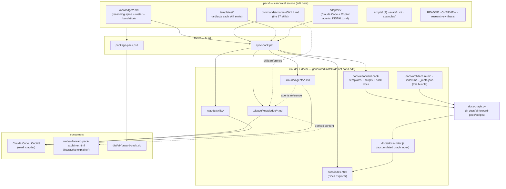
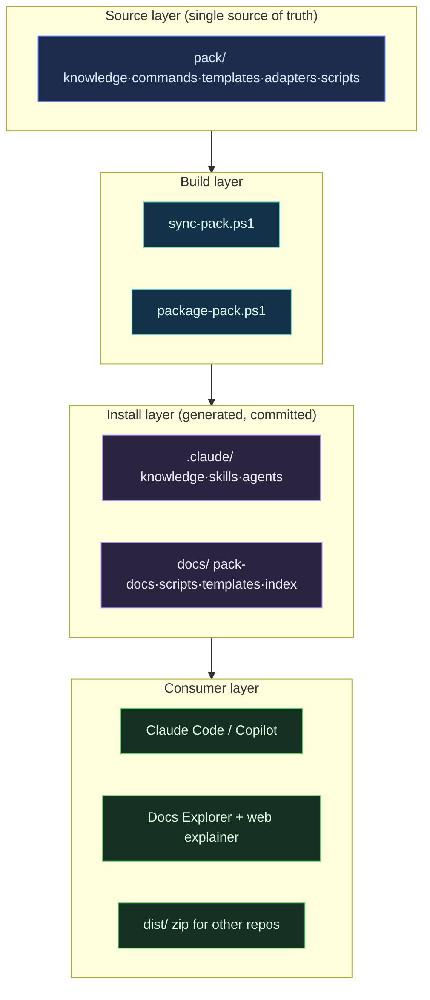
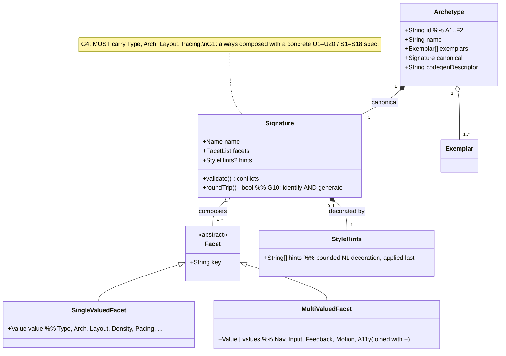

<!--
Produced by /document (Rigor Protocol run on the codebase as the subject of documentation).
Ground truth is the repository itself. Confidence labels: [Verified] traced to a file/run;
[Inferred] reasoned, not executed; [Flagged] carried as a risk. The documented commit and
coverage are in docs/_meta.json. This bundle is companion to the self-contained interactive explainer
web/ai-forward-pack-explainer.html (generated by this run).
-->

# Architecture: AI-Forward (pack source + live dogfood install)

- **Status:** Accepted
- **Tier:** N/A — this repository is a knowledge/tooling package with no inference client.
  The short-lived model-orchestration experiment was reverted after forensic review; model
  selection remains the host/user's responsibility. `[Verified]`
- **Driving context:** `README.md`, `CLAUDE.md`, `pack/OVERVIEW.md`
- **Documented commit:** see `docs/_meta.json`

## Context & constraints

This repository is **two things at once** (`README.md` §"This repo is two things at once"):

1. **The canonical source** of the AI-Forward Pack — everything you edit to expand the pack lives under `pack/`. `[Verified: README.md, pack/]`
2. **A live install of the pack** — the pack is installed into this same repo (`.claude/`, `docs/`) so the skills, agents, and knowledge are active in Claude Code *while you work on the pack itself*. Dogfooding: the pack is built using the pack. `[Verified: .claude/, CLAUDE.md]`

The load-bearing constraint that shapes the whole structure:

> **`.claude/` and `docs/` are GENERATED from `pack/`** by `tools/sync-pack.ps1` and committed so a fresh clone has a working install with no setup. `pack/` is the single source of truth — never edit the generated copies directly; they are overwritten on the next sync. `[Verified: CLAUDE.md, tools/sync-pack.ps1]`

Generated knowledge documents under `.claude/knowledge/` and `docs/ai-forward-pack/` carry **no YAML frontmatter** (they are vendored prose, not graph nodes). Project documentation under `docs/` is the graph authority; at the model-orchestration forensic baseline it contains **22 valid artifacts with no stale, flagged, orphan, dangling, or index-drift findings**. `[Verified: docs-graph.py inventory, 2026-07-12]`

## Archetype & rationale

No LOA system archetype (A–I) applies — those classify AI-integrated *runtime* systems. The applicable shape here is a classic **source → build → install → consumer** pipeline with a **dogfood loopback**: the install layer feeds back into the authoring experience (Claude Code reads `.claude/` while you edit `pack/`). `[Inferred from repo structure]`

## Component map & boundaries

The major components and the real dependency edges between them (read from `tools/sync-pack.ps1`, `tools/package-pack.ps1`, and the directory layout):



Boundaries that matter:
- **Source ↔ install boundary** — crossed *only* by `tools/sync-pack.ps1`. Editing the install side directly is a contract violation (the next sync overwrites it). `[Verified: CLAUDE.md, sync-pack.ps1]`
- **`sync-pack.ps1` write scope** — it writes only `.claude/{knowledge,skills,agents}`, `docs/ai-forward-pack/**`, and `docs/index.html`; it **intentionally does not touch** `docs/docs-index.js` (skills accumulate it) or other `docs/` root files. This is why this bundle (`docs/architecture.md`, `docs/index.md`, `docs/_meta.json`) and `web/ai-forward-pack-explainer.html` have a stable home that sync will not clobber. `[Verified: tools/sync-pack.ps1 lines 22, 92–98]`

## Key flow — the sandbox / dogfood loop (sequence)

The authoring loop from `README.md` §"Expanding the pack", with the graph-refresh step `/document` adds:

```mermaid
sequenceDiagram
  actor Dev as Author
  participant Pack as pack/ (source)
  participant Sync as tools/sync-pack.ps1
  participant Install as .claude/ + docs/
  participant CC as Claude Code (this repo)
  participant Graph as docs-graph.py
  participant Explorer as docs/index.html

  Dev->>Pack: edit a knowledge doc / SKILL.md / persona / template
  Dev->>Sync: pwsh tools/sync-pack.ps1
  Sync->>Install: mirror knowledge, skills, agents, templates, scripts
  Sync->>Install: regenerate docs/index.html from template
  Note over Sync,Install: docs-index.js is NOT touched (accumulated separately)
  Dev->>CC: try the change (regenerated skills/agents are now live)
  CC-->>Dev: run a skill; dogfood the edit
  Dev->>Graph: /document → docs-graph.py derive
  Graph->>Install: write docs/docs-index.js from frontmatter
  Graph->>Explorer: index loaded; hierarchy · graph · mind map · health render
  Dev->>Pack: commit pack/ + .claude/ + docs/ together (lockstep)
```

`[Verified: README.md §"Expanding the pack (the sandbox loop)", sync-pack.ps1, docs-graph.py --help]`

## Reverted model-orchestration experiment (historical)

Commit `5d7b952` added a global model-orchestration standard and static routing lookup. The
forensic review found that the capability was not wired into skills/personas, contradicted its
hard adversary-independence rule, could reduce T2 rigor, lacked behavioral proof/audit support,
and had no provider/data-governance boundary. The user chose removal rather than remediation.

The active architecture therefore has **no model-per-task control plane**. The existing
Orchestrator remains a process/persona facilitator only. The historical evidence and closed
findings remain in `docs/reviews/forensic-review.md`,
`docs/backlog/forensic-review.md`, and the superseded/accepted decision-note pair.

## Layered view (source → consumer)

The repo's own layering (distinct from the LOA *capability* tiers it ships as payload):



Dependency direction points **up only** (source → build → install → consumer); no consumer writes back into source except through the human author editing `pack/`. `[Verified: tools/*.ps1]`

## Domain model (class) — the UI Archetype Grammar

The most code-like structure in the repo is the **Archetype Grammar** (`ui-archetype-grammar.md` EBNF, G1–G16) and its catalog (`ui-archetype-catalog.md`). Documented here as a class model because it is the conceptual schema the experience and the codegen contract are built on:



`[Verified: ui-archetype-grammar.md §2 EBNF, G1/G4/G5/G10; ui-archetype-catalog.md]`

## Tool & CLI reference (the repo's public surface)

This repo has no traditional doc-commented API. Its public, invocable surface is the build/maintenance tools under `tools/` plus the deployed Python/JavaScript script bundle. `[Verified: tools/, pack/scripts/, docs/ai-forward-pack/scripts/]`

| Command | Purpose | Notes |
|---|---|---|
| `pwsh tools/sync-pack.ps1` | Regenerate `.claude/` + `docs/` from `pack/`. | Run after every `pack/` edit. Does not touch `docs/docs-index.js`. |
| `pwsh tools/package-pack.ps1` | Build `dist/ai-forward-pack.zip` for sharing. | Carries full Claude Code + Copilot wiring. |
| `pwsh tools/verify-bundle.ps1` | Run sync, consistency, foundation, and eval-shape checks. | Currently reports a dirty post-sync tree but does not fail on it; see forensic finding FR-007. |
| `python tools/new-capability.py ...` | Scaffold a skill or knowledge extension across source surfaces. | Used by `/extendaibundle`. |
| `python tools/check-consistency.py` | Check headline counts, skill/prompt parity, and prose drift. | Does not yet validate promised peer-agent deployment parity. |
| `python docs/ai-forward-pack/scripts/docs-graph.py <cmd>` | The knowledge-graph mechanics (V18). | Stdlib-only Python 3.8+. |

`docs-graph.py` subcommands (`[Verified: --help]`): `inventory` (scan the graph → JSON), `derive` (frontmatter → `docs/docs-index.js`), `validate` (inventory + nonzero exit on findings, CI-able), `freshness` (stale + flagged + orphans gate), `flag` / `clear-flag` (V16 review propagation), `stub` (scaffold a schema-correct artifact), `snapshot` (append a graph-health record), `rollup` (aggregate per-design STRIDE / privacy tables into a register).

## Cross-cutting concerns

- **Identity & trust boundaries:** none — this is a static content/tooling repo with no runtime auth surface. `[Verified]`
- **Failure & resilience:** the only "runtime" is the build tools; `sync-pack.ps1` is idempotent (it mirrors source over install each run). `[Inferred]`
- **Observability:** N/A at repo runtime; the *Observability Standard* (O1–O13) is shipped as pack payload, not applied to this repo's tools. `[Verified]`
- **Data governance / privacy:** no personal data is stored or processed. `[Verified]`

## Flagged risks & residual unknowns

- **`[Resolved 2026-06-22; reverified 2026-07-12]` Knowledge graph populated; vendored foundation docs deliberately excluded (decision).** The graph holds the project's dogfood artifacts while vendored foundation/standards docs deliberately stay out: they deploy as *always-applied reference instructions*, not parallel graph authorities. `[Decision recorded per BoK Part IX / V17; pre-review inventory = 22 artifacts, 0 problems/stale/flagged/orphans/drift]`
- **`[Resolved]` Archetype count corrected (16, not 18).** `CLAUDE.md`, the managed blocks (`CLAUDE.block.md`, `AGENTS.block.md`), `pack/OVERVIEW.md`, `pack/README.md`, and `pack/adapters/INSTALL.md` previously said **"18-archetype catalog"**, but `ui-archetype-catalog.md` enumerates **16** (A1–A4, B1–B4, C1, D1–D3, E1–E2, F1–F2). All source occurrences were corrected to 16 and the install re-synced from `pack/` (the grammar doc itself never stated a count). `[Verified: ui-archetype-catalog.md count = 16; grep shows no remaining "18-archetype" in source]`
- **`[Verified-headless 2026-06-22]` Explainer statically verified; live visual pass still advisable.** `web/ai-forward-pack-explainer.html` passed a thorough headless check: its single inline app (~67 KB) **parses cleanly under `node --check`**, mounts to a `#root`, renders via `ReactDOM` (`createRoot`/`render`), and carries a CDN **offline-fallback guard**; it mirrors the proven `docs/index.html` (React 18 UMD + htm, no JSX/babel) pattern. The parse/structure failure risk is retired; a quick **visual** pass in a real browser remains nice-to-have before any public share (cosmetic only — cannot be done headless). `[Verified: node --check OK; mount + ReactDOM + offline guard present]`

## Status & next action

| | |
|---|---|
| **Completed** | Architecture overview + 4 diagram families; tool/CLI reference; interactive explainer; MoC index; `_meta.json`; `docs-index.js` regenerated; findings recorded. **2026-06-22 audit:** design-doc status tables refreshed (rev-8 Doc Drift), `project-memory` ledger instantiated, explainer headless-verified, knowledge-docs-in-graph decision recorded. |
| **Remaining** | No active model-orchestration work. Two repo-level review findings remain independent of the reverted experiment: the bundle verifier's dirty-tree oracle (FR-008) and the pre-existing Copilot peer-agent deployment-map mismatch (residual FR-010). |
| **Best next action** | Triage FR-008 / residual FR-010 only if they are worth addressing; any future model-routing proposal starts as a new spec/ADR. |

## Gate record

`GATE document · 2026-06-14 · Documentation Steward (peer→adversary), Patterns Expert, Enterprise Architect, Simplifier · diagrams verified node-by-node against repo structure; CLI verified against --help; discrepancies recorded not hidden · verdict: pass with flagged findings · author did not self-clear`

---
**Handoff:** → onboarding, review, and `/define-architecture` (these diagrams are the architecture of record). Runs continuously via the freshness trigger.
