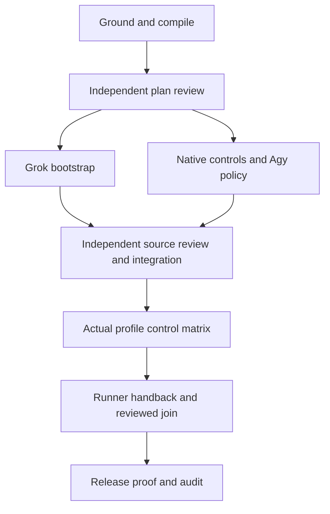

# End-to-end local coordination

Goal: make installed Claude, Codex, Grok and Agy coordination work end to end. Done when the actual profiles produce permitted work, refuse coordinator-owned edits, respect unresolved Owner decisions, cancel active work, and return independently reviewed evidence through the runner and join. Missing proof stays blocked. No remote push or blanket permission changes. Tier T2; two delegates maximum; 400k context ceiling with compaction/handoff before the ceiling.

## Layer state

| check | result | meaning |
|---|---|---|
| Invoking base | `6711dba` | Prior ownership guard and finite proof integrated locally |
| Registry / merge drivers | 11 patterns; both effective | Install inherited from primary; never reinstall in a linked tree |
| Requests / leases | 12 terminal, zero open; zero live leases | No prior active authority to overtake |
| Regeneration | Six owed artifacts regenerated successfully | Audit-derived state is refreshed before joins |
| Profiles | Claude/Codex native ownership qualified; Grok bootstrap and Agy permitted write blocked | Transport support is not profile qualification |

## Artifact classes

| path / pattern | class | mechanism | coordination needed |
|---|---|---|---|
| `pack/scripts/coord_transport.py`, transport tests | authored | Grok track only | Yes, short claims |
| `pack/scripts/coord-core.py`, `pack/adapters/hooks/**`, native config and tests | authored | Native-controls track only | Yes, short claims |
| `pack/scripts/coord-runner.py`, runner acceptance tests, runner design | authored | Native-controls track owns final decision fence | Yes, short claims |
| Launch reference, evidence/proof, this plan | authored | Coordinator integrates reviewer-approved contracts | Serial shared seam |
| Audit, rulings, health history | register | Existing append/union writers | No claims |
| Generated installs, API/docs views/index | derived | Source sync and official generators | Regenerate at integration; no manual editing |

## Tracks

| track | owns (authored) | depends on | tier | fan-out cap | budget | exit evidence | harness |
|---|---|---|---|---|---|---|---|
| e2e-grok | Transport source/tests; `docs/notes/note-20260921-grok-bootstrap.md` | Plan review | T2 | 0 | 70 tool calls, 25k tokens, 45 min | Recorded-order regression, bounded/foreign-session negatives, live creation and ordered prompts | Codex delegate; own tree observed; native mechanism unchanged |
| e2e-controls | Native hooks/core/config/tests; runner acceptance source/tests/design; `docs/design/native-profile-controls.md`; Agy policy evidence | Plan review | T2 | 0 | 100 calls, 35k tokens, 60 min | Reviewed contract; red-first tests; documented native policy and hook behavior; necessary approval identified concretely | Codex delegate; own tree observed |
| coord-e2e | Qualification operations, proof, integration, runner launch reference | Reviewed track results before live complete matrix | T2 | 2 | 120 calls, 90 min before re-estimation | All four profile matrix; actual runner receipt/review/join; retained negative attempts; all applicable gates | Codex Owner; leadership is explicitly designated, not harness-derived |

Each delegate uses its assigned absolute checkout and session. `e2e-grok`: `/Users/mallalieut/projects/ai-forward-fix-grok-session-bootstrap`; `e2e-controls`: `/Users/mallalieut/projects/ai-forward-feat-native-profile-controls`; coordinator: `/Users/mallalieut/projects/ai-forward-feat-coordination-end-to-end`. Initial leader is `coord-e2e`, epoch **8**, renewed every 100 seconds. Never EnterWorktree/ExitWorktree. First command is `audit-log.py start --session <id> --skill implement`. Derived/register files need no claims. Claim authored files only for the editing minutes, releasing promptly. Owner is `coord-e2e`; requests address it and rulings go in `docs/notes/rulings.md`. No delegate clears its own hard veto. Hook policy changes require design-slice and independent review before use. The exact already-approved Codex apply_patch definition remains approved; a different native trust request is presented only after its concrete implementation and review.

## Finite exit matrix

For each Claude, Codex, Grok and Agy actual profile record: permitted work; leased-edit refusal; native Stop behavior; pending-decision no-ready; active cancellation after observed work start and owned-process cleanup; receipt, independent review and join evidence. Cancellation/error attempts never join. Bind every observation to source bytes, actual cwd/profile/fingerprint, and holder/epoch. Unknown and blocked cells remain explicit.

Native Stop is a bounded behavior observation, not an indefinite lock. Final handback requires a separate fail-closed runner fence: complete transport plus valid receipts must not become `ready_for_review` while the worker's Owner-decision state is open or unreadable. An actual Owner ruling is required; continuation follows the existing fresh-attempt/manual path, with no dynamic prompting or resume feature.

Qualify the four worker profiles once per actual admitted binding, then perform a representative composed dispatch/review/join under each actual Codex and Claude Owner harness. Merely changing `--host` metadata does not prove the second Owner. Gates and source sync precede claims against fresh native profiles; evidence-only regeneration follows the final observations.

## Serial spine

| item | why it cannot be parallel | who owns it |
|---|---|---|
| Public transport contract / shared runner design | Both branches must preserve the same admission boundary | Coordinator |
| Source integration, sync and release gates | Generated surfaces and one integrated HEAD | Coordinator |
| Native qualification per profile | Each claim depends on that profile's prerequisite; fresh identity/cwd required | Coordinator, with delegated evidence observation |
| Owner decision and reviewed join | Requester may not rule on itself | Coordinator / independent reviewer |

## Seams

| from -> to | the request | resolved by |
|---|---|---|
| Grok -> coordinator | Bounded early session update contract and evidence | Reviewed design delta before integration |
| Controls -> coordinator | Actual Agy permitted-write policy; Codex Stop trust definition if required | Existing authority or concrete user approval after review |
| Coordinator -> reviewer | Source plus runtime proofs, including negative evidence | Independent Test Architect/Security/Simplifier review |

## Struck tracks

| track | why it was not worth its multiplier |
|---|---|
| One worker per harness implementation | Shared hooks/core would collide; combine native controls |
| Separate artifact viewer / protocol framework | Existing runner, ledger, compiler and transport suffice |

## Order of operations

| # | action | cost | why now |
|---|---|---|---|
| 1 | Compile scope, doctor, new coordinator tree, leader designation | Deterministic | Establish actual identity and authority |
| 2 | Independent plan review; isolated repair tracks | Reasoning, width 2 | Bootstrap and native controls have disjoint ownership and no decision dependency |
| 3 | Review then integrate repaired contracts/source | Independent review then deterministic | Live results must bind reviewed bytes |
| 4 | Fresh profile matrix, Owner rulings and active cancellation | Bounded native model work | Establish behavior rather than infer it |
| 5 | Actual runner dispatch and independent artifact handback/join | Bounded native work + review | Prove the composed workflow and leadership choice |
| 6 | Full release gates, finite evidence verifier, proof and audit | Deterministic | Validate installed consistency and honest claims |

Capability labels: reasoning for repair/design and review; deterministic mechanics for setup/sync/tests; native measured execution for qualification. Work/span estimates are Inferred: 90–130 aggregate minutes, 60–90 critical-path minutes, no claim of measured speedup. Parallelism buys isolation and context hygiene; the documented agent multiplier can reach 15×, so width stays two. Shared guards scan only their named source/tests; neither delegate changes runner admission or another track's files. A seam request is mandatory if that becomes necessary.

Fan-out contract: width two; one diagnosed transient retry per profile, fresh identity every new attempt; per-branch exits are reviewed evidence or a reproducible named blocker; join only compatible reviewed results; failed profile remains blocked while independent work continues. Deadline is the budget review, not permission to omit proof. Fallback retains exact manual briefs and asks only for consequential unresolved policy. The loop variant is unproven required capability cells; if it does not decrease across two passes, diagnose before increasing the budget. No unattended attestation until the matrix establishes every declared capability.

## Planned versus actual

Pending execution. Parent tokens/spend are not recorded. Audit markers measure duration. The compiler rejected a wrong clause key and an empty exclusion list before dispatch; corrected against its actual schema, with no bypass.
