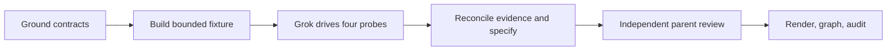

# ACP specification and spike plan

**Goal:** specify multi-harness coordination with Agent Client Protocol and measure the
four local harnesses from Grok. **Done when:** linked Markdown and HTML specification,
capability matrix, reproducible evidence and recommendation have independent review.
**Not in scope:** production transport implementation, global permission changes,
automatic approvals, arbitrary existing-terminal attachment, or A2A services.
**Tier:** T2. **Fan-out:** one Grok driver, serial target probes. **Budget:** 70 tool calls
and 30 minutes to first handback; context ceiling 400,000. Budget firing is a finding,
never evidence that a capability passed.

## Execution graph

| Node | Capability | Inputs | Exit | Tier | Dependency |
|---|---|---|---|---|---|
| G1 Ground | Reasoning | request, existing message/leader specs, protocol contracts | open questions and scope fixed | T2 | none |
| G2 Fixture/client | Deterministic mechanics | G1, versioned interfaces | bounded probe with deny-only permission handler | T0 | G1, data |
| G3 Grok driver | Deterministic mechanics | G2, four installed harnesses/pinned adapters | one measured record per harness | T0 | G2, data |
| G4 Evidence/spec | Reasoning | G3 results, primary references | MD, HTML, matrix, recommendation | T2 | G3, decision |
| G5 Adversary | Independent review | G4 and raw sanitized evidence | explicit veto disposition from parent | T2 | G4, data |
| G6 Publish artifact | Deterministic mechanics | G5 resolution | render checked, graph derived, audit appended | T0 | G5, decision |

The naive plan repeats contract setup, fixtures and interpretation per harness. The
optimized plan shares the deterministic fixture/client while retaining each independent
observation. All six floor nodes remain. No latency advantage is claimed before measurement.
Normalized cost model: **Inferred** six units of work, six-unit critical path, width one;
`T1 = T∞ = 6`, hence no modelled benefit from widening the probe loop. Local package discovery
and authoritative-document reads can be batched; credential stores, harness processes and
machine load make serial probes the lower-coupling experiment.

## Bounds and oracles

The Grok driver owns only its prepared command. Each target creates a disposable git
repository and independent session identity. The ACP client advertises no optional filesystem
or terminal capability. It rejects every permission request. A write appearing despite a
recorded rejection fails the denial oracle; an absent file without a permission request does
**not** establish permission-broker coverage. Unknown methods return a method-not-found error.

The loop variant is the number of unattempted harnesses (four down to zero), then the finite
ordered methods per harness. Prompt timeout is 70 s, startup 30–40 s, load 35 s, output 2 MiB;
the driver has a 900 s outer limit. Owned process groups are terminated. One diagnosed retry
may target a contract mismatch, never broaden authorization. Partial join preserves failed,
blocked and unverified cells; it does not average them into support. Parent review is independent
and mandatory; no author clears their own hard veto.

Surfaces: protocol contract → executable version → process/identity/cwd → initialization →
session → prompt/progress → permission/cancel → response/artifact observation → matrix →
MD and HTML → graph/audit. The HTML must contain the same substantive specification as MD.
Secret/config payloads are excluded from committed transcripts; read-only personal credentials
are reused only by their owning harness. No new credential store is created.

## Cost versus delivery

Started 2026-09-20T14:50:52Z. First-pass target durations: Grok 56.288 s, Claude 17.686 s,
Codex 50.220 s, Agy 48.676 s. Codex control 21.464 s. One diagnosed control pass used the
same untrusted Grok fixture through the native CLI and a Codex native read/external-write
denial. The first Grok driver returned successfully; the second hit its three-turn cap
after its child produced completed records, so the wrapper failure remains explicit.
The exporter was corrected once to handle empty final stdout without discarding child
facts. No scope expansion or permission/trust widening occurred.

Peak actual model-session width was four: parent, specification agent, one Grok driver,
one target. Targets were serial. The original width-one label applied to driver fan-out,
not total active sessions; this distinction was corrected during execution. Child spend
is not recorded by this wrapper; provider cumulative usage is not summed across turns.
The successful driver's own measured cost is retained separately in its evidence. All
six planned floor nodes completed. Independent parent specification review cleared the
stale-profile condition; browser review passed at 1440 and 390 px actual emulated widths.
One footer-hash overflow was measured red at 509 px, fixed by wrapping, then measured
green at 390 px. The final audit entry supplies measured whole-run duration. No invented
aggregate token/spend or speedup estimate.
