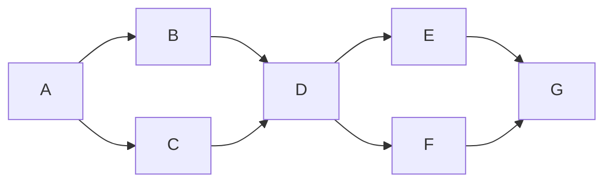

# Codex pack discovery and grounding

Goal: make the pack's skills, scripts, and constitution reachable in Codex in the
source repository and every repository receiving the deployment map. Done when
invocation, grounding, fresh install, update, and regeneration are proven. T1;
one independent reviewer maximum. No workflow rewrites, personal configuration
changes, custom slash-command implementation, or new host hook integration.

## Evidence and specification

**Verified:** the session skill list and installed Codex CLI 0.155.0 `skills/list`
both expose all 27 skills from `.agents/skills/`. `collectknowledge` and `specify`
are enabled, without catalog errors, in the primary checkout and repair worktree.
The probe used `initialize` → `initialized` → `skills/list` with `forceReload`;
it made no model turn. Startup timed out in the sandbox; the approved unsandboxed
probe completed. This verifies CLI discovery, not the desktop command picker.

The official [skill contract](https://developers.openai.com/codex/skills) specifies
`$skill` invocation and `.agents/skills/` discovery. The official
[instruction contract](https://developers.openai.com/codex/guides/agents-md)
specifies `AGENTS.md`, override precedence, and a default 32 KiB project budget.
The existing generator and installer already copy all skill companion files.
The missing contract was Codex-specific invocation and explicit constitution
grounding; Antigravity guidance claimed `/name` for a shared directory.

Acceptance criteria:

1. All canonical skill directories, including references, deploy unchanged and are
   discoverable at `.agents/skills/`. Fresh installs and updates both reach this state.
2. `AGENTS.md` names the Codex guide near the start of its managed block. The guide
   names foundation files, resolves skill-relative knowledge references, and exposes
   shared scripts and templates. It never claims Copilot rules or other hosts' hooks
   are automatically active in Codex.
3. The deployed doctor catches missing pack skills even if both host copies are
   missing, malformed metadata, missing companions, and missing foundation/scripts.
   Extra repo-local skills are allowed; instruction overrides are reported, preserved.
4. Source synchronization, complete bundle gates, and independent review pass.

No domain entity or storage migration is involved. The generated inventory has one
entry per pack skill, mapping its stable name to sorted relative companion paths.
It is derived data; `pack/commands` remains authoritative.

## Execution graph

| Node | Capability | Inputs / goal | Exit oracle | Tier | Dependency |
|---|---|---|---|---|---|
| A | Reasoning | Official docs, installer, history, graph grounding | Discovery vs syntax distinguished | T1 | — |
| B | Independent review | Surface list and proposed design | No unresolved hard veto | T1 | A (decision) |
| C | Deterministic mechanics | Contract tests | Red observed before implementation | T0 | A (decision) |
| D | Reasoning | Existing deployment map | Guide, inventory, doctor, docs implemented | T1 | B,C (decision/data) |
| E | Deterministic mechanics | Completed source changes | Targeted tests, sync, full bundle gates | T0 | D (data) |
| F | Independent review | Diff and proof | Findings resolved or explicitly reported | T1 | D (data) |
| G | Deterministic mechanics | Evidence and accepted diff | Audit, graph derivation, final state recorded | T0 | E,F (data) |

Before: seven serial nodes. After: seven nodes, five-node span, width two including
the main agent. **Inferred**, uniform-node-cost comparison only: T1=7, T∞=5,
two-worker ceiling=6; no wall-time speedup claim. Context-heavy implementation
stays local. Review overlaps deterministic proof; one reviewer, no nested fan-out,
no automatic retries. Partial review cannot clear the gate. Each correction cycle
must remove a named failure; floor zero outstanding failures, stop/report on three
unsuccessful attempts instead of silently dropping gates. Targeted test setup,
runtime startup, and gate failures are re-plan checkpoints.

Immovable floors: surface trace, red-first controls, independent review, full gates,
audit. Surface clauses are compatible: generated skill bodies equal canonical
files; inventories name every canonical companion; the doctor checks only listed
pack names and allows extras. Scan root is `pack/commands`, recursive, all files
under directories carrying `SKILL.md`; no extension allowlist hides companions.
Install validation reads only inventory-relative `.agents/skills` paths, with
absolute and parent-traversal paths rejected.

## Class → sweep → derive → prevent

Class: shared filesystem support mistaken for a complete host integration. Sweep:
generator, installer, doctor, managed block, root and distributed READMEs, deployment
guide, skill references, script access, hooks. Derive: discovery, invocation,
instruction loading, and automated hooks are separate host contracts. Prevent:
`test_codex_surface.py` plus the deployed readiness check, inventory parity, and
the always-loaded managed-block pointer. No skill-body forks required.

Grounding used `kb-graph-and-loop-engineering` with a one-hop bounded graph packet;
no adjacent path was returned. Source inspection supplied the missing host contract.
The existing defect register's PACK-C and RIG-E classes warn against conflating
host compatibility with a documented contract. Baseline consistency had stale
portal/web indexes; regeneration repairs those derived files.

## Delivery ledger

Verified initial targeted proof: 60 tests and eight subtests passed. New control
was observed red before implementation (missing guide/check), then six tests green.
Codex runtime catalog: 27 enabled skills, no errors in both checked workspaces.
Primary project instructions after generation: 27,413 bytes (other instruction
files/settings can still consume the remaining budget). Tokens not recorded.
Final proof: `pwsh tools/verify-bundle.ps1` reported **BUNDLE CONSISTENT — all 11
gates passed**. Python: 714 passed, 12 skipped, 219 subtests passed in 39.87 seconds.
All nine Codex tests and 11 subtests passed; independent Test Architect/Simplifier
review cleared the corrected implementation. Pack doctor: Codex readiness PASS.

The full run used `TMPDIR=/private/tmp` and a temporary `GIT_CONFIG_GLOBAL` with
`init.defaultBranch=master` and `core.fsmonitor=false`. The first run exposed five
existing environment-sensitive tests; canonicalizing the macOS temp path and
isolating Git config made them pass without changing/skipping tests. The first
run's generated drift was corrected before the second run. The suite's existing
12 skips are not reported as executed proof. Graph validation retained seven
pre-existing stale-knowledge suggestions; none is a graph defect.

Actual nodes matched the planned seven; one independent reviewer, no fan-out
expansion. Rework: ordinal sort parity and generated-inventory upgrade handling
both failed a regression test before correction. Graph frontmatter required the
repository's inline link form plus summary and an existing target. No timing
estimate was promoted to a measurement; the closing audit records run duration.

Integration exception to WT1: implementation and verification used an isolated
worktree. The reviewed patch is applied back to the original checkout only after
checking that its source files still match the worktree base. Existing dream and
proposal files remain untouched. Audit entries are appended through `audit-log.py`
and derived indexes rebuilt from the combined corpus, avoiding replacement of
another session's uncommitted audit history. No commit or push is performed.
