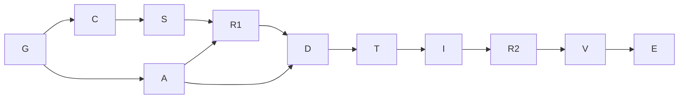

# Multi-harness runner execution plan

**Goal:** extend `execute-with-coordination` with a small deterministic launch-and-monitor
script that can be operated by Claude or Codex. **Done when:** the specification, design,
implementation and required verification are complete. **Not in scope:** work outside that
extension. **Tier:** T2. **Fan-out cap:** four model sessions: parent, independent ACP
agent, one Grok driver and one target harness at a time. Context
ceiling: 400,000 tokens; main-line budget: 160 tool calls before a recorded re-estimate.

The user's additional request assigns the ACP specification and compatibility spike to a
separate sub-agent. Its Markdown and HTML deliverables must be reviewed before choosing
the production transport. This is a decision dependency, not an authorization to label an
unrun adapter supported.

## Graph and exit conditions

| Node | Capability | Input and goal | Exit condition / oracle | Tier |
|---|---|---|---|---|
| G | Deterministic mechanics | Log and compile the request; isolate worktrees | Dispatchable compilation; actual worktree inventory agrees | T0 |
| C | Reasoning | Read current leadership, worktree, mail and join contracts | Cited requirements; no transport assumptions | T2 |
| A | Reasoning + deterministic mechanics | Independent ACP spec; Grok drives bounded harness probes | MD + HTML; observed capability matrix; blocked probes named | T2 |
| S | Reasoning | Functional specification from C and user intent | Requirements have falsifiable acceptance criteria | T2 |
| R1 | Independent review | S and A | Security, test, data and simplifier objections resolved or explicitly open | T2 |
| D | Reasoning | Reviewed spec plus A's measured evidence | Transport choice, failure model, surface list, test map; design review clears vetoes | T2 |
| T | Deterministic mechanics | Accepted design | Spec tests observed red on absent or incorrect behavior | T0 |
| I | Reasoning + deterministic mechanics | Red tests | Minimal implementation passes the targeted tests | T2 |
| R2 | Independent review | Implementation and proof | Claims independently checked; unresolved veto prevents completion | T2 |
| V | Deterministic mechanics | Reviewed change | Sync, integrated gates, rendered and cross-surface proof pass | T0 |
| E | Deterministic mechanics | Verified artifacts | Audit, change record, graph and proof pack complete; actual costs recorded | T0 |

Every arrow is a data dependency except A → D and the review gates, which are decision
dependencies. Serializing C after A would be incidental ordering, so that edge is absent.
Implementation cannot move ahead of the design gate. R1, design review, red-first proof,
R2, integrated verification, and audit closure are immovable floors.

## Bounds, containment and measurement

Two coordination branches may work concurrently only on separate authored files and separate worktrees.
The ACP branch owns its spec, HTML and spike evidence, not production scripts. The parent
owns the launch extension. The parent inspects the ACP evidence before accepting any
capability claim. Partial probe results remain partial; a blocker does not become support.

No automatic model retry. A transient failure is diagnosed before one targeted retry;
authentication, permissions and absent adapters do not become retry loops. A probe has an
explicit subprocess deadline and cleans up only its own children. A failed branch cannot
change another branch's index or permission configuration. The fallback is a named blocked
capability and a concrete next step, preserving manual operation.

The main loop's variant is the number of unfulfilled required exit conditions. The review
loop's variant is unresolved vetoes. A cap firing is a planning defect and triggers a
re-estimate, not a fabricated success. Re-plan after ACP results, design review or any
failing integrated gate that changes the scope of the repair.

**Inferred planning model:** assign one unit per node (these are dependency units, not
measured seconds). Naive serial work T1 = 11; optimized span T∞ = 10; p = 2 gives ceiling
10.5 units. No speedup is claimed: the user requested an independent ACP track and its
probe latency is not yet measured. The useful overlap is contract inspection while native
harness probes run. A wider council would duplicate grounding without removing this
decision dependency, so width remains two.

Surface clauses are compatible: the source skill and script define launch behavior;
generated harness skill copies must match source; runtime stores retain their existing
single writers; Markdown is the ACP specification and HTML renders that same specification.
No new scanner is required merely for this planning artifact.

## Grounding and risks

Graph traversal: `spec-message-layer` → `proposal-owner-coordinator-subagent-coordination`
→ `architecture-agent-coordination`; `spec-message-layer` →
`adr-0007-coordination-substrate`. Actual code inspected: `coord-core.py`'s leader CAS,
worktree creation and checkout-root distinction; `coord-mail.py`'s dispatch; and
`conductor-join.py`'s epoch fence. Relevant known classes: CTX-F (unbounded delegation),
CTX-Q (tree before spawn), WT-A (checkout versus shared-store root), HOST-A (a loaded hook
file does not prove its events fired).

Verified by source inspection: current dispatch inherits the parent's session environment
and labels exit-zero, parseable output as dispatch verification. Those observations do not
prove completion, permissions or preserved hooks. The new spec must distinguish each.

## Planned versus actual

2026-09-20: compilation passed; two coordination worktrees exist plus the Grok driver's
isolated worktree; ACP track delegated explicitly by the user. The original width of two
counted only coordination agents; corrected to include the Grok driver and one active
target harness, four model sessions total. Contract review proceeds while the ACP track
runs. Independent review identified bounded permission handling, precise parent-tree
checks, explicit evidence verifiers and failure UX edges; the draft incorporates them.
Design and implementation completed after the independent ACP compatibility result. The
ACP branch committed the Markdown/HTML spec, measured observations and render QA as
`abe0cc0`; it remains a separate deliverable. A second bounded implementation subtask owned
only the transport module/tests in another precreated worktree. Parent owned launch/monitor,
worktree, leader, qualification, receipts and skill integration. Peak active model width
remained within four; transport work began after the Grok-driven live probes ended.

Independent review found seven reproducible runner defects plus a queued check/use gap;
all are controlled by regression tests. Parent transport review added the duplicate-buffered
Agy-result control. No new transport features were added by those reviews. Shared ACP plus
an explicit Agy native stream was selected for an opt-in POSIX pilot; native hook/policy
qualification is still required, never inferred from the protocol.

Observed proof: 29 runner integration tests and 23 transport tests pass; full repository
Python suite reports 1,137 passed, 12 skipped and 321 subtests passed. Initial bundle checks
caught stale script-count/API/site outputs and a missing pytest environment; regenerated
outputs and an isolated test environment resolved them. The final full bundle run on
revision 85 passed all 17 gates; its Python suite completed in 117.22 s. Final result/audit
records are the only changes after that run. The Proof Pack records the implementation
and the separate live-profile release condition.

Duration is recorded by skill audit markers; the delegated transport span measured 976 s.
Main-line model tokens/spend and exact tool-call count are **not recorded** in this runtime,
so the planned 160-call budget cannot be honestly scored from this artifact. That is an
instrumentation gap, not an assertion that the estimate held. No speedup is claimed from
the abstract unit-weight graph. Actual benefit: protocol evidence and initial contract
analysis overlapped; transport and runner implementation then had separate single writers.
