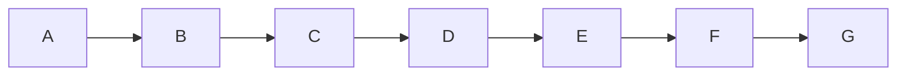

# Repair native coordination transport and requalify profiles

Goal: implement the two recommended transport repairs and repeat actual local-profile
qualification. Done when the fixes have red-first, independent and integrated proof,
and each harness has an observed readiness decision. Tier T2; fan-out cap one reviewer
or live target at a time. No remote push, global trust/permission changes, automatic
approval, or unrelated hook-platform implementation.

## Contract and surfaces

Trace: spec AC5 session control, AC6 named refusal/failure and bounded cleanup, AC7 no
false completion. The existing design says "Denial is sticky and stops the remaining
prompt list" and "permission refusal is not complete, even if its response parses
successfully". The fixes enforce those existing contracts. ACP v1 extensibility reserves
underscore-prefixed methods and says to ignore unrecognized notifications, while unknown
requests receive method-not-found: https://agentclientprotocol.com/protocol/v1/extensibility.

Surface list: native wire → bounded transport state/result → runner events/status → file
receipt gate → source/install copies → guide, API and proof. No new entity/store: each
result is one attempt; counters are additive within that attempt, never grants or proof
of a capability. Reuse the selector reader's total byte/deadline bounds and existing
result/event projection. No dependency, transcript store, callback approval or retry.

ACP: consume only well-formed underscore-prefixed notifications without an id. Count
them without persisting method/payload. Unknown requests still receive -32601; malformed
envelopes, wrong response IDs and foreign-session updates remain errors. Notifications
cannot reset time/output bounds or create a session/completion.

Agy: nonempty structured `denied_actions` blocks, before checking SUCCESS or sending
another prompt. Native error steps also stop dispatch immediately; distinguish the
observed permission-error shape from other tool errors without retaining raw text.
Malformed denial/error payloads fail closed. No action list or error message enters
durable telemetry. A denied attempt cannot become ready even with pre-existing evidence.

## Execution graph and oracles

| Node | Capability | Dependencies | Exit/oracle | Tier |
|---|---|---|---|---|
| A Ground + independent plan review | Reasoning / Independent review | Recorded wire and existing design | Scope/bounds/negative proof accepted | T2 |
| B Red regressions | Deterministic mechanics | A data | Real subprocess tests fail on the original two defects | T2 |
| C Minimal transport fixes | Reasoning | B decision | Positive and negative tests pass; false-success mutants fail | T2 |
| D Independent implementation review | Independent review | C data | No unresolved hard veto | T2 |
| E Sync and integrated release checks | Deterministic mechanics | D decision | Installed composition and full bundle pass | T2 |
| F Serial live profile qualification | Reasoning | E data | Fresh identities and exact installed bytes; honest blocked cells | T2 |
| G Record and local linear integration | Deterministic mechanics | F data | Evidence reviewed, audits/graph coherent, local main advanced | T1 |

Read-only research/review may overlap local test preparation. Live targets remain serial
to avoid shared profile/lease/reviewer interference. No model retry; at most one diagnosed
control per harness, each ≤180 seconds and 4 MiB. Termination variant: finite unmeasured
cells in the four-profile matrix; stop a profile at a failed prerequisite and record
downstream tests as not qualified. A positive readiness decision additionally requires
actual ownership/Owner-review refusal, allowed/denied tools, active-tool cancellation and
reviewed handback through the join path. A missing required mechanism stays unsupported.

Testing Strategy union: state machine/boundary contract tests, real subprocess composition,
untrusted parsing/security/privacy negatives, resource/time faults and mutation checks.
Existing identity/leader tests are retained. No new UI, schema migration or network API.
Threats: forged completion, extension flood, malformed native denial and secret leakage;
tests keep the original bounds and prove sticky refusal plus sanitized normal telemetry.

Naive/selected logical nodes: seven/seven. Width one; work equals span for model work.
Inferred budget: 45 minutes and 100 parent tool calls; native attempt time/bytes measured,
unknown model cost stays unknown. Independent review cap12 calls/5min per pass. A firing
cap requires re-estimation, never dropping a gate. Prior live seven attempts cost106.185s;
that is history, not a prediction of enforcement probes. Full release gates run once per
code state; later documentation-only closure repeats affected gates.

## Actual execution

Nodes A–F completed. Independent code review raised one missing ERROR-step session binding;
it was fixed red-first and cleared. All 17 release gates passed (1,146 tests, 12 skips,
339 subtests). Five serial live attempts at `22a643a` used 128.978436 seconds and 402,030 bytes.
The sole extra model attempt was a diagnosed Codex control after a malformed patch left
ownership enforcement untested. All profiles retain failed prerequisites; downstream
Owner Stop, active-tool cancellation and handback remain unqualified as this plan allows.
No policy setting or trust override was changed. Node G has independent evidence review
PASS and local source integration by fast-forward; the evidence closure uses the same
linear path. Measured skill close was 1,698 seconds against the inferred 45-minute budget;
parent model cost and exact call count were not recorded. No remote push or worktree deletion.
Details and next slice:
[repair proof](../proof/native-coordination-repair.md).
