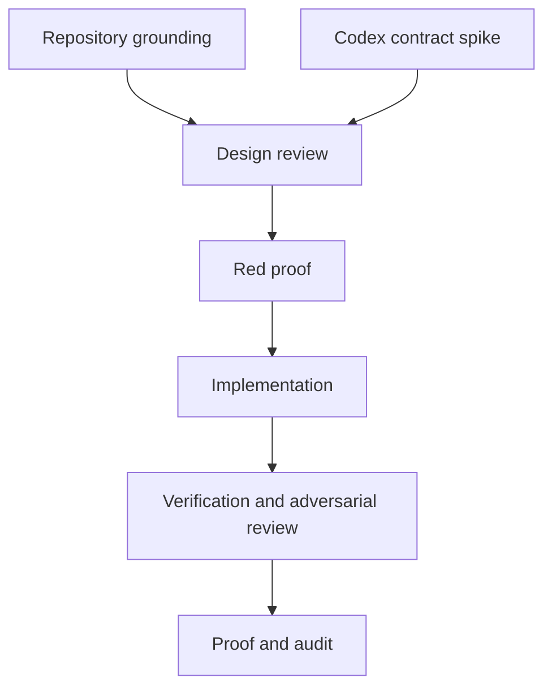

# Codex adapter

## Goal and scope

User request: keep pack/ as the shared source and add a Codex adapter to the existing generation process. Generate Codex skills into .agents/skills/. Keep the shared constitution in AGENTS.md. Adapt tool names, persona invocation, and hook wiring where required. Extend existing consistency checks to cover that output. Work in a unique worktree; push and merge later.

Done when all four adapter requirements have direct evidence, consumer installation preserves unrelated configuration, native discovery contracts are checked, and tools/verify-bundle.ps1 passes. Push and merge are outside this execution. Tier T2; fan-out cap 3. Worktree: feature/codex-adapter, based on 21dbfeeec3de (includes revision 71 Grok support).

## Domain and surfaces

The bounded context is pack installation. A capability has one canonical source and host-specific projections. The invariant is that a generated projection represents its source and remains discoverable in the intended host. No new durable business data or measures are introduced; installation files are derived, and audit events append to the existing log.

Surface list: pack/adapters and pack/commands -> pack-apply.py and sync-pack.ps1 -> .agents/skills plus native Codex persona/hook configuration -> AGENTS.md path guidance -> pack-doctor.py, check-consistency.py, local and CI drift paths -> INSTALL, workflow instructions, proof and audit. Git ignore rules are part of discovery because ignored artifacts do not reach fresh clones.

## Execution graph

| Node | Inputs and exit condition | Tier |
|---|---|---|
| A Ground | Existing installer, tests, standards and baseline; contracts located | T1 |
| B Host spike | Official Codex docs and available runtime; native discovery and hook contracts established | T1 |
| C Design review | A+B; independent Test Architect and Simplifier review of acceptance coverage | T2 |
| D Red proof | C; tests fail on missing native surfaces, config preservation and drift | T1 |
| E Implement | D; one source projection shared by consumer and dogfood paths where practical | T2 |
| F Verify | E; focused tests, independent adversarial review, full bundle gates | T2 |
| G Close | F; proof, graph and audit updated; branch ready for later integration | T1 |

Naive graph serializes A and B. Optimized graph overlaps their read-only work, leaving mutations serial. Inferred unit-cost model only: work 7 units, serial span 7, optimized span 6, width 2, maximum saving 1 unit before overhead. Actual runtime and token cost are not yet recorded; this is not a measured performance claim.

Fan-out: at most 3 agents, read-only independent reviews; one retry only for a transient tool failure, then surface the failure. Each branch exits with cited findings and explicit gaps. Join requires every required review, and a partial report cannot clear a veto. No concurrent index or generated-file writes. Repair loop variant is the remaining falsified acceptance criteria; exit requires zero. Three failed repair passes trigger replanning, never a success claim.

## Floors and oracles

- Testing Strategy: deterministic projection/parser tests, real temporary consumer filesystem integration, hook payload contract tests, and prompt/tool mapping checks. Unsupported contracts remain unresolved rather than invented.
- Red-first: missing .agents/skills, omitted reference files, altered generated bytes, hidden Git files, and clobbered consumer config must produce failures.
- Knowledge remains shared; no duplicate constitution. Codex host-specific instructions must be reachable through AGENTS.md and generated skills.
- Native hook enablement and payloads require official evidence and a local probe when available. Report the boundary between serialization tests and observed host execution.
- Test Architect hard veto and Release/Documentation consistency review remain mandatory. No author self-clearance.
- Full bundle checks must include the new paths. Record measured results, not just exit codes.
- Audit and graph metadata close the work. Any discovered defect follows class -> sweep -> derive -> prevent.

## Initial evidence

Verified: clean isolated worktree; baseline check-consistency.py reports clean with 27 skills and 23 personas. Existing .gitignore ignores .agents/* except artifacts.yml; the Codex adapter must preserve a skills exception. The existing Grok adapter is the closest exemplar. Cost history includes its audit entry, but does not establish a Codex runtime estimate.

## Actual execution

A through G completed with consumer installation, native skill and hook discovery, independent review and full bundle evidence in [the proof](../proof/codex-adapter.md). The native hook investigation required a clean consumer and isolated profile to separate generated-file discovery from the existing worktree configuration. That consumer discovered all four hooks; activation in the existing worktree is not claimed. Review repairs added historical-guidance refresh and malformed doctor-input controls. Copilot lifecycle prompts now carry the same Codex installation verification as shared skills.

The original unit-cost model was not validated: detailed agent timing and cost were not recorded. Runtime investigation and interruptions extended the observed elapsed run; audit duration must not be interpreted as active execution time. No commit, push or merge was performed.
