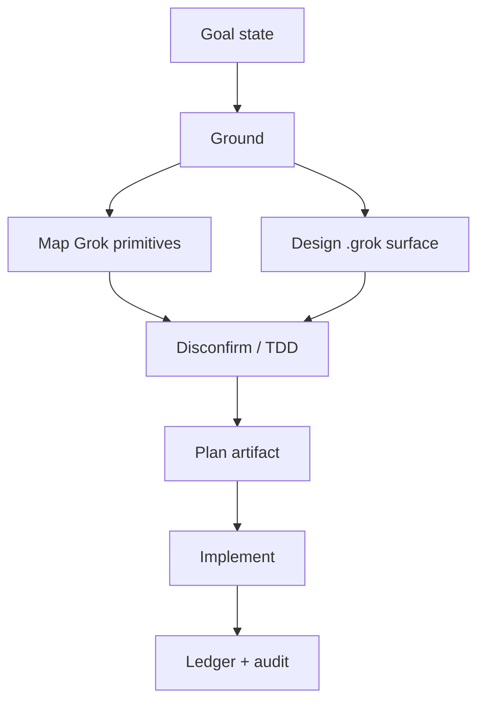

# optimize-graph — Grok Build surface

**Prompt (verbatim):** analyze the ai-forward repo / what do we need so any repo that applies the pack is configured properly for Grok / yes run /optimize-graph / plan approved and move to the execution turn /implement

**Date:** 2026-09-14 · **Tier:** T2 · **Fan-out cap:** 4 · **Objective:** completeness and rigor, then token cost, then speed (GO4a).

## Stage 0 — Triage (GO16)

**Plan, do not skip.** Multi-host adapter, fan-out, and triggered floors (Testing Strategy, E7 surface list, pack-apply as the deployment map, CTX-B).

## Optimized graph (executed)

| ID | Goal | Exit | Tier | Capability |
|---|---|---|---|---|
| A | Goal state | Written | T0 | Deterministic mechanics |
| B | Ground in Grok user-guide + pack-apply | Cited contracts | T1 | Reasoning |
| C1 | Map Grok primitives | Bidirectional table | T0 | Deterministic mechanics |
| C2 | Design native `.grok/` surface | Path map; no knowledge in rules | T2 | Reasoning |
| D | Disconfirm | Tests red then green | T2 | Independent review |
| E | Emit plan | This file | T1 | Deterministic mechanics |
| F | Implement | pack-apply + sync-pack + doctor + INSTALL | T2 | Reasoning |
| G | Record planned vs actual | Audit + proof pack | T0 | Deterministic mechanics |

## Floors (immovable)

- Hard vetoes: Security not triggered (no new trust boundary beyond existing project hooks). Privacy not triggered. Test Architect: every dest and hook payload has an oracle.
- E7 surfaces: `.grok/skills`, `.grok/agents`, `.grok/hooks`, `.grok/rules`, `pack-apply.py`, `pack-doctor.py`, `INSTALL.md`, `AGENTS.block.md`, `sync-pack.ps1`.
- CTX-B: knowledge docs MUST NOT land in `.grok/rules/`.
- AL5 audit entry; red-first tests.

## Fan-out contract (C1 ∥ C2)

Width 2. Join: both complete. Failure: re-plan, never drop a floor.

## Planned vs actual (GO18)

| Metric | Planned | Actual | Label |
|---|---|---|---|
| Nodes | 7 | 7 | Verified |
| Span | ~5 | 5 (ground → design → tests → implement → sync) | Verified |
| Parallel width | 2 | 1 in this session (single agent; mapping and design sequential in one context) | Verified |
| Rework passes | 0 | 1 (sync-pack re-run after skill edits) | Verified |
| Floors present | all | all | Verified |
| Token cost of always-on prefix | Inferred rise from AGENTS.block sentence | `prefix_tokens` 89398 → 89467 (~69 tokens) | Verified |
| addpacktorepo skill tokens | Inferred rise | 3467 → 3645 | Verified |
