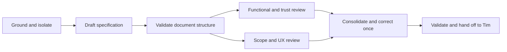

# Optional Formal Verification: Spec Authoring Plan

## Goal State

- **Goal:** produce a self-contained proposed spec for Tim Mallalieu's review,
  using AI-Forward's own SDD method.
- **Done when:** the three-layer spec has falsifiable criteria, independent
  review, verified document/graph links, and a handoff that stops before implementation.
- **Not in scope:** pack implementation, toolchain installation, full production
  proofs, commits, pushes, PR creation, or trying Tim's IDE without access/instructions.
- **Tier:** T1. **Fan-out cap:** two independent read-only reviewers; no nested agents.
- **Baseline:** upstream revision 70, `17666d35927e2bf9374b45644ca03d13102837ef`.
- **Worktree:** dedicated `docs/formal-verification-spec` branch; primary checkout unchanged.

## Grounding and Planning Decision

Applied `/optimize-graph` once, then `/specify`. The repo's graph packet rooted
at `kb-graph-and-loop-engineering` identifies the pack as a planning-discipline
system rather than a new scheduler. Its output was explicitly bounded/truncated;
it was not treated as complete repository coverage. The local spec template,
Specification Standards, existing native-app extension spec, and the previously
inspected design/implementation/testing/Proof Pack contracts provide the local pattern.

The request initially mentioned implementation. The contributor explicitly
confirmed **Tim should review the spec first**, so this plan ends at a proposed
spec and does not proceed to `/design-slice` or `/implement`.

**Alternative considered:** a broad multi-verifier service with new personas and
mandatory formal stages. Rejected as unnecessary to substantiate selected claims.
**Selected framing:** an opt-in evidence capability, Verus-first, with one example
and no automatic substitution for current tests.

## Execution Graph

| Node | Capability | Inputs | Exit Condition | Depends On | Status |
|---|---|---|---|---|---|
| G | Deterministic mechanics | Upstream, instructions, graph | Clean isolated baseline and known spec format | None | Complete |
| S | Reasoning | User request, local contracts, verified references | Proposed three-layer spec with IDs, assumptions, and non-goals | G | Drafted |
| V | Deterministic mechanics | Proposed spec and plan | Graph derivation/validation and source links checked | S | Complete |
| R1 | Independent review | Spec, testing/proof contracts | Functional, trust, and safety findings with falsifiable reasons | S, V | PASS |
| R2 | Independent review | Spec, specification standards | Scope, conceptual-model, and text-UX findings | S, V | PASS after bounded correction recheck |
| C | Reasoning | Consolidated findings | At most one correction pass; blockers fixed or reported | R1, R2 | Complete; one correction pass |
| H | Deterministic mechanics | Final spec, review record | Revalidate, record audit, hand off for Tim's approval | C | Review-ready; human approval pending |

All edges are input or decision dependencies. Sequential R1-to-R2 ordering
would be incidental: reviewers read the same draft, do not write, and assess
different criteria. Only the parent edits. No authority, schema, or runtime
interface is being changed in this spec-only branch.

**Modeled shape, not measured time:** naive work/span = 7/7 node units;
selected work/span = 7/6, width 2, deterministic share 3/7. Equal-node costs
are only an illustration; no latency or cost saving is claimed. The useful
reason for two reviews is separate judgments without duplicated broad research.

**Review budget:** each reviewer reads the spec plus at most three directly
relevant existing artifacts, makes no writes, uses no network or subagents,
and returns a concise verdict. No rerun of broad research. If a reviewer
cannot finish, its gate is unresolved, never presumed passed.

**Correction bound:** one consolidated pass. The variant is the number of
unresolved blocking findings; if it cannot be reduced within scope, stop and
record the unresolved issue for Tim. A cap firing does not mean acceptance.
If a blocker requires a recheck, only the reviewer owning that blocker checks
its resolution. New feature suggestions are deferred, not added automatically.

## Validation and Evidence

- Verified baseline: `tools/check-consistency.py` reported clean at revision 70.
- Completed document checks: native graph derivation/validation; six local Markdown
  targets; all three layers; 18 unique functional and four unique UX criterion IDs;
  both Mermaid diagrams validated and previewed; no editor diagnostics.
- These checks validate the spec artifact, not the future feature or any Rust program.
- No new tests, formal toolchain, verifier execution, or production proof is part of this run.
- Existing stale knowledge warnings outside this scope are retained and reported, not repaired.

## Independent Review Record

Two independent read-only review seats assessed the draft on 2026-09-14. These
are agent spec-readiness judgments, not formal proofs, production validation,
or Tim's approval. No reviewer edited the spec or launched nested agents.

| Seat | Verdict | Scope |
|---|---|---|
| R1: Test Architect + Security & Identity | PASS; no substantive findings | Falsifiability, trust boundaries, evidence scope/freshness, existing test obligations, and authoring-plan gate preservation. |
| R2: Simplifier + conceptual Data & Persistence + text UX/IA | PASS after correction recheck; initially PASS-WITH-CONDITIONS | Scope, layering, concepts, opt-in/recovery experience, and proportional authoring plan. |

| Finding | Severity | Disposition |
|---|---|---|
| R2-1: recovery diagram omits recorded withdrawal after failure/staleness; a changed contract could bypass renewed review | Major | Clarified the diagram: recorded plan change retains the prior outcome; meaning/trust changes return to contract review. No repository-mandated gate can be waived implicitly. R2 independently confirmed resolved. |
| R2-2: attempts defined only as actual invocations, despite required not-run/unavailable reporting | Minor | Clarified pre-invocation outcomes and explicitly absent execution-only fields. No fabricated command, duration, or output. R2 independently confirmed resolved. |
| R2: concurrent evidence handling might imply unnecessary parallel verifier support | Advisory | Clarified that refusing overlapping attempts is acceptable; evidence integrity is required, parallel execution is not. |

R2's open decisions for Tim: runnable pilot versus guidance only; recorded
withdrawal semantics; whether concurrency should be more than safe refusal.
The current proposal uses the narrower first-release interpretation.

R2 independently rechecked only the affected corrections and returned PASS;
the author did not self-clear its conditions. The recheck also confirmed the
concurrency clarification. Tim's acceptance remains pending despite both
spec-readiness verdicts passing.

## Planned vs. Actual

- Grounding and isolated worktree: complete.
- Spec drafted from the existing template: complete.
- Independent reviews: complete; one consolidated correction and its bounded
  independent recheck complete, with no remaining review conditions.
- Initial graph validation: 182 artifacts, zero defects/orphans/index drift;
  seven pre-existing stale knowledge suggestions outside this scope.
- Editor diagnostics: no errors in either new Markdown document.
- Native audit entry: `al-01M2GNYYWXTY2MXCGK8GR1WY32`, for `/specify` in session
  `39b844ea-0267-4ae4-81aa-85b4636b86bd`. Elapsed interval recorded from the
  observed start `2026-09-14T19:11:04Z`, not estimated from graph shape.
- Tokens and billed cost: not recorded; no modeled substitute.

## Status

| Item | State |
|---|---|
| Completed | Isolated revision-70 baseline, proposed spec, independent review/recheck, and document validation |
| Remaining | Contributor discussion and Tim's decision; implementation remains unauthorized |
| Best next action | Walk through the proposed scope and open decisions without implementing the feature |