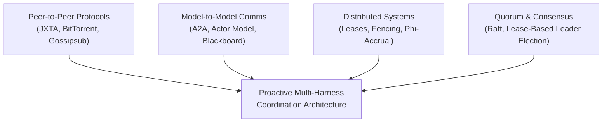
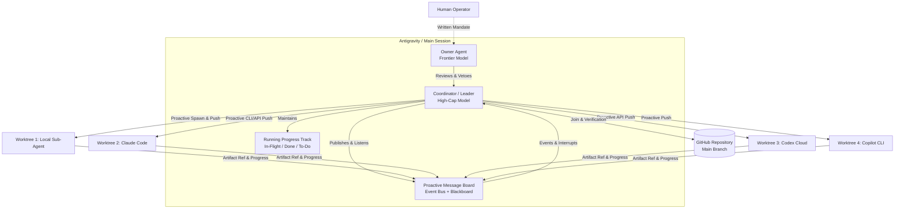
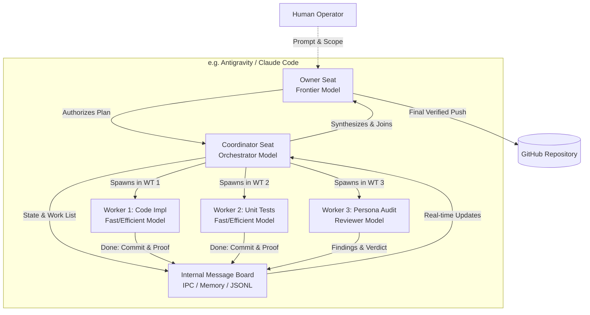
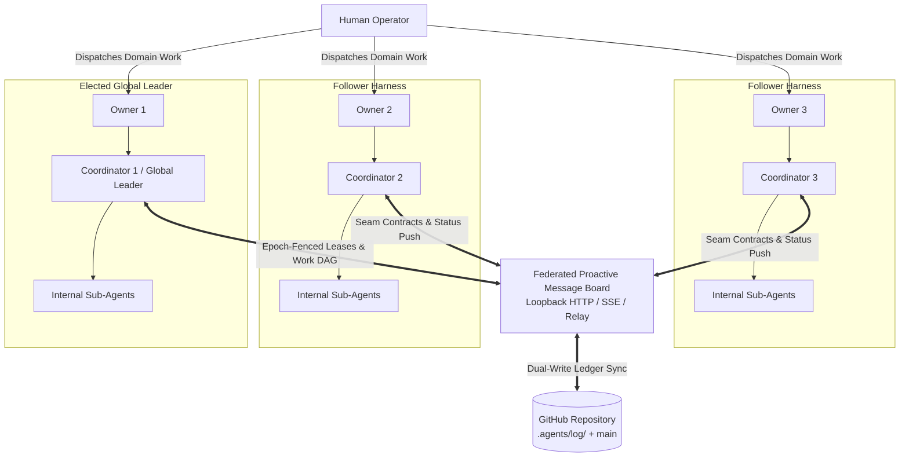
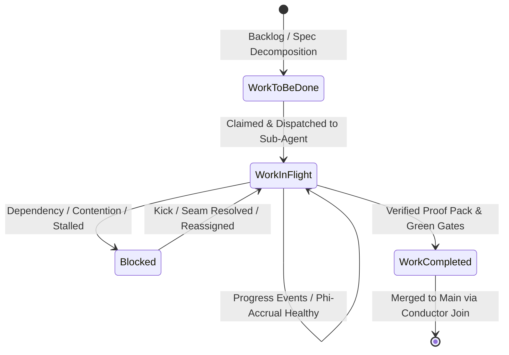

# Proposal: Proactive Multi-Harness Coordination — The Owner/Coordinator/Sub-Agent Architecture

*Research, critique, and systems architecture proposal. Successor revision to [`active-multi-harness-coordination.md`](./active-multi-harness-coordination.md). Grounded in the AI-Forward Pack, the latest dream synthesis (`drm-0010`), empirical telemetry from the `ai-de` production experiments, and foundational distributed systems theory.*

**Status:** `in-review` — submitted for maintainer review.

| Attribute | Specification |
|---|---|
| **Date** | 2026-09-18 |
| **Tier** | T2 — architectural specification governing cross-harness execution and multi-agent systems |
| **Grounding** | `spec-agent-coordination`, `architecture-agent-coordination`, ADR-0007 / 0008 / 0009 / 0010 / 0011; `ai-de` empirical telemetry (`docs/notes/collaboration-not-happening.md`, `docs/profiles/addendum-cd.md`, `docs/notes/pack-findings-addendum-cd.md`); Dream `drm-0010` findings (p44–p50: COORD-I, COORD-J, COORD-L, COORD-D); and distributed systems literature cited in §14 |
| **Harnesses in Scope** | Antigravity (AGY), Claude Code, GitHub Copilot CLI / Workspace, OpenAI Codex, Grok Build |
| **Repositories** | `ai-forward` (coordination pack core, scripts, hooks) and `ai-de` (workbench host, watcher substrate, multi-agent ide) |

---

## 1. Executive Summary & Thesis

### 1.1 The Operational Bottleneck
The AI-Forward Pack established a mathematically sound, append-only git ledger for concurrency control (ADR-0007). Leases, non-coordinating random IDs (ADR-0008), and derived-file merge drivers (ADR-0009) solved structural file contention.

However, empirical evidence from `ai-de` (`note-20260902-collaboration-not-happening`, Addenda C/D profile) demonstrated that **a passive, pull-based ledger does not produce collaboration**:
1. **The Empty Board Syndrome:** In `ai-de`, the Loomkeeper Message Board was built as an empty read-only UI pane; `MessageBoardService` had zero callers in production. When Copilot searched for communication channels, it found none and fell silent.
2. **The 8,143-Second Stall:** In Addendum C/D, a Conductor sub-agent stalled for **2 hours and 15 minutes** on an `EnterWorktree` directory violation. Because the harness relied on passive polling or next-tool injection, nothing proactively interrupted or kicked the node.
3. **The Shared-Worktree Disaster:** Multiple agents launched into the identical working directory (`TheTerrace/docs/fix-broken-design-links`), causing uncommitted index collisions, dirty working tree errors, and stash contamination (violating WT1).
4. **Ledger Merge Friction:** 44.8% of conductor active time was burned in serial joins and recounts. Merging branches back to `main` repeatedly collided on `.agents/*.jsonl` and `audit-log.jsonl`.
5. **Phantom Liveness:** In `drm-0010`, 127 of 197 sessions registered at startup but never emitted a session-end or heartbeat, leaving phantom leases that blocked subsequent work until 8-hour timeouts elapsed (COORD-D).

### 1.2 Core Thesis: Active Push-Pull Over Git Ground Truth
To eliminate stalls, maximize throughput, and guarantee deterministic progress across heterogenous agent harnesses, coordination must be refactored into:

> **Git as Immutable Ground Truth + Active Dual-Channel Message Board (Push & Pull) + Strict Owner/Coordinator/Sub-Agent Hierarchy across Isolated Worktrees.**

1. **The Truth is Always in Git:** All final decisions, architectural reviews, committed artifacts, and terminal leases persist to git branches and append-only JSONL ledgers. No ephemeral broker or daemon can ever override or fabricate git state.
2. **Proactive Communication (Push & Pull):** Replace passive file-polling and delayed tool-boundary injection with an active bi-directional Event Bus & Message Board. Events are pushed instantly via local loopback SSE/webhooks, process signals, and proactive prompt injection, while remaining queryable via an interactive blackboard.
3. **Owner / Coordinator / Sub-Agent Model:**
   - **Owner (Super-Reasoner):** The highest capability model available (e.g. Gemini 2.5/3 Pro, Claude 3.7/Opus, GPT-5). Evaluates architectural trade-offs, holds the hard veto, acts as surrogate human decision-maker within a written mandate, and only pages the human operator on mandate boundary breaches.
   - **Coordinator (Decomposer & Orchestrator):** High-capability model (e.g. Gemini Flash-High/Pro, Claude Sonnet/Opus, GPT-4o). Decomposes work for minimal contention, plans bounded DAGs, provisions isolated worktrees, delegates with explicit 4-part contracts, serializes dependent phases, and monitors progress-φ.
   - **Sub-Agents (Fit-for-Purpose Executors):** Right-sized models selected specifically for task efficiency (fast/cheap models like Flash/Haiku for mechanical implementation; specialized persona prompts for adversarial verification).
4. **Strict Worktree Isolation:** Every agent—Owner, Coordinator, Leader, and Sub-Agent—operates in its own dedicated git worktree (`WT1`). Zero shared checkouts.
5. **Real-Time Running Progress Tracking:** The Leader continuously maintains and broadcasts a transparent 3-state vector: **Work in Flight**, **Work Completed**, and **Work Remaining**.

---

## 2. Critique of the Prior Proposal (`active-multi-harness-coordination.md`)

While the prior proposal (`proposal/active-coordination-bus`) correctly identified the gap between passive ledgers and active messaging, its proposed architecture retained critical flaws that would reproduce the failure modes observed in `ai-de`:

| Component / Area | Prior Proposal (`active-multi-harness-coordination.md`) | Failure Mode in Practice | Proposed Resolution in this Architecture |
|---|---|---|---|
| **Message Delivery** | Injected primarily into `additionalContext` on the **next tool boundary**. | **The Infinite Reasoning / Idle Trap:** If an agent is stuck in an infinite reasoning loop, waiting on user input, or blocked on a subprocess, it *never* calls a tool. The message is never delivered. The 8,143 s stall remains unmitigated. | **Active Interrupt & Multi-Channel Push:** Active push via loopback SSE, local IPC/signals, and harness-native task notification / prompt steering. If an agent does not ack within the progress-φ window, the Coordinator proactively kicks or reassigns. |
| **Message Board** | Viewed as an auxiliary projection over the ledger; no live interactive protocol for both human and agent visibility. | **The Invisible Board:** Agents could not post questions or broadcast status without writing a ledger event first. Humans could only view state via complex audit commands. | **Hybrid Blackboard + Pub/Sub Board:** A first-class, interactive Message Board with both CLI/TUI (`coord board`) and MCP tool interfaces (`coord_board_post`, `coord_board_read`), dual-writing to git while streaming real-time updates. |
| **Topological Scenarios** | Assumed a single generalized "Swarm" of peers electing a Leader across harnesses. | **Architectural Ambiguity:** Failed to address how coordination actually operates when: (1) one harness drives external tools, (2) all agents run inside one harness session, or (3) federated teams operate across multiple active harnesses. | **Formalized Scenarios 1, 2, and 3:** Concrete topological models, communication graphs, lifecycle rules, and error recovery specified for each scenario (§5, §6, §7). |
| **Role & Model Allocation** | Conflated Owner, Conductor, and Leader; allowed Owner and Conductor to merge arbitrarily; model selection was untethered to task tiers. | **Capability Mismatch:** Fast, shallow models were assigned complex architectural synthesis, while Opus-class models were burned on repetitive test runs ($2,198 spent in Addenda C/D). | **Strict Capability-Tiered Hierarchy:** Rigid mapping: Owner = frontier reasoning model; Coordinator = high-throughput planning model; Sub-Agents = fit-for-purpose models assigned by task complexity and cost curves. |
| **Git Merge Contention** | Acknowledged merge friction on `.agents/*.jsonl` and `audit-log.jsonl` but left resolution to manual script flags. | **Serial Join Bottleneck:** 44.8% of conductor wall-clock time wasted rebasing and resolving ledger merge conflicts at every single node completion. | **Isolated Per-Agent Log Streams + Automated Union Resolution:** Ephemeral messaging moved to memory/bus; durable ledgers partitioned by branch/session (`.agents/log/<session-id>.jsonl`); automated `--ours` and union drivers for ledger joins. |
| **Progress Visibility** | Computed on-demand via `coord tail` or audit queries. | **Opaque Execution:** Neither the human operator nor peer agents had a single running view of what was in flight, what finished, and what was blocked. | **Live State Vector (Running Track):** Real-time broadcast and rendered dashboard tracking In-Flight, Completed, and Remaining work (§8). |

---

## 3. Grounding & Empirical Evidence

### 3.1 Lessons from `ai-de` Telemetry
The Addenda C/D profile (`docs/profiles/addendum-cd.md`) and session notes provide empirical data on how multi-agent coordination fails at scale:

1. **Conductor Overhead vs Coordination Execution:**
   - Total conductor active main-line time: 30,032 s (8.3 h) out of 56.0 h wall time.
   - **44.8%** of active time (13,451 s) was consumed by joins, recounts, and test gates.
   - Only **0.7%** (217 s) was spent executing coordination logic.
   - *Conclusion:* The coordination layer was not too heavy; rather, the *integration path* was uncoordinated, forcing the conductor into repetitive, blocking, serial join loops.
2. **The Need for Asynchronous Delegation:**
   - Conductor `claude:919ba21f` ran 52 writing nodes and 114 persona reviews sequentially or in small synchronous waves.
   - Anthropic's multi-agent research evaluation noted that synchronous sub-agent execution creates a single-point-of-failure bottleneck: *"The lead agent executes subagents synchronously. It cannot steer them, they cannot coordinate, and the system can be blocked waiting for one subagent."*
3. **The Worktree Discipline Mandate (WT1):**
   - In `note-20260902-collaboration-not-happening`, three agents sharing `TheTerrace/docs/fix-broken-design-links` produced immediate index corruption.
   - Git worktrees provide zero-cost directory isolation while sharing object databases. Every session must be quarantined in its own worktree.

### 3.2 Lessons from Dream Session `drm-0010`
Dream session `drm-0010` (2026-09-18) codified critical defect classes that this architecture directly closes:

- **COORD-I (Control Currency):** Worktrees branched from old commits execute stale versions of scripts and hooks. *Fix:* The Coordinator verifies that any spawned sub-agent worktree is rebased to the current control revision before dispatch.
- **COORD-J (The Invisible Join):** Relying on harness process exit codes to indicate task completion is fatal (processes often exit 0 despite internal failures). *Fix:* State-based completion verification via explicit `JoinState` artifacts and verified proof packs (`E18`).
- **COORD-L (Harness Identity):** Coordination records failed to capture which harness executed the task, hindering multi-harness debugging. *Fix:* Strict emission of `harness_id`, `model_id`, and `runtime_env` in all session cards and task events.
- **COORD-D (Registration Without Enlistment):** Sessions start without emitting heartbeats or clean end events, creating phantom locks. *Fix:* Continuous phi-accrual failure detection paired with automatic lease reclamation.

---

## 4. Theoretical Foundations (/collectknowledge Synthesis)

The architecture synthesizes key principles from four primary domains of distributed systems and multi-agent literature:



### 4.1 Peer-to-Peer (P2P) Protocols & Topology
1. **JXTA Peer Advertisements & Pipes:**
   - JXTA established that in dynamic, heterogeneous P2P networks, peers must publish **Peer Advertisements** describing identity, capabilities, and endpoints, and communicate across abstract **Pipes** (unicast or multicast).
   - *Application:* Every harness session publishes an A2A-compliant **Session Card** at startup detailing its supported roles (`owner`, `coordinator`, `subagent`), model capabilities, and transport endpoints (§9).
2. **BitTorrent Scheduling Principles:**
   - **Rare-First Scheduling:** In BitTorrent, the rarest pieces are retrieved first to prevent swarm bottlenecks. In coding pipelines, the **serial spine** (core data models, interface contracts, ADRs) must be scheduled and locked before parallel leaves are unchoked.
   - **Tit-for-Tat & Optimistic Unchoke:** Sub-agents that complete assignments promptly with green proof packs receive immediate subsequent allocations; stalled agents receive smaller, diagnostic tasks before being evicted.
3. **Gossipsub v1.1 Epidemic Broadcast:**
   - Unbounded flooding (Gnutella 0.4) causes ping-storms where 50% of traffic is overhead. Gossipsub uses a structured mesh with peer scoring and prune/graft control.
   - *Application:* High-frequency heartbeats and board chatter stay on the lightweight local event bus; only state-changing milestones, claims, and joins are gossiped into the git ledger.

### 4.2 Model-to-Model (M2M) Communication & Agent Paradigms
1. **Blackboard Architecture & Linda Tuple Spaces:**
   - First developed in Hearsay-II and Linda, blackboards allow heterogeneous knowledge sources to communicate asynchronously through associative pattern matching (`read`, `write`, `take`), completely decoupling message producers from consumers in space and time.
   - *Application:* The **Message Board** acts as a structured blackboard where tasks, blockers, architectural rulings, and breadcrumbs are posted and matched to capable agents.
2. **Actor Model & Supervision Trees (Erlang/OTP):**
   - The Actor model provides location transparency, isolated state, and strict message passing. Erlang's supervision trees (`one_for_one`, `one_for_all`) formalize how managers detect worker crashes and execute automated restarts.
   - *Application:* The Coordinator functions as a supervisor over Sub-Agent actors. When a Sub-Agent stalls or fails, the Coordinator terminates its worktree, cleans its leases, and restarts the task on a clean branch.
3. **Magentic-One & Anthropic Delegation Contracts:**
   - Magentic-One’s dual-ledger architecture (Task Ledger for outer planning; Progress Ledger for inner stall detection).
   - Anthropic's rule: **Never play telephone.** Sub-agents must write outputs directly to the shared filesystem and return file references, rather than passing conversational summaries through multiple model contexts.
   - *Application:* The 4-part delegation contract: (1) Objective, (2) Artifact path / output schema, (3) In-bounds tools and sources, (4) Invariant boundaries and token budget.

### 4.3 Distributed Systems Coordination & Resource Management
1. **Gray & Cheriton Leases (1989) & Chubby (2006):**
   - A lease is a time-bounded contract granting exclusive access to a resource. Unlike locks, leases guarantee fault tolerance: if the holder crashes, the lease automatically expires without deadlocking the system.
2. **Kleppmann’s Fencing Tokens (2016):**
   - A lease expiration alone does not prevent split-brain writes: a paused process (e.g. GC pause, slow tool call, context paging) may wake up after its lease expired and overwrite newer work.
   - *Application:* Every claim issued by the coordination layer carries a strictly monotonic **fencing token** (sequencer number). When files are committed or merged, the join engine asserts that the worker’s fencing token matches the current active lease. Stale writes are rejected.
3. **Phi-Accrual Failure Detector (Hayashibara et al., 2004):**
   - Binary heartbeat timeouts fail in real-world networks because they conflate slow execution with death. The $\Phi$-accrual detector outputs a continuous scale of suspicion based on the historical distribution of inter-arrival times:
   $$\Phi = -\log_{10}(P_{\text{later}}(t - t_{\text{last}}))$$
   - *Application:* Progress detection uses phi-accrual over expected task durations. A complex refactoring task is not kicked after 30 seconds, but a worker silent for 3 standard deviations past its historical editing pace triggers a progressive kick ladder.

### 4.4 Quorum-Based Systems & Leader Election
1. **Lease-Based Leader Election (etcd / Kubernetes):**
   - Leader election is implemented as an atomic compare-and-swap on an ephemeral lease object carrying an epoch number and TTL.
   - *Application:* In multi-harness clusters, the "Global Leader" is not hardcoded; it is the Coordinator holding the unexpired `leader-claim` lease in the repository's coordination store.
2. **Split-Brain Mitigation & Quorum Arithmetic:**
   - In federated multi-harness environments, network partitions or process hangs can cause two coordinators to believe they are the Leader.
   - *Application:* A Leader must verify its epoch sequencer against the shared git/board state before executing global reassignments. If an epoch collision occurs, the higher total-order commit wins, and the superseded leader demotes itself to follower.

---

## 5. Architectural Blueprint: The Three Scenarios

The architecture establishes a unified Owner / Coordinator / Sub-Agent model tailored to three distinct operational topologies:

```text
┌────────────────────────────────────────────────────────────────────────┐
│                        ROLE & CAPABILITY TIERS                         │
├────────────────────────────────────────────────────────────────────────┤
│  OWNER         Frontier Model (Gemini 2.5/3 Pro, Claude 3.7, GPT-5)    │
│                • Authoritative architectural reviewer & surrogate human│
│                • Holds veto rights; enforces invariants & mandates     │
│                • Only escalates to human on mandate boundary breach    │
├────────────────────────────────────────────────────────────────────────┤
│  COORDINATOR   High-Capability Orchestrator (Flash-High, Sonnet, 4o)   │
│                • Decomposes goals into minimal-contention DAGs         │
│                • Allocates isolated worktrees & path leases            │
│                • Proactively pushes tasks, monitors progress-φ, joins  │
├────────────────────────────────────────────────────────────────────────┤
│  SUB-AGENTS    Fit-for-Purpose Models (Flash, Haiku, 4o-mini, Personas)│
│                • Scoped execution of leaf tasks under TDD              │
│                • Specialized adversarial review (Test, UX, Security)   │
│                • Writes artifacts directly to worktree, returns refs   │
└────────────────────────────────────────────────────────────────────────┘
```

---

### 5.1 Scenario 1: Cross-Harness Hub-and-Spoke (Remote Delegation)

**Context:** A primary harness (e.g. Antigravity) acts as the operational headquarters, hosting both the Owner and Coordinator. The Coordinator dispatches and oversees Sub-Agents running in external harnesses (e.g. Claude Code, Codex, Copilot CLI).



#### Operational Mechanics:
1. **Hierarchy:**
   - **Owner:** Sits in the primary harness. Interprets operator intent, approves the execution DAG, signs off on design slices, and evaluates cross-harness PRs.
   - **Coordinator / Leader:** Sits in the primary harness. Provisions dedicated git worktrees for each external harness, writes 4-part delegation contracts, and issues cross-harness commands (via CLI triggers, ACP, or local APIs).
   - **Sub-Agents:** Executed inside external harnesses. Each external harness is pinned to its designated worktree and branch.
2. **Proactive Communication Flow:**
   - The Coordinator pushes task assignments directly into the external harness using harness-native CLI wrappers (`claude -p ...`, `copilot --prompt ...`, or API requests).
   - External sub-agents stream events (`progress`, `blocked`, `completed`) back to the primary harness via the loopback HTTP Event Bus.
   - If an external sub-agent halts or exceeds its progress-φ deadline, the Coordinator sends an active OS signal / cancel command, reclaims its leases, and reassigns the task.
3. **Serialization & Joining:**
   - External sub-agents commit their work to their isolated branch and post an `artifact-ready` event with a cryptographic commit hash.
   - The Coordinator executes `conductor-join.py`, runs the automated verify gates, merges the branch, and reports completion to the Owner.

---

### 5.2 Scenario 2: Single-Harness Internal Fleet (In-Session Swarm)

**Context:** All work is executed entirely within a single harness (e.g. Antigravity sub-agents, Claude Code agent mode, GitHub Copilot fleet mode).



#### Operational Mechanics:
1. **Hierarchy:**
   - **Owner:** Configured with the frontier model (e.g. Gemini 2.5/3 Pro in Antigravity, Claude 3.7 Opus in Claude Code). Defines the goal state, establishes the non-goals, and conducts final adversarial reviews.
   - **Coordinator:** Orchestrator model. Translates Owner milestones into an execution graph, manages concurrency caps, and enforces red-green-refactor cycles.
   - **Sub-Agents:** Spawned concurrently via native harness tools (e.g. `invoke_subagent` in Antigravity). Sub-agents utilize fit-for-purpose models (e.g. `flash` for mechanical tests, `pro` for security review).
2. **Worktree Isolation Inside the Harness:**
   - Even though all sub-agents run inside one harness session, each sub-agent is assigned an isolated worktree via `coord worktree new`.
   - Sub-agents communicate through fast in-memory IPC or local loopback HTTP.
3. **Proactive Interrupts:**
   - The Coordinator monitors sub-agent execution. If Sub-Agent 1 encounters a blocked dependency on Sub-Agent 2, the Coordinator immediately pauses Sub-Agent 1, dynamically reschedules Sub-Agent 2 onto the critical path, and wakes Sub-Agent 1 upon resolution.

---

### 5.3 Scenario 3: Federated Multi-Harness with Global Leader

**Context:** Multiple independent harnesses operate simultaneously on the same repository (e.g. a human starts a Copilot session for frontend UI design, an Antigravity session for core backend architecture, and a Claude Code session for test suites). Each harness contains its own internal Scenario 2 hierarchy.



#### Operational Mechanics:
1. **Federation Discovery & Registration:**
   - When each harness starts, its SessionStart hook emits a Session Card to the shared Message Board (`peers/<session-id>.json`) and registers with the local loopback bus.
   - The human operator assigns domain-level streams (e.g. Antigravity = backend engine, Copilot = UI tokens, Claude Code = integration tests).
2. **Global Leader Election:**
   - One Coordinator claims the **Global Leader Lease** (`coord leader claim --ttl 60`).
   - The Global Leader does *not* micromanage internal sub-agents inside other harnesses; instead, it coordinates **inter-harness seams, path-level claims, and the global critical path**.
   - If the Global Leader fails to renew its lease (e.g. Antigravity session closes), the Coordinator in Claude Code observes the expiration via the bus and claims the Leader role.
3. **Cross-Harness Seams & Serialization:**
   - When Harness 2 requires an API contract being authored by Harness 1, Harness 2 posts a `seam-request` to the Message Board.
   - The Global Leader marks Harness 2's task as `BLOCKED_ON(H1_API)` in the global track.
   - The moment Harness 1 completes and verifies the API contract, Harness 1 emits `seam-resolved`. The Global Leader immediately broadcasts a proactive push notification to Harness 2, which resumes its internal execution.

---

## 6. The Proactive Message Board & Event Bus

The core defect of past implementations was relying on passive file pulling or delayed tool-boundary injection. The new architecture provides a **dual-plane proactive communication system**:

```text
┌────────────────────────────────────────────────────────────────────────┐
│               PROACTIVE COMMUNICATION SYSTEM ARCHITECTURE              │
├────────────────────────────────────────────────────────────────────────┤
│  PLANE 1: ACTIVE EVENT BUS (Transport & Proactive Push)                │
│  • Local loopback HTTP (127.0.0.1:port) + Server-Sent Events (SSE)     │
│  • Active OS IPC signals / named trigger pipes for instant wakeup      │
│  • Push into running harness context via native notification hooks     │
│  • Cloud Relay (HTTPS + Webhooks) for multi-machine/cloud execution   │
├────────────────────────────────────────────────────────────────────────┤
│  PLANE 2: STRUCTURED MESSAGE BOARD (Blackboard & State Store)          │
│  • Interactive CLI/TUI: `coord board` (live filter, search, post)      │
│  • Agent MCP Tools: `coord_board_post`, `coord_board_read`             │
│  • Categorized channels: Announcements, Blockers, Questions, Breadcrumbs│
│  • Transparent human-in-the-loop inspection and steering               │
├────────────────────────────────────────────────────────────────────────┤
│  PERSISTENCE & RECOVERY: THE IMMUTABLE GIT LEDGER                      │
│  • Dual-write invariant: state-changing events write to JSONL log      │
│  • Git branches store code and verified proof packs                    │
│  • Bus failure degrades to ledger fold; ledger outlives any process   │
└────────────────────────────────────────────────────────────────────────┘
```

### 6.1 Message Board Channels & Message Schema
The Message Board operates as a categorized blackboard. Every message conforms to a strict JSON schema:

```json
{
  "$schema": "https://json-schema.org/draft/2020-12/schema",
  "id": "msg_01J8Z9K4M5N6P7Q8R9S0T1U2V3",
  "epoch": 42,
  "fencing_token": 1089,
  "timestamp": "2026-09-18T22:15:30.123Z",
  "from": {
    "session_id": "ses_agy_backend_01",
    "harness": "antigravity",
    "role": "coordinator",
    "model": "gemini-2.5-pro"
  },
  "to": "ses_claude_frontend_02",
  "channel": "blockers",
  "kind": "seam_resolved",
  "payload": {
    "work_item_id": "WI-0142",
    "seam_id": "seam-auth-tokens",
    "status": "resolved",
    "artifact_ref": "docs/specs/auth-tokens.md@commit:7f8e9a1",
    "summary": "Auth token schema finalized and verified. Downstream implementation unblocked."
  }
}
```

#### First-Class Channels:
1. `announcements`: High-level milestone completions, leader claims, and workstream assignments.
2. `blockers`: Explicit dependency halts (`blocked_on`), path contention notices, and lease expirations.
3. `questions`: Clarifications on interfaces, specifications, or mandate boundaries directed to Owners or the human operator.
4. `kicks`: Active supervisor steering messages issued by the Coordinator/Leader when progress-φ indicates a stall.
5. `breadcrumbs`: Transient progress updates, test run outcomes, and intermediate artifact references.

### 6.2 Proactive Push Mechanics (Eliminating the Stalled Wait)
To guarantee that messages are received immediately without waiting for an agent to initiate an edit or check an inbox file:

1. **Loopback SSE Streams:** Each active harness maintains an open Server-Sent Events (SSE) connection to `http://127.0.0.1:<port>/events?session=<id>`. When a relevant message (`to: <session>` or broadcast) is posted, it is pushed over the wire in `< 5 ms`.
2. **Harness Wakeup Adapters:**
   - **Antigravity:** Messages arrive directly via native agent messaging (`send_message` / reactive notification wakes the agent loop).
   - **Claude Code:** The local bus driver writes an immediate trigger into the session's active terminal or triggers a task notification.
   - **GitHub Copilot / Codex:** Messages trigger the webhook listener or stdin event injector.
3. **Active Process Interrupts:** If a sub-agent process is hanging (e.g. the 8,143 s `EnterWorktree` stall), the Coordinator does not wait for a tool call. The Coordinator's monitor process detects the breach via phi-accrual, cancels the hanging subprocess, marks the task failed on the board, and initiates recovery.

---

## 7. Worktree Isolation, Conflict Minimization & Git as Truth

### 7.1 Strict Worktree Isolation (The WT1 Floor)
Empirical defect analysis showed that running multiple agents in a single working directory is the single largest cause of merge conflicts, untracked file pollution, and lost work.

**Universal Mandate:**
- **Zero Shared Trees:** Every agent session—Owner, Coordinator, Global Leader, and individual Sub-Agents—MUST execute within a dedicated, isolated git worktree created via `coord worktree new`.
- **Naming Convention:** `.worktrees/<harness>-<role>-<work_item_id>` (e.g. `.worktrees/agy-coord-WI-0101`, `.worktrees/claude-sub-WI-0102`).
- **Shared Git Directory:** All worktrees reference the common `.git/` object store, ensuring near-zero disk overhead and instant branch switching.
- **Fail-Safe Cleanup:** Worktrees are removed only after their branch has been successfully merged to `main` and verified clean (`coord worktree cleanup --remove`).

### 7.2 Minimizing Conflicts on Append-Only Ledgers
The second major bottleneck in `ai-de` was that merging branch worktrees back to `main` caused repeated merge conflicts on `.agents/*.jsonl` and `docs/audit/audit-log.jsonl`.

**Architectural Controls:**
1. **Per-Session Ledger Streams:** Agents never append directly to a single shared `audit-log.jsonl` in their feature branches. Instead, each session writes to an independent, isolated ledger file:
   `.agents/log/<session-id>.jsonl`
2. **Automated Union Merge Driver:** The repository configures a custom merge driver for `.agents/log/*.jsonl`:
   ```gitattributes
   .agents/log/*.jsonl merge=union
   docs/audit/audit-log.jsonl merge=union
   ```
3. **Primary-Wins Resolution during Joins:** During `conductor-join.py`, ledger files from the primary checkout take precedence, and branch-specific event files are incorporated cleanly without conflict markers.
4. **Kleppmann Fencing Tokens on Leases:** Path leases are granted with monotonically increasing fencing tokens. The commit verification gate asserts:
   $$\text{Token}_{\text{worker}} \ge \text{Token}_{\text{active\_lease}}$$
   Any commit submitted under a superseded token is rejected before touching the branch.

---

## 8. Real-Time Running Progress Tracking (The Live State Vector)

The Leader and Coordinators maintain a transparent, continuous running track of the entire project state. This running track is rendered to the human operator (via CLI/TUI and HTML) and exposed to agents via the Message Board.



### 8.1 The Three States of the Running Track

```text
====================================================================================================
RUNNING TRACK: PROACTIVE MULTI-HARNESS COORDINATION [EPOCH 12]
Leader: ses_agy_coord_01 (Antigravity · Gemini 2.5 Pro) | Quorum: 3 Harnesses Live | Bus: SSE Live
====================================================================================================

[1] WORK IN FLIGHT (Active Executions & Leases)
┌──────────┬──────────────┬─────────────┬──────────────┬──────────┬────────┬─────────────┬───────────┐
│ Task ID  │ Harness      │ Model Tier  │ Assigned To  │ Lease TTL│ Phi (Φ)│ Status      │ ETA / Rem │
├──────────┼──────────────┼─────────────┼──────────────┼──────────┼────────┼─────────────┼───────────┤
│ WI-0201  │ Antigravity  │ Pro (High)  │ coord-engine │ 540s rem │  0.12  │ Generating  │ ~2 mins   │
│ WI-0202  │ Claude Code  │ Sonnet 3.7  │ sub-auth-api │ 780s rem │  0.45  │ TDD Phase 2 │ ~4 mins   │
│ WI-0203  │ Copilot CLI  │ GPT-4o      │ sub-ui-tokens│ 320s rem │  2.81* │ STALL WARN  │ KICK SENT │
└──────────┴──────────────┴─────────────┴──────────────┴──────────┴────────┴─────────────┴───────────┘
* Phi > 2.0 triggers Rung 1 of Kick Ladder.

[2] WORK COMPLETED (Committed, Verified & Merged)
┌──────────┬──────────────┬────────────────────────────┬─────────────────┬──────────────┬────────────┐
│ Task ID  │ Completed By │ Branch / Commit            │ Proof Pack Ref  │ Test Results │ Joined At  │
├──────────┼──────────────┼────────────────────────────┼─────────────────┼──────────────┼────────────┤
│ WI-0198  │ Claude Code  │ feat/db-schema-0198@a4b1c2 │ proof/WI-0198.md│ 42/42 Pass   │ 22:04:12Z  │
│ WI-0199  │ Antigravity  │ feat/core-domain-0199@9d8e │ proof/WI-0199.md│ 18/18 Pass   │ 22:11:45Z  │
│ WI-0200  │ Copilot CLI  │ feat/design-tokens@3f2a1b  │ proof/WI-0200.md│ UI-Craft Pass│ 22:14:02Z  │
└──────────┴──────────────┴────────────────────────────┴─────────────────┴──────────────┴────────────┘

[3] WORK TO BE DONE (Backlog, Blocked Items & Critical Path)
┌──────────┬─────────────────────────────┬──────────────┬───────────────────────────┬──────────────┐
│ Task ID  │ Objective Description       │ Dependencies │ Blocked On                │ Critical Path│
├──────────┼─────────────────────────────┼──────────────┼───────────────────────────┼──────────────┤
│ WI-0204  │ Wire Auth API to UI Views   │ WI-0202,0203 │ WAITING ON WI-0202, 0203  │ YES (Spine)  │
│ WI-0205  │ End-to-End Cypress Suite    │ WI-0204      │ WAITING ON WI-0204        │ NO           │
│ WI-0206  │ Performance Load Benchmark  │ WI-0201,0202 │ WAITING ON WI-0201        │ NO           │
└──────────┴─────────────────────────────┴──────────────┴───────────────────────────┴──────────────┘
====================================================================================================
```

### 8.2 The Kick & Recovery Ladder
When a sub-agent's phi-accrual failure metric ($\Phi$) rises, indicating an abnormal lack of progress events, the Coordinator/Leader executes the deterministic **Kick Ladder**:

| Rung | Trigger | Proactive Action | Dual-Write Record |
|---|---|---|---|
| **Rung 0: Nudge** | $\Phi \ge 1.5$ (mild anomaly) | Pushes an informational inquiry to the sub-agent: *"Are you blocked on external tools or dependencies?"* | Message Board `breadcrumbs` |
| **Rung 1: Kick** | $\Phi \ge 2.5$ or 5 mins silence | Pushes an active priority interrupt into the sub-agent's prompt context with suggested remedy (`release`, `report-blocked`, or `compact-context`). | Message Board `kicks` + Ledger event |
| **Rung 2: Reassign** | Kick unacknowledged for 90 s | Coordinator terminates the sub-agent's process, revokes its lease with a new fencing token, cleans the worktree, and re-allocates the task to an idle sub-agent. | Ledger `lease-revocation` + `task-reassigned` |
| **Rung 3: Escalate to Owner** | Reassignment fails or architectural contradiction | Coordinator presents the blocker and failure history to the Owner model for decision or plan reformulation. | Ledger `owner-escalation` |
| **Rung 4: Page Human** | Mandate boundary breached | System pauses the affected track and alerts the human operator with a concise decision rubric. | Ledger `human-alert` + TUI alert |

---

## 9. Interface Specifications & Schemas

### 9.1 A2A-Compliant Session Card Schema
Every harness registers its presence by publishing a Session Card:

```json
{
  "$schema": "https://json-schema.org/draft/2020-12/schema",
  "kind": "session_card",
  "version": "2.0.0",
  "session_id": "ses_agy_coord_01",
  "harness": {
    "name": "antigravity",
    "version": "2.1.0",
    "host_os": "darwin-arm64",
    "pid": 48192
  },
  "roles": ["coordinator", "leader"],
  "model": {
    "provider": "google",
    "name": "gemini-2.5-pro",
    "tier": "frontier",
    "context_window": 1000000
  },
  "worktree": {
    "path": "/Users/mallalieut/projects/ai-forward/.worktrees/agy-coord-01",
    "branch": "coord/active-orchestration",
    "base_commit": "4e0f3b0"
  },
  "endpoints": {
    "loopback_http": "http://127.0.0.1:58214",
    "sse_events": "http://127.0.0.1:58214/events",
    "inbox_file": ".agents/bus/inbox/ses_agy_coord_01.jsonl"
  },
  "leases_held": ["src/core/**", "docs/specs/coord-*"]
}
```

### 9.2 The 4-Part Delegation Contract Schema
When a Coordinator delegates a task to any Sub-Agent (in-session or cross-harness), it transmits a mandatory 4-part payload:

```json
{
  "$schema": "https://json-schema.org/draft/2020-12/schema",
  "kind": "delegation_contract",
  "contract_id": "del_01J8ZAA1B2C3D4E5F6G7H8",
  "task_id": "WI-0202",
  "assigned_to": "ses_claude_frontend_02",
  "fencing_token": 1092,
  "1_objective": "Implement the token refresher middleware conforming strictly to ADR-0012.",
  "2_artifacts": {
    "target_files": ["src/auth/refresh.py", "tests/auth/test_refresh.py"],
    "proof_pack_path": "docs/proof/WI-0202-token-refresh.md"
  },
  "3_in_bounds_tools": ["view_file", "replace_file_content", "write_to_file", "run_command:pytest"],
  "4_boundaries": {
    "forbidden_paths": ["src/core/**", ".agents/**"],
    "max_token_budget": 150000,
    "max_duration_seconds": 900,
    "deadline": "2026-09-18T22:45:00Z"
  }
}
```

---

## 10. Phasing & Implementation Roadmap

The implementation builds incrementally upon the existing codebase, introducing the proactive layers without breaking the existing passive git ledger:

```mermaid
gantt
    title Proactive Coordination Implementation Roadmap
    dateFormat  YYYY-MM-DD
    section Phase A: Substrate Hardening
    Absorb COORD-I & COORD-J into scripts           :2026-10-01, 7d
    Enforce Universal WT1 per-session worktrees     :2026-10-05, 7d
    Automated union merge drivers for ledgers       :2026-10-10, 5d
    section Phase B: Active Message Board
    Loopback HTTP + SSE Event Bus (127.0.0.1:0)     :2026-10-15, 10d
    CLI/TUI `coord board` and MCP tool endpoints   :2026-10-22, 7d
    Proactive interrupt & multi-channel push       :2026-10-27, 8d
    section Phase C: Topologies & State Vector
    Scenario 1 & 2 Owner/Coordinator/Subagent engine:2026-11-05, 10d
    Real-Time Running Progress Tracker (3-State)    :2026-11-12, 7d
    Phi-accrual kick ladder & automated eviction   :2026-11-18, 7d
    section Phase D: Multi-Harness Federation
    Scenario 3 Global Leader election & lease sync  :2026-11-25, 10d
    Cross-harness seam contracts & handoff tokens   :2026-12-05, 10d
    End-to-End Validation across AGY, Claude, Copilot:2026-12-15, 7d
```

### Phase A: Substrate Hardening & Isolation (Prerequisites)
- **Goal:** Close known defect classes from `drm-0010` and guarantee worktree isolation.
- **Deliverables:**
  - Absorb COORD-I (control currency check) and COORD-J (`JoinState` verification) into `coord-core.py` and `conductor-join.py`.
  - Wire `coord worktree new` unconditionally into all session launch hooks (`session-start.py`), preventing any agent from executing in the primary checkout.
  - Install custom git union merge drivers for `.agents/log/*.jsonl`.

### Phase B: The Active Message Board & Event Bus
- **Goal:** Establish zero-latency, proactive push/pull communication across processes.
- **Deliverables:**
  - Implement `coord bus serve`: Loopback HTTP on `127.0.0.1:0` with per-session token authentication and Server-Sent Events (SSE).
  - Ship `coord board` interactive TUI and MCP tools (`coord_board_post`, `coord_board_read`).
  - Wire proactive prompt interrupts into harness adapters for instant wakeup on blockers and kicks.

### Phase C: Role Hierarchies & Running Progress Tracker
- **Goal:** Enforce the Owner / Coordinator / Sub-Agent model and live state vector.
- **Deliverables:**
  - Formalize Scenario 1 and Scenario 2 execution engines.
  - Implement the 3-state Running Progress Tracker (In-Flight, Completed, Remaining) rendered in real-time to CLI and HTML dashboard.
  - Implement the $\Phi$-accrual failure detector and automated 5-rung Kick Ladder.

### Phase D: Federated Multi-Harness Coordination (Scenario 3)
- **Goal:** Enable multiple independent harnesses to collaborate under a unified Global Leader.
- **Deliverables:**
  - Implement lease-based Global Leader election with epoch sequencers.
  - Implement cross-harness seam contracts and automated handoff notifications.
  - Validate the full end-to-end matrix: Antigravity (Leader) + Claude Code (Worker) + Copilot CLI (Worker).

---

## 11. Rigor, Invariants & Anti-Patterns

### 11.1 Immutable Invariants
1. **The Git Ground-Truth Invariant:** Ephemeral memory, bus messages, and blackboard posts are accelerators. The final state of record is ALWAYS a git commit on a branch accompanied by a verified proof pack.
2. **The Worktree Boundary Invariant (WT1):** No two agent processes may ever share a working directory. Every agent instance must have its own worktree.
3. **The Anti-Telephone Invariant:** Sub-agents never transmit long prose summaries through intermediate model contexts. Results must be committed as filesystem artifacts and referenced by path and commit hash.
4. **The Fenced Lease Invariant:** Every file write and branch merge must carry a valid, unexpired fencing token matching or exceeding the current lease sequencer. Stale writes are unconditionally rejected.
5. **The Non-Blocking Degrade Invariant (NFR-P2):** If the loopback HTTP bus, SSE server, or cloud relay experiences an outage, all harnesses immediately degrade to the local git ledger. No edit or test is ever blocked by a missing socket.

### 11.2 Architectural Anti-Patterns (What Will Be Refused)
- **Anti-Pattern 1: The Monolithic Chat Swarm.** Unstructured multi-agent group chats where all agents see all messages in one shared context window. Refused due to context contamination, quadratic token burn, and catastrophic forgetting.
- **Anti-Pattern 2: Source Code CRDTs.** Attempting to use Operational Transformation or CRDTs directly on raw source code lines. Refused because CRDTs are blind to semantic syntax, language ASTs, and cross-file invariants (as proven by CodeCRDT's 5–10% semantic error rate).
- **Anti-Pattern 3: The Passive File-Drop.** Placing a kick or standing feedback in a silent disk file and hoping the model reads it. Refused because empirical evidence proved it produces multi-hour stalls.

---

## 12. Evaluation & Validation Criteria

The proposed system will be judged successful only when verified against empirical benchmarks in real repositories (`ai-forward` and `ai-de`):

| Evaluation Metric | Current Baseline (Addenda C/D Telemetry) | Target Under Proactive Coordination | Verification Method |
|---|---|---|---|
| **Stall Resolution Latency** | Max **8,143 s (2.25 h)** on directory violation | $\le \mathbf{60\text{ s}}$ from stall detection to automated kick/reassign | Simulated process hang test with phi-accrual monitoring |
| **Ledger / Join Contention** | **44.8%** of active conductor time burned in joins | $\le \mathbf{10\%}$ of active conductor time | Profiled run over a 20-node feature slice using `conductor-join.py` |
| **Worktree Collisions** | Multiple agents sharing 1 tree (`TheTerrace`) | **0 collisions** (100% strict worktree isolation) | CI assertion: distinct worktrees per agent process |
| **Cross-Harness Message Delay** | $\infty$ (Loomkeeper board had 0 callers) | $\le \mathbf{200\text{ ms}}$ from post to peer receipt over loopback bus | Automated multi-harness integration test (AGY $\leftrightarrow$ Claude $\leftrightarrow$ Copilot) |
| **Token Efficiency / Rework** | 15× chat token usage; multiple duplicate runs | $\ge \mathbf{35\%}$ token reduction via fit-for-purpose model tiering | Comparative cost analysis using `/session-profiler` |

---

## 13. Open Questions & Future Explorations

1. **Cross-Machine Cloud Relay Security:**
   - For remote developers collaborating across different physical laptops, the local loopback HTTP bus must bridge to a secure cloud relay.
   - *Exploration:* Adopt A2A-compliant mTLS with signed Agent Cards, leveraging GitHub OAuth tokens for identity verification without centralizing lease management.
2. **Sub-Turn Model Interruption:**
   - Current LLM APIs generally do not permit mid-generation cancellation without dropping the entire completion stream.
   - *Exploration:* Implement client-side stream termination via process signal (`SIGINT` to the CLI child process) so runaway models can be cut off before wasting thousands of output tokens.
3. **Dynamic Model Tier Downgrading:**
   - Can the Coordinator dynamically downgrade a Sub-Agent's model tier (e.g. from Opus to Flash) if a task is determined to be purely mechanical refactoring during execution?
   - *Exploration:* Formalize model tier selection within the 4-part delegation contract based on AST complexity metrics.

---

## 14. References & Literature Grounding

1. **Anthropic Engineering:** "How we built our multi-agent research system," June 13, 2025.
2. **Microsoft Research:** "Magentic-One: A Generalist Multi-Agent System for Solving Complex Tasks," arXiv:2411.04468, Nov 2024.
3. **Microsoft Research:** "Magentic-UI: Towards Human-in-the-loop Agentic Systems," arXiv:2507.22358, July 2025.
4. **Google & Linux Foundation:** "Agent2Agent Protocol (A2A) Specification v1.0," March 2026.
5. **Agent Network Protocol (ANP):** "ANP 1.1 Technical White Paper," arXiv:2508.00007, July 2025.
6. **Zed Industries:** "Agent Client Protocol (ACP) Specification," 2025–2026.
7. **Burrows, M.:** "The Chubby lock service for loosely-coupled distributed systems," *OSDI 2006*, Google.
8. **Gray, C. and Cheriton, D.:** "Leases: An Efficient Fault-Tolerant Mechanism for Distributed File Cache Consistency," *SOSP 1989*.
9. **Kleppmann, M.:** "How to do distributed locking," Martin Kleppmann’s Blog, Feb 8, 2016.
10. **Hayashibara, N. et al.:** "The $\Phi$ Accrual Failure Detector," *IEEE Symposium on Reliable Distributed Systems (SRDS)*, 2004.
11. **Pugachev, S.:** "CodeCRDT: Observation-Driven Coordination for Multi-Agent LLM Code Generation," arXiv:2510.18893, Oct 2025.
12. **Lee, D.:** "AgentRoom: Concurrent Multi-Agent Coding in a CRDT-Backed Shared Workspace," arXiv:2608.23740, Aug 2026.
13. **Sun Microsystems:** "JXTA v2.0 Protocols Specification," 2001–2007.
14. **Libp2p / Protocol Labs:** "Gossipsub v1.1: An extensible pub/sub framework with message scoring," 2020.
15. **Ongaro, D. and Ousterhout, J.:** "In Search of an Understandable Consensus Algorithm (Raft)," *USENIX ATC 2014*.
16. **AI-Forward Pack & AI-DE Corpus:**
    - `docs/specs/agent-coordination.md`
    - `docs/architecture-agent-coordination.md`
    - `docs/adr/0007-coordination-substrate.md`
    - `docs/profiles/addendum-cd.md`
    - `docs/notes/collaboration-not-happening.md`
    - `docs/notes/pack-findings-addendum-cd.md`
    - `docs/dreams/drm-0010/dream.json` (Proposals p44–p50)
