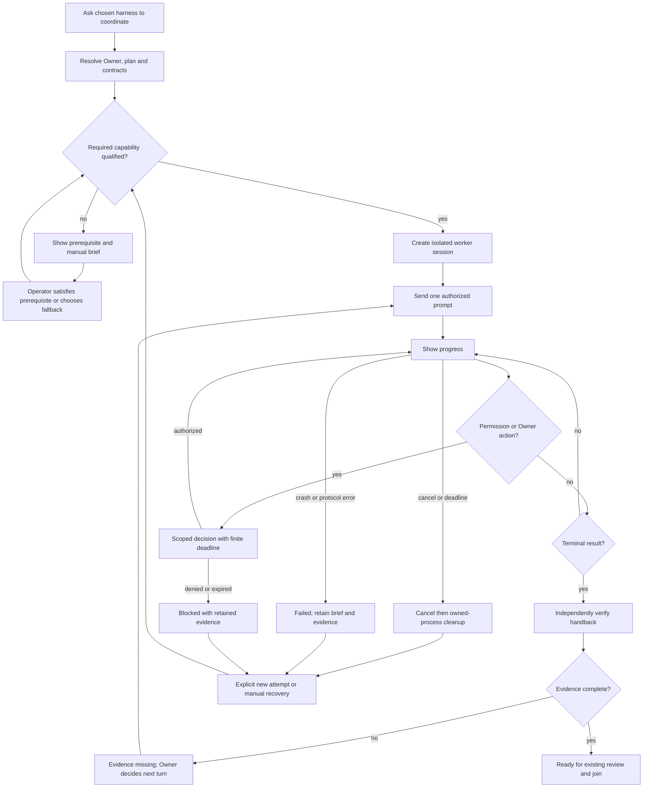

# ACP for multi-harness coordination

**Recommendation: proceed with a small, capability-qualified ACP client under
`execute-with-coordination`, with an explicitly different Agy native-stream adapter.**
Keep the pack's current worktree, leader, request/ruling, mail, audit and join mechanisms.
Do not claim that ACP replaces them or that every harness is already qualified for
unattended repository work. This recommendation is **Inferred from executed evidence**;
the cells below state exactly what was observed.

**Status:** specification proposed; independent review recorded in the final gate section.
**Tier:** T2. **Date:** 2026-09-20. **Owner:** repository operator. **Author:** separate
Codex specification track; all model-runtime probes were executed by a Grok driver.
The [HTML rendition](acp-coordination.html) contains the same substantive specification.

## Decision and evidence first

The experiment used Grok 1.0.34, Claude ACP adapter 0.79.0 with Claude Agent SDK 0.3.274,
Codex ACP adapter 1.12.0 with the installed Codex CLI 0.155.1, and Antigravity 1.2.7.
Installed Claude Code 2.1.278 was inventoried; the adapter ran its SDK runtime, so its
results must not be attributed to that standalone CLI version. Node was 22.22.2.
Adapters were pinned in a temporary directory with a lockfile; no global installation,
trust setting or permission setting was changed.

The driver executed `probe.py all` from its own worktree, then one diagnosed control
experiment. Its result and each target's protocol records were inspected independently.
The first driver returned a successful final result. The control driver reached its
three-turn cap after generating the completed control observations; its wrapper exited
1 with `max turns reached`. Those target observations were independently inspected;
no successful final driver response is claimed for that follow-up.
Each target ran serially in a separate disposable Git repository with a unique session
identity. Peak model-session width was four: parent Codex, this specification agent,
Grok driver, and one target. This was not four simultaneous target probes.

### Observed compatibility matrix

All **Verified** cells are bounded observations on this machine and these versions,
not guarantees about other installations. **Not established** means no supporting
execution evidence; it does not mean impossible. [Reproduction and evidence](../knowledge/acp-compatibility/index.md).

| Capability | Grok native ACP | Claude SDK ACP adapter | Codex ACP adapter | Agy native stream |
|---|---|---|---|---|
| Transport | Verified: `grok agent --no-leader stdio` | Verified: `claude-agent-acp` | Verified: `codex-acp`, explicit `CODEX_PATH` | Verified: stream-json; **not ACP** |
| Initialize / create | Verified, ACP v1 and session ID | Verified, ACP v1 and session ID | Verified, ACP v1 and session ID | Verified `init` + conversation ID; ACP negotiation N/A |
| Two prompts, same context | Verified nonce recalled on turn 2 | Verified | Verified | Verified |
| Progress before completion | Verified `session/update` | Verified `session/update` | Verified `session/update` | Verified `step_update` |
| Native tools without client FS/terminal | Verified file read/edit | Verified native Read | Verified native shell read in control; no dedicated read tool in first probe | Verified `view_file` |
| Actual permission request and rejection | **Not established:** no callback for allowed in-workspace edit | Verified one ACP request rejected; file absent | Verified one external-path ACP request rejected; file absent | ACP broker N/A; local hook/reviewer denied write after deadline |
| Workspace edit result | Created `denied.txt`; no refusal had occurred | File absent after actual rejection | Created local `denied.txt`; mode permits workspace writes | File absent; runtime reported local review timeout |
| Cancellation | Verified prompt response `cancelled` | Verified `cancelled` | Verified `cancelled` | Owned process terminated; graceful per-turn cancel **not established** |
| Optional session loading | Verified same-process replay | Verified same-process replay | Verified same-process replay | Not tested |
| Repository instruction canary | Absent in both ACP and native CLI on same **untrusted** fixture | Verified canary in response | Verified canary in response | Verified canary in response |
| Project hook canaries | Absent; local hooks not discovered in untrusted fixture | Verified SessionStart, UserPromptSubmit, Stop | **Not tested:** no Codex hook fixture | Verified PreInvocation and Stop |
| Protocol completion | Verified `end_turn` and reply | Verified `end_turn` and reply | Verified `end_turn` and reply | Verified per-turn `SUCCESS` and reply |
| Full pack handback / commit / join | Not tested | Not tested | Not tested | Not tested |

First-pass elapsed times were Grok **56.288 s**, Claude **17.686 s**, Codex **50.220 s**,
and Agy **48.676 s**. These are complete probe durations with different native policy
paths, not a model-speed comparison. Codex's targeted control took **21.464 s**.
Cancellation responses were observed at 0.272 / 0.258 / 0.267 s from prompt submission,
with cancellation sent at 0.25 s. This establishes an early in-flight cancellation path,
not cancellation of a long-running side-effecting tool.

### What changes the recommendation

1. **Use ACP for the common lifecycle.** Three real harness runtimes created sessions,
   exchanged multiple prompts, emitted progress, cancelled and replayed an existing
   session. That is a stronger basis than four bespoke one-shot dispatchers. The common
   client need not initially implement an editor filesystem, terminal service, provider
   chooser, MCP proxy, or every protocol extension.
2. **Qualify effective policy separately.** An ACP permission callback is not a universal
   wrapper around every native tool. Codex adapter 1.12.0's `read-only` ID maps to
   `workspaceWrite` with approval on request; the displayed mode says “Ask for approval.”
   It allowed a local edit and rejected an external edit through ACP. Matching a mode ID
   by its English-looking name would be a defect. Grok's permitted local edit likewise
   did not exercise refusal. Neither observation is evidence of ignoring a client denial.
3. **Make trust a visible setup prerequisite.** Grok inspection reported
   `projectTrusted: false`, no local instructions, and no local hooks. The native CLI
   control had the same missing marker. Thus the fixture does not implicate ACP as the
   cause. A newly created sibling worktree needs its actual trust/configuration verified;
   this experiment does not establish whether repository trust extends to siblings.
4. **Keep Agy's fallback narrow and honest.** Its native stream already accepts subsequent
   turns in one process. A new bridge does not need an A2A server. Its permission UX,
   per-turn cancellation and restart/load semantics still need their own qualification.
5. **Ship opt-in first.** Claude and Codex can enter a qualified-profile pilot, subject to
   full pack canaries and handback tests. Grok conversation control is validated; unattended
   pack work stays blocked until project trust, required hooks and the selected policy are
   measured. Agy can use its named native fallback with process-level cancellation and
   explicit blocked/action-required states. None of these gaps invalidates all ACP use.

The go/no-go boundary is **required capability of this task**, not a single global
“harness supported” flag. A read-only research track and a write-capable implementation
track can legitimately have different qualification outcomes.

## Part A — Functional specification

### Problem, users and core scenario

The operator currently has to relay startup and continuation messages between harnesses.
They want to choose Claude or Codex as the coordinating Owner and start independent work
on Grok, Agy, Claude and Codex without reconstructing each harness's launch procedure.
The operator's 2026-09-20 request is the **Verified user evidence**. The existing
[`execute-with-coordination` skill](../../pack/commands/execute-with-coordination/SKILL.md)
supports native agents and manual briefs. [`coord-mail.py`](../../pack/scripts/coord-mail.py)
dispatches native headless commands and treats parseable successful process output as
transport evidence. It does not currently implement ACP.

Primary user: the human operator choosing the Owner and authorized work. Secondary users:
the Owner on Claude or Codex, a worker in its isolated checkout, and a later operator
diagnosing a stopped run. Their job is to start, observe, intervene in, and verify a
delegation with an unambiguous return path.

Core scenario: “Start coordination across Grok and Agy” in either Claude or Codex resolves
the plan and worker contracts, displays any missing local prerequisite, opens qualified
sessions, and delivers the brief. Progress and decisions return to the designated Owner.
The Owner supplies rulings; workers continue in their session. A successful transport
turn produces a candidate handback. The pack independently reads the artifacts and
applies its existing review/join gates before recording work as complete.

### Scope and non-goals

**In scope:** a shared session-control contract, explicit version/profile qualification,
fresh session creation, sequential prompts, streamed progress, permission decisions or
finite action-required fallback, cancellation, evidence-bearing outcomes, and leader
neutrality. Agy native stream is an explicit alternative transport. Either initiating
Grok/Agy session or the selected Claude/Codex Owner can invoke the same pack entry point.

**Out of scope:** replacing pack coordination stores, electing a leader, granting blanket
permissions, changing global trust, collecting credentials, automatic merges/pushes,
arbitrary attachment to an already-open terminal, remote agent services, A2A deployment,
full ACP-editor feature coverage, or claiming that protocol success proves task correctness.
Session loading is optional. This specification does not require it for the first release.
Copilot is outside the requested four-harness matrix and was not installed or spiked here.

### Conceptual domain model

Bounded context: **worker session control**, downstream of **repository coordination**.
The domain vocabulary separates pack **Session identity** from a provider's **Transport
session**, and a **Prompt turn** from a **Delegated task**.

| Concept | Entity or value | Meaning / aggregate invariant |
|---|---|---|
| Coordination run | Entity, existing execution context | Each admitted worker belongs to the designated Owner/epoch and approved plan |
| Worker binding | Entity, aggregate root | One pack identity has one assigned checkout and one active transport session for an attempt |
| Transport profile | Immutable value | Executable/version, effective permissions, capabilities, instruction and hook prerequisites |
| Capability observation | Immutable value | One bounded measurement for one profile/environment; absence is explicit |
| Prompt turn | Entity within worker binding | At most one active task prompt per worker in the initial release |
| Permission decision | Value referencing a pending action | Applies only to that action, session and attempt; no decision means no approval |
| Candidate handback | Value | Artifact/commit references and terminal transport reason; never self-certifies work completion |

The worker binding protects **identity/checkout/transport consistency**. The pending action
protects **no authority without a matching decision**. Existing leader and request aggregates
retain their current invariants. ACP messages are transient transport events; the pack's
durable audit and request facts remain the record. Concrete storage/grain/schema decisions
belong to design. LOA allocation: deterministic transport and admission are T0 mechanics;
planning, delegated reasoning and Owner decisions remain model/human work. No model is
asked to simulate the transport protocol.

### Stories and acceptance criteria

The following are **requirements**, not claims that a production runner exists. Each names
its future negative oracle so an implementation cannot satisfy it with a happy-path mock.

**ACP-1 — Start from either Owner.** Given the same authorized plan and one Claude Owner
or one Codex Owner, when fresh workers are requested, then the same qualification and
ownership rules apply. Given an active different leader, when launch is attempted, then
it reports the holder and dispatches no work. Verification: real Git fixture, swapped
Owner identities and competing designation; retain the existing CAS/epoch oracle.

**ACP-2 — Admit a qualified profile.** Given an executable with a recorded version and
the task's required capabilities, when preflight executes, then every required capability
has a compatible observed profile or the worker is blocked before its work prompt. Given
missing credentials/adapter/project trust or an unknown capability, then show that exact
prerequisite and preserve a manual brief. Verification: missing executable, version change,
auth failure, untrusted Grok fixture, and false advertised capability. Qualification binds
the actual cwd/repository trust, effective permission policy, and required instruction/hook
configuration as well as executable version. A changed binding invalidates the observation
unless re-probed; a fingerprint may detect drift but cannot substitute for the original
behavioral probe. Negative oracle: change policy or remove a required hook after a green
qualification and verify that the stale profile cannot admit work.

**ACP-3 — Bind identity and cwd.** Given inherited parent environment and multiple worker
contracts, when sessions are created, then each observes its own pack identity and actual
assigned non-primary checkout; transport session IDs are stored against that attempt.
Given an invalid or reused checkout/identity, then reject before launch. Verification:
child reports environment/cwd; duplicate IDs and a mismatched session event must fail.

**ACP-4 — Exchange subsequent turns.** Given one active worker session, when two authorized
prompts are sent sequentially, then both have distinct turn correlation and the second
can use the first's context. Given a second prompt during an active turn, then reject or
queue within an explicit finite limit; never silently interleave. Verification: live nonce
recall and a fixture that reorders responses and emits unrelated IDs.

**ACP-5 — Observe progress and completion.** Given a streaming worker, when updates arrive,
then expose bounded progress and the terminal protocol reason separately from task status.
Given `end_turn`/`SUCCESS` but no required handback, then report evidence missing. Given a
fake “done” string or exit zero without a valid terminal event, then do not mark completed.
Verification: real progress, malformed/truncated stream, forged done, missing artifact,
wrong checkout/commit and independent handback verifier. Full pack join remains mandatory.

**ACP-6 — Preserve authority.** Given a permission request not already covered by the
operator's selected profile, when the client receives it, then expose the action/session
and route a scoped decision or deny with a finite action-required fallback. Given denial,
timeout, disconnect, stale session or mismatched action, then grant nothing. Native actions
already allowed by the selected harness policy need not request ACP approval. Verification:
allow one benign in-scope action and reject one out-of-scope canary; inspect filesystem and
effective policy, not just callback count or mode name. No blanket or persistent approval.

**ACP-7 — Preserve instructions and required hooks.** Given a track requiring pack rules,
when it is qualified, then named instruction and hook canaries are observed on that exact
launch path/profile. Given a required canary absent, then block that capability with the
actual trust/configuration diagnosis. Verification: same fixture through native and ACP
paths, read-allowed/write-denied discrimination, and a missing-hook negative control.
Canary execution alone does not prove the full pack's enforcement semantics.

**ACP-8 — Stop and contain.** Given an in-flight prompt, when cancelled or its deadline
expires, then record requested/observed cancellation distinctly and reap owned processes
within a documented cleanup bound. Given no cancellation acknowledgement, then terminate
only the owned process tree and report that fallback. No edit rollback is implied.
Verification: prompt cancellation, tool-in-flight cancellation, hanging child, descendant
process, malformed output and output-flood fixture; no unrelated-process termination.

**ACP-9 — Treat optional load honestly.** Given `loadSession` advertised and a verified
load profile, when explicit load is selected, then restore the recorded compatible session
and replay as documented. Given no capability, a wrong cwd, unknown session or a failed
load, then preserve evidence and offer a fresh explicit attempt. Never infer restart
recovery from same-process replay or claim arbitrary interactive-terminal attachment.
Verification: same-process replay now; process-restart/load and continuation before release
of that optional feature. No automatic replay of a potentially side-effecting prompt.

**ACP-10 — Keep Agy visibly distinct.** Given a qualified Agy native-stream profile, when
selected, then use its documented event framing and show `native-stream`, not `ACP`.
Given a capability it lacks, then expose the limitation without inventing an ACP response.
Verification: multiple messages in one process, per-turn result, cumulative usage handling,
local denial and process cancellation; graceful turn-cancel remains unqualified.

### Quality attributes and boundary set

| ISO 25010 attribute | Required outcome |
|---|---|
| Functional suitability | All admitted required capabilities have independent evidence; no all-green aggregate hides blocked cells |
| Reliability | Every worker has finite startup/turn/cancel/cleanup bounds and a declared fallback; no automatic side-effecting replay |
| Performance efficiency | Bounds and latency measured on the normal path; protocol parser/queue byte limits enforced before allocation growth; model latency not fabricated |
| Compatibility | ACP v1 negotiated and optional capabilities advertised only when implemented; native fallback separately named |
| Security | Effective least-privilege profile, scoped decisions, path/session validation, no credentials or raw private payloads in committed evidence |
| Usability | Human and machine outputs distinguish blocked, waiting for action, running, cancelled, transport complete, evidence missing and ready for review |
| Maintainability | Versioned external executables; deterministic protocol fixtures plus separately labelled live tests; no mandatory provider SDK in core pack |
| Portability | This spike qualifies macOS only; Windows/Linux process containment and executable resolution require CI evidence before claimed support |

Boundaries: absent executable, unsupported protocol version, authentication refusal, lost
stdout, invalid JSON, unexpected method, oversized line/update queue, partial result,
duplicate/reordered response, missing session ID, multiple pending prompts, invalid
permission option, no Owner decision, lease/epoch change, no instructions, untrusted
project, cancelled tool, worker crash and missing/mismatched handback. Limits are chosen
in design and must be finite; the spike's 70-second prompts are experimental bounds,
not the product's universal deadline.

### Governance and threat disposition

| Lens / threat | Required response |
|---|---|
| Spoofing worker or leader | Bind pack session, transport session, cwd and current leader epoch before dispatch |
| Tampered stream/permission result | Validate incoming shapes and IDs; reject unknown pending action; no shell interpretation of model text |
| Repudiation / false completion | Correlated durable pack events, explicit evidence verifier, terminal-reason/task-status separation |
| Information disclosure | Harness retains credentials; allowlist operational fields; redact private metadata; no raw provider settings in durable facts |
| Denial of service | Bounded line/queue/output/time/process resources; independent cancellation and leader renewal |
| Elevation of privilege | Preserve selected effective native profile; refuse undocumented approval/trust changes; explicit action-scoped decisions |
| Dependency supply chain | Pin adapters and transitive lockfile; record source/runtime versions; missing adapter never triggers silent install |
| Privacy | Record only necessary identifiers, capability evidence and operational costs; raw diagnostic traces excluded by default |
| Accessibility | Plain labels and reasons, keyboard-accessible CLI/document links, no color-only state |
| Release / rollback | Opt-in transport; fall back to retained native/manual contract; leave worktrees/audit intact |
| Incident response | Diagnose by run/session/turn + stable reason; stop owned process and retain brief/evidence |

Applicable governance lenses are traceability, quality, security, privacy, CLI usability,
resource budgets, observability, supply chain, rollback and incident readiness. No new
database or visual product UI is specified. No compatibility claim crosses a platform,
adapter version or effective policy boundary without a new observation.

## Part B — UX specification

The primary interaction is an existing skill in the chosen harness. Information order:
**plan and Owner → workers/checkouts → required capability profile → action required →
progress → terminal transport result → handback verification**. The operator should not
need to know JSON-RPC method names to make a decision.

The preflight view identifies the worker, harness/runtime version, selected transport,
required trust/permissions and missing prerequisite. A permission view names the concrete
operation and scope, why it needs a decision, its deadline, and deny as the fallback.
The status view lists one row per worker and links to the existing pack evidence/request.
Error recovery preserves the original brief and checkout; it does not start another model
or replay a task silently.

UX acceptance: every blocked/error/cancelled worker shows an actionable reason and retained
reference in the same status response (ACP-2/5/6/8); subsequent prompts explicitly name the
worker binding (ACP-3/4); load controls appear only for qualified capability (ACP-9); Agy's
fallback label remains visible (ACP-10). Empty plan means “No workers requested,” not an
empty success table. Mixed success shows individual worker states and never a blanket done.

## Part C — UI specification

**N/A — no new graphical runtime UI.** CLI/skill UX is specified above. The requested HTML
is a static document rendition, not a new coordination dashboard or a visual prototype.
It must work offline, have semantic headings/table headers, readable narrow-screen overflow,
visible keyboard focus, and preserve the Markdown's acceptance criteria and caveats.

## Comparables, sources and reconciliation

| Evidence | What it establishes | Confidence |
|---|---|---|
| [ACP initialization](https://agentclientprotocol.com/protocol/v1/initialization) | Negotiated version/capabilities; optional client facilities | Verified documentation |
| [ACP prompt turn](https://agentclientprotocol.com/protocol/v1/prompt-turn) | Prompt/update/terminal/cancel contract | Verified documentation and bounded live observations |
| [ACP tool calls](https://agentclientprotocol.com/protocol/v1/tool-calls) | Agent-originated permission request with scoped options | Verified documentation; Claude/Codex negative probes |
| [ACP session setup](https://agentclientprotocol.com/protocol/v1/session-setup) | Optional load and replay, not arbitrary TUI attachment | Verified documentation; same-process replay observed |
| [Grok headless and ACP](https://docs.x.ai/build/cli/headless-scripting) | Native stdio endpoint | Verified docs and execution |
| [Claude adapter](https://github.com/agentclientprotocol/claude-agent-acp) | SDK-backed ACP bridge with project settings | Verified pinned source and execution |
| [Codex adapter](https://github.com/agentclientprotocol/codex-acp) | App-server-backed bridge and CODEX_PATH override | Verified pinned source and execution |
| [Agy headless mode](https://antigravity.google/docs/cli/headless/) | Persistent native NDJSON input/output | Verified docs and execution |
| [IBM Agent Communication Protocol](https://research.ibm.com/projects/agent-communication-protocol) | Different HTTP agent protocol, now part of A2A | Verified documentation; service adoption not required here |
| [Existing research](../knowledge/multi-agent-coordination/state-of-the-art.md) | Repository already identified ACP; current native dispatcher did not adopt it | Verified source inspection |

Grounding traversal: `spec-message-layer → proposal-owner-coordinator-subagent-coordination
→ spec-agent-coordination`, and `spec-message-layer → adr-0007-coordination-substrate →
architecture`, plus the leader-designation sibling. Existing mail and leader contracts
remain authoritative. The new spec refines session control rather than replacing those
stores. ADR-0005's injected runner boundary belongs to dreaming; its dependency-averse
principle is relevant, but its subsystem-specific human-gate wording is not transplanted
as an invented blanket restriction on this authorized launch work.

### Why not the other ACP / A2A now?

Agent Client Protocol addresses this local need: one client controls coding-agent sessions.
IBM's Agent Communication Protocol became part of A2A and addresses agent services. A2A
could become relevant if independently hosted services, remote discovery or service-to-service
authentication become requirements. Adding those services here would create more deployment
and identity work while leaving repository ownership, leader fencing and artifact verification
unsolved. **Inferred decision:** defer A2A; revisit when remote service interoperability is a
real requirement rather than because the abbreviations match.

## Independent gate and residual risks

**Gate status: PASS for the specification/spike phase.** The independent parent reviewed
Test Architect, Security, Data, UX/IA and Simplifier lenses. It confirmed the
observation/requirement separation, negative controls, model and UX. Its Security
condition was to invalidate qualification after effective policy, trust or required-hook
configuration changes; ACP-2 now contains that requirement and negative oracle, and the
reviewer confirmed the correction. No hard veto remains for this phase.

Independent browser review passed at actual emulated widths 1440 and 390 px, with document
width equal to viewport width, no overflowing non-table elements and no missing internal
anchors. The reviewer inspected the main content and narrow-screen matrix. An initial
footer hash overflow measured 509 px at the 390 px viewport; `overflow-wrap:anywhere`
corrected it to 390 px. The [render evidence](../knowledge/acp-compatibility/render-qa.json)
binds the final HTML hash to these checks. The author did not self-clear this gate. This
is a specification/spike deliverable, not a production implementation Proof Pack.

Open qualification work before broad unattended rollout: trusted Grok project/worktree
canaries and real permission denial; full installed pack hooks and ownership discrimination
on each chosen profile; permitted-action counterpart where only denial was tested; tool-in-flight
cancellation; process-restart/load if shipped; Windows/Linux containment; all-harness
artifact/commit handback and the existing join gate. Agy's observed refusal depended on an
existing local review hook timing out, so it does not establish universal native plan-mode
enforcement. Codex's missing hook observation is not a claim that Codex lacks hook capability.

The experimental Python client's in-memory queue and reader are not a hardened production
boundary: consumed-output caps do not bound queued bytes or a single unterminated line.
Its process-group cleanup was not a cross-platform descendant-containment proof. Reuse the
protocol findings, **not this experimental client as production code**. A failed or partial
capability remains visible rather than being relabelled supported.

What would change the recommendation: a required policy/canary cannot be preserved through
an adapter, or production-safe lifecycle/permission handling proves materially larger than
a native alternative. In that case retain that harness's native/manual profile while keeping
ACP for the harnesses whose measured contract fits.
