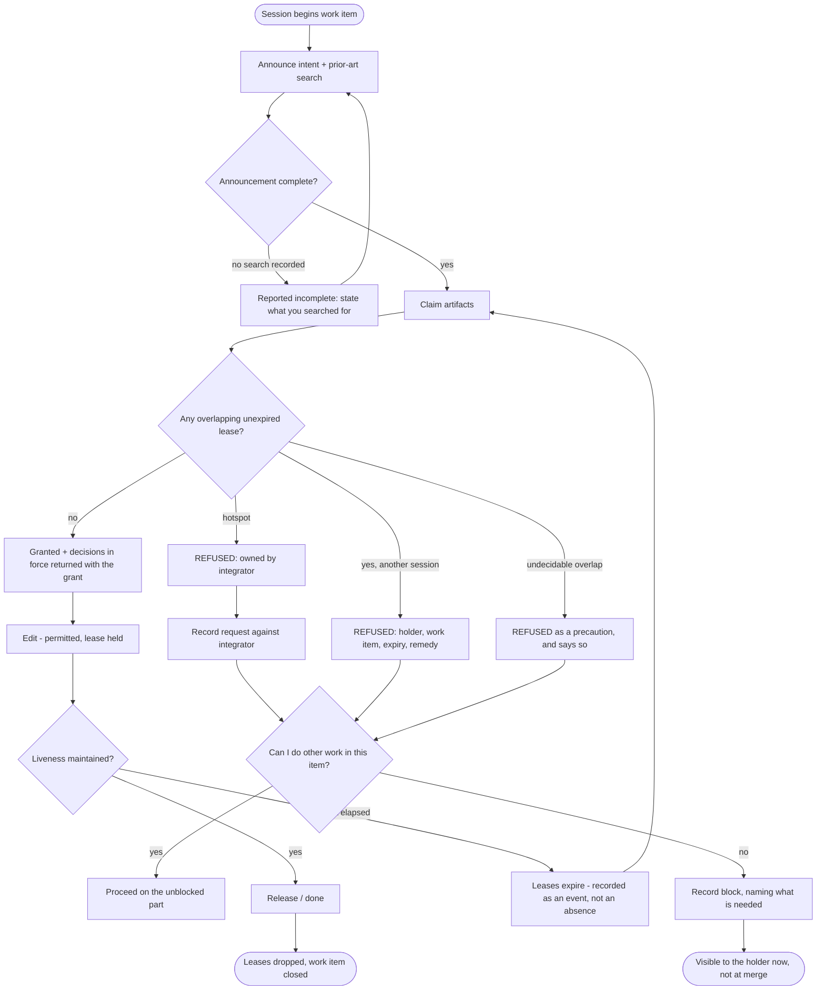
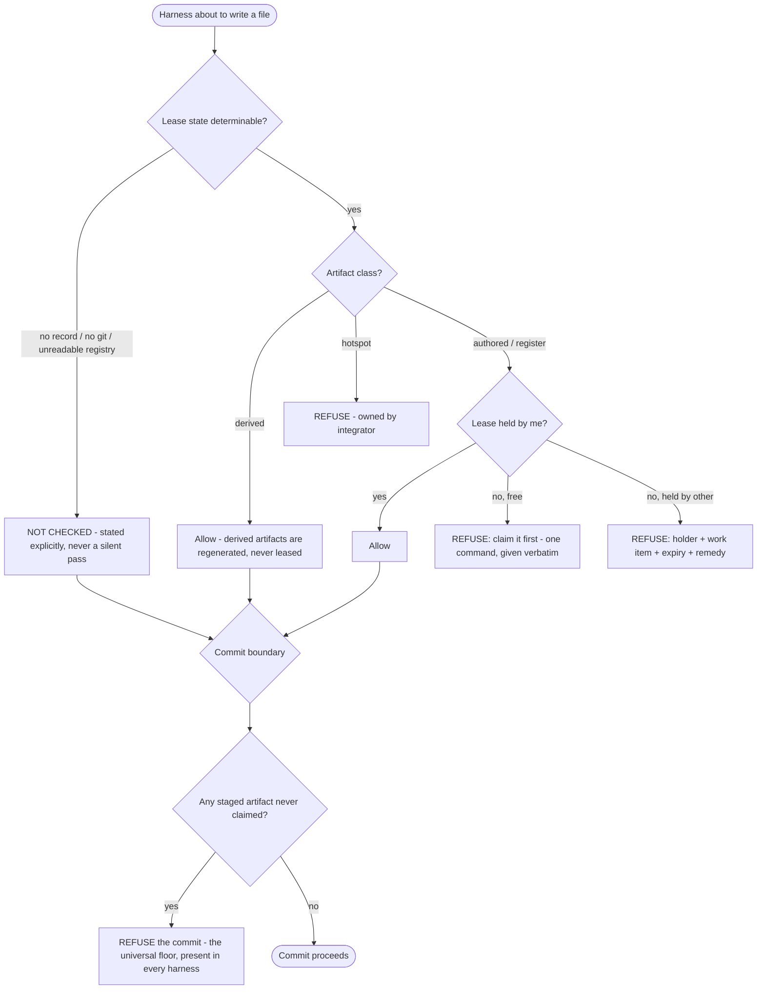
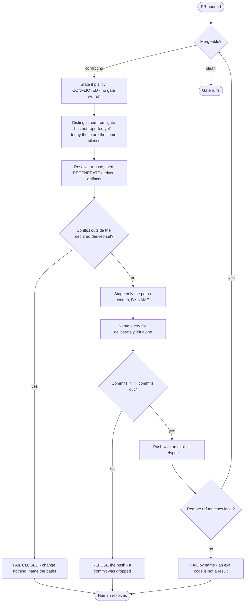
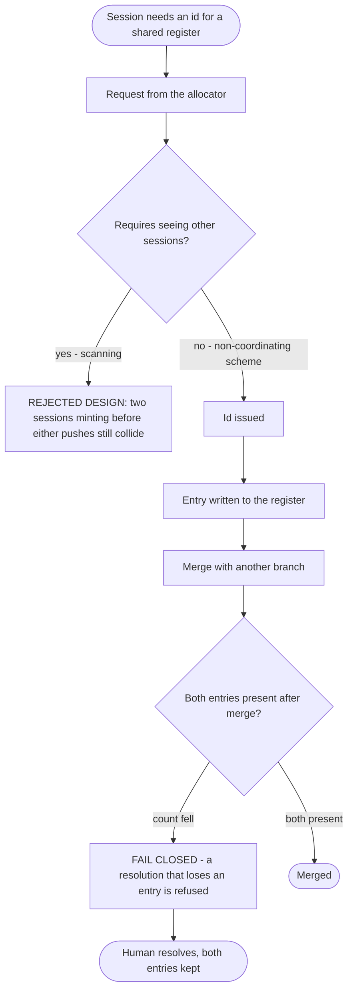
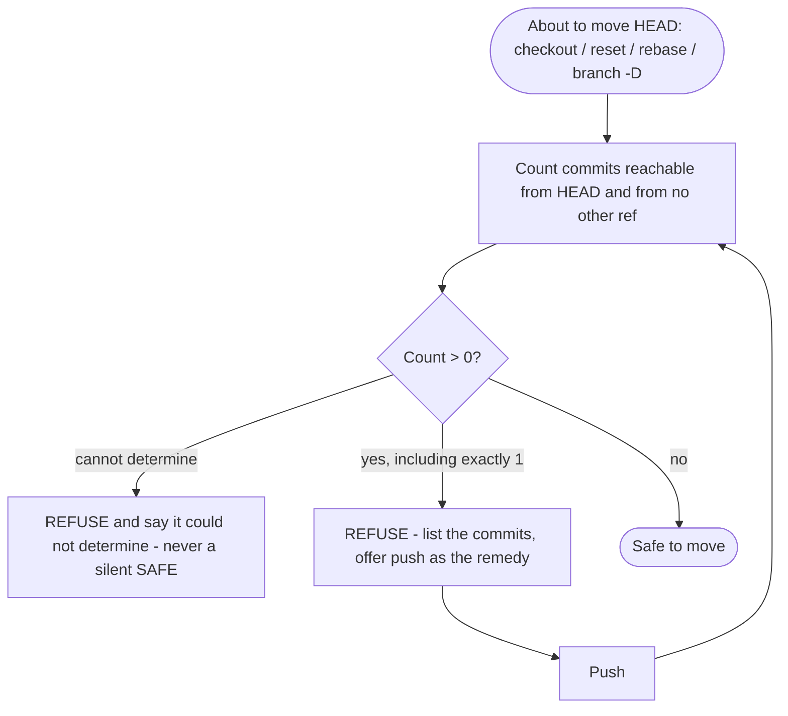

# Spec: Agent coordination — shared context and explicit coordination

- **Status:** Draft
- **Tier (cost-of-error):** **T2** — this layer sits on the edit path of every agent in every repo, it is federated by the pack, and its own failure modes are *silent work loss* and *false green*. The evidence below contains two occasions on which the tooling written to make concurrency safe lost work and reported success. Human review is mandatory.
- **Author(s) / date:** Product Strategist (lead) + Domain Researcher + Data & Persistence Architect + Security & Identity Architect (peers), 2026-08-20
- **Supersedes / related:** converges the draft `AGENT-COORDINATION-SPEC.md v0.1` and its decision explorer (`agent-coordination-explorer.jsx`). Grounds on `docs/lessons/defect-classes.md` (this repo), and on the measured registers of TheTerrace, HealthWatch and Meridian. Does not supersede `audit-and-change-log.md`, `knowledge-visualization.md`, or `continuous-improvement.md` — it answers to all three.

> **Grounding trace (V15):** `spec-agent-coordination` → `relates-to` → `defect-classes` (the register whose classes this spec is derived from) → `relates-to` → `audit-log` (the append-only store whose id scheme is one of the failure modes) → `relates-to` → `architecture` + `spec-dreaming` (the consolidation loop that will read this layer's exhaust). No conflicting prior spec exists: `docs/specs/` holds `documentation-portal` and `dreaming-continuous-improvement`, neither of which addresses concurrency between sessions.

---

## Reading note — what changed from the draft, and why

The draft `v0.1` is a good design for **one** of the four failure modes actually observed. Its thesis — *claims, not commits, are the unit of coordination* — is kept and sharpened. Four things are corrected, each by measurement rather than by preference:

| # | The draft says | The evidence says | Consequence for this spec |
|---|---|---|---|
| 1 | Path/symbol **leases** are the central mechanism. | The six busiest files in TheTerrace are **all generated** (58/60, 58/60, 58/60, 54/60, 35/60, 33/60 of the last 60 commits) against **13/60** for the busiest hand-written source file. Neither agent's authored work disagrees — *the generator ran twice*. A lease over a derived file would have prevented **none** of these and would have serialized work that is not actually in contention. | Leases are **scoped by artifact class**, not applied uniformly. Derived artifacts are **regenerated, never leased and never merged**. |
| 2 | The log is safe because ids are ULIDs. | Correct for the new log, and it leaves the **existing** collision untouched. `KG-B` in TheTerrace has **nine recorded occurrences** of client-minted sequential ids colliding across branches (`FR-`, `al-`), twice reaching `main`, once **silently destroying an entry** during a "dedupe by id" resolution. A full 22-branch remote scan was built, works, and **still collided within the hour** — two sessions minting before either has pushed cannot be separated by scanning. | **Collision-proof allocation becomes a first-class service of this layer**, serving the repo's *existing* registers, not only its own log. This is the only rung (*make it impossible*) the evidence shows holding. |
| 3 | The risk table's worst case is a stale lease. | The worst case observed is **lost work**. Two sessions shared one working directory; `git add -A` swept one session's in-progress files into the other's commit; the swept product work became reachable from **exactly one ref**, an unrelated analysis branch. A sweep of 27 worktrees then found **five holding 19 commits that existed nowhere else**. Recovery depended on a human noticing. | **Work preservation is a goal of equal rank to conflict avoidance**, with its own invariants and its own acceptance criteria. |
| 4 | Invariants are "enforced by `agentctl`, stated in `AGENTS.md`". | `CLAUDE.md` had warned against `git add -A` in prose, in the file every session reads at grounding, **and the delivery script did it anyway** — because prose does not fail. This is `CI6` with a worked example. | **A rule that ships only as prose is out of scope.** Every invariant in Part A carries a named mechanism and a red-first proof obligation. |

A fifth correction is about cost, not correctness: the draft assumes a .NET 10 global tool. Three of the four repositories in evidence are .NET, but the layer is federated by a pack whose entire script surface is dependency-free Python and whose install target may have no .NET SDK. That is an **architecture** decision, recorded here only as a portability NFR (`NFR-P2`).

---

## Part A — Functional specification

*Owner: Product Strategist. What the capability must do and why.*

### Problem

Several agents — Claude Code sessions, GitHub Copilot, and any harness driving another model — work one repository at the same time, in separate worktrees or, worse, in the same one. They cannot see each other. The cost of that blindness is **not one problem but four**, and only the first is a merge conflict:

- **M1 · Structural conflict.** Two branches both regenerate the same committed derived artifact. Nobody's authored work disagrees; the generator ran twice. *Measured: the six busiest files in TheTerrace are all generated; with 26 worktrees in play, any two concurrent branches conflict by construction.* Its real cost is indirect and compounding: **a conflicted PR runs no gate at all** — GitHub builds a merge commit to run `pull_request` workflows, so a conflicting PR runs none of them, and `gh pr checks` answers *"no checks reported on this branch"*, which is indistinguishable from a trigger that failed to fire. Two pushes were spent re-triggering a gate that was never going to start, and the repo's standing folklore that "PR events occasionally don't fire" was at least partly this.
- **M2 · Allocation collision.** A shared append-only register mints its next id by reading the local file and adding one. Two branches both take the next free number, because neither can see the other. The conflict then presents as an ordinary content conflict, and the obvious resolution — dedupe by id, keep one — **silently destroys one of the two entries**. *Measured: nine occurrences in TheTerrace, two reaching `main`, one destroying an entry, one recurring **during the work that was preventing it**.*
- **M3 · Silent divergence.** Two agents independently author the same rule, helper, or convention. Git merges both cleanly. Nothing fails, because each copy is correct on the day it is written. *Measured in Meridian: one quantity — "what an account is worth" — had **six** implementations, one of which had already drifted (`!= 0` where every money-deciding path tested `> 0`), so the inventory and the plan reported different net worths and nothing compared them.* This is the most expensive mode and the only one git will never report.
- **M4 · Work loss.** In a shared working tree, one session's `checkout` moves another's HEAD, an unscoped `git add -A` commits another's files under a message describing neither, and work ends up reachable from a single transient ref. *Measured: one near-miss during the writing of the investigation that found it; then five of 27 worktrees holding 19 commits that existed in exactly one place.*

Underneath all four is one shape the repository's own doctrine already names: **procedure that exists as knowledge rather than as mechanism**. An ordering rule, a canonical command, a merge strategy, an id scheme — each written down, each read, each violated by someone who had just cited it. `CI6`: *a lesson recorded as prose is a memoir.*

**This spec is therefore not "a lease server".** It is: *give concurrent agents the smallest set of shared facts that makes each of the four modes impossible to express, and ship each of those facts as something that fails.*

### Target users & personas

- **The Agent (primary).** A model-driven session — Claude Code, Copilot, or another harness — holding a worktree. Its job-to-be-done: *"change what I was asked to change, without discovering three hours later that another session had already decided something incompatible, taken my number, or committed my files."* It reads a small amount of context at grounding, calls a tool before it edits, and is under time pressure. It will not read a 1,300-line instruction file for a rule that only matters twice a week; it *will* obey a tool that refuses.
- **The Operator (secondary, human).** The person running the fleet. Job-to-be-done: *"tell me which trees are waiting on me, whether anything exists in only one place, and what the agents have decided since I last looked."* Today that answer is "nobody knows" — 135 local branches, 31 fully merged and never pruned, in-flight branches 20–26 commits behind.
- **The Integrator (a role, may be an agent or the operator).** Owns the hotspots nobody else may claim — the composition root, DI registration, project files, migrations — and batches the requests routed to them.

### Core scenario

Three sessions are open on one repository, each in its own worktree: **Opus** on a data-ingestion work item, **Copilot** extracting a client interface, and a **GPT harness** on a page that consumes both.

Opus announces its intent and claims `src/Ingest/**`, stating in the announcement what it searched for first and what came back. The claim is granted. It needs a new entry in the defect-class register, and asks the layer for an id; it is issued one that no other session can be issued, ever, without either of them coordinating. It edits, and its harness lets the edits through because it holds the lease.

Copilot claims `src/Clients/**` — disjoint, granted immediately, no serialization. It then needs to touch the composition root, which is registered as a hotspot: the claim is refused with the reason and the owner, and Copilot instead records a request against the integrator and continues with the rest of its work item.

The GPT harness announces a work item that depends on a type Opus has not written yet. Before it starts, it reads the decisions in force for the artifacts it will touch and finds one Opus recorded twenty minutes ago — *this DTO lives in the contracts assembly* — so it does not invent a second home for it. It records that it is blocked, and the block is visible to Opus rather than being discovered at merge.

Opus finishes, releases, and pushes. Its branch conflicts on two committed derived artifacts, because Copilot merged first and the generator ran twice. The conflict is resolved by **regenerating**, not by merging, and the resolution stages the files it wrote **by name** — so the untracked work sitting in the tree from another task is not swept into the commit. Opus then asks the layer whether it is safe to move HEAD; because everything is pushed, the answer is yes.

At the end of the day the Operator asks one question and gets one answer: which trees are waiting, what has been decided, and whether anything exists in only one place. Nothing does.

**If that scenario works end to end, the capability is worth building.** Every clause in it corresponds to a defect with an instance and a date.

### In scope / Out of scope (explicit non-goals)

**In:**

1. A shared, append-only record of **intent** — claims, decisions, blocks, completion — written before the working tree moves, with one writer per file.
2. **Leases** over artifacts, scoped by **artifact class**, enforced at the edit boundary of each harness and at the commit boundary universally.
3. **Collision-proof id allocation** as a service to the repository's *existing* append-only registers, not only to this layer's own log.
4. A **decision register** with an enforced pre-write read, addressing M3.
5. **Work-preservation invariants**: stage by name, never move HEAD over unique work, one session per working tree.
6. A **derived-artifact declaration** so structural conflicts are resolved by regeneration rather than by merge.
7. A **projection**: a small, bounded, per-agent context view, and an operator status view.
8. **Federation**: the layer is installed and updated by the pack, in every repo, with per-repo configuration.

**Out (non-goals) — each with the reason it is out:**

- **Semantic merge resolution.** An agent that resolves a conflict by understanding both sides is a different, much harder capability. Regeneration and refusal are in; understanding is out.
- **Replacing GitHub Issues / Projects as the backlog.** Work items here are *in-flight coordination handles*; the backlog remains the system of record and is mirrored, not replaced.
- **A planner that assigns work to minimize overlap.** Attractive and speculative: nothing in the corpus shows overlap being caused by bad assignment, and a planner's model of the dependency graph goes stale faster than it is consulted. Revisit only when the metrics in `NFR-M1` show lease waiting as a top-two cost.
- **Multi-machine / cloud-hosted agents.** Designed for (nothing in the model may assume a shared filesystem or a single clock), not built. See `NFR-C1`.
- **A second audit log.** The pack already has `docs/audit/audit-log.jsonl` — the durable record of *what was done*. This layer records *what is being attempted, right now*, at a different grain and with a different lifecycle. The two must share the **allocator** and must not duplicate each other's content (`ONE-A`, `DUP-A`).
- **Replacing the docs knowledge graph.** `docs-graph.py` owns artifact-level intent and typed links. This layer owns work-in-flight. A coordination "graph" that re-modelled documentation would be a second source for one quantity.
- **A merge queue.** GitHub has one. This layer supplies the ordering signal (`done`), not the queue.
- **Enforcing an agent's reasoning.** The layer can refuse an edit; it cannot make an agent think. Every mechanism here is designed to fail closed on a *fact*, never on a judgement.

### Conceptual domain model

*Bounded context: **Agent Coordination** — work in flight. Adjacent contexts, deliberately not absorbed: **Delivery** (gates, CI, merge), **Knowledge Graph** (`docs-graph.py`: artifacts and typed links), **Audit & Change Log** (what was done and why, durably). Written in domain terms only; keys, types, storage and grain are `/define-architecture`'s and `/design`'s decisions.*

**Ubiquitous language**

| Term | Means | Explicitly does **not** mean |
|---|---|---|
| **Agent** | A logical actor identity — `opus`, `copilot`, `fable`. Stable across sessions. | The model string. One agent may run several models. |
| **Session** | One agent's continuous run inside one working tree. **The unit of writership**: a session's record is written by that session and by nothing else. | A conversation, or a process. A restarted process resuming the same tree is the same session. |
| **Working tree** | A checkout — the primary clone or a `git worktree`. **At most one session at a time**; this is an invariant, not a convention. | A branch. Two worktrees may share none, and a branch may be checked out nowhere. |
| **Work item** | The unit of intended change a session is executing, and the handle everything else hangs from. | A backlog item. It *references* one; it is not one. |
| **Artifact** | A thing in the repository a change can touch, addressed by pattern or by symbol. | A file. A symbol inside a shared file is an artifact; a directory of generated output is one artifact, not many. |
| **Artifact class** | **What kind of contention an artifact is subject to** — `authored`, `derived`, `register`, `hotspot`. The load-bearing concept: the correct coordination action differs *entirely* by class. | A file type or a language. |
| **Claim** | A session's declaration of intent over an artifact set, made **before** the working tree moves. | A lock. A claim may be refused, and a refused claim is a normal outcome. |
| **Lease** | The time-bounded hold that a granted claim confers. | Ownership. A lease expires; an unheartbeated session loses all of them. |
| **Decision** | A convention or design choice other sessions must honour, recorded against the artifacts it applies to. | An ADR. An ADR is a durable architectural record; a decision here is in-flight and may be superseded within the hour. |
| **Allocation** | An identifier issued from a scheme in which two issuers who cannot see each other still cannot collide. | A sequence number. A sequence is precisely the thing that failed nine times. |
| **Unique work** | Commits reachable from exactly one ref. | Unpushed work. Work pushed to a branch that is about to be deleted is still unique. |
| **Projection** | The bounded view of shared state rendered into one agent's context. | The state. The state is a fold of the record; the projection is a lossy, budgeted view of the fold. |

**Entities:** Agent, Session, WorkItem, Lease, Decision, Allocation.
**Value objects:** ArtifactPattern, ArtifactClass, ClaimScope, Ttl, Refusal (reason + holder + remedy).

**Aggregates — each bounded by exactly one invariant**

| Aggregate | Root | The one invariant it protects |
|---|---|---|
| **Session record** | SessionId | *A session's record has exactly one writer, for its whole life.* This is what keeps the coordination substrate from becoming the next `M1` — the failure mode the draft correctly names first in its own risk table. |
| **Lease set** | ArtifactPattern | *No two unexpired hard leases overlap.* Overlap is decided by pattern intersection, and the resolution of an ambiguous intersection is **refuse** — a false refusal costs a message, a false grant costs a merge. |
| **Allocation scheme** | SchemeId | *An issued identifier is never issued twice, and issuance requires no communication between issuers.* The second half is the whole point: a scheme that is only safe when issuers can see each other is the defect, not the fix. |
| **Work item** | WorkItemId | *A work item is owned by at most one session at a time, and its status is derived from the record — never written.* |
| **Decision** | DecisionId | *A decision is superseded, never edited.* Editing a decision rewrites the past for every session that already read it. |

**Durable representation (DM2/DM7 — recorded here as domain intent, not as schema).** The record is an **append-only stream of facts**; leases, work-item status, blocked-on relationships and the operator view are **folds** over it and are never a second stored source. The artifact-class registry is the one deliberately *stateful* thing — a slowly-changing description of the repository, edited by humans, reviewed in PRs. **Grain, declared before any column:** *one row of the coordination record is exactly one event emitted by one session at one instant.*

### User stories & acceptance criteria (testable)

Each criterion is falsifiable and traceable to a control. Thresholds are drawn from measured baselines, cited in *Comparables & evidence*.

---

**US-1 — As an Agent, I want to know before I edit whether another session is already changing this artifact, so that I do not discover it at merge.**

- **Given** no unexpired lease overlaps `src/Ingest/**` **When** a session claims it **Then** the claim is granted and the grant is recorded in that session's record within the latency budget of `NFR-P1`.
- **Given** session A holds an unexpired hard lease on `src/Ingest/**` **When** session B claims `src/Ingest/Reader.cs` **Then** the claim is **refused**, and the refusal names the holder, the work item, the expiry, and one remedy.
- **Given** two patterns whose intersection cannot be decided **When** either is claimed against the other **Then** the claim is **refused** — the layer prefers a false refusal to a false grant, and says which it did.
- **Given** a session holding leases stops emitting liveness for longer than its TTL **When** any other session claims an overlapping artifact **Then** the claim is granted, and the expiry is visible in the operator view as an event, not as an absence.

**US-2 — As an Agent, I want an edit to an unclaimed artifact to be refused rather than warned about, so that the rule holds when I am under pressure.**

- **Given** enforcement is enabled **When** a session's harness attempts to write an artifact of class `authored` for which it holds no lease **Then** the write is **refused before it happens**, and the refusal text names the holder and the remedy in a form the model can act on.
- **Given** a harness with no pre-edit hook surface **When** that session attempts to commit an artifact it never claimed **Then** the commit is refused. *(The commit boundary is the universal floor: every harness has one.)*
- **Given** enforcement cannot determine the lease state — no record, no git, an unreadable registry — **When** it runs **Then** it **says so explicitly and refuses to imply it looked**. A control that cannot see is not licensed to accuse, and it is certainly not licensed to report a pass. *(`CI-A`: a control that borrowed ambient state and then accused its own branch.)*

**US-3 — As an Agent, I want an identifier for a shared register that cannot collide with another session's, even if neither of us has pushed.**

- **Given** two sessions request an identifier for the same register **within the same second, in separate worktrees, with no network** **When** both are issued **Then** the two identifiers differ. *(This is the exact shape that defeated a working 22-branch remote scan.)*
- **Given** a register whose ids are currently client-minted and sequential **When** the layer is adopted for that register **Then** every existing identifier keeps its value and no existing reference is rewritten. *(Renumbering a live scheme would touch every commit subject and merged PR body that cites it — the reason the prevention was left half-applied last time.)*
- **Given** an identifier has been issued **When** the issuing session's branch is abandoned **Then** the identifier is never reissued, and nothing depends on reclaiming it.
- **Given** two branches each appended an entry to the same register **When** they are merged **Then** the merged register contains **both** entries, and a resolution that reduces the entry count below the sum of the distinct entries **fails closed**. *(A "dedupe by id" resolution reported "203 ours + 203 theirs → 203 unique" and destroyed an entry. Arithmetic caught it; nothing else did.)*

**US-4 — As an Agent, I want to know what other sessions have already decided about the artifacts I am about to touch, so that I do not build a second answer to a settled question.**

- **Given** a session claims artifacts against which decisions are in force **When** the claim is granted **Then** the decisions in force are returned *with the grant* — the agent does not have to know to ask.
- **Given** a session disagrees with a decision in force **When** it proceeds **Then** it must record a superseding decision; the original is retained and marked superseded, never edited.
- **Given** a session announces intent to create a new artifact **When** the announcement carries no record of a prior-art search **Then** the announcement is incomplete and is reported as such. *(An unevidenced search is indistinguishable from no search — and the measured instances were all authored by someone who had just cited the rule requiring one.)*

**US-5 — As an Agent, I want conflicts on generated files to stop being conflicts.**

- **Given** an artifact declared `derived` **When** two branches both regenerate it and merge **Then** the conflict is resolved by **regeneration**, and the result is byte-identical to a clean generation from the merged source.
- **Given** a conflict outside the declared derived set **When** the resolution tool runs **Then** it **fails closed** and changes nothing, so it can never silently discard authored work.
- **Given** a resolution has run **When** it stages **Then** it stages **only the paths it wrote, by name**, and **names every file it deliberately left alone** — because silently declining to touch a file is indistinguishable from never having noticed it.
- **Given** a PR is conflicted **When** the session asks for its status **Then** the answer distinguishes *"conflicted, therefore no gate will run"* from *"the gate has not reported yet"*. These are the same silence today and the difference is measured in wasted gate cycles.

**US-6 — As an Agent, I want to be refused any operation that would leave work reachable from nowhere.**

- **Given** the current HEAD holds commits reachable from no other ref **When** the session attempts `checkout`, `reset --hard`, `rebase` or `branch -D` **Then** the operation is refused, the at-risk commits are listed, and the cheapest remedy (push) is offered.
- **Given** a single at-risk commit **When** the guard runs **Then** it is counted. *(The first implementation of this guard reported SAFE for exactly the case it existed to catch, because `git rev-list HEAD --not --all` includes HEAD; a second bug lost the count when there was only one. A guard that fails open is worse than no guard, because it is trusted.)*
- **Given** a working tree already occupied by a live session **When** a second session starts in it **Then** the second session is refused, with the occupant named.
- **Given** any tool in this layer stages changes **When** it does so **Then** it stages by explicit path. A wildcard stage anywhere in the layer's own surface — or in any agent-facing prompt this layer ships — is a defect, detectable by scanning the shipped text.

**US-7 — As an Operator, I want one place that answers "which tree is waiting on me, and is anything held in only one place".**

- **Given** any number of worktrees **When** the operator asks for status **Then** every tree is listed with its branch, its drift from the base, its held leases, and its **unique-commit count**, and any non-zero unique count is visually and exit-code distinguishable.
- **Given** branches fully merged into the base **When** the operator prunes **Then** no branch that is checked out anywhere, and no branch carrying unique work, is deleted — those being the two ways an automated cleanup does damage.
- **Given** the record for the last N hours **When** the operator asks what has happened **Then** claims, refusals, decisions, blocks and completions are shown in one chronological view across all agents.

**US-8 — As a fleet owner, I want the layer installed and updated by the pack in every repository, without each repo re-deciding it.**

- **Given** a repository with the pack installed **When** the pack is updated **Then** the coordination layer arrives with it, and the repo's own configuration — its artifact-class registry, its hotspots, its registers — is **preserved**, not overwritten. *(A pack update that silently drops a repo customization on a pack-managed file is an existing, recorded class.)*
- **Given** a repository that has not configured an artifact-class registry **When** an agent claims anything **Then** the layer operates in advisory mode and **says that it is advisory**, rather than implying enforcement it cannot deliver.

**US-9 — As a reviewer, I want the layer's own record to be incorruptible by the ordinary operations performed on it.**

- **Given** a record file whose last byte is not a newline — after a merge resolution, a hand edit, or a writer that joined without a terminator — **When** the next event is appended **Then** the two records do **not** fuse. *(The prior instance fused two well-formed entries into one unparseable 2,323-character line, exit code 0, and **both** were lost — the new one and the innocent one before it. Detected days later by an unrelated suite; the duplicate-id and ordering checks both reported PASS on the file that had just eaten two records.)*
- **Given** any step in any tool of this layer returns a non-zero exit **When** the tool continues **Then** it throws by step name; no tool in this layer may print a success line that is a statement about having reached the last line. *(A push that failed printed its usage hint into a discarded stream while the script announced "rebased on origin/main"; four commits stayed local for twenty minutes, noticed only when a PR reported a conflict against a branch that was zero behind.)*
- **Given** a tool claims to have changed state **When** it reports success **Then** it has **read the state back**. An exit code is not a result.

### Non-functional requirements (ISO/IEC 25010)

| Attribute | Requirement (measurable) | Why this number |
|---|---|---|
| **Performance efficiency** (`NFR-P1`) | A pre-edit check adds **< 100 ms p95** on a repository with ≥ 5,000 tracked files and a 10,000-event record. A claim, release or allocation completes **< 250 ms p95**. A full fold of a 10,000-event record completes **< 2 s**. | The check sits on *every* edit. A hook that costs a visible pause is a hook that gets disabled, and a disabled hook is worse than none because the invariant is still assumed. |
| **Reliability** (`NFR-R1`) | Zero record-fusing appends under an adversarial corpus (missing trailing newline, CRLF, concurrent appenders, a file rewritten by a merge). Zero success reports from a tool whose step failed. Replaying the record twice yields identical folded state. | Both fusing and false-success have instances with dates. Fold idempotence is what makes the record, rather than a database, the source of truth. |
| **Reliability** (`NFR-R2`) | The layer **fails safe, never open**: any state it cannot determine produces a refusal-with-reason or an explicit "not checked", never a silent pass. | A guard that reported SAFE for the case it existed to catch, and a control that accused its own branch because CI checks out a detached HEAD. |
| **Security** (`NFR-S1`) | Content written by one agent and rendered into another agent's context is **treated as untrusted data**: it is length-bounded, structurally delimited, and never carries instruction authority. A decision, intent or refusal reason cannot cause the reading agent to take an action. | The projection is a model-to-model channel. This is a prompt-injection boundary and is the one genuinely new trust boundary this layer creates. |
| **Security** (`NFR-S2`) | Enforcement is a **local integrity control, not a security control**: an agent with shell access can bypass it. The layer states this rather than implying exclusion it cannot enforce. | Claiming a security property the mechanism does not have is how a control gets trusted past its limit. |
| **Privacy** (`NFR-V1`) | Anything in the record that is git-tracked and pushed passes the pack's existing secret/PII scrub before it can be committed, and intents are **capped in length** so a whole prompt cannot be pasted into a public repository by accident. | Intent text is model-authored and unbounded; the record is pushed. |
| **Compatibility** (`NFR-C1`) | At least **three harness families** — Claude Code, a Copilot-family CLI, and one other — can perform every verb. No verb is reachable only through one vendor's tool surface. Nothing in the model assumes a shared filesystem or a single clock, so a later multi-machine substrate needs no protocol change. | "Model/tool agnostic" is a stated goal; the honest test of it is three, not two. |
| **Compatibility** (`NFR-C2`) | Adopting the layer changes **no existing identifier** in any register it takes over, and requires **no rewrite of history**. | The reason the last prevention was applied to one id scheme and not its sibling. |
| **Portability** (`NFR-P2`) | Runs on Windows, Linux and macOS with **no language runtime the pack does not already require**, no network, and no daemon that must be started before an agent can work. Its own control suite runs on every one of those platforms in CI. | Two recorded classes: a control suite silently coupled to one OS, and a deployed script broken by a runner's language-version auto-upgrade. Also the standing Windows footgun where the documented interpreter name is a store alias that is not the interpreter. |
| **Maintainability** (`NFR-M1`) | The layer emits the four metrics it exists to move: **conflicts per merged PR**, **percentage of edits made under a held lease**, **mean and p95 wait on a refused claim**, and **count of commits reachable from exactly one ref**. Each is derivable from the record plus git — no separate instrumentation. | A layer that cannot show it moved the numbers will be kept or removed on taste. |
| **Maintainability** (`NFR-M2`) | Every invariant in Part A is realized as a named control, **observed failing on the un-fixed shape** before it is trusted, and enumerable — a reader can list the invariants and the control enforcing each. | `CI6`, and the control ladder: *make it impossible* > *automated control* > *always-loaded instruction* > *knowledge doc*. An invariant that reaches only rung 3 must say so. |
| **Usability** (`NFR-U1`) | An agent's per-turn coordination context is **≤ 2,000 tokens** and is a projection, never the whole state. A refusal is actionable in one read: holder, reason, remedy. | Context spent on coordination is context not spent on the work. |

### Boundary set

The inputs that define correctness at the edges — these become the test matrix.

- **Empty and first-run:** no record at all; a repo with no artifact-class registry; a repo with no remote; a fresh clone with no session.
- **Concurrency:** two sessions allocating within the same millisecond; two sessions claiming intersecting patterns simultaneously; a session that dies holding leases; a session whose process restarts and resumes the same tree; a claim that arrives exactly at another's expiry.
- **Clock:** worktrees with skewed clocks; a clock that moves backwards; TTL arithmetic across a DST boundary.
- **Git states:** detached HEAD (**the state every PR gate runs in** — an existing control accused its own branch here); a rebase that rewrites record history; a branch with no upstream; a bare push with no upstream configured; a shallow clone; a repository with 135 branches and 27 worktrees.
- **Record integrity:** a record file with no trailing newline; CRLF line endings; a partially written final line; a record containing an event from an unknown future schema version.
- **Patterns:** a claim matching zero artifacts; a claim matching 10,000; a claim over the coordination substrate itself; overlapping globs whose intersection is undecidable; a symbol claim on a file that no longer contains that symbol.
- **Identity:** a session with no configured agent name; two sessions claiming the same session identity; an agent name that collides with a reserved role (`integrator`).
- **Hostile / adversarial:** an intent string containing instruction-shaped text aimed at the reading agent; a decision rationale containing a secret; a 5 MB intent; a path pattern containing traversal segments.
- **Scale:** a 100,000-event record; the fold on a machine with a cold filesystem cache.

### Comparables & evidence (sourced)

*Every row is drawn from a committed artifact in a repository on this machine, read directly. No figure is estimated.*

| Claim | Source | Confidence |
|---|---|---|
| The six busiest files in TheTerrace are all generated — 58/60, 58/60, 58/60, 54/60, 35/60, 33/60 of the last 60 commits on `main` — against 13/60 for the busiest hand-written source file; with 26 worktrees any two concurrent branches conflict by construction | `TheTerrace/docs/investigations/delivery-orchestration.md` §F4; `defect-classes.md` → `CI-B` | **Verified** |
| A conflicting PR runs **no** `pull_request` workflow, and `gh pr checks` reports "no checks reported on this branch" — indistinguishable from a trigger that failed to fire; two pushes were spent re-triggering a gate that could not start | `TheTerrace/docs/delivery/entries/conflicting-pr-runs-no-gate.md`; `defect-classes.md` → `CI-A` | **Verified** |
| 20% of the 100 most recent gate runs produced nothing (10 failed, 10 cancelled) — ~440 billable minutes and ~86 minutes of waiting per 100 runs | `delivery-orchestration.md` §F2 | **Verified** |
| Client-minted sequential ids collided **nine** recorded times across branches (`FR-`, `al-`), twice reaching `main`; one "dedupe by id" resolution silently destroyed an entry and was caught only because "203 + 203 → 203 unique" is arithmetically impossible | `TheTerrace/docs/lessons/defect-classes.md` → `KG-B` and addenda 1–5 | **Verified** |
| A remote-branch-scanning allocator was built, works, scans 22 branches in ~1 s — **and collided within the hour**, because two sessions minting before either has pushed cannot be separated by scanning | `KG-B` addendum 4 | **Verified** |
| The prevention was applied to the `FR-` scheme and **not** to the `al-` scheme with identical mechanics, which then collided again between two branches of one session | `KG-B` addendum 5 | **Verified** |
| Two sessions shared one working directory; `git add -A` swept an in-progress report into the other's commit; the swept product work became reachable from exactly one ref, and recovery depended on a human noticing | `delivery-orchestration.md` §F5 | **Verified** |
| A subsequent sweep of 27 worktrees found **five** holding **19** commits that existed nowhere else | `TheTerrace` commit `27361844`; `scripts/worktree-status.ps1` | **Verified** |
| A script written to make rebasing safe **lost work twice in one day and reported success both times** — an unread exit code, and no comparison of commits across the rebase | `defect-classes.md` → `CTRL-E`; commit `80954bae` | **Verified** |
| The delivery script every session is told to run ended with `git add -A`, sweeping 2,917 lines of unrelated work into a commit whose message described only the regeneration — while `CLAUDE.md` had warned against exactly that, in prose, in the file every session reads at grounding | `defect-classes.md` → `CTRL-G`; commit `b4ff1a7d` | **Verified** |
| An append-only writer that emitted `record + "\n"` without checking the file already ended in one **fused two entries into one unparseable line**; exit code 0; both entries lost; the duplicate-id and ordering checks both reported PASS on that file | `defect-classes.md` → `LOG-A` | **Verified** |
| 135 local branches, 31 fully merged and never pruned; in-flight branches 20–26 commits behind, and protected `main` requires up-to-date branches, so every merge invalidates the ones behind it | `delivery-orchestration.md` §F6 | **Verified** |
| The same contention shape occurs outside TheTerrace: HealthWatch merged `main` with a conflict in `docs/lessons/defect-classes.md` — the append-heavy shared register — and separately in `docs/audit/audit-data.js` + `docs/docs-index.js`, both derived | `HealthWatch` commits `9641067`, `3d72eb3` | **Verified** |
| Silent semantic divergence is real and expensive: one quantity had **six** implementations in Meridian, one already drifted (`!= 0` vs `> 0`), so two surfaces reported different net worths and nothing compared them; a **seventh** copy was written by the author *while fixing the class* | `meridian-finance-planner/docs/lessons/defect-classes.md` → `ONE-A`, `DUP-A` | **Verified** |
| The pack's own consolidation pass currently proposes controls whose text is *"derive a falsifiable control for this class"* — i.e. several classes are still recorded as prose rather than mechanism | `ai-forward/learnings/fleet-classes.md`; `docs/dreams/drm-0005/dream.json` | **Verified** |
| Re-running the consolidation over an unchanged corpus re-emits already-promoted proposals under fresh ids, because idempotency is keyed on `(dream, proposal)` rather than on the class | `ai-forward/docs/notes/note-20260818-dream-rerun-unchanged-corpus.md` | **Verified** |
| Prior art for the mechanism family: advisory/exclusive file locking in centralized VCS (Perforce, SVN `svn lock`, Git LFS `lock`); lease-with-TTL-and-heartbeat as the standard distributed-lock shape (Chubby, `etcd` leases); time-ordered non-coordinating identifiers (ULID, UUIDv7); event-sourced state as a fold over an append-only log | Established practice, named here without a fresh source read | **Inferred** |
| The draft's own claim that Copilot's edit-time hook surface may differ from Claude Code's `PreToolUse`, and must be verified at implementation time | `AGENT-COORDINATION-SPEC.md` §5.3, which flags it itself | **Flagged** |

### Applicable governance lenses

- [x] **Quality attributes / NFRs** — the table above; `NFR-M1` supplies the measurement.
- [x] **Threat model (STRIDE)** — required and **not yet done**. The new trust boundary is the projection: one agent's text becomes another agent's context (`NFR-S1`). Tampering (a session editing another's record), spoofing (an agent asserting another's identity), and elevation (an intent string that instructs the reader) are the live ones. **Gap — closed in `/define-architecture`.**
- [x] **Privacy & data governance** — model-authored intent, git-tracked and pushed. `NFR-V1`; must reuse the pack's existing scrub rather than adding a second one.
- [x] **Accessibility** — applies to the operator's surfaces. Terminal output must not use colour as the sole carrier of the one thing that matters (a non-zero unique-commit count), and must carry a distinguishing exit code.
- [x] **Performance budget** — `NFR-P1`; the pre-edit check is the hot path.
- [x] **Release / rollback / migration** — the layer is federated by the pack. Adoption must be additive (`NFR-C2`), advisory-by-default until configured (`US-8`), and removable without rewriting history. Migrating a register onto the allocator is expand-migrate-contract: issue new ids from the new scheme while every old id keeps its value; never backfill by guessing.
- [x] **Observability** — the record *is* the telemetry; `NFR-M1` names the four measures. A refusal must be an observable event, not just a message to one agent.

### AI-integrated allocation

- **Archetype:** none. **No part of this layer uses a model.** That is a deliberate constraint, not an omission: the layer's job is to be the deterministic floor beneath non-deterministic actors, and a probabilistic component in a refusal path would make the refusal unreviewable. The layer is *consumed by* model-driven agents; it does not contain one.
- **Tier allocation:** N/A. If a later planner or conflict-explainer is added, it is a separate capability with its own eval harness, and it may **advise** — it may never **grant or refuse**.

---

## Part B — UX specification

*Owner: UX Researcher / Information Architect. The medium is a **command-line and tool surface**, consumed by two very different readers: a model, and a human. Present because both are user-facing.*

### Personas & jobs-to-be-done (deepened)

**The Agent.** Reads a bounded projection at grounding and a refusal mid-task. Its constraints are unusual and decisive: it has **no memory between sessions**, it **cannot see the other worktrees**, it is optimising for finishing, and — as measured repeatedly — *it will comply with a rule it is told, right up until the moment complying is inconvenient, at which point only a mechanism holds.* Success from its side: it never has to ask "is anyone else in here?", because the answer arrives with the grant.

**The Operator.** Opens a terminal after several hours of unattended fleet work. Constraints: 27 trees, 135 branches, limited attention, and a real fear — justified once — that something is held in exactly one place. Success from their side: **one command, one screen, and the dangerous thing is the visually loudest thing on it.**

**The Integrator.** Receives batched requests against hotspots. Success: the requests arrive as a list with the requesting work item attached, not as merge conflicts.

### Information architecture

Four surfaces, and the discipline is that **each answers exactly one question**:

1. **The claim path** — *"may I touch this, and what should I know first?"* Verbs an agent calls. The grant carries the decisions in force; the refusal carries holder, reason, remedy.
2. **The stream** — *"what has been happening?"* One merged chronological view across all sessions. The shared console.
3. **The status view** — *"which tree is waiting on me, and is anything held in only one place?"* One row per working tree. Unique work is the loudest column.
4. **The projection** — *"what do I, specifically, need in context?"* Generated per agent, budget-capped, regenerated rather than accumulated.

**Labels** are the ubiquitous language of Part A verbatim — `claim`, `lease`, `decision`, `refusal`, `unique work`, `artifact class`. These seed the glossary (S10/V14). One label is deliberately blunt: **`refused`**, never *"denied"*, *"blocked"* or *"unavailable"* — the reader is a model that must not be able to read the outcome as a transient failure worth retrying.

**Hierarchy.** In every surface, order is: *what must I not do* → *what is waiting on me* → *what happened*. Never chronological-first; the newest event is rarely the most important one.

### User flows

**Flow 1 — Claim, edit, release (the spine, with its unhappy paths)**



**Flow 2 — The unclaimed edit (the enforcement path, and its honest failure)**



**Flow 3 — Conflict on a derived artifact, and the gate that will not run**



**Flow 4 — Allocation (M2), including the case that defeated the previous fix**



**Flow 5 — Work preservation (M4)**



### Wireframe-level structure

**The refusal** (the single most-read output in the system, and the one a model must act on without re-reading):

```
REFUSED  src/Ingest/Reader.cs
  held by   opus · WI-142 · expires in 3m12s
  because   an unexpired lease overlaps your pattern
  remedy    wait, or claim a disjoint subset, or record a block on WI-142
```

Four labelled lines, fixed order, no prose. *What happened · who · why · what to do.* The remedy is last because it is what the reader acts on.

**The status view** (one row per working tree; the dangerous column is not last, and not colour-only):

```
TREE               UNIQUE  BRANCH                   BEHIND  LEASES  SESSION
../wt-opus-142        0     agent/opus/WI-142            3       2   opus (live, 40s)
../wt-copilot-151     2 !   agent/copilot/WI-151        21       1   copilot (stale, 14m)
../wt-gpt-140         0     agent/gpt/WI-140             3       0   -  blocked on WI-142
C:/Projects/Repo      0     main                         0       0   ! 2 sessions detected
```

**The stream** — one line per event, `time · agent · verb · subject · work item`, refusals and blocks marked so they survive a skim.

**The projection** — the agent's open work items and their goals; its own leases; **overlapping neighbours only**; decisions in force on artifacts it touches; anything blocked on it. Budget-capped; when the cap binds it **says what it dropped**, because a silently truncated projection is a projection that lies.

### UX acceptance criteria (falsifiable)

- **UX-1** — A refusal names holder, reason and remedy in one screen, in that order, with no prose paragraph. *Falsified by:* any refusal path whose output omits a remedy.
- **UX-2** — A conflicted PR and an unreported gate produce **different** text. *Falsified by:* any state in which both render the same string.
- **UX-3** — The status view answers "is anything held in only one place?" **without the operator issuing a second command**, and sets a distinguishing exit code. *Falsified by:* a non-zero unique count that is visible only in colour, or only after a follow-up command.
- **UX-4** — Every surface that cannot determine its answer prints *"not checked"* and its reason. *Falsified by:* any path where an indeterminate state renders identically to a clean one.
- **UX-5** — The decisions in force arrive **with the grant**; no flow requires an agent to know to ask for them. *Falsified by:* a granted claim whose response omits decisions that exist for those artifacts.
- **UX-6** — The projection never exceeds its token budget, and when it truncates it names what it dropped. *Falsified by:* a projection over budget, or a truncation with no notice.
- **UX-7** — Every flow above has a specified recovery path, and every refusal is recoverable without a human in the loop **except** the two that must not be: a conflict outside the declared derived set, and a dropped commit.
- **UX-8** — An agent reaching the layer for the first time, with no configuration, is told in one line that it is **advisory** and what would make it enforcing. *Falsified by:* an advisory-mode grant indistinguishable from an enforced one.

---

## Part C — UI specification

**N/A — command-line and tool surfaces only; there is no visual UI in scope for v1.** Part B specifies the CLI interaction, its information architecture, and its wireframe-level structure per the medium's conventions.

*Recorded so the omission is a decision rather than a gap:* a browsable HTML lens over the record — in the family of this repo's existing Docs Explorer, audit explorer and dream review views — is an obvious later addition and is **deliberately deferred**. The operator need measured in the evidence ("which tree is waiting on me") is answered by a terminal in one command; an HTML surface would add a build step, a generated committed artifact, and therefore a new instance of the exact class (`CI-B`) this spec exists to remove. When the fleet outgrows the terminal, that surface gets its own `/ui-design` pass and its own archetype signature.

---

## Decisions the evidence settles, and decisions it does not

The draft's companion explorer opens five design questions. A spec's job is to converge where the evidence forces an answer and to hand the rest downstream with the constraint attached, not to re-open the space.

**Settled here, by evidence:**

| Question | Verdict | The evidence that forces it |
|---|---|---|
| Is the coordination substrate itself allowed to conflict? | **No — one writer per record file, always.** | The substrate becoming the hotspot is the first-order failure; `CI-B` shows what a shared append-region costs at 27 worktrees. |
| Are leases uniform across artifacts? | **No — scoped by artifact class.** Derived artifacts are regenerated and never leased. | 6 of the 6 busiest files are generated; a lease would have prevented none of those conflicts and would have serialized non-contention. |
| Are ids allocated by scanning or by scheme? | **By scheme.** A non-coordinating, time-ordered identifier. Scanning is rejected as a *design*, not as an implementation. | A working 22-branch scanner collided within the hour; nine occurrences total; the failure is structural. |
| Advisory or hard? | **Hard by default where it can be enforced; advisory only where a harness has no edit hook — and it must say which it is.** | Prose in the always-loaded file did not stop the script that swept another session's work. |
| Is work preservation in scope? | **Yes, at equal rank.** | The only failure in the corpus not measured in minutes. |
| Is a planner in v1? | **No.** | Nothing in the corpus attributes overlap to assignment; a planner's model goes stale faster than it is read. |

**Left to `/define-architecture`, with the constraint that binds it:**

| Question | The constraint this spec imposes |
|---|---|
| Storage substrate (files vs local store vs daemon vs hosted) | Must satisfy `NFR-P1` (< 100 ms p95 on the edit path), `NFR-P2` (no daemon required before an agent can work, no runtime the pack does not already require), and `NFR-R1` (fold idempotence). The record must survive a clone. |
| Implementation language and packaging | `NFR-P2`. The draft's .NET 10 tool is permitted **only** if the layer remains fully usable in a repo with no .NET SDK. |
| Claim granularity beyond file (symbol/Roslyn) | `NFR-C1` — no verb may be reachable only through one language's tooling. Symbol-level claims are an *optimisation*, permitted only as a refinement of a file-level claim. |
| Transport (CLI, MCP, hooks) | All three must reach the same core; `NFR-C1` requires three harness families to perform every verb. |
| Graph representation | Must be a **fold**, never a second write path (DM7). It may not restate what `docs-graph.py` already owns. |
| Threat model | `NFR-S1` — must be completed before the projection renders one agent's text into another's context. |

---

## Flagged risks & residual unknowns

| # | Risk / unknown | Cheapest next probe |
|---|---|---|
| **F1** | Copilot's (and other harnesses') edit-time hook surface may not exist or may differ, leaving those agents advisory-only at the edit boundary. The draft flags this itself. | Spike Protocol against each harness's current hook documentation *and* an executed hello-world hook, before the enforcement phase is scoped. Until then the commit boundary is the honest floor. |
| **F2** | Agents may route around a refusal — running the edit through a shell, or disabling the hook — because they are optimising for finishing. `NFR-S2` concedes it is not a security control. | Measure it: `NFR-M1`'s "% of edits made under a held lease" is exactly this number. If it does not reach a high fraction, enforcement has failed regardless of how well it is implemented. |
| **F3** | The pre-edit check's latency budget may be unachievable on a large repository if the fold is recomputed per call. | Benchmark the fold on a 10,000-event record and a 5,000-file tree before committing to the substrate. |
| **F4** | Coordination overhead may exceed the conflict cost on repositories with **one** agent — the common case for most repos the pack installs into. | `US-8`'s advisory default plus a measured before/after on one repository. If a single-agent repo pays anything measurable, the layer must be inert until a second session appears. |
| **F5** | The layer adds a new always-loaded instruction surface, and the corpus shows always-loaded prose changing nothing. | `NFR-M2`: any invariant that reaches only the "always-loaded instruction" rung must be labelled as such in the artifact, so its weakness is visible rather than assumed away. |
| **F6** | The record is git-tracked and pushed; model-authored intent may carry secrets or PII. | Reuse the pack's existing scrub at the write boundary — and prove it red on a planted secret before the first record is pushed. |
| **F7** | **Unquantified:** how much of the observed cost is concurrency between *agents* versus concurrency between *a human and an agent*. Every measured instance in the corpus involves at least one agent, but the mechanism does not care, and a fix aimed only at agents would miss half the population. | The four `NFR-M1` metrics, segmented by actor, over two weeks on one repository. |
| **F8** | Two of the four failure modes (`M2`, `M4`) are already **partially** solved in TheTerrace by repo-local scripts. Federating a second mechanism risks `ONE-A` — a shared rule accreting private copies — which is one of the classes this spec cites. | Before implementation, an explicit reconciliation: for each existing script, either it becomes the layer's implementation, or it is deleted, or the difference is recorded. Two answers to one question is the defect signature. |

---

## Gate record

`GATE specify · 2026-08-20 · Product Strategist, Domain Researcher, Data & Persistence Architect, Security & Identity Architect (peers) → The Simplifier, Test Architect, Data & Persistence Architect, UX Researcher/IA, Security & Identity Architect (adversaries) · verdict: PASS WITH CONDITIONS`

| Adversary | Finding | Severity | Resolution |
|---|---|---|---|
| **The Simplifier** | Six in-scope capabilities is a large v1; items 3–6 (allocation, decisions, work-preservation, derived declaration) read as adjacent problems bolted onto a lease server. | Soft veto | **Partially upheld, and the scope kept.** The measurement says leases alone address the *minority* of observed cost: derived-file conflict is the dominant conflict source, allocation collision has nine instances, and work loss is the only unbounded one. A "coordination layer" that shipped leases alone would be correct and would not move the numbers. **Condition:** each of the six carries its own `NFR-M1` metric, and any that does not move is removed rather than defended. |
| **The Simplifier** | The planner and the HTML lens. | Soft veto | **Upheld.** Both moved to explicit non-goals with the reason recorded. |
| **Test Architect** | `US-3`'s "cannot collide" is unfalsifiable as stated — you cannot test a negative over all time. | **Hard veto** | **Resolved.** Restated as the executable shape that actually failed: *two sessions, same second, separate worktrees, no network, both issued — the identifiers differ.* Plus the merge-conservation assertion, which is the check that caught the real instance. |
| **Test Architect** | `NFR-R1`'s "zero fusing appends" needs a named adversarial corpus or it is a wish. | **Hard veto** | **Resolved.** The corpus is enumerated in the Boundary set: missing trailing newline, CRLF, concurrent appenders, a merge-rewritten file, a partial final line. |
| **Test Architect** | Every control cited in evidence had a **red-first proof**; the spec must require the same of its own or it is asking for less rigor than the classes it cites. | **Hard veto** | **Resolved** — `NFR-M2` requires each invariant's control to be observed failing on the un-fixed shape before it is trusted. |
| **Data & Persistence Architect** | Original draft had no declared grain and no aggregate invariants; "the graph" risked becoming a second write path beside the log. | **Veto** | **Resolved.** Grain declared (*one row is exactly one event emitted by one session at one instant*); five aggregates each bounded by one invariant; folds explicitly derived, never stored (DM7). |
| **Data & Persistence Architect** | Migrating existing registers onto the allocator could rewrite live identifiers. | **Veto** | **Resolved** — `NFR-C2` and `US-3`: additive only, every existing id keeps its value, expand-migrate-contract, no backfill by guessing. |
| **UX Researcher / IA** | The draft had no unhappy-path flows: no refusal, no expiry, no indeterminate state, no "PR is conflicted so no gate will run". | **UX-specification veto** | **Resolved.** Five flows drawn, each covering alternate/error/recovery; refusal given a fixed four-line structure; the "not checked" state made a first-class output (`UX-4`). |
| **UX Researcher / IA** | The status view buried the one thing that matters. | Advisory | **Resolved** — unique work is a leading column with a distinguishing exit code, and is not colour-only (`UX-3`). |
| **Security & Identity Architect** | The projection renders one agent's model-authored text into another agent's context. This is a prompt-injection boundary and the draft did not name it. | **Hard veto** | **Resolved as a requirement, open as a threat model.** `NFR-S1` makes cross-agent content untrusted data with no instruction authority; the STRIDE pass is a named gap closed in `/define-architecture` **before** any projection is rendered. Recorded as a condition of pass, not as done. |
| **Security & Identity Architect** | Hard leases could be read as an isolation guarantee they cannot provide. | **Hard veto** | **Resolved** — `NFR-S2` states plainly that this is a local integrity control, bypassable by any agent with shell access. |
| **Security & Identity Architect** | Git-tracked, pushed, model-authored intent text. | Advisory | **Resolved** — `NFR-V1`; reuse the existing scrub, cap intent length. |

**Conditions of pass (all three must be met before implementation begins):**

1. The **STRIDE threat model** for the projection boundary is completed in `/define-architecture`.
2. The **F8 reconciliation** — for each existing repo-local script covering `M2`/`M4`, it becomes the implementation, or it is deleted, or the difference is written down. Two answers to one question is the defect signature this spec cites.
3. The **F1 spike** — each target harness's edit-time hook surface established by execution, not by documentation, before the enforcement scope is fixed.

**The authors did not clear their own hard veto.** The Security veto is recorded as *resolved-as-requirement with an open threat model*, not as cleared.

---

**Handoff:** → `/define-architecture`. This is a new load-bearing capability with an unsettled substrate, an unsettled implementation language, and an open threat model — three architecture-level decisions, none of which a spec may take.
