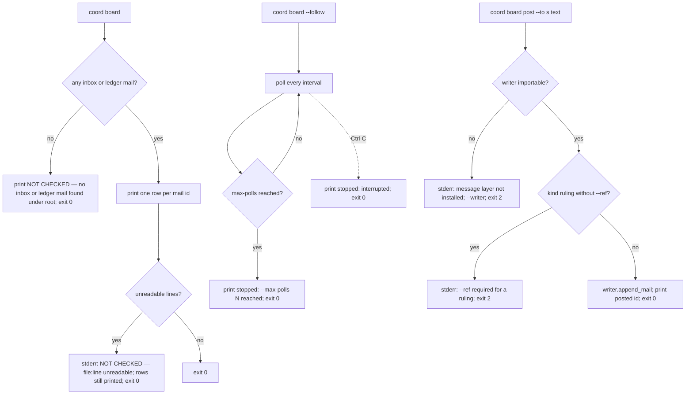

# Spec: Board — human transparency over agent messages

- **Status:** Draft
- **Tier (cost-of-error):** **T2** — the board is what the maintainer reads *instead of* git to know what agents said to each other; a row that is not backed by a store line, or a quiet page that hides a `blocked`, misleads the one seat that can rule. The prior board (proposal §6) was struck because nothing wrote to it and nobody read it; the reopen trigger (read-rate zero after two sprints) is the same trigger this spec must survive.
- **Author(s) / date:** Python Developer (Peer Mode, lead for this track) with Product Strategist, UX Researcher / IA and UX & Accessibility enacted inline, 2026-09-19. Adversaries at the gate, **enacted inline (fan-out 0 by the track contract)**: Test Architect (hard veto), Simplifier (soft veto), UX Researcher / IA (UX veto), UX & Accessibility (UI veto). Inline enactment is recorded, not hidden: the author did not clear the vetoes silently — each veto's condition is written as a falsifiable criterion below and is proven by a named test at `/implement`.
- **Supersedes / related:** refines `docs/proposals/owner-coordinator-subagent-coordination.md` §4b (row *Board*, the rules paragraph), §6 (the struck earlier board and its reopen trigger), §7 row **P6**, decision **D12**; the maintainer's D5 answer in `docs/notes/note-20260919-coordination-decisions-ratified.md` ("some form of board to create human transparency on messages as opposed to in git"). Sibling of `spec-message-layer` (P4 — the store this board reads and the writer it posts through).

> **Grounding trace (V15):** `spec-board` → `refines` → `proposal-owner-coordinator-subagent-coordination` (§4b Board row: *"folds every inbox plus the ledger's message kinds into one timeline … A read model, never a store. Rendered empty it says NOT CHECKED, never all quiet"*; §6 struck board, reopen trigger *read-rate zero*; P6 row; D12) → `relates-to` → `note-20260919-coordination-decisions-ratified` (D5: a board for human transparency instead of reading git; reopen trigger: *a board that people stop reading — read-rate zero after two sprints*) → `relates-to` → `spec-message-layer` (P4; **the fixed store contract** in `docs/coordination/coordination-p2-p8.md` "Fixed contracts" is binding on both) → `relates-to` → `audit-log` (`audit-log.py render` produces `audit-data.js` + `docs/audit/index.html` from `pack/templates/audit-explorer.template.html`; the viewer is dependency-free, file://-loadable, and carries the `--cp-*` token system this spec inherits). Rules read: U9 (complete states incl. empty/loading/error), U16 (WCAG 2.2 AA), G1–G16 (archetype grammar), IO1–IO12 (measurement degrades to *not recorded*), R4/G15 (no rate over an empty corpus), E7 (surface list). **Conflict surfaced, not overridden:** the proposal's Board row says the empty rendering is `NOT CHECKED (no inboxes)`; the fixed contract says `NOT CHECKED — no inbox or ledger mail found under <root>`. This spec takes the contract's wording (it names the root that was scanned, which the proposal's does not) — a wording refinement, not a decision change.

---

## Part A — Functional specification
*Owner: Product Strategist (enacted inline).*

### Problem
The message layer (P4) gives agents a local inbox per session and a ledger twin for state-changing kinds. The human seat — the one that rules on decision requests and hard stops — has no way to *see* that traffic except by opening JSONL files or reading git. The earlier board proposals failed for a measured reason (proposal §6, ai-de §1.5): nothing wrote to them, so nothing was read. D12 reopens the board on one condition: it is a **read model over the store that agents already write**, never a second store that must be fed.

### Target users & personas
- **The Owner / human seat** — wants to know, in one glance, *who is blocked on whom, what is unanswered, and what was ruled*, without reading git. Reads the terminal board during a coordinated run and the audit explorer afterwards.
- **The Coordinator (an agent or a human)** — uses `--follow` while sub-agents run; posts a `note` or a `ruling` to a session or to everyone.
- **A new session / a reviewer** — opens `docs/audit/index.html` days later and needs the message history to be there, with the same truth the ledger holds and no invented detail.

### Core scenario
A coordinated run is under way. The human opens a terminal and runs `coord board --follow`. Rows appear as agents send: `ts · from → to · kind · ref · age · acked?`. A `blocked` from `p4-mail` to `coordinator` sits **unacked** for four minutes; the human runs `coord board post --to p4-mail "use the fixture writer until the join"`. The note lands in p4-mail's inbox through the message layer's own writer; the next poll shows it. Later, the maintainer opens the audit explorer's **Messages** view and sees the ledger's twins of the same exchange — the `blocked`, the ruling — with no bodies (the ledger carries none) and an honest *ack: not recorded here* (acks live only in inboxes).

### In scope / Out of scope (explicit non-goals)
**In scope:**
- `coord-board.py board [--follow] [--since <id>] [--session <s>] [--json]` — the terminal read model.
- `coord-board.py board post --to <session|*> "<text>" [--kind note|ruling] [--ref DR-n] [--writer <path>]` — a human message into the same inboxes, through the single writer.
- `audit-log.py render` emitting `messages: […]` (ledger twins, no bodies) into `window.AUDIT_DATA`.
- The audit explorer template gaining a **Messages** view beside the timeline.

**Out of scope (non-goals):**
- The transport, the doorbells, `dispatch`, `append_mail()` itself — P4 (`spec-message-layer`).
- A second store: the board persists nothing, caches nothing, and never rewrites a JSONL line.
- Recording that the board was read — **reading must not write** (the track contract; IO). The read-rate is measured from the shell history / session profiler, not by the board.
- Leader designation (P2), the readers and skill citations (P8), the `coord board` delegation line in `coord-core.py` (the coordinator adds it at the join).
- Bodies in the HTML view: the ledger has none by contract, and the board never invents one.
- Notifications, sound, colour semantics, a web server: the page is file:// and dependency-free.

### Conceptual domain model (DM1/DM4)
- **Bounded context:** *coordination messaging*, shared with P4. **Ubiquitous language:** *mail* (one inbox line), *inbox* (`.agents/mail/<session>.jsonl`), *ledger twin* (a `type: mail` record in `.agents/log/<session>.jsonl`), *board row* (the read model's row for one mail id), *ack* (a mail of kind `ack` whose `ref` is another mail's id), *post* (a human mail of kind `note` or `ruling`).
- **Entities / value objects:** a **Mail** is an entity identified by `id` (ULID) — the aggregate root of *nothing*: the store is append-only and a mail never changes. A **Board row** is a **value object** derived from the union of a mail's inbox line and its ledger twin — it has no identity of its own beyond the mail id it projects, which is the invariant *"one row per mail id"*. **Acked** is a derived attribute: true iff some inbox line of kind `ack` carries `ref == id`.
- **Grain:** one board row is exactly **one mail id**. **Additivity:** counts of rows per kind/session are additive; *age* is non-additive; *acked* is a boolean projection.
- **History rule:** none — the board stores nothing; every re-render is a full rebuild from the sources (**derive, don't store**; the board is the definition of a rebuildable cache with a trivial equality test: rendering twice over the same files yields the same rows).
- **Sources of truth:** the inboxes (bodies, acks) and the ledger (twins for state-changing kinds). Where both exist for one id, the row shows the inbox's body and ack state and carries `source: both`; a ledger-only twin shows `body: (not on this machine)` and `source: ledger`; an inbox-only line (a `note`, an `ack`, or a twin not yet written) shows `source: inbox`.

### User stories & acceptance criteria (testable)

**US-1 — Read the board (terminal).** As the human seat, I run `coord board` and see one row per mail id from every inbox and every ledger twin.
```gherkin
Given inbox a.jsonl holds mail m1 (from a, to b, kind delegate) and the ledger holds m1's twin
  And inbox b.jsonl holds mail m2 (kind note) with no twin
When I run board --json
Then rows has exactly 2 entries, ids {m1, m2}, m1.source == "both", m2.source == "inbox"
  And every row id is present in at least one inbox or ledger file (a row with no store line behind it is impossible)
```
**US-2 — Ledger-only twin.** A twin whose inbox is on another machine still shows.
```gherkin
Given the ledger holds a type: mail record for m3 and no inbox holds m3
When I run board
Then the m3 row shows body "(not on this machine)" and source "ledger"
```
**US-3 — Acked is a derived word, never a colour.**
```gherkin
Given inbox b.jsonl holds m1 and an ack line {kind: ack, ref: m1}
When I run board
Then m1's row shows "✓ acked" and an unacked row shows "- unacked" (the word is always present)
```
**US-4 — Empty corpus is NOT CHECKED.**
```gherkin
Given no .agents/mail/*.jsonl and no ledger type: mail record under <root>
When I run board
Then stdout contains "NOT CHECKED — no inbox or ledger mail found under <root>" and the exit code is 0
```
**US-5 — Follow terminates and says why.**
```gherkin
Given --follow --max-polls 2 --interval 0.01
When the polls elapse
Then the process exits 0 and stdout ends with "stopped: --max-polls 2 reached"
```
**US-6 — Post through the single writer.**
```gherkin
Given a writer module at <path> exposing append_mail(root, session, entry)
When I run board post --to p4-mail "text" --writer <path>
Then the writer was called once with an entry matching the store schema (id, ts, from, to, kind=note, body, ref=null, ack=null)
  And coord-board.py's source contains no open(…, "a") of any mail path
When I run board post --to p4-mail "x" --kind ruling (no --ref)
Then the exit code is 2 and stderr names --ref
When the writer path does not exist
Then the exit code is 2 and stderr says the message layer is not installed and names --writer
```
**US-7 — Render emits messages.**
```gherkin
Given <docs-root>/../.agents/log/s.jsonl holds a type: mail record for m9 (and a body field by mistake)
When I run audit-log.py --root <docs-root> render
Then audit-data.js contains "messages" with m9's id, kind, from, to, ref, ts — and no body
  And the rendered index.html contains the Messages view markup (a "Messages" toggle, the NOT CHECKED empty state)
```
**US-8 — Filters.** `--session s` keeps rows where `from == s`, `to == s`, or `to == "*"`; `--since <id>` keeps rows ordered after `<id>` (by `ts`, then `id`); the page filters by session and kind.
**US-9 — Unreadable lines are reported, never hidden.** A line that is not JSON is counted and named on stderr as `NOT CHECKED — <file>:<line> unreadable`; the readable rows still print; exit 0 (a read model does not fail the operator for a corrupt line, but it never pretends the line is absent).

### Non-functional requirements (ISO/IEC 25010 checklist)
- **Functional suitability:** the union and de-dup rule above; no invented fields (a missing `ts` renders `age: not recorded`).
- **Performance:** one full read of every inbox and ledger file per render; a 720-poll follow reads at most 720 times; no caching (a store would be a second store). *Measured at implement, not modelled.*
- **Compatibility / portability:** Python 3.8+, stdlib only; utf-8 stdio guard; no machine paths; LF writes (the board writes none); Windows-safe glyph handling through the existing reconfigure idiom.
- **Usability:** plain-text rows with no colour-only meaning (U16); the page's Messages view keyboard-reachable, states complete (U9).
- **Reliability:** an empty or unreadable corpus degrades to NOT CHECKED, never to an empty timeline that reads as "all quiet" (R4).
- **Security:** the board reads only under the resolved coordination root inside the repository; `--writer` is a path the operator chooses (a local trust decision, same class as `COORD_ROOT`); the post body is bounded to 4 KiB by the store contract.
- **Maintainability:** one reader script; the render change is a single additional field; the template change is one view.

### Boundary set
- Zero files; zero readable lines; a file of blank lines; one unreadable line among readable ones; the same id in two inboxes (de-dup keeps one row, `source` records both inboxes is *not* required — one row); a twin with no `ts` (age *not recorded*); an ack whose `ref` points at an id that is not in the corpus (the ack row shows; nothing is marked acked); `--since` an id not in the corpus (no rows; a stderr note); `--max-polls 0` (one read, then stop); a body of exactly 4096 bytes accepted, 4097 refused; `--to` empty refused; `--kind` outside `note|ruling` refused.

### Comparables & user evidence (sourced)
- The struck board in the prior proposals and ai-de's §1.5 account of the pull-only board with zero callers — proposal §6, §1 (**Verified**, read in the proposal).
- The maintainer's D5 ruling — `note-20260919-coordination-decisions-ratified` (**Verified**).
- The audit explorer's own timeline as the pattern for a derived, file://-loadable read model over committed JSONL — `audit-log.py render` (**Verified**, read).

### Applicable governance lenses
- **Data & Persistence:** no store, no migration — the projection rule is the whole model. Walked above.
- **Security & Identity:** `--writer` path trust; reads bounded to the repository root. Walked in Part A NFRs; STRIDE at design.
- **Privacy:** mail bodies are work data authored by agents and the operator; the page shows none; the terminal shows what the local inbox already holds. No personal data category is introduced.
- **Observability / IO:** reading emits nothing by design (the contract forbids a write on read); the read-rate is measured elsewhere — recorded in the design's Telemetry.

### AI-integrated allocation
None — no model call anywhere in the board. Deterministic.

---

## Part B — UX specification
*Owner: UX Researcher / IA (enacted inline).*

### Personas & jobs-to-be-done
- **Owner, mid-run:** *"Is anyone blocked, and on what?"* — needs the newest unacked `blocked`/`decision-request` rows first; the terminal, live.
- **Coordinator:** *"Say one thing to one session without opening its file."* — `board post`.
- **Maintainer, after the fact:** *"What was said during that run, and was it ruled?"* — the explorer's Messages view, filtered by session and kind.

### Information architecture
- **Terminal:** one table, newest last (so `--follow` appends naturally), columns `ts · from → to · kind · ref · age · acked?`, then the body on a second indented line when present (a `(not on this machine)` placeholder for ledger-only rows). The NOT CHECKED line replaces the table when there is nothing to show. `--json` is the same rows as data for other readers.
- **Explorer:** the existing header gains a third toggle — **Full history · Changes · Messages** — so Messages is a sibling of the two existing views, not a new page. The existing session select applies (a message matches when `from` or `to` equals the session); a **kind** select appears in the Messages view only. Rows are a table (header row: when · from → to · kind · ref · ack), not expandable (there is no body to expand).

### User flows (happy + alternate + error + recovery)

Explorer: **loading** (the existing status region) → **error** (the existing alert when `audit-data.js` fails or is invalid) → **Messages view**: rows, or **NOT CHECKED — nothing recorded** with the guidance *run `coord board` to read the inboxes on this machine; twins appear here after `audit-log.py render`*, or **No messages match the filters** with a *Clear filters* button (filtered-empty is a different state from empty, U9).

### Wireframe-level structure
```
[ Project — Messages ]   n actions · m changes · k messages · generated …   [Full history][Changes][Messages]
[ search … ] session [all ▾] kind [all ▾] from [date] to [date] [clear]   k shown
┌ when ─────── from → to ─────────── kind ──────── ref ───────── ack ───────────┐
│ 18:02  p4-mail → coordinator      blocked       DR-3          not recorded here │
│ 18:07  coordinator → p4-mail      ruling        DR-3          not recorded here │
└──────────────────────────────────────────────────────────────────────────────┘
  ack state lives in the inboxes; run `coord board` for it.
```

### UX acceptance criteria (falsifiable)
- The Messages toggle is a `<button>` with `aria-pressed`; the kind select has a visible `<label>`; every control is reachable by Tab (existing focus ring).
- The empty state text begins with `NOT CHECKED` and names `coord board`; the filtered-empty state is distinct and offers *Clear filters*.
- The page still loads over `file://` with `audit-data.js` lacking `messages` (older data): the view shows the NOT CHECKED state rather than throwing.

---

## Part C — UI specification
*Owner: UX & Accessibility (enacted inline).*

- **Archetype Signature (G13, auto-selected from the JTBD):** nearest catalog row **B2 · Enterprise Master-Detail** — the job is *reading relational operational records at volume, filtered, in a dense table* — with recorded deviations: `Layout:SingleColumn` (the explorer is one column, no sidebar; a sibling view, not a new IA), `Sync:Static` (derived file, no server; a re-render is `audit-log.py render`), `Persistence:None`, `Color:Monochrome` (the page's existing `--cp-*` tokens, no new colours), `Motion:None`. B3 (Telemetry Bento) was rejected: no live polling on the page (the terminal `--follow` is where liveness lives) and no metric widgets — a table of records is a B2 shape. B1 rejected: no command palette, not keyboard-first beyond the WCAG floor.
- **Medium / platform:** a self-contained HTML page, dependency-free, file://-loadable, light/dark by the existing `data-theme`, forced-colors block inherited.
- **Tokens:** only the existing `--cp-*` set; the table reuses `.row`/`.badge`/`.time`/`.empty` semantics; header cells use `--cp-text-muted` on `--cp-surface` (existing pair, already ≥ 4.5:1 in both themes by the page's prior audit — **Inferred** from the tokens' present use on the same surfaces; the craft gate at implement is the measurement).
- **States (U9):** loading (inherited), error (inherited), empty (`NOT CHECKED — nothing recorded` + guidance), filtered-empty (+ *Clear filters*), populated. Overflow: long refs ellipsise with `title` carrying the full value.
- **Copy:** real, in voice: *ack: not recorded here — see coord board* (never "unacked", which the page cannot know).
- **WCAG 2.2 AA (U16):** a `<table>` with `<th scope="col">`; ack rendered as words; kind badge is text; no colour-only meaning; focus-visible inherited; the count region is `aria-live="polite"` (existing).
- **Performance budget:** no new script or stylesheet; the messages array is the ledger's twin count (hundreds, not millions); render is O(n) per filter change like the existing views.

---

## Flagged risks & residual unknowns
- **assume:** P4's `append_mail(root, session, entry)` owns the ledger twin dual-write for `ruling`; the board never writes a twin itself. *Confirmed by:* reading `coord-mail.py` at the join. *If false:* a human ruling has no twin and the explorer never shows it — the coordinator's join step (order-of-operations 4) swaps the writer and runs `board` over real mail, which would show the gap.
- **assume:** a broadcast `--to "*"` is passed to the writer as the session argument verbatim; the writer owns fan-out. *Confirmed by:* the same read. *If false:* the writer raises, the post exits 2 with the writer's message — never a silent drop.
- The page cannot show ack state (acks are not twinned) — recorded as *not recorded here*, not as a defect; if the maintainer wants acks on the page, the contract must twin acks (a `coord request add` to P4, not a board change).
- Read-rate is the reopen trigger and is measured outside the board (shell history / profiler) — the design's Telemetry names the gap.

## Gate record

`GATE specify · 2026-09-19 · peers: Python Developer (lead), Product Strategist, UX Researcher/IA, UX & Accessibility (inline) · adversaries, enacted inline under fan-out 0: Test Architect (hard), Simplifier (soft), UX Researcher/IA (UX veto), UX & Accessibility (UI veto) · verdict: **PASS-WITH-CONDITIONS** — conditions are the named tests below and are discharged at /implement, not here.`

| # | Finding (severity, lens) | Resolution |
|---|---|---|
| 1 | "A row with no store line behind it is impossible" is a construction claim, not a test (Test Architect, veto condition) | US-1 asserts every emitted id ∈ ids read from the fixture files; plus the render test asserts no body leaks from a twin |
| 2 | The page's *acked?* column cannot be true from the ledger alone (UX & Accessibility, must) | Column shows *ack: not recorded here — see coord board*; IO rule (degrade to not recorded) |
| 3 | `--follow` with no cap is an unbounded loop (Test Architect, veto condition) | `--max-polls` default 720, `--interval` default 5 s; the stop reason is printed and tested |
| 4 | A kind select and a body column would gold-plate the page (Simplifier, should) | Kind select kept (it is the maintainer's second filter question); body column dropped — the ledger has none |
| 5 | Two empty states collapse into one (UX Researcher/IA, must) | Empty (NOT CHECKED + guidance) and filtered-empty (+ Clear filters) specified separately |
| 6 | Reading must not write — a "last read" marker would be a store (Simplifier + contract) | Non-goal; read-rate measured outside |
