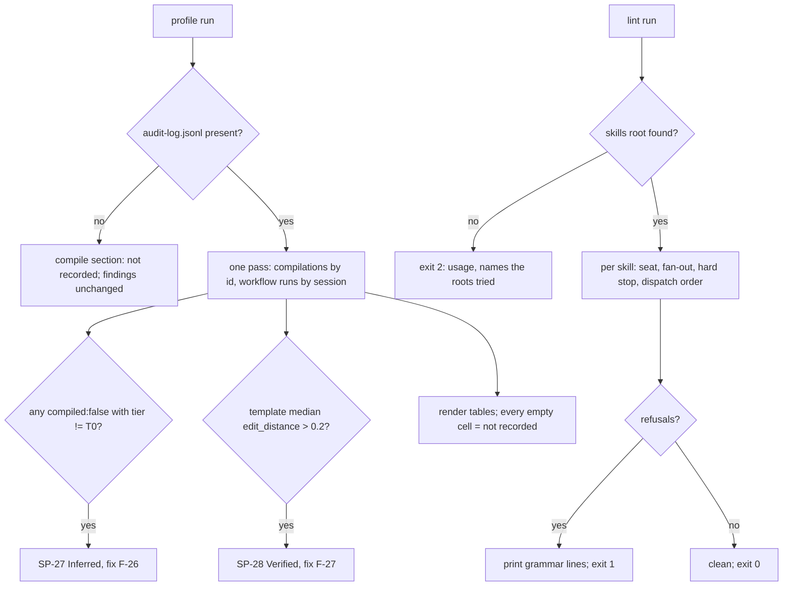

# Spec: Compile readers — measure the compile stage, declare the seat, cite the stage

- **Status:** Draft
- **Tier (cost-of-error):** **T2** — the lint becomes a bundle gate every future skill must pass, and the two readers are the only instruments that will tell the maintainer whether the compile stage is used or edited away; a wrong measurement here is silent and steers template revisions. (The Coordinator's plan row fixes T2; recorded, not chosen here.)
- **Author(s) / date:** Python Developer (lead; peer mode) + Product Strategist + Data & Persistence Architect (peers, enacted inline — fan-out 0), 2026-09-19. Adversaries at the gate, enacted inline: Test Architect (hard veto), Simplifier (soft veto), Data & Persistence Architect (unmodelled concept). **No sub-agent was convened** (the track's fan-out cap is 0); the council is rhetorical, as §7b.1 measures it to be in every prose-input skill today.
- **Supersedes / related:** refines `spec-compile-stage` (US-3 eval measurement, US-6 surface list, US-8 dispatchable stop); builds the "Flagged risks" rows of `design-compile-stage` that were deferred to P8 (*"`/session-profiler` and `/dream` do not yet read the new fields"*, *"the consuming skills' `dispatchable` stop is P8's"*); proposal §7b.2 (CO-S0/S1/S2), §7b.3 groups B/C/D, §7b.5 (the control `verify-skill-contracts.py`), D15.

> **Grounding trace (V15):** `spec-compile-readers` → `refines` → `spec-compile-stage` (US-3, US-6, US-8; NFR "Functional suitability": *the edit-distance distribution per template version [is a] measurement `/session-profiler` reports*) → `relates-to` → `design-compile-stage` (Telemetry: `engine_seconds`, `compile_tokens`, `decision_requests`, `refusals[]`, `retries`, `mode`, `template_version`, `dispatchable`; workflow entries: `compiled_from`, `edit_distance`, else `compiled: false`) → `relates-to` → `proposal-owner-coordinator-subagent-coordination` (§7b.1 survey: 25 of 27 skills carry no seat; §7b.5: red-first). Also read: `docs/coordination/coordination-compile-stage.md` "Planned vs actual" (the carried-forward list is exactly this spec's scope), `pack/knowledge/agent-coordination.md` CO-S0 as seeded, `pack/commands/compile/SKILL.md` step 6 (the consuming skill's closing `--compiled-from --edit-distance`), the live audit log (1 `kind: compilation` entry, 2 `kind: skill` entries carrying `compiled: false`, 1 carrying `compiled_from` — the field shapes below are read from those entries, not from memory), `pack/context-budget.json` (`growth_tolerance_pct: 2`; every skill's baseline equals its current size, so the headroom per skill is exactly 2%). **Drift found:** the proposal and the coordination plan write the seat as `Runs as:`; the P8 contract fixes the frontmatter key as `runs_as:` (YAML-safe, `check-consistency.py check_frontmatter_yaml`) — this spec follows the contract and records the rename below.

---

## Part A — Functional specification

### Problem
The compile stage (P7) records, per workflow run, whether it started from a compiled prompt and how far the human edited that prompt before running it — but **nothing reads those fields**. The profiler reports twenty-six findings from harness telemetry and none from the audit log's compile fields; `/dream` mines goal-state presence (PACK-O) but not compile presence, unanswered decision requests, or gate refusals. So the compiler's one quality measure (spec-compile-stage US-6: *what the human changed*) is written and never shown, and a template that produces prompts nobody runs unedited would not be noticed. Independently, the doctrine of delegation names three shared stages a skill cites (CO-S0 compile, CO-S1 seat, CO-S2 stop = message) and the survey measured that no skill outside the two coordinators cites any of them: 25 of 28 skills declare no seat, 13 of 14 prose-input skills do not cite CO-S0, none of the four hard-stop stages cites CO-S2. Doctrine with no citation and no lint is prose — a memoir (CI6).

### Target users & personas
- **The maintainer (primary)** — reads a profile after a session and wants to know: did the turns start compiled; how much was the compiled prompt edited; which template version is being edited most; did any dispatch run on an unanswered decision request.
- **The skill author** — runs `verify-skill-contracts.py` at authoring time (`/extendaibundle`, §7b.3 group D) and gets a refusal naming the skill and the fix.
- **The Coordinator seat** — needs every skill to say which seat it may run in, so a plan can dispatch a Sub-Agent-capable skill and refuse to dispatch a Coordinator-only one.

### Core scenario
The maintainer runs `session-profile.py --repo <tree> --days 2 profile`. Beside the harness tables, a **Compile stage (audit log)** section reports, per session and per template version: compilations, the share of substantive turns that recorded `compiled: false`, the edit-distance median and p90 for turns that closed with `compiled_from`, decision requests per compilation, refusals and retries, and the engine-seconds median — each cell `not recorded` when the log carries no entry for it. Two findings can fire: **SP-27** (substantive turns started without a compiled prompt — *Inferred*, because a T0 closed question needs no compile) and **SP-28** (compiled prompts heavily edited before the run: median `edit_distance` > 0.2 for a template version — *Verified*). The fixes catalog names **F-26** (the CO-S0 citation — the skill consumes the compiled prompt) and **F-27** (revise the template version from the edit-distance evidence). Later `/dream` proposes, from the same log, candidate classes for the `compiled: false` gaps, the decision requests still unanswered in the text a workflow received, and the gate's refusals — proposals only. Meanwhile `verify-skill-contracts.py` runs argument-free in the bundle gate: every SKILL.md declares `runs_as`, every prose-input skill cites CO-S0, the four hard stops cite CO-S2, and no dispatcher spawns before the compile stage.

### In scope / Out of scope (explicit non-goals)
- **In:** `session-profile.py` new measurements, SP-27/SP-28, F-26/F-27, compare-table columns; `dream.py` compile miner; `verify-skill-contracts.py` (new, stdlib, `--root`, `--self-test`, refusal grammar); `runs_as:` on the 26 SKILL.md files P8 owns; the CO-S0 sentence on the thirteen prose-input skills that lack it; the dispatchable-stop sentence on `optimize-graph`; the one-line CO-S2 citation on the four hard-stop skills; red-first tests; the per-skill context budget held.
- **Out (non-goals):** `execute-with-coordination` and `prepare-for-coordination` (P2 owns them; P2 inserts the same dispatchable-stop sentence and `runs_as: Coordinator`; the lint *reads* them and this spec reports their result); `coord-core.py`, the message layer (P4), the board (P6), `audit-log.py`; the CO-S2 doctrine text itself (P0's — this spec cites the id, never writes the doctrine); other harness templates; INSTALL/README counts; `pack/context-budget.json` baselines; registering the lint in the gate runner (the Coordinator wires gates); scoring or promoting a dream proposal (dream proposes, the human decides — ADR-0003); a leader-loss finding in the profiler (a P2→P8 seam request, not required for exit).

### Conceptual domain model (DM1/DM4)
**Bounded context:** *compile telemetry* — the read side of the compile stage, over the same store the stage writes to (the audit log), plus *skill contracts* — what a SKILL.md declares about itself.

**Ubiquitous language.** *Compilation* — one gate-passing compile of one raw prompt for one harness (`kind: compilation`; the aggregate P7 defined). *Workflow run* — a substantive audit entry (`kind: skill`) that either closed from a compiled prompt (`compiled_from` + `edit_distance`) or recorded `compiled: false`. *Template version* — the `(harness, template_version)` pair a compilation names; the unit the compiler's quality is measured per. *Edit distance* — the compiled-vs-received ratio P7 defined (`1 − SequenceMatcher.ratio()`, 4 decimals); non-additive. *Presence gap* — a workflow run with `compiled: false`. *Unanswered decision request* — a `DR-n` whose `answer` is null in the compilation and still reads `answer: unanswered` in the text a workflow received. *Seat* — the value of `runs_as`: `Coordinator` · `Sub-Agent` · `either` (CO-S1). *Prose-input skill* — the fourteen skills of §7b.3 group B. *Hard-stop stage* — a stage that halts for a human (investigate Stage 7, forensicreview triage, code-hygiene fix Stage 7, apply-learnings' plan). *Dispatcher* — a skill whose text instructs a spawn or a dispatch.

**Entities vs value objects.** Compilation and Workflow run are entities (identified by their audit id; append-only, never edited). Measurement rows (per session, per template version), Edit distance, Seat and Citation are value objects. A Skill contract is an entity identified by the skill name.

**Aggregates and invariants.** (1) *Measurement* — root: the audit log read once per run; invariant: **every cell either derives from ≥ 1 entry or reads `not recorded`** — never a plausible number from an empty set (IO8). (2) *Skill contract* — root: the SKILL.md (plus its `reference/*.md`); invariant: **one seat, declared in frontmatter, from the closed set; the citations the skill's shape requires are present** (CO-S0 for prose input and fan-out; CO-S2 for a hard stop; compile before dispatch). (3) *Dream proposal* — invariant: **evidence-bearing or dropped; never scored above the deterministic formula, never promoted by the miner.**

### User stories & acceptance criteria (testable)

**US-1 — As the maintainer, I want the profiler to read the compile fields per session and per template version, so that the compile stage's use is measured, not assumed.**
- **Given** an audit log with two `kind: compilation` entries for template `claude-code v1` and three `kind: skill` entries — one `compiled_from` the first with `edit_distance: 0.31`, one `compiled_from` the second with `edit_distance: 0.05`, one `compiled: false` — **When** `profile` runs over that repo **Then** the profile's `compile.by_template["claude-code v1"]` reads `compilations: 2`, `edit_distance_median: 0.18`, `edit_distance_p90` between 0.28 and 0.31, `samples: 2`, and `compile.by_session[<session>]` reads `compiled_false_share: 0.33` (1 of 3) with `substantive_recorded: 3`.
- **Given** the same log **When** a compilation's `provenance` carries `refusals: ["raw mismatch"]`, `retries: 1`, `engine_seconds: 0.002` and `decision_requests` of length 2 **Then** the template row reads `refusals: 1`, `retries: 1`, `engine_seconds_median: 0.002`, `decision_requests_per_compilation: 1.0` (2 over 2 compilations).
- **Given** an empty audit log, or a repo with no `docs/audit/audit-log.jsonl` **When** `profile` runs **Then** every compile cell reads `not recorded`, no SP-27/SP-28 fires, and the run exits as it does today (the harness tables are unchanged).
- **Given** a `kind: skill` entry that carries neither `compiled` nor `compiled_from` (pre-P7) **Then** it is not in the denominator of `compiled_false_share` (it is *unrecorded*, not *not compiled*); the row reports `substantive_unrecorded` beside it.

**US-2 — As the maintainer, I want SP-27 and SP-28 as findings with fixes, so that a compile gap or a bad template is a control, not a table cell.**
- **Given** a `kind: skill` entry with `compiled: false` and `tier` not `T0` **When** `profile` runs **Then** finding `SP-27` appears with confidence `Inferred`, evidence naming the entry's shortname, fix `F-26`.
- **Given** the only `compiled: false` entry has `tier: T0` **Then** SP-27 does not fire (a closed question needs no compile — the Inferred label's reason).
- **Given** a template version whose `edit_distance` median across `compiled_from` entries is `0.25` **Then** `SP-28` fires with confidence `Verified`, evidence naming the template version, the median and the sample count, fix `F-27`; **Given** the median is `0.20` **Then** it does not fire (strictly greater).
- **Given** the existing findings SP-01…SP-26 and fixes F-01…F-25 **Then** their ids, titles and output shapes are unchanged (`tests/docs_explorer/test_session_profile*.py` stay green).

**US-3 — As the maintainer, I want `/dream` to propose classes from the compile fields, so that a recurring gap becomes a control candidate.**
- **Given** an audit corpus with `kind: skill` entries of which some carry `compiled: false` **When** `build_proposals` runs **Then** one proposal with `sig` starting `CO-S0` names `n/m substantive turns recorded compiled: false`, confidence `v`, evidence naming each gap (≤ 8), control pointing at F-26 / the CO-S0 sentence.
- **Given** a `kind: compilation` entry with `dispatchable: false` whose `prompt` text still carries `DR-1 … answer: unanswered`, and no later compilation of the same `raw_id` answers it **Then** a proposal with `sig` `CO-S0 unanswered decision requests` lists `DR-1` with the compilation id.
- **Given** a compilation whose `provenance.refusals` is non-empty **Then** a proposal with `sig` `CO-S0 gate refusals` lists each code with its count.
- **Given** a corpus with no compile fields at all **Then** no CO-S0 proposal is produced and the PACK-O proposal is unchanged (`test_dream_pack_o.py` green). The miner never sets a score above the deterministic formula and never promotes.

**US-4 — As the Coordinator seat, I want every skill to declare `runs_as`, so that a plan knows what it may dispatch.**
- **Given** a SKILL.md whose frontmatter has no `runs_as:` line **When** the lint runs **Then** it prints `seat missing: <skill> — fix: add runs_as: Coordinator|Sub-Agent|either to the frontmatter` and exits 1.
- **Given** `runs_as: Owner` **Then** `seat invalid: <skill> — fix: …` and exit 1.
- **Given** today's tree (base `2b3a815`) **Then** the argument-free run refuses every skill that carries no `runs_as` on `seat missing` (red first — the plan estimated 25 of 28; **observed at implement time: 28 of 28**, plus 4 `hard stop without message` and 2 `dispatch before compile` — 34 refusals).
- **Given** the seats are added **Then** the fourteen prose-input skills read `either`; `optimize-graph`, `addpacktorepo`, `updatepack`, `extendaibundle` read `Coordinator`; the measurement and utility skills read as the design's data-shapes table justifies each.

**US-5 — As the skill author, I want every prose-input skill to cite CO-S0 in one fixed sentence, so that a consuming skill takes the compiled goal state instead of re-deriving it (US-6 of the compile stage).**
- **Given** the fourteen prose-input skills **Then** each carries the sentence *"Consume the compiled prompt when one is in hand (CO-S0, `knowledge/agent-coordination.md`; `/compile`): its goal state is the turn's goal state and its Not-in-scope is the interdiction — derive nothing from raw prose that a compiled prompt already fixed."* **exactly once** across `SKILL.md` and its `reference/*.md`, as the first sentence of the Grounding or Stage 0 paragraph; `optimize-graph` and `prepare-for-coordination` keep the copy they already carry (not duplicated).
- **Given** a skill whose baseline + 2% cannot hold the sentence **Then** the sentence lives in that skill's `reference/co-s0.md` and SKILL.md carries a one-line pointer citing `CO-S0` — the test accepts either placement, the budget gate accepts only one, and the design names each such skill for a baseline update.

**US-6 — As the skill author, I want a skill that names a fan-out cap above zero to cite CO-S0 and the five-part contract with a termination condition, so that a plan is dispatchable (GO7).**
- **Given** a SKILL.md whose text names `fan-out cap` followed by an integer ≥ 1 (`fan-out cap 2`, `fan-out cap: 3`, `fan-out cap of 4`, `fan-out cap ≤ 4`) and no `CO-S0` **Then** `fan-out without compile: <skill> — fix: …`, exit 1; with CO-S0 but no `five-part contract` **or** no `termination` **Then** `fan-out without contract: <skill> — fix: …`.
- **Given** `fan-out cap 0` or `fan-out cap` with no integer (a field name) **Then** the rule does not apply (`also`'s *"fan-out cap 0 → 2"* example and the plan-row field lists are exempt by construction).

**US-7 — As the human seat, I want the four hard-stop stages to cite CO-S2, so that the stop is a message, not a paragraph.**
- **Given** a SKILL.md carrying a hard-stop shape (`**STOP` in capitals, `stop for human`, or `never merges`) and no `CO-S2` **Then** `hard stop without message: <skill> — fix: cite CO-S2 (knowledge/agent-coordination.md)`, exit 1.
- **Given** `investigate`, `forensicreview`, `code-hygiene`, `apply-learnings` after the one-line citation **Then** each passes; no other skill in the tree matches the hard-stop shape (observed at implement time; a new match is a finding, not an exemption).

**US-8 — As the Coordinator seat, I want a dispatcher never to spawn before the compile stage, and a consuming skill to refuse a non-dispatchable prompt (spec-compile-stage US-8).**
- **Given** a SKILL.md whose text *instructs* a spawn or dispatch (a Dispatch heading or stage label, `coord dispatch`, or a sentence-initial `spawn` — prose *about* spawning, such as "which spawns one sub-agent per track", is not an instruction) and whose first `CO-S0` occurrence in SKILL.md comes after the first such instruction (or is absent) **Then** `dispatch before compile: <skill> — fix: …`, exit 1.
- **Given** `optimize-graph` **Then** its plan-emission step carries the sentence *"Before dispatch, refuse a compiled prompt whose `dispatchable` is false or whose text still carries an unanswered `DR-n` line — stop with `decision request unanswered: DR-n` (CO-S0)."* exactly once.
- **Given** P2's two skills in this tree (base `2b3a815`) **Then** the lint's result on them is reported, not fixed here.

**US-9 — As the maintainer, I want the added lines to fit the per-skill context budget, so that a citation is never a paragraph paid on every invocation.**
- **Given** the edits **When** `context-budget.py skills --gate` runs **Then** exit 0 with no skill above `baseline × 1.02` (`pack/context-budget.json` untouched).
- **Given** the lint over its own fixtures **When** `verify-skill-contracts.py --self-test` runs **Then** every direction fails when it should (seat missing, seat invalid, fan-out without compile/contract, hard stop without message, dispatch before compile) and the good skill passes; exit 0 — DC-104: a gate that cannot fail is not a gate.

### Non-functional requirements (ISO/IEC 25010)
| Attribute | Requirement (measurable) |
|---|---|
| Performance efficiency | The profiler's audit read is one pass over `audit-log.jsonl` (today ~1 MB, < 1 s); the lint reads 28 files once; neither adds a network or subprocess call. |
| Reliability | A malformed audit line is skipped and counted, never fatal (the existing `dream.read_jsonl` behaviour); a missing log → `not recorded` (IO8). |
| Security | No secret can enter a profile or a dream: evidence notes carry shortnames, ids, codes and numbers, never prompt text beyond the 60-char scrubbed slice `/dream` already applies; the lint reads files, writes nothing. |
| Usability | Refusals in the pack's grammar `<code>: <target> — fix: <text>`; the profile section reads `not recorded` in every empty cell; SP-27 says why it is Inferred. |
| Compatibility | stdlib only; Python 3.8+; LF writes with `newline="\n"`; the stdio guard on every printing script (PLAT-A; the three portability lints exit 0). |
| Maintainability | Existing finding/fix ids and output shapes unchanged; new code added beside the PACK-O miner and the SP catalogs, not restructured; tests pin exact oracles. |
| Portability | The lint finds its skills root argument-free from `pack/commands` (the source repo) or `.claude/skills` (a consuming repo); `--root` overrides. No home-directory path in any new file (the machine-path lint). |

### Boundary set
| Boundary | Expected |
|---|---|
| Empty log · missing log · log with only pre-P7 entries | every compile cell `not recorded`; no SP-27/28; no CO-S0 dream proposal |
| `edit_distance` present but not numeric (`null`, `"not recorded"`) | excluded from the distribution; counted in `samples_unrecorded` |
| `compiled_from` naming a compilation id not in the window or not in the log | the run counts toward the session's compiled share; its distance falls under template `unknown` |
| One sample per template version | median = that value; p90 = that value; SP-28 evidence shows `samples: 1` so the reader can discount it |
| Two compilations of one `raw_id`, the later answering `DR-1` | not an unanswered request |
| `decision_requests` absent on a compilation | 0 for the mean; not `not recorded` (the field's absence on a gate-passing entry means none) |
| Frontmatter with `runs_as` outside the `---` fence, or `Runs as:` in the body | `seat missing` — the key is frontmatter, the spelling is `runs_as` |
| Skill directory with no SKILL.md | skipped with a warning line; not a refusal |
| The sentence present twice (SKILL.md and reference) | the citation test fails (exactly once across the skill) |
| A SKILL.md at exactly baseline × 1.02 tokens | passes (the gate's comparison is strict `>`) |

### Comparables & user evidence (sourced)
| Claim | Source | Confidence |
|---|---|---|
| The compile fields exist on live entries in the shapes this spec reads (`compiled` object with `provenance.refusals/retries/engine_seconds/compile_tokens`, `decision_requests[].answer`, `template_version`, `harness`, `dispatchable`, `raw_id`; workflow `compiled_from`/`edit_distance`/`compiled: false`) | `docs/audit/audit-log.jsonl` in this tree, entries `al-01M2XAV9RG…` (compilation), `al-01M2XB4R11…`, `al-01M2XCCE6R…` (`compiled: false`), `al-01M2X9MK7P…` (`compiled_from`), read at grounding | Verified |
| 25 of 28 skills declare no seat; 3 of 28 cite CO-S0 (`compile`, `optimize-graph`, `prepare-for-coordination`) | `grep -l CO-S0 pack/commands/*/SKILL.md`; `grep -n runs_as` empty, at grounding | Verified |
| Every skill's baseline equals its current size (headroom = 2% exactly; `adopt` = 31 tokens, `migrate` = 39, `design-slice` = 40, `implement` = 40, `ui-design` = 45, `collectknowledge` = 46, `forensicreview` = 53, `define-architecture` = 57) and the CO-S0 sentence is ~54 tokens at 4.83 chars/token | `context-budget.py skills --gate` output and `pack/context-budget.json` at grounding | Verified |
| The Copilot prompt mirrors do not carry the Grounding/Stage-0 text for the prose-input skills (only `dream` and `optimize-graph` mirrors carry a "Stage 0" line, as a summary) | `grep -l "Stage 0\|Grounding" pack/adapters/copilot/prompts/*.prompt.md` at grounding | Verified |
| A per-template edit-distance distribution is the accepted quality measure for a prompt compiler | spec-compile-stage US-6 and NFR row "Functional suitability" | Verified (repo-internal) |
| The 0.2 median threshold for SP-28 is a starting point, not a measured elbow | no prior distribution exists (1 `compiled_from` entry in the tree) | Flagged — revisit after ten compiles per template |

### Applicable governance lenses
- [x] Quality attributes / NFRs — above.
- [ ] Threat model (STRIDE) — not required: no identity, PII, money or irreversible action; the lint and readers are read-only over committed files.
- [x] Privacy & data governance — evidence carries ids, shortnames and numbers; prompt text is never copied into a finding beyond the existing 60-char scrubbed slice.
- [ ] Accessibility — N/A: CLI text and Markdown only.
- [x] Performance budget — one pass over the log; no subprocess.
- [x] Release / rollback — additive; removing the new lines from a SKILL.md restores today's tree; the lint is not yet wired into a gate (Coordinator).
- [x] Observability — the profile *is* the instrument; the lint's refusals are its telemetry (stable codes).

### AI-integrated allocation
N/A — deterministic stdlib scripts and Markdown edits; no model step.

## Part B — UX specification
*The "surface" is the CLI and the committed report. Written in CLI/report terms; there is no visual UI.*

### Personas & jobs-to-be-done
The maintainer reads `docs/profiles/<sp-id>/profile.md` and the dream review; the skill author reads a refusal on stderr; the Coordinator reads `runs_as` from frontmatter (by eye or a future `coord` verb — out of scope).

### Information architecture
- `profile.md`: `## Findings` (SP-27/SP-28 sorted with the rest by severity) → `## Fixes` (F-26/F-27 appear only when used, as today) → `## Model family x harness` (two added trailing columns: `compiled`, `edit dist p50`) → **new** `## Compile stage (audit log)` with two tables: *by session* (`session · substantive recorded · compiled: false share · unrecorded · compilations`) and *by template version* (`template · compilations · samples · edit dist p50 · p90 · DR/compile · refusals · retries · engine s p50`) → per-session sections unchanged. `profile.json` gains `compile: {source, by_session, by_template}`.
- Dream: proposals with `group: "Control upgrade"`, `sig` prefixed `CO-S0`, beside PACK-O in the same review view; no new view.
- Lint: stdout lists refusals one per line in the grammar; a clean run prints `clean - N skill(s) checked`; `--self-test` prints one line per direction.

### User flows

### Wireframe-level structure
The compile section sits after the tuning view because it is read after it; the tables carry `not recorded` in-cell so a reader never has to infer absence from a missing row.

### UX acceptance criteria
- A reader can tell from `profile.md` alone whether the compile data existed (`source: not recorded` vs a path) — no `0` that could be "none" or "unmeasured".
- A refusal names the skill and the fix in one line; a self-test failure names the direction.

## Part C — UI specification
N/A — no visual UI (CLI + Markdown reports; the audit viewer's `compiled` badge stays with the viewer's owner).

## Flagged risks & residual unknowns
| Risk | Cheapest next probe |
|---|---|
| The 0.2 SP-28 threshold (Flagged) | read the distribution after ten compiles per template; adjust the constant, keep the id |
| Skills whose 2% headroom cannot hold the sentence take the `reference/co-s0.md` route — the sentence is then not on the always-injected surface | the design names each; the Coordinator raises those baselines by ~55 tokens and the sentence moves inline in one edit |
| The hard-stop and dispatcher detectors are regexes over prose (Inferred by nature) | the self-test pins each shape; a new skill matching neither is the author's finding |
| P2's two skills fail the lint in this tree until P2 lands `runs_as: Coordinator` and the CO-S0 line | reported in exit evidence; green at the join |

## Gate record
`GATE spec · 2026-09-19 · Test Architect (hard) · Simplifier (soft) · Data & Persistence Architect (model) — enacted inline, fan-out 0 · verdict: PASS-WITH-CONDITIONS`

| # | Adversary finding (severity) | Resolution |
|---|---|---|
| 1 | Test Architect — "SP-27 on every `compiled: false` is unfalsifiable: a T0 closed question is *supposed* to skip the compile" (Blocker) | SP-27 fires only when `tier` is not `T0`; labelled Inferred with that reason (US-2) |
| 2 | Test Architect — "a median over one sample is a number that asserts nothing" (Major) | the row carries `samples`; SP-28 evidence prints it; threshold Flagged (risks) |
| 3 | Simplifier — "eight new `reference/co-s0.md` files to hold one sentence is ceremony" (Major, soft) | accepted as the contract's fallback; the cheaper fix (raise eight baselines by ~55 tokens) is the Coordinator's and is named for it — condition recorded |
| 4 | Data & Persistence Architect — "an entry with neither field is not `compiled: false`" (Major) | *unrecorded* is its own count; excluded from the denominator (US-1, boundary set) |
| 5 | Simplifier — "the compare-table columns duplicate the compile section" (Minor) | kept: the tuning view is per family × harness, the section is per session/template — different grains |
| 6 | Test Architect — "the dispatcher rule's `spawn` token also matches prose *about* spawning" (Minor) | accepted: it errs toward requiring CO-S0 earlier, never toward silence; self-test pins the shape |

Authors did not clear their own veto: the Test Architect's Blocker (#1) was resolved by the Product Strategist's rewrite of US-2 and re-read by the Test Architect.

---
**Handoff:** → `/design-slice` (`docs/design/compile-readers.md`, implements this spec).
