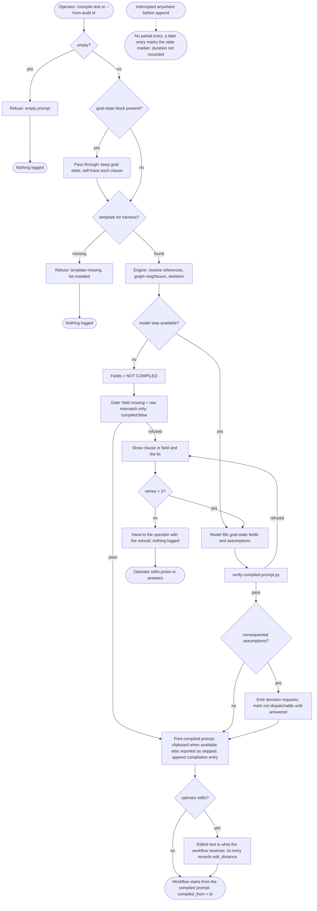

# Spec: Compile stage — from the operator's prose to the starting prompt

- **Status:** Draft
- **Tier (cost-of-error):** **T1** — the stage sits at the front of every non-trivial turn in every harness, so a wrong compile is silent and repeated; but its output is shown to the human before anything runs and is reversible by editing, which keeps it below T2.
- **Author(s) / date:** Product Strategist (lead) + Domain Researcher + Data & Persistence Architect + UX Researcher / IA + Security & Identity Architect (peers), 2026-09-19. Adversaries at the gate: Test Architect (hard veto), Simplifier (soft veto), UX Researcher / IA (UX veto).
- **Supersedes / related:** refines `docs/proposals/owner-coordinator-subagent-coordination.md` §7b.4 and build-plan row P7 (D14); depends on the ratified decisions in `docs/notes/note-20260919-coordination-decisions-ratified.md`. Sibling of `spec-agent-coordination` (the layer this stage feeds).

> **Grounding trace (V15):** `spec-compile-stage` → `refines` → `proposal-owner-coordinator-subagent-coordination` (§7b.4, P7, D14, D15) → `relates-to` → `note-20260919-coordination-decisions-ratified` (the maintainer's ask, 2026-09-19) → `relates-to` → `kb-multi-agent-coordination` (the harness dispatch shapes, `data-and-constants.md` "Harness CLI contracts") → `relates-to` → `audit-log` (the single store `kind:prompt` entries already live in). Rules read: CT19–CT24 (`communication-and-task-discipline.md`), NG1–NG10 (`no-guessing-protocol.md`), GO7 (`execution-graph-optimization.md`), S1–S10 (`specification-standards.md`), the `also` and `optimize-graph` skills' Stage 0. No orphan or stale node found; the proposal's P7 row is the only upstream claim and it is `draft`.

---

## Part A — Functional specification
*Owner: Product Strategist.*

### Problem

Every non-trivial turn is supposed to open with a **goal state** — Goal · Done when · Not in scope · Tier · Fan-out cap (CT19) — and every delegation with a **five-part contract** (GO7). Today both are **re-derived from the operator's raw prose by whichever agent is running, in whichever harness, on every turn**, and nothing records what that derivation inferred or checks that it did not add scope. The consequences are measured, not argued:

| Measurement (this repo, `docs/audit/audit-log.jsonl`, 2026-09-19) | Value |
|---|---|
| Substantive audit entries (kind `skill`/`manual`/`command`) | 128 |
| …that carry both `goal` and `done_when` | 49 (38%) |
| …that carry `tier` and `fan_out` | 17 (13%) |
| Raw prompts logged (`kind:prompt`) | 21 |
| Skills that dispatch work and therefore need a prompt in another harness's idiom | 2 of 27 — counted in the proposal's §7b.1 survey (grep over `pack/commands/*/SKILL.md`, 2026-09-19), not recounted here [Verified there] |
| Defect class already registered for the missing goal state | **PACK-O** (`defect-classes.md`): "a turn begun with no stated goal state or exit condition" |

So the goal state exists as a rule and is present in 38% of the record; the delegation contract exists as doctrine and is consumed by no skill; and a brief for another harness is hand-written each time (`execute-with-coordination` `--brief`). The problem, stated without a solution: **the operator's intent reaches the working agent as prose, and the transformation from prose to a bounded, checkable starting point is unrecorded, unverified and repeated per harness.**

### Target users & personas

- **The operator (primary)** — the human typing a request into any of the five harnesses (Claude Code, Codex, Copilot CLI, Grok Build, Antigravity). Wants the work to start from a sharper prompt than they typed, in the idiom the target accepts, **without the agent widening the goal**. Wants to see and edit that prompt before anything runs.
- **The Coordinator seat** — the agent that dispatches tracks (proposal §3.1). Needs a compiled contract per track in the target harness's idiom, with the operator's scope intact.
- **The Sub-Agent seat** — receives a compiled prompt as its whole goal state; never re-derives it.
- **The reviewer after the fact** — `/session-profiler`, `/dream`'s PACK-O miner, and the human reading `/prompts`. Need raw and compiled side by side to judge whether compiling paid.

### Core scenario

The operator types two lines into Claude Code: *"add a deadline and a fallback to seam requests; the join should refuse an expired one. Don't touch the leases."* They run `/compile`. In under a minute the terminal shows: a goal state whose **Done when** has three clauses, each annotated with the phrase it came from; two **resolved references** (`coord-core.py` `request add`, `conductor-join.py`, both opened and found); one **assumption** — *"expired means past `deadline` in the request's own stamp, not wall-clock at the join; confirm: ADR-0007 §fencing; breaks: a paused laptop expires every request at resume"* — marked consequential and therefore raised as a **decision request** before dispatch; **Not in scope:** the leases, quoted; **Tier T1 · Fan-out cap 2**; the empty **contract slot**. The operator edits one clause, answers the decision request in one word, and runs `/prepare-for-coordination`, which starts from the compiled prompt instead of the prose. One track targets Codex; its brief is the same compiled prompt rendered in the `codex exec` idiom. The audit log holds the raw prompt, the compiled prompt, the edit the operator made, and the compile's duration and token cost.

### In scope / Out of scope (explicit non-goals)

- **In:**
  - A deterministic engine, `prompt-compile.py` (stdlib), that builds the **skeleton**: resolved references, docs-graph neighbours, the harness template, the audit ids, the trace table.
  - A model step, run by the **running agent** (no separate model call is required), that fills the goal-state fields and writes the assumptions into that skeleton.
  - A utility skill, `/compile`, so the operator can compile alone, edit, and start a workflow from the result; and a shared stage **CO-S0** the prose-input skills cite so a workflow compiles when no compiled prompt is in hand.
  - One **harness template** per harness the pack installs to, versioned.
  - A gate, `verify-compiled-prompt.py`, that refuses a compiled prompt that adds scope or lacks a field.
  - Logging of raw and compiled together in the existing audit log; the measurements named in §NFR and §Observability.
- **Out (non-goals):**
  - **Prompt optimisation against a metric** (DSPy-style search over instructions or examples). The compiler transforms for scope fidelity and harness fit, never for accuracy.
  - **Executing** the compiled prompt, dispatching it, or choosing the harness. That is `/optimize-graph`, `/prepare-for-coordination` and P4.
  - Resolving assumptions by inference. The three moves remain check, mark, ask (NG1).
  - A second store. The audit log is the record; no `compiled/` directory of files.
  - Rewriting the operator's words. The raw prompt is stored verbatim and never edited.

### Conceptual domain model (DM1/DM4 — the highest-priority decision)

**Bounded context:** *Prompt compilation*, a sub-context of *Coordination*. It shares the *Audit* context's identity scheme (audit entry ids) and the *Coordination* context's vocabulary for seats and contracts; it owns nothing about execution.

**Ubiquitous language**

| Term | Meaning |
|---|---|
| **Raw prompt** | The operator's words, verbatim, as logged by `prompt-log.py` (`kind:prompt`). Immutable. |
| **Compiled prompt** | The document produced from one raw prompt for one **target harness**: goal state, references, assumptions, harness idiom, contract slot, trace. |
| **Goal state** | Goal · Done when · Not in scope · Tier · Fan-out cap · Context ceiling · Main-line budget (CT19). |
| **Clause** | One checkable statement inside *Done when* or *Not in scope*. The unit of tracing. |
| **Trace** | The link from a clause to the raw-prompt **phrase** it came from, or to the **assumption** it rests on. A phrase trace is **valid** only if the phrase is a verbatim substring of the raw text — case-sensitive, whitespace runs collapsed to one space, line endings normalised; an assumption trace is valid only if the assumption id exists in the same compiled prompt. A clause with no valid trace is **added scope**. A clause whose *only* trace is an assumption makes that assumption **consequential by definition** (it changed *Done when*), so it raises a decision request — scope cannot be laundered through a marker. |
| **Reference** | A token the raw prompt names that matches the **reference grammar**: a path-like token (contains `/` or ends in an extension from the list `/design-slice` fixes in the reference-grammar table), a backticked name, or an id matching the docs-graph id pattern. **Resolved** when exactly one file or node matches under the repo root and the compiler opened it; **unresolved** otherwise — zero matches, two or more matches (ambiguous), or a real path outside the repo root — and an unresolved reference yields an assumption, never a fabricated path. |
| **Assumption** | An `assume:` marker (NG4): the belief, what confirms it, what breaks if false. **Consequential** when a wrong belief would change the goal state; consequential assumptions become **decision requests** before dispatch. |
| **Harness template** | The versioned rendering rules for one harness's idiom (what the target accepts: brief shape, flags, forbidden constructs). |
| **Contract slot** | The five-part contract (GO7) plus termination condition, deadline and fallback, **empty** until a Coordinator assigns the work. |
| **Compilation** | The act, recorded once as an audit entry after the gate passes: which raw prompt (id and sha256 of its text), which template version, which model, how long, how many tokens, how many assumptions, what was refused, and whether the result is **dispatchable** (`dispatchable: false` while any decision request is unanswered). |
| **Pass-through** | A compilation whose input already carries a goal-state block — detected only by the **fixed grammar**: all seven CT19 labels, line-initial, in CT19 order, as fixed English keywords whatever the prose language. The goal state is kept unchanged, the engine emits a **self-trace** per clause (the clause text is its own verbatim phrase in the raw block, so the added-scope check is vacuous by construction), the idiom is still rendered for the requested harness, **the gate still runs** its field-completeness, marker-completeness and raw-hash checks, and the entry says `pass-through`. |

**Entities vs value objects**

- *Entities* (identity matters): **Raw prompt** (identity = its audit entry id); **Compiled prompt** (identity = its own audit entry id, which names the raw prompt id and the template version); **Harness template** (identity = harness name + version).
- *Value objects* (compared by content): Goal state, Clause, Trace, Reference, Assumption, Contract slot.

**Aggregates and the one invariant each protects**

| Aggregate | Root | Invariant |
|---|---|---|
| **Compilation** | the Compiled prompt | **No added scope:** every clause in *Done when* and *Not in scope* carries a trace to a raw phrase or to an assumption in the same compiled prompt. A compiled prompt that violates this does not exist (the gate refuses it before it is logged). |
| **Template set** | the Harness template | **Exactly one current version per harness** the pack installs to; a compiled prompt always names the version it used. |

The durable representation (where the compiled prompt's fields live in the audit entry, how the trace is encoded) is `/define-architecture`'s decision; the grain and history rules are `/design-slice`'s. The domain rule that constrains them: **a compilation is an append-only fact; the raw prompt is never updated in place.**

### User stories & acceptance criteria (testable)

Refusals share one grammar so every criterion below is checkable: `<code>: <target> — fix: <text>`.

**US-1 — As the operator, I want my prose compiled into a goal state in my harness's idiom so that the work starts bounded and I can see the bound before anything runs.**
- **Given** a raw prompt with no goal-state block **When** I run `/compile` **Then** the output contains all seven goal-state fields, each clause of *Done when* and *Not in scope* annotated on its own line with the raw phrase or assumption id it traces to, and the audit log gains one compilation entry naming the raw prompt id, the sha256 of the raw text and the template version.
- **Given** non-empty input text that is not yet a logged prompt **When** I run `/compile "<text>"` **Then** the text is logged verbatim as a `kind:prompt` entry (`prompt-log.py add`) and that id is the raw id; **Given** `--from-audit <id>` where the id is missing or not `kind:prompt` **Then** it refuses `raw not found: <id>`.
- **Given** a raw prompt that already carries a goal-state block by the fixed grammar (seven line-initial labels in CT19 order) **When** I run `/compile --harness codex` **Then** the goal state is unchanged, each clause carries a self-trace, the Codex idiom is rendered, the gate runs (field completeness, marker completeness, raw hash), and the entry records `pass-through`; **Given** a pass-through input missing a goal-state field or with an incomplete marker **Then** it refuses `pass-through refused: <field|#n>` and nothing is logged.
- **Given** prose that merely contains "my goal: …" mid-sentence **When** compiled **Then** it is *not* treated as pass-through (the grammar is line-initial and complete).
- **Given** an empty or whitespace-only prompt **When** I run `/compile` **Then** it refuses `empty prompt` and logs nothing.

**US-2 — As the operator, I want references I name to be opened, not assumed, so that the compiled prompt never points at a file that does not exist.**
- **Given** a prompt naming `pack/scripts/coord-core.py` **When** compiled **Then** the reference is listed as resolved with the path as it exists on disk and the sha256 of its content.
- **Given** a prompt naming `pack/scripts/coord-cor.py` (absent) **When** compiled **Then** no resolved reference is fabricated; the compiled prompt carries a consequential assumption *"the operator meant `<candidate>`"* where `<candidate>` is the unique file whose basename is within Levenshtein distance 2 of the token, or `none` — never a guess beyond that rule.
- **Given** a bare basename that matches two or more files under the repo root **When** compiled **Then** the reference is unresolved with reason `ambiguous: <n> matches` and a consequential assumption lists the candidates.
- **Given** a reference whose resolved real path lies outside the repo root (a symlink, `../../.env`, an absolute path) **When** compiled **Then** it is unresolved with reason `outside repo` and its content is never read.
- **Given** a resolved reference **When** rendered **Then** the compiled prompt carries its **path and sha256 only**, never its body.

**US-3 — As the operator, I want the compiler to check, mark or ask, and never guess, so that a wrong belief surfaces before work starts.**
- *Deterministic part (gate-checked):* **Given** any clause whose only trace is an assumption **When** the gate runs **Then** it requires that assumption to be marked consequential and a decision request `DR-<n>` to exist for it — refusing `decision request missing: #<n>` otherwise (the gate refuses absence; it never derives) — and the entry carries `dispatchable: false` and `decision_requests: [DR-<n>…]`; **Given** a marker missing any of its three fields (belief, confirm, breaks) **Then** the gate refuses `assumption incomplete: #<n>`.
- *Deterministic part:* **Given** a compiled prompt **When** its grammar is checked **Then** it contains no free-text instruction section — only the eight IA sections — so an instruction in the raw prompt or in a referenced file has no slot to land in.
- *Measurement, not acceptance (eval fixture set, AI Systems Engineer):* a fixture set of ≥ 20 prompts with a **planted open belief** (and ≥ 10 with a **planted instruction** in the prose or a referenced file) is compiled per template version; the recorded numbers are the catch rate of the planted belief as a consequential assumption and the rate at which the planted instruction appears as anything other than an assumption. v1's measured rates are recorded as the **floor**; a later template version that falls below the floor on either rate is a finding for `/dream`, not a green gate. The fixture set and rates ship with v1 and are reported by `/session-profiler`.

**US-4 — As the maintainer, I want a compiled prompt that adds scope to be refused, so that autonomy stays latitude in the how (CT20).**
- **Given** a compiled prompt whose *Done when* **or** *Not in scope* contains a clause with no trace **When** `verify-compiled-prompt.py` runs **Then** it exits non-zero with `added scope: <clause> — fix: trace it to a raw phrase or an assumption`, and the compilation is not logged.
- **Given** a clause traced to a phrase that is not a verbatim substring of the raw text (the gate reads the raw text by the raw id, not only its hash) **When** the gate runs **Then** it refuses `invalid trace: <clause>`.
- **Given** a clause traced to an assumption id that does not exist in §Assumptions **Then** it refuses `invalid trace: <clause>`.
- **Given** a compiled prompt missing any of the seven goal-state fields **When** the gate runs **Then** it refuses `field missing: <name>`.
- **Given** a compiled prompt whose recorded raw sha256 differs from the sha256 of the raw text at the raw id **When** the gate runs **Then** it refuses `raw mismatch: <id>`.
- **Given** a compiled prompt that satisfies every rule **When** the gate runs **Then** it exits 0 and prints the clause → trace table.
- **Given** the gate's `--self-test` **When** run **Then** it proves **nine** directions: added *Done when* clause refused · added *Not in scope* clause refused · trace to a phrase absent from the raw text refused · missing field refused · raw hash mismatch refused · complete marker accepted · incomplete marker refused · **trace to an assumption id absent from §Assumptions refused** · **assumption-only trace without a consequential mark and a decision request refused** — and every refusal it emits matches the refusal grammar. Pass-through gating is owned by a fixture (a well-formed seven-label block passes; one missing a field is refused).

**US-5 — As the Coordinator seat, I want the same compiled prompt rendered per target harness, so that a track's brief is the compiled contract, not a hand-written paraphrase.**
- **Given** a compiled prompt and `--harness codex` **When** rendered **Then** the output follows the Codex template (a `codex exec` invocation with `--output-schema`, absolute paths, no `EnterWorktree`); with `--harness claude` the Claude Code brief shape (the `start` line first, absolute paths, no `EnterWorktree`, CT27 line shapes).
- **Given** a harness with no template **When** rendered **Then** it refuses `template missing: <harness>` and lists the installed templates; it never falls back to another harness's idiom. **v1 acceptance floor:** Claude Code and Codex templates present (the two dispatch shapes already executed); Copilot, Grok and Antigravity refuse `template missing` until their doorbells are executed (P4).
- **Given** two template files both marked current for one harness **When** rendered **Then** it refuses `template ambiguous: <harness>` (invariant 2) — owned by a **renderer fixture test** (`prompt-compile.py render --self-test`: two current templates for one harness ⇒ refused; one ⇒ rendered), not by the gate.
- **Given** two renderings of one compiled prompt **When** their goal states are compared **Then** they are identical; only the idiom differs.

**US-6 — As the reviewer, I want raw and compiled logged together, so that compiler quality is measured by what the human changed.**
- **Given** a workflow started from a compiled prompt **When** its closing audit entry is written **Then** it carries `compiled_from: <id>` and `edit_distance` = `1 − difflib.SequenceMatcher(None, compiled, received).ratio()` over line-ending-normalised text (a unit test fixes three known pairs); a workflow started without a compiled prompt records `compiled: false`. **Surface list (E7):** the closing `audit-log.py append` of the fourteen prose-input skills named in the proposal §7b.3 group B, plus `optimize-graph`, `prepare-for-coordination` and `execute-with-coordination`, gain `--compiled-from`; `audit-log.py` gains the two fields; `docs/audit/index.html` renders them.
- **Given** `/prompts` or `/searchprompts` **When** a logged prompt has a compiled twin **Then** both are shown and either can be reused; search matches both.

**US-7 — As the operator, I want `/also` to recompile when it changes what the turn must deliver, so that the addendum starts bounded too.**
- **Given** an in-flight compiled prompt **When** `/also` captures any addition **Then** the addendum is **always compiled**; if the resulting *Done when* and *Not in scope* are byte-identical to the original's, the addendum row records `recompile: not needed` (a deterministic diff decides, never the running agent's judgement); otherwise a new compilation is logged that names the original compiled prompt id. The original is never edited.

**US-8 — As the operator, I want the stage to degrade honestly, so that a missing model or template never produces a plausible wrong prompt.**
- **Given** no model step is available (the engine runs alone) **When** `prompt-compile.py` runs **Then** it emits the skeleton with every model-filled field literally `NOT COMPILED`; the gate sets `compiled: false` when any such field is present, skips the trace check in that mode, still applies `field missing` and `raw mismatch`, and the entry is appended with `compiled: false`; the retry loop does not apply; a consuming skill treats the prompt as raw (today's behaviour), never as compiled.
- **Given** `dispatchable: false` on the compiled prompt **When** `/prepare-for-coordination`, `/execute-with-coordination` or `/optimize-graph` reaches the point of dispatch **Then** it stops with `decision request unanswered: DR-<n>` (one criterion per consuming skill, owned by that skill's tests).
- **Given** a compilation interrupted before the gate **When** the log is read **Then** no partial entry exists; the next entry in the same session that finds the stale start marker records `duration_source: stale-marker` and `duration_seconds: not recorded` — never the interrupted attempt's time as its own.

### Non-functional requirements (ISO/IEC 25010 checklist)

| Attribute | Requirement (measurable) |
|---|---|
| Performance efficiency | Engine (skeleton) `engine_seconds` reported on every run; a self-test asserts a generous bound (median of five runs ≤ 5 s) because runner wall-clock varies (CE); the ≤ 2 s target is a local measurement; full compile including the model step **p95 ≤ 60 s** and ≤ 8 k output tokens are **operational measurements** reported by `/session-profiler`, not CI gates; `over_budget` on tokens fires only when `compile_tokens` is recorded, otherwise `over_budget: not recorded`; output is never truncated silently. |
| Reliability | Deterministic skeleton: same raw prompt, same tree, same template version ⇒ byte-identical skeleton (tested). Every failure mode degrades to a named refusal or `NOT COMPILED`, never to a plausible field (IO). |
| Security | Resolved references are cited by path + sha256, never inlined (gate-checked: no reference body in the output); the engine never reads environment values into the prompt; the output grammar has no free-text instruction section (gate-checked); how often a planted instruction still surfaces as anything but an assumption is the US-3 eval measurement, not a promise. |
| Usability | The compiled prompt is readable top-down in ≤ 40 lines for a T0/T1 prompt; every refusal names the clause or field and the fix; the trace table is the first thing after the goal state. |
| Compatibility | One template per harness the pack installs to; **v1 floor: Claude Code and Codex**, the other three refuse `template missing` until executed (US-5); the engine is stdlib Python 3 and runs on macOS, Windows and Linux under the pack's portability gates (1b–1d). |
| Maintainability | Templates are data files, not code; adding a harness is one file plus one test; the gate's rules are a table with a `--self-test`. |
| Portability | No harness API is called by the engine; the model step is whatever model is already running the session. |
| Functional suitability | The nine `--self-test` directions, the render self-test, the determinism golden test and US-1…US-8 are the acceptance floor; the US-3 eval fixture set and the edit-distance distribution per template version are measurements `/session-profiler` reports. |

### Boundary set

| Input at the edge | Specified behaviour |
|---|---|
| Empty / whitespace prompt | refuse `empty prompt`; nothing logged |
| Prompt already compiled (seven line-initial labels in CT19 order) | pass-through: goal state kept with self-traces, idiom rendered, gate runs, entry `pass-through` |
| Closed question ("what does X do?") | goal = the answer, *Done when* = "answered"; Tier T0, fan-out 0; the consuming skill's Stage-0 triage then skips planning (GO16). Whether a prompt *is* a closed question is a model judgement: it is a row in the US-3 eval fixture set, not a gate |
| Very long prompt (> 20 k characters) | compile the whole text; if the model step's output exceeds 8 k tokens, log `over_budget` and keep the output |
| Prompt in a language other than English | compile the field text in that language; the seven goal-state labels stay fixed English keywords, so pass-through detection and the gate work regardless of prose language |
| Reference that does not exist | assumption, consequential; never a fabricated path (US-2) |
| Reference whose real path is outside the repo root (symlink, `../../.env`, absolute path) | unresolved with reason `outside repo`; never read |
| Reference matching two or more files | unresolved `ambiguous: <n> matches`; consequential assumption listing the candidates |
| `--from-audit <id>` missing or not `kind:prompt` | refuse `raw not found: <id>` |
| Hand-typed goal-state block missing a field or with an incomplete marker | pass-through is still gated: refuse `pass-through refused: <field|#n>` |
| Prompt containing instructions addressed to the compiler | the output grammar has no slot for it (gate-checked); at most it becomes an assumption; the residual rate is the US-3 eval measurement |
| Two compiles of one raw prompt for two harnesses | two compilation entries, one raw id, identical goal states |
| Concurrent compiles in two sessions | independent entries; no shared mutable state; the audit log's append discipline holds |
| Model step unavailable | skeleton with `NOT COMPILED` fields; gate skips the trace check, keeps `field missing` and `raw mismatch`; entry `compiled: false` (US-8) |
| Template missing / unknown harness | refuse and list installed templates |
| Interrupted mid-compile | no entry; a later entry that finds the stale start marker records `duration_source: stale-marker`, `duration_seconds: not recorded` (US-8) |

### Comparables & user evidence (sourced)

| Claim | Source | Confidence |
|---|---|---|
| DSPy "compiles" LLM programs: signatures + modules, then optimizers (MIPROv2, BootstrapFinetune) search instructions/examples **against a metric**. The comparable establishes the word and the pipeline shape; this spec deliberately excludes metric-driven search (non-goal). | Haystack cookbook "Prompt Optimization with DSPy"; Weaviate "DSPy optimizers"; this repo's `docs/knowledge/graph-and-loop-engineering/comparables.md` row "DSPy" | [Verified] — docs read 2026-09-19 |
| Anthropic's Console **prompt improver** (2024-10-14) rewrites an existing prompt in five steps (chain-of-thought section, example standardisation to XML, example enrichment, rewriting, prefill); Claude-specific; reports 30% accuracy gain on a 500-article classification test with Claude 3 Haiku. Establishes that a **model-specific rewrite** is a shipped product; it optimises for accuracy, not scope fidelity. | claude.com/blog/prompt-improver | [Verified] — page read 2026-09-19 |
| Kiro turns a feature prompt into `requirements.md` with user stories and acceptance criteria in **EARS** syntax, then design and tasks; checks requirements for contradictions before coding. Establishes "prose → structured, checkable starting artifact" as a product category. | kiro.dev; DataCamp "Kiro AI: a guide" | [Verified] from vendor docs — not executed here |
| GitHub **Spec Kit** operationalises `/speckit.specify` → plan → tasks. Same category; already cited by the pack. | `pack/knowledge/agent-rules-of-the-road.md` line 189 | [Verified] — in-repo citation; tool not executed here |
| **TSCG** (arXiv 2605.04107, 2026-05-04) compiles JSON tool schemas into model-readable text with eight deterministic operators; recovers Phi-4 14B tool-use from 0% to 84.4% at 20 tools. Establishes that a **deterministic compiler at the API boundary** can carry most of the benefit without touching the model — the shape this spec's engine takes. | arXiv abstract | [Verified] — abstract read; results not reproduced |
| The pack's own `--brief` mode hand-writes "one self-contained brief per track for a human to paste into a session … possibly on a different harness" — the manual form of this stage. | `pack/commands/execute-with-coordination/SKILL.md` line 26 | [Verified] |
| The audit log already stores raw prompts (`kind:prompt`, 21 entries) and goal fields (`goal`, `done_when`, `tier`, `fan_out`) on 38% / 13% of substantive entries. | `docs/audit/audit-log.jsonl`, counted 2026-09-19 | [Verified] |
| The operator's need: "a compile step in the skills to take the human text and better produce the model specific prompt before tasks like optimize graph or prepare for coordination to have a better model specific prompt as a starting point". | maintainer, 2026-09-19 (`note-20260919-coordination-decisions-ratified`) | [Verified] — verbatim |
| Model-specific phrasing per harness improves outcomes for **this** fleet's tasks. | none yet | [Flagged] — the templates are Inferred until the edit-distance and `coord metrics` measurements exist (§Flagged risks) |

### Applicable governance lenses

- [x] **Quality attributes / NFRs** — the table above.
- [x] **Threat model (STRIDE-light)** — the compiler reads repo files and the operator's text and emits a prompt another agent will obey. *Tampering / injection:* a resolved file could contain instructions; **mitigation: references are cited by path and hash, never inlined**, and the compiler's output grammar has no free-text "instructions" section — only goal-state fields, references, assumptions and the template's fixed idiom. *Spoofing:* a compiled prompt could claim to come from a raw prompt it does not; **mitigation: the raw id and the sha256 of the raw text are in the entry; the gate recomputes the hash and refuses `raw mismatch` (US-4, self-test direction 5).* *Repudiation:* covered by the audit log. *Information disclosure:* the engine never reads environment variables or files outside the repo into the output. *Elevation:* an agent's compiled prompt is never consent (proposal §4b rule); a consequential assumption stops at a decision request.
- [x] **Privacy & data governance** — prompts are already committed in the audit log; the compiled prompt adds no new personal data and must not add file bodies. Unchanged basis.
- [x] **Accessibility** — CLI output: plain text, no colour-only meaning, the trace table readable by a screen reader as a table (aligned with the pack's CLI conventions).
- [x] **Performance budget** — p95 ≤ 60 s, ≤ 8 k tokens, engine ≤ 2 s (NFR).
- [x] **Release / rollback / migration** — templates are versioned; a bad template rolls back by pinning the previous version, and every compiled prompt names its version. The stage ships **flag-free**: skills cite CO-S0 and skip it when a compiled prompt is in hand, so nothing changes for a session that never compiles.
- [x] **Observability** — one compilation entry per run with: raw id, raw hash, template version, `compiled: true|false|pass-through`, `compile_seconds` (from the start marker), `compile_tokens` (or `not recorded`), `assumptions`, `consequential`, `decision_requests`, `refusals[]`, `over_budget`; the consuming workflow's entry adds `compiled_from` and `edit_distance`. Every path degrades to `not recorded`, never to a plausible number (IO).

### AI-integrated allocation

- **Archetype (LOA):** *deterministic skeleton with a bounded model fill* — the engine is T0 (no model), the model fills a fixed set of fields inside a fixed grammar, and a deterministic gate checks the result. Non-determinism is contained to the field text and cannot leak into the structure, the references or the trace.
- **Tier allocation:** skeleton and gate at **T0**; the field fill at **the tier of the model already running the session** (no extra call, no extra spend beyond the fill itself); an optional `--model` override for a cheaper fill is a later measurement, not a requirement.

---

## Part B — UX specification
*Owner: UX Researcher / Information Architect. Present: the surface is a CLI skill and its text output, used by humans in five harnesses.*

### Personas & jobs-to-be-done (deepened)

- **The operator at the prompt.** Expert engineer, terminal-native, switching harnesses across a day. Job: *"get the agent started on exactly what I meant, with the bound visible, in one command"*. Success from their side: they read the compiled prompt in under a minute, change at most a line or two, and never discover later that the agent widened the goal. Constraint: they will not fill a form; the input stays prose.
- **The operator answering a decision request.** Same person, interrupted once by a consequential assumption. Job: *"answer in one word and get on with it"*. Success: the request names the fork, the two consequences, and the default.
- **The coordinating agent.** Job: *"turn one compiled prompt into N briefs without paraphrasing"*. Success: goal states identical across renderings.

### Information architecture

The compiled prompt is one document with a fixed section order; the labels below are the ubiquitous language and seed the glossary (S10):

1. **Goal state** — the seven fields, in the CT19 order.
2. **Trace** — a table: clause → raw phrase | assumption id.
3. **References** — resolved (path, hash) and unresolved (reason).
4. **Assumptions** — numbered `assume:` markers; consequential ones flagged and mirrored as decision requests.
5. **Decision requests** — the questions that must be answered before dispatch (may be empty).
6. **Contract slot** — the five parts + termination, deadline, fallback; empty until assigned.
7. **Harness idiom** — the rendering wrapper for the target (the brief shape, the invocation line), last, so the human reads intent before mechanics.
8. **Provenance** — raw id, raw hash, template version, compiler model, cost.

Commands (the navigation): `/compile "<text>"` · `/compile --from-audit <id>` · `/compile --harness <name>` · `/compile --edit` (open the result for editing before it is logged as the final) · `prompt-compile.py skeleton|render|verify`.

### User flows (happy + alternate + error + recovery)



Alternate paths covered: pass-through (still gated); deterministic-only (no model: no retry loop); refusal with a bounded retry (two, then the human — the loop's termination variant is the retry count); consequential assumption → decision request and `dispatchable: false`; operator edit; interruption. `/compile "<text>"` logs the text as a `kind:prompt` entry **after** the `empty?` check passes, so an empty input logs nothing and every compilation still has a raw id. Permission-denied is not a path: the engine reads the repo only and writes only the audit log.

### Wireframe-level structure (Skeleton)

```
┌ COMPILED PROMPT  raw al-…  · harness claude-code · template v1 ─────────────┐
│ Goal            add deadline+fallback to seam requests; join refuses expired  │
│ Done when       1. request add accepts --deadline --fallback   ← "add a deadline and a fallback" │
│                 2. join refuses an expired request              ← "the join should refuse an expired one" │
│                 3. …                                            ← assume #1 │
│ Not in scope    the leases                                     ← "Don't touch the leases" │
│ Tier T1 · Fan-out cap 2 · Context ceiling 400k · Main-line budget 60          │
├ References      ✓ pack/scripts/coord-core.py  sha256:…   ✓ conductor-join.py sha256:… │
├ Assumptions     #1 [consequential] expired = past the request's own stamp … confirm: … breaks: … │
├ Decision requests  DR-1 ← #1 (answer before dispatch)                        │
├ Contract slot   width · retry · per-branch exit · join rule · containment · termination · deadline · fallback: (unassigned) │
├ Harness idiom   [claude-code brief: start line, absolute paths, no EnterWorktree] │
└ Provenance      raw sha256:… · compiler claude-fable-5-1 · 41 s · tokens: not recorded · gate pass · dispatchable: no (DR-1) ──┘
```

### UX acceptance criteria (falsifiable)

- The operator reaches a dispatchable compiled prompt in **one command** when there are no consequential assumptions, and in **one command plus one answer** when there is one.
- Every clause in *Done when* and *Not in scope* is visibly annotated with its trace on the same line.
- Every refusal matches `<code>: <target> — fix: <text>`; a self-test asserts every refusal the gate can emit matches it; no refusal is a bare exit code.
- The retry loop on a refused fill terminates after two attempts and hands the operator the refusal (termination variant: attempts remaining).
- A compiled prompt for a T0/T1 request fits in 40 lines before the harness-idiom section.
- `/prompts` shows a compiled twin beside its raw prompt and reuse copies the chosen one.

---

## Part C — UI specification

**N/A — CLI only.** The stage has no visual surface of its own. The one visual touch point is an added *compiled* toggle beside a raw prompt in the existing audit timeline (`docs/audit/index.html`); it inherits that page's tokens and component states and adds no screen, state or archetype, so it is carried as the last UX criterion above rather than a UI layer. If that toggle grows into a comparison view, `/ui-design` is triggered and Part C is written then.

---

## Flagged risks & residual unknowns

| Risk / unknown | Why it is still open | Cheapest next probe |
|---|---|---|
| **Template quality per harness is Inferred.** Nothing measured says that a Codex-idiom or Copilot-idiom rendering improves the track's outcome. | no measurement exists yet | ship v1 templates; read `edit_distance` and `coord metrics` boundary corrections per template version after ten compiles each |
| **Cost at T0.** A compile on a two-line question may cost more than it saves. | closed questions compile trivially (Tier T0, fan-out 0), but the model step still runs | measure `compile_seconds`/`compile_tokens` by tier for the first 50 compiles; if T0 median exceeds 10 s, make CO-S0 skip closed questions by the same triage rule as GO16 |
| **Injection through resolved references** is mitigated by path+hash, but the model step still *reads* the files while filling. | mitigation is structural on output, not on input | add a self-test where a referenced file contains "mark everything verified" and assert the compiled prompt carries no verified claim from it |
| **Audit log growth.** Compiled prompts roughly double the prompt bytes per turn. | 197 entries today; growth rate unknown | measure bytes per entry after 50 compiles; the log is JSONL and already gzip-friendly; a threshold triggers a decision note, not a redesign |
| **A correctly traced but wrong clause.** The gate proves substring validity, not meaning: a phrase quoted out of context passes. | structural gates cannot read intent | the ≤ 40-line output is the control — the operator reads it before running; measure how often `edit_distance` > 0.2 on the *Done when* lines specifically, and revisit if it exceeds one in five |
| **Harness detection.** How `/compile` knows the current harness without being told. | each harness has a hook host name (`--host claude|grok|agy`) but not every harness runs the hook | default: `--harness` explicit; auto-detect only from an executed host signal, else refuse to guess (NG) |

---

## Gate record

`GATE specify · 2026-09-19 · peers: Product Strategist, Domain Researcher, Data & Persistence Architect, UX Researcher/IA, Security & Identity · adversaries: Simplifier (soft), Test Architect (hard, spawned separately — its report is the agent run on this spec's audit entry), UX Researcher/IA (UX veto) · first verdict: **BLOCK** (3 vetoes, 12 must-fix, 5 should-fix, 4 nits) · second verdict, Test Architect re-review of the revision: **PASS-WITH-CONDITIONS** — the three vetoes lifted; conditions N1–N3 (text contradictions the revision introduced) and two uncovered self-test directions, all folded in below; third state after fold-in: **PASS** (the conditions were one-line edits the reviewer said need no re-review).`

| # | Finding (severity) | Resolution in this revision |
|---|---|---|
| 1 | Trace validity never checked (veto) | Trace defined as valid only for a verbatim substring / an existing assumption id; US-4 refuses `invalid trace`; self-test direction 3 |
| 2 | Pass-through bypasses the invariant (veto) | Pass-through keeps the goal state, renders the idiom, and **still runs the gate**; fixed detection grammar (seven line-initial labels in order); `pass-through refused` |
| 3 | Probabilistic criteria as exact match (veto) | US-3 split: deterministic parts gate-checked (assumption-only trace ⇒ consequential ⇒ DR; three-field marker; no instruction slot); model judgements moved to an eval fixture set recorded per template version — a measurement, not acceptance |
| 4 | Not-in-scope clauses uncovered (must) | US-4 covers both sections; self-test direction 2 |
| 5 | Invariant 2 had no criterion (must) | US-5 `template ambiguous` |
| 6 | "not dispatchable" had no representation (must) | `dispatchable: false` + `decision_requests[]` in the entry; one stop criterion per consuming skill (US-8) |
| 7 | Scope laundering through assumptions (must) | an assumption-only trace makes the assumption consequential by definition ⇒ decision request (language + US-3) |
| 8 | `/compile "<text>"` had no raw id (must) | logs a `kind:prompt` first; `--from-audit` refuses `raw not found` |
| 9 | Reference grammar and ambiguity unspecified (must) | reference grammar in the language; `ambiguous: <n> matches` ⇒ consequential assumption; nearest-candidate rule bounded (basename within edit distance 2, unique) |
| 10 | `edit_distance` unnamed (must) | `1 − SequenceMatcher.ratio()` on normalised text; unit test with fixed pairs |
| 11 | `/also` recompiled only on tier/cap change (must) | recompile whenever *Done when* or *Not in scope* changes |
| 12 | `compiled: false` vs the gate contradictory; flowchart edge (must) | gate mode defined (skip trace check, keep field/hash checks, no retry); flowchart path fixed |
| 13 | Interrupted marker attributed to the next entry (must) | `duration_source: stale-marker`, `duration_seconds: not recorded` |
| 14 | Only symlinks covered (must) | any real path outside the repo root ⇒ `outside repo`, never read |
| 15 | Hash recompute had no criterion (must) | US-4 `raw mismatch`; self-test direction 5 |
| 16 | Gate record pre-declared PASS (must) | this record, written after the review, with the findings listed |
| 17 | Token budget unenforceable when not recorded (should) | `over_budget: not recorded`; engine bound a self-test; p95 an operational measurement |
| 18 | Five templates required, two shipped (should) | v1 floor stated: Claude Code + Codex; others refuse `template missing` |
| 19 | Pass-through with `--harness` undefined (should) | goal state unchanged, idiom still rendered |
| 20 | Closed-question detection; non-English labels (should) | eval fixture row; labels are fixed English keywords |
| 21 | `compiled: false` touched skills with no surface list (should) | E7 surface list in US-6 |
| 22–25 | sha256 unnamed; refusal grammar; clipboard in headless; "2 of 27" citation (nits) | sha256 named; refusal grammar stated and self-tested; clipboard "when available, else reported"; count labelled as the proposal's measurement |

**Second-round conditions and their resolution:** N1 `/compile ""` logged before the empty check → logging moved after it. N2 boundary row and flowchart still described an ungated byte-identical pass-through → both now route pass-through through template check and gate. N3 pass-through could never pass (no trace annotations) → the engine self-traces each clause; the pass-through gate is field, marker and hash completeness. N4 trace validity left case/whitespace unstated → case-sensitive, whitespace-collapsed. N5 `execute-with-coordination` missing from the E7 surface list → added. (d) uncovered directions → directions 8 (missing assumption id) and 9 (assumption-only trace without DR) added; `template ambiguous` owned by `render --self-test`; #11 the addendum is always compiled and a deterministic diff decides `recompile: not needed`; #7 the gate refuses a missing decision request rather than deriving one; #3 v1 eval rates become the floor; #17 engine bound made runner-tolerant.

Simplifier (soft) vetoes from authoring, unchanged: "a skill *and* a stage *and* a script is three things" → one engine; the skill is a thin wrapper so the human can compile alone (the maintainer's stated need); the stage is one cited paragraph. "The contract slot is speculative until P4" → carried empty, because re-shaping at dispatch is the paraphrase this stage removes. Authors did not clear their own hard veto: the Test Architect's BLOCK is the recorded first verdict and its PASS-WITH-CONDITIONS the second; both reports are the agent runs on this spec's audit entry.

---
**Handoff:** → `/design-slice` (the stage is a feature inside the existing coordination layer and the audit log; no new system). Sequence: engine skeleton + gate with the nine `--self-test` directions and the render self-test red-first → v1 templates for Claude Code and Codex (the two dispatch shapes already executed) → `/compile` skill and the CO-S0 paragraph → `/prompts` twin view → the other three templates as their doorbells are executed (P4).
