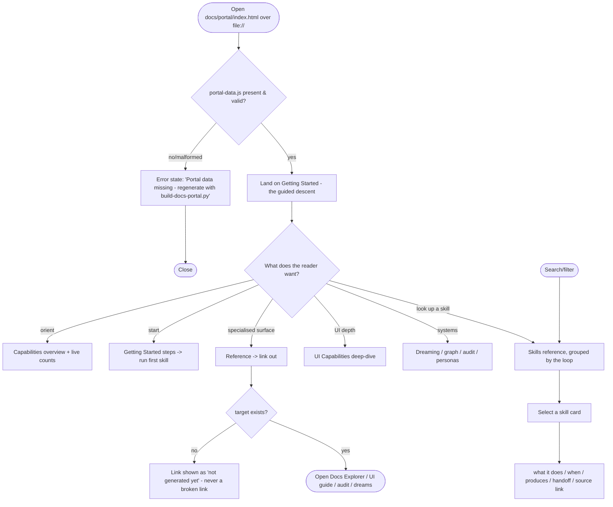

# Spec: Documentation Portal — the derived, self-maintaining front door

- **Status:** Accepted
- **Tier (cost-of-error):** T1 — a documentation surface (no identity/PII/money/irreversible action), but load-bearing for adoption; its dominant risk is *drift*, addressed structurally (it is derived, not authored).
- **Author(s) / date:** Product Strategist + Domain Researcher + UX Researcher/IA (peers), 2026-08-15
- **Supersedes / related:** unifies and fronts the existing scattered surfaces (`web/index.html`, `web/ai-forward-pack-explainer.html`, `docs/index.html` Docs Explorer, `docs/ui-guide.html`) — it links to them, does not replace their specialised jobs.

> **Grounding trace (V15):** `spec-documentation-portal` → `refines` → `architecture` (the pack's overall shape) → `depends-on` → `design-language-docs-explorer` (the `docs/DESIGN.md` token system it reuses) → `relates-to` → `docs-index` (the knowledge graph it surfaces). No prior spec covers a unified doc portal; the closest surfaces are the generated `web/index.html` (search index + explainer) and `docs/index.html` (graph explorer), which are grounded and reconciled below (§ non-goals).

---

## Part A — Functional specification
*Owner: Product Strategist.*

### Problem
The repo now carries a large, growing surface — **21 skills, 23 personas, 33 knowledge docs, 25 templates, 15 scripts**, the dreaming capability, the knowledge graph, the audit system, and seven UI standards — and **there is no single, learnable front door**. A newcomer faces several disconnected surfaces (a search index, a narrative explainer, a graph explorer, a UI how-to) and must *discover* what exists rather than being *guided*. Worse, any hand-authored overview **rots** the moment a skill is added or a count changes — the pack has already fought this exact class (PACK-A, stale counts) across README/OVERVIEW/INSTALL. The underlying problem: **onboarding-scale documentation that stays true as the repo evolves, without a human remembering to update it.**

*This is not a request for more prose to maintain by hand. It is a request for a front door that is a **derived projection** of what the repo actually contains — so it is complete by construction and cannot drift.*

### Target users & personas
- **Primary — the evaluator / newcomer:** just found the repo, wants to understand *what it is, what it can do, and how to start* in minutes, without reading 33 knowledge docs. Success: "I understood the capabilities and ran my first skill within ten minutes."
- **Secondary — the adopter:** deciding whether to install the pack in their own repos; needs the capability map, the getting-started path, and the "what will this cost me to maintain" answer.
- **Secondary — the contributor / returning maintainer:** needs the concrete per-skill reference and the UI-capabilities deep-dive as a lookup, and needs the portal to *stay correct* as they extend the pack.

### Core scenario
A newcomer opens `docs/portal/index.html` over `file://` (no server, no build). A persistent left-nav shows the shape of the whole thing: **Getting Started · Capabilities · The 21 Skills · UI Capabilities · Systems · Reference**. They read a two-minute capabilities overview, follow the explicit **Getting Started** steps to install and run their first skill, then browse the **Skills reference** — every skill, grouped by the natural loop, each with *what it does, when to use it, what it produces, and what it hands off to*. When they want depth on a topic (the UI system, dreaming, the knowledge graph) the portal has an in-depth section and links out to the specialised surface (the Docs Explorer, the UI guide, the audit viewer). Weeks later a contributor adds a skill and runs the sync; the portal **already lists it** — because the portal is regenerated from the pack sources, and CI's drift gate would fail if it hadn't been.

### In scope / Out of scope (explicit non-goals)
- **In:** a single self-contained interactive HTML portal (`docs/portal/index.html`) with: a **capabilities overview**; an explicit **Getting Started** guide; **concrete reference for all 21 skills** (grouped by the loop, each derived from its `SKILL.md`); an **in-depth UI-capabilities** section (the seven UI standards, the archetype system, the craft/detection/visual-assets pipeline, where each artifact lands); a **Systems** section (knowledge graph, dreaming, audit, personas); and a **Reference** section (live counts, links to the specialised surfaces). A **generator** that derives the portal from pack sources; wiring into `sync-pack.ps1`; a **drift gate** in `check-consistency.py`; and a governing **directive** that makes the keep-current guarantee a rule.
- **Out (non-goals):**
  - **Not** a replacement for the specialised surfaces — the Docs Explorer (graph), the UI guide (UI how-to), the audit viewer, and the dream review view keep their jobs; the portal **links to** them as the front door.
  - **Not** hand-authored prose that must be manually synced — structured content (skills, counts, UI standards) is **pulled from source**; editorial content lives in **committed source files** the generator reads, never inline in the generated HTML.
  - **No** server, build step, framework, or CDN — self-contained, dependency-free, `file://`-openable (V9).
  - **No** new heavy dependency — stdlib Python generator composing the existing `build-web-index.py` pattern.
  - **Not** auto-published to the web — it is a committed local artifact; publishing is a separate concern.

### User stories & acceptance criteria (testable)

**US-1 — As a newcomer, I want one front door that outlines the capabilities and every skill, so I don't have to discover the repo piecemeal.**
- **Given** the portal, **When** I open `docs/portal/index.html`, **Then** the left-nav shows the six sections (Getting Started · Capabilities · Skills · UI Capabilities · Systems · Reference) and the Skills section lists **exactly the number of skills that exist in `pack/commands/`** (currently 21), each with a name, a one-line description, a "when to use it", and its handoff.
- **Given** a skill exists in `pack/commands/<name>/SKILL.md`, **When** the portal is generated, **Then** that skill **appears** in the Skills reference with its description derived from its `SKILL.md` (no skill silently missing).
- **Given** the portal, **When** rendered, **Then** it opens over `file://` with no console error and no network request (self-contained).

**US-2 — As a newcomer, I want an explicit Getting Started guide, so I can install and run my first skill fast.**
- **Given** the Getting Started section, **When** I read it, **Then** it states, in order: what the pack is, the install path (into a new or existing repo), how skills are invoked on each surface (Claude Code / Copilot), and a concrete first task ("run `/collectknowledge` on your domain").
- **Given** the getting-started content, **When** the install path or the entry points change in source, **Then** the section reflects the change on the next generation (it is sourced, not frozen).

**US-3 — As an adopter, I want an in-depth review of the UI capabilities, so I understand what the pack offers for building interfaces.**
- **Given** the UI Capabilities section, **When** I read it, **Then** it covers the seven UI standards (interaction design, craft, archetype grammar + catalog, technical/quantitative, craft-detection, visual-assets, specification layers), the `/ui-design` workflow stages, the archetype→artifact flow, and where each artifact lands — each linking to its source knowledge doc.
- **Given** a UI knowledge doc is added or renamed in `pack/knowledge/`, **When** the portal is generated, **Then** the UI Capabilities section reflects it (derived from the source set, not a frozen list).

**US-4 — As the maintainer, I want the portal to stay true as the repo evolves, so I never ship a stale front door.**
- **Given** any change under `pack/`, **When** `sync-pack.ps1` runs, **Then** the portal is **regenerated** as part of the sync (same as the other mirrors).
- **Given** the committed portal, **When** the drift gate runs (`check-consistency.py`), **Then** it **regenerates the portal into a temp location and asserts byte-identical output**; if the committed portal is stale, the gate **fails** (the FR-048 deterministic-stamp discipline).
- **Given** a skill is added but the portal was not regenerated, **When** CI runs, **Then** the drift gate **fails** with a message naming the missing skill (a stale portal cannot merge).
- **Given** the generator runs twice over identical sources, **When** the outputs are compared, **Then** they are **byte-identical** (deterministic — no wall-clock in the output).

**US-5 — As a contributor, I want the portal to link out to the specialised surfaces rather than duplicate them, so there is one front door and no divergent copies.**
- **Given** the Reference section, **When** I read it, **Then** it links to the Docs Explorer (`docs/index.html`), the UI guide (`docs/ui-guide.html`), the audit viewer (`docs/audit/index.html`), the dream review (`docs/dreams/`), and the whole-pack index (`web/index.html`) — with a one-line "what each is for".
- **Given** a specialised surface exists at its path, **When** the portal links to it, **Then** the link is relative and resolves over `file://`.

### Non-functional requirements (ISO/IEC 25010 checklist)
| Attribute | Requirement (measurable) |
|---|---|
| Performance efficiency | The portal parses + first-renders in ≤ 2s for the current content; section navigation is ≤ 100ms; the generated data payload stays lean (a per-item text cap, like `build-web-index.py`). |
| Reliability | Generation is **deterministic** (byte-identical over identical sources — no wall-clock, `SOURCE_DATE_EPOCH`/newest-mtime stamp); a missing optional source degrades to a defined "section coming soon" rather than a crash. |
| Security | No secrets/PII in the portal (it derives from public pack sources; run the same discipline as the other generators). No remote runtime, no CDN — no third-party trust boundary. |
| Usability | The portal is operable over `file://`; every section reachable in ≤1 click from the persistent nav; readable at density with a strong reading hierarchy. |
| Compatibility | Self-contained HTML + `portal-data.js`; dependency-free browser DOM; works under any static host or `file://`. |
| Maintainability | The generator is one stdlib script composing the existing `build-web-index.py` scan; editorial content is committed markdown; **no hand-authored content in the generated HTML**. |
| Portability | Committed local artifact; deploys with the repo; regenerates via `sync-pack.ps1` on any machine. |

### Boundary set
A newly added skill · a removed skill · a renamed knowledge doc · a skill whose `SKILL.md` lacks a parseable description · an editorial source file that is missing · the portal opened over `file://` vs. a static host · the generator run twice (determinism) · a count that changed · a specialised surface that does not exist yet (link target missing) · a very long skill description (overflow) · zero editorial content for a section.

### Comparables & user evidence (sourced)
| Claim | Source | Confidence |
|---|---|---|
| Docs-as-code + generated-from-source is the anti-drift norm (living documentation) | `knowledge-visualization.md` §0 (docs-as-code); the pack's own `build-web-index.py` wired into sync | [Verified] |
| A deterministic build stamp is required or the drift gate cannot cover the artifact | `build-web-index.py` `_stable_stamp()` (FR-048) | [Verified] |
| Stale hand-authored counts are a recurring, controlled defect class in this repo | PACK-A / the `check-consistency.py` count gate | [Verified] |
| Good developer-docs portals lead with a capabilities overview + getting-started + a per-feature reference + search (Stripe, Vercel, the "Diátaxis" tutorial/how-to/reference/explanation split) | industry docs practice (Diátaxis; Stripe/Vercel docs) | [Inferred] |
| The repo already has a self-contained, `file://`-safe knowledge-surface pattern to reuse | `docs/index.html`, `web/index.html`, `docs/DESIGN.md` | [Verified] |

### Applicable governance lenses
- [x] Quality attributes / NFRs — above.
- [ ] Threat model (STRIDE) — N/A: no identity/PII/money/irreversible action; a read-only derived local artifact.
- [x] Privacy & data governance — derives from public pack sources only; no personal data.
- [x] Accessibility — the portal meets WCAG 2.2 AA (Part C); it is a primary reading surface, so this is load-bearing.
- [x] Performance budget — parse+render ≤ 2s; nav ≤ 100ms.
- [x] Release / rollback / migration — the portal is regenerated, never hand-migrated; a bad generation is reverted by re-running the generator; committed alongside its source.
- [x] Observability — the drift gate is the "is it stale?" signal; the generator prints what it emitted (counts) like `build-web-index.py`.

### AI-integrated allocation (LOA)
**N/A** — the portal contains no model call; it is a deterministic derived projection of committed sources. (The pack it documents is AI-forward; the documentation of it is not.)

### Conceptual domain model (DDD)
*Bounded context: **Documentation**. Ubiquitous language: portal, section, skill-doc, capability group, editorial section, derived projection, drift gate.*

**Entities vs value objects**
- **SkillDoc** — *value object*, derived from one `pack/commands/<name>/SKILL.md`: `name`, `group` (loop position), `description`, `when-to-use`, `spine/authority`, `produces`, `handoff`. Identified by skill name; recomputed on generation, never hand-edited.
- **CapabilityGroup** — *value object*: a named grouping of skills by the loop (Collect → Specify → Architect → Design → Build → Document; plus lifecycle/utility/UI groups). Order is data.
- **EditorialSection** — *value object*: a committed markdown source (e.g. getting-started, capabilities-overview) the generator inlines. Identified by section id.
- **PortalSection** — *value object*: a nav section (id, title, order, kind = derived | editorial | link-out).
- **Portal** — *entity/aggregate root*: the whole generated site (`index.html` + `portal-data.js`).

**Aggregate & the one invariant it protects**
- **Portal** (root: Portal) — *invariant:* **the rendered portal is a pure, deterministic function of committed pack sources** (the `SKILL.md` set + the knowledge-doc set + the filesystem counts + the committed editorial markdown). No content appears in the generated HTML that is not traceable to a committed source, and a regeneration over identical sources is **byte-identical**. *This invariant is what makes "always up to date" enforceable:* the drift gate can assert it, so a stale portal is a failing build, not a matter of discipline.

*Grain: one card in the Skills reference is exactly one deployed skill (`pack/commands/*/SKILL.md`). Derive-don't-store: counts are computed from the filesystem at generation, never hard-coded (the PACK-A control).*

---

## Part B — UX specification
*Owner: UX Researcher / IA. Present — the portal is the primary user-facing surface.*

### Personas & jobs-to-be-done (deepened)
- **The evaluator** arrives cold and wants a *guided descent* from "what is this" → "what can it do" → "how do I start", never a wall of 33 docs. Their job is *orient-and-start*, so the IA must lead (getting-started and a capabilities overview are the first two sections), and depth must be *available but not mandatory* (progressive disclosure).
- **The adopter** wants the *capability map + the maintenance answer* — they read Capabilities and UI Capabilities and the Reference (counts, links), and decide.
- **The contributor** treats it as a *reference lookup* — they jump straight to a skill or the UI section via nav or search.

### Information architecture
- **Nine top-level sections** (the unified IA — the front door to *everything*), in reading order: **1 Getting Started** (editorial), **2 Capabilities** (editorial + derived counts), **3 The Skills** (derived; grouped by the loop), **4 Foundations** (derived from `pack/knowledge/*.md` — the reasoning constitution, engineering guidance incl. LOA architecture guidance, and the coding-style guides — grouped), **5 UI & Design** (the seven UI standards + the UX/UI examples from `docs/mockups/` + the design language), **6 Architecture** (derived — the architecture of record, ADRs, specs, and component designs), **7 Systems** (dreaming, knowledge graph, audit, personas), **8 Graph** (an embedded, dependency-free view of the knowledge graph derived from `docs/docs-index.js`, with a link to the fuller Docs Explorer and a note on the Obsidian vault), **9 Reference** (live counts + the lens principle + link-outs to the specialised surfaces).
  - **The lens principle (precision):** the portal is the *high-level, user-facing* layer. Foundations / UI / Architecture **list and link** the structured artifacts with *derived summaries*; the artifacts stay structured where they live. The core knowledge is never flattened into the portal.
  - **Graph view — feasibility (the Obsidian question):** Obsidian's own hosted web graph (**Obsidian Publish**) is a *paid* service and cannot be embedded for free, so the portal ships a **dependency-free equivalent**: a type-clustered SVG graph rendered from `docs/docs-index.js` (node select → neighbours + summary; type legend; an accessible node list), composing with the existing Docs Explorer and with the local Obsidian vault (`docs/` is a valid vault per `obsidian-lens.md`).
- **Within Skills:** grouped by **capability group** (the loop order), each group a labelled band; each skill a card (name · description · when-to-use · produces · handoff · link to its `SKILL.md`).
- **Persistent left-nav** with the six sections and (within a long section) on-page anchors; a **search/filter** over skills and sections; a **theme** control (reuse DESIGN.md modes).
- **Labels** feed the glossary (S10): "skill", "capability group", "knowledge surface", "derived artifact".

### User flows (happy + alternate + error + recovery)

### Wireframe-level structure (Skeleton)
- **Top bar:** portal title · live "what this is" one-liner · search box · theme control.
- **Left rail (persistent):** the six sections; the active section highlighted; within Skills, the capability-group anchors.
- **Content pane (focal):** the active section. Getting Started = numbered steps. Capabilities = a capability grid + counts. Skills = grouped cards. UI Capabilities = the standards stack + the /ui-design stages + the archetype→artifact flow. Systems = per-system explainer + link-out. Reference = counts table + surface link-outs.
- **Empty/error:** if `portal-data.js` is missing/malformed, a defined error card with the regenerate command (no blank screen).

### UX acceptance criteria (falsifiable)
- From opening the portal, a reader reaches the Getting Started steps and any skill's card in **≤2 clicks**.
- **Every** flow branch has a defined state: valid portal, missing/malformed data, a link-out whose target does not exist (shown as "not generated yet", never a broken link).
- The Skills section shows **every** skill and no phantom skills (count matches `pack/commands/`).
- Search/filter narrows skills and sections; clearing it restores the full set (no lost content).
- The nav reflects the reader's position (the active section is indicated).

---

## Part C — UI specification
*Owner: UX & Accessibility. Present — visual HTML surface; gated behind the settled Part B. The polished visual design is produced by `/ui-design`; this is the intent + falsifiable criteria.*

### UI Archetype Signature (the determinism selector)
- **Archetype:** **Documentation Portal** — a reading-first knowledge surface with a persistent sidebar nav + a scrollable content pane + search (catalog **F1 Content Portal**, adapted to a docs portal — a "HolyGrail/HubAndSpoke" reading layout, *not* the graph-first Docs Explorer and *not* a dashboard).
- **Signature:** `DocsPortal { Type:Portal; Arch:SPA; Layout:HolyGrail; Density:Comfortable; Nav:Sidebar+TopBar+Search; Viewport:FluidResponsive; Input:KeyboardFirst+PrecisionPointer+TouchPrimary; Color:DarkAdaptive; x-TypeStyle:EditorialTechnical; Depth:SoftShadow; Sync:Stateless; Persistence:Session; Feedback:Instant; Motion:Micro; Pacing:Freeform; Transition:HardCut; A11y:WCAG_2.2_AA+ReducedMotion+HighLegibility; x-KnowledgeSurface:DerivedHtml; }`
- **Selection:** **auto-selected from the JTBD** — the dominant job is *orient-and-read* over structured, sectioned content with lookup, which maps to a documentation Content Portal (persistent nav + reading pane + search), not a dashboard (parallel monitoring), a review queue (serial decision), or a form wizard (guided entry). Rationale surfaced in the summary.

### Medium(s) & platform guidelines
- **Web, self-contained HTML, `file://`-openable** — the pack's derived-knowledge-surface family. Dependency-free browser DOM (V9). Reading-optimised (measure, hierarchy, scan patterns).

### Visual intent & tokens
- **Reuse `docs/DESIGN.md`** (the Docs Explorer design language) as the concrete Surface token system — it is the accessibility-audited knowledge-surface language this portal belongs to (`{colors.*}`, `{typography.*}`, `{spacing.scale}`, `{motion.*}`, `{focus.*}`, `{targets.minimum}`). No arbitrary values (U3/U20). The portal is registered as another **derived knowledge surface**.
- **Experience qualities:** *inviting, not marketing-hype · authoritative, not dense · guided, not hand-holding.* A newcomer should feel oriented and confident, an expert should feel it respects their time.

### Key screens & complete component states
- **Portal shell** (nav + content), **skill card**, **capability grid**, **getting-started steps**, **UI-capabilities stack**, **reference table** — each with the full state set: default / hover / focus / active / disabled / **loading (skeleton while portal-data.js parses)** / **empty (a section with no content yet — "coming soon", not blank)** / **error ("Portal data missing or malformed — regenerate")** / success / **overflow (a very long skill description, a group with 8 skills, a long counts table)**.
- **One defended focal point:** the active content section (the thing being read).

### Motion, copy, accessibility & performance
- **Motion:** `{motion.fast}` for nav selection + section reveal only; reduced-motion → instant (U10). No layout shift on nav (U17).
- **Copy (real, in-voice):** section titles say what they are; the getting-started steps are imperative and concrete; the empty state teaches ("this section is generated from `pack/…` — add content there"); a missing link-out reads "not generated yet" with the command to produce it.
- **Accessibility (WCAG 2.2 AA, U16):** contrast from the audited tokens; the nav and search fully keyboard-operable with a visible focus ring; a skip-to-content link; headings form a correct outline (a screen-reader can navigate the sections); nothing conveyed by colour alone; targets ≥ `{targets.minimum}`.
- **Performance:** parse + first render ≤ 2s; nav feedback ≤ 100ms; the payload stays lean (per-item text cap).

### AI-UX
**N/A** — the portal contains no model-generated content; it is a deterministic derived surface. (It *documents* AI capabilities; it does not front a model.)

### UI acceptance criteria (falsifiable)
- Every text/surface pairing meets **AA** (from the DESIGN.md audit; any new pairing audited in the mockup).
- The **empty**, **loading**, **error**, and **overflow** states each render a defined view (no blank screen).
- The nav is **keyboard-operable** with a visible focus ring and a working skip-to-content link.
- Decision/position state (active section) is conveyed by **more than colour** (weight + indicator).
- The portal **loads no remote resource** and throws no console error over `file://`.
- Reduced-motion shows no animation; no layout shift on section change.

---

## Flagged risks & residual unknowns
- **[Flagged] Editorial content freshness.** Structured content can't drift (derived), but the *editorial* sections (getting-started narrative, capability framing) are human-written source and could go stale in *substance* even while the drift gate confirms they were regenerated. *Next probe:* keep editorial sources small and principle-level (not detail that changes often); give them a `review-by` so the freshness gate flags them like any knowledge doc.
- **[Flagged] Surface proliferation.** The portal is a *sixth* HTML surface. The mitigation is that it is the **front door that links to the other five** (and the others keep their specialised jobs) — but the Simplifier's standing concern is that we must not grow a seventh. *Next probe:* the Reference section explicitly maps "which surface for which job" so the set stays legible.
- **[Flagged] Skill-description parsing.** A `SKILL.md` with an unusual heading shape could parse an empty description. *Next probe:* the generator falls back to the Copilot prompt `description:` frontmatter, then to "(no description)", and the drift gate/`check-consistency` flags any skill with no description.

## Gate record
Adversarial review ran bottom-up (S2). **Simplifier** (soft veto): challenged "a sixth surface" → resolved by making the portal the *front door that links out*, not a duplicate, and by deriving it so it costs nothing to maintain (cleared). **Test Architect** (hard veto): required every US criterion be falsifiable and the drift/determinism guarantees be testable → US-1..5 rewritten with observable outcomes incl. byte-identical regeneration and count-match (cleared). **Data & Persistence Architect**: required the conceptual model + the "derived pure function" invariant that makes the drift gate possible → Part A model added (cleared). **UX Researcher/IA** (UX-spec veto): required the guided-descent IA, all flow branches (missing data, missing link-out), and ≤2-click reachability → Part B (cleared). **UX & Accessibility** (UI veto): required complete states, AA, keyboard nav + skip link, no-colour-alone, no-remote-resource → Part C (cleared). Authors did not clear their own hard vetoes.

`GATE specify · 2026-08-15 · Product Strategist, Domain Researcher, UX Researcher/IA, UX&Accessibility, Data&Persistence, Simplifier, Test Architect · criteria met: 3 layers + conceptual model + falsifiable criteria (incl. drift/determinism) + governance lenses walked · verdict: PASS · vetoes→resolution: all resolved as recorded`

---
**Handoff:** → `/ui-design` (the portal experience) → `/implement` (the generator + template + the keep-current directive + drift gate).
