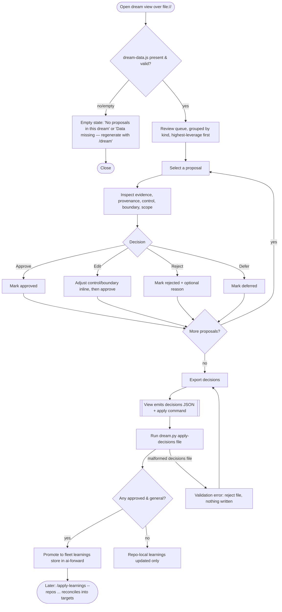

# Spec: Dreaming — continuous-improvement consolidation, review & federation

- **Status:** Accepted
- **Tier (cost-of-error):** T2 — writes to always-loaded directives and pushes changes across repos (the identity of a codebase's rules); a bad promotion corrupts every future session. Human review is mandatory.
- **Author(s) / date:** Product Strategist + Domain Researcher + Data & Persistence Architect (peers), 2026-08-15
- **Supersedes / related:** grounds on `docs/knowledge/continuous-improvement-and-dreaming/`; extends `continuous-improvement.md` (CI1–CI12) and `audit-and-change-log.md` (AL/CL); does not supersede them.

> **Grounding trace (V15):** `spec-dreaming` → `implements` → `kb-continuous-improvement-and-dreaming` (the evidence base, 8 findings) → `relates-to` → `defect-classes` (the register the dream pass proposes into) + `audit-log` (the corpus it reads). No conflicting prior spec exists (`docs/specs/` was empty). The knowledge base's design implications (§"one capability with two faces") are the authoritative input.

---

## Part A — Functional specification
*Owner: Product Strategist. What the capability must do and why.*

### Problem
Learnings, mistakes, patterns and anti-patterns are produced continuously across a fleet of local repositories, and today they **evaporate or stay siloed**. AI-Forward already *captures* them well (the audit/change logs, the defect-class register, the knowledge graph) and reads them *at grounding* — but it **consolidates one defect at a time** (CI2, in the moment a human notices) and **never shares across repos**. Three specific losses follow: (1) cross-cutting classes that are only visible in aggregate are never seen; (2) triggered `assume:`/`simplify:` markers and successful mitigations nobody re-read are wasted; (3) a mistake solved in repo A is re-made in repos B–Z. The underlying problem is a **missing offline consolidation pass** and a **missing federation mechanism** — the "asleep half" the evidence base identified.

*This is not a request for a memory database or a model fine-tune (both explicitly out — see non-goals). It is a request to complete a loop the pack half-built, over artifacts that already exist.*

### Target users & personas
- **Primary — the maintainer / fleet owner** (`@timianmalloo`): runs many local repos with the pack installed; wants each repo to get better every day and a mistake learned once to protect all repos. Reviews and approves what gets promoted; never wants an agent silently editing the rules.
- **Secondary — a coding agent (Claude Code / Copilot) at grounding:** reads the promoted fleet learnings so a known class is designed out rather than rediscovered (CI5).
- **Secondary — a scheduled runner** (claude-cowork / OpenClaw / cron / GitHub Action): executes the dream job unattended and leaves a review artifact for the human.

### Core scenario
Overnight, the **dream job** runs in each local repo. In `ai-forward`, it reads the last N days of `audit-log.jsonl`, `change-log.jsonl`, the `defect-classes.md` register, captured **mitigation records**, and triggered `assume:`/`simplify:` markers. It runs `light → REM → deep`: it stages and dedupes the raw signals, reflects them into recurring **candidate classes**, scores each, and drops anything untrusted or below threshold. It writes a **dream** — a set of **proposals** (new/updated defect classes with named controls, register de-duplications, doc updates, and *confirmed successful mitigations* promoted to reusable learnings) — and renders an **HTML review view**. In the morning the maintainer opens the view, sees each proposal with its evidence, provenance and confidence, and **approves / edits / rejects** each; the view exports the decisions. Approved, *generalised* learnings land in the **fleet learnings store** in `ai-forward`. Later the maintainer runs **`/apply-learnings`**, which pushes the approved learnings to chosen repos — **reconciling** each against that repo's existing directives and register so nothing is duplicated or contradicted — or a repo simply inherits them next time it runs `/updatepack`.

### In scope / Out of scope (explicit non-goals)
- **In:** a `/dream` consolidation skill; a schedulable `dream` job; the `light/REM/deep` deterministic-first pipeline over the committed corpus; the **HTML review/approval view** (the primary human surface); the **promotion oracle** (capture of successful mitigations + human validations); the **safe instance→class abstraction** procedure; the **fleet learnings store** in `ai-forward`; the **`/apply-learnings`** push skill with per-repo reconciliation; the `/updatepack` inheritance path for general classes.
- **Out (non-goals):**
  - **No vector database, no runtime memory service, no model fine-tune.** The store is committed Markdown/JSONL (adopt the dreaming *shape*, reject the vendor *substrate* — knowledge base finding #6).
  - **No auto-merge.** Nothing lands in a durable store or a target repo without human approval (BoK D3). The dream job *proposes*; the human *disposes*.
  - **No mutation of source-of-truth logs.** `audit-log.jsonl` / `change-log.jsonl` stay append-only; a dream reads them and writes elsewhere.
  - **No cross-repo sharing of raw instances.** Only abstracted, scrubbed classes cross a repo boundary.
  - **No new heavy dependency.** Stdlib Python + the runner's model call (the same identity decision made for the CLI/doctor in `kb-pack-evolution`).
  - **No autonomous execution of pushed changes** in target repos — `/apply-learnings` produces reviewable diffs/branches, not merges.

### User stories & acceptance criteria (testable)

**US-1 — As the maintainer, I want a dream pass to consolidate my repo's corpus into a few high-signal proposals, so I stop re-deriving the same lessons.**
- **Given** an `audit-log.jsonl` + `change-log.jsonl` + `defect-classes.md` + captured mitigations exist, **When** I run `/dream` (or the job runs), **Then** a `dream` artifact is written with ≥0 proposals, each carrying `kind`, `evidence[]` (source ids), `confidence`, and a proposed `control`, and an HTML review view is rendered.
- **Given** the corpus is empty or unchanged since the last dream, **When** the pass runs, **Then** it produces a **valid empty dream** ("nothing to consolidate") and says so in the view — never a crash and never a fabricated proposal.
- **Given** a candidate derives from an `origin: untrusted`/`system`/tool-authored signal or one containing a secret/PII, **When** the deep phase scores candidates, **Then** that candidate is **structurally excluded** before consolidation (not merely low-scored), and the exclusion is logged.

**US-2 — As the maintainer, I want to review proposals in an HTML view and approve/reject each, so nothing changes my rules without my consent.**
- **Given** a rendered dream view, **When** I open it over `file://`, **Then** each proposal shows its evidence, provenance (`Source: <file>#Lx-Ly` or `al-`/`cl-` id), confidence label, and proposed control, and offers **Approve / Edit / Reject / Defer**.
- **Given** I have marked decisions, **When** I choose "export decisions", **Then** the view emits a **decisions artifact** (copyable JSON / a `dream.py apply-decisions` command) — because a `file://` page cannot write to disk, the export path is the contract, not a silent save.
- **Given** I approve nothing, **When** I export, **Then** no durable store is modified (the null path is safe).

**US-3 — As the maintainer, I want successful mitigations captured automatically, so the oracle learns what *worked*, not only what broke.**
- **Given** a defect is fixed under `/implement` or `/investigate` with a test that was **observed failing before the fix and passing after** (red→green), **When** the fix is verified, **Then** a **mitigation record** is appended (`kind: mitigation`, linking the error/defect-class, the change, and the red→green evidence).
- **Given** the agent asks me to validate a change and I approve it, **When** I confirm, **Then** a mitigation record is captured with `oracle: human-validated`.
- **Given** a fix with **no** red-observed test and **no** human validation, **When** it completes, **Then** its outcome is recorded as `unverified` and is **not** treated by the dream pass as a successful mitigation (an optimistic self-report is not an oracle).

**US-4 — As the maintainer, I want approved learnings abstracted to safe, general classes before they leave a repo, so I never leak specifics or promote a false universal.**
- **Given** an approved instance-level learning, **When** it is promoted toward the fleet store, **Then** the **abstraction procedure** runs: specifics stripped (path/name/line/value/PII via `scrub.py`), the class stated as a signature + "why it survives" + a named control, a **boundary statement** (where it applies and where it does not), and a link back to its scrubbed instances.
- **Given** a candidate class with only **one** repo-specific instance and no clearly general mechanism, **When** abstraction runs, **Then** it is held as a **repo-local** learning (not federated) until it recurs or a human explicitly blesses it as general.
- **Given** an abstracted class whose control cannot be stated as a falsifiable check, **When** the gate reviews it, **Then** it is **rejected** ("a lesson recorded as prose is a memoir" — CI6): no un-testable "always do X" universals.

**US-5 — As the maintainer, I want to push approved learnings to specific or all local repos, reconciled with each repo's existing knowledge.**
- **Given** approved fleet learnings and a target repo list, **When** I run `/apply-learnings --repos <a,b,…|all>`, **Then** for each repo it produces a **reviewable diff/branch** (never a merge) adding the class + control to that repo's register/knowledge.
- **Given** a target repo already has an equivalent class, **When** reconciliation runs, **Then** the incoming learning is **merged into the existing entry** (append instance, upgrade control) — not duplicated (no "one quantity, two homes").
- **Given** an incoming learning **contradicts** a target repo's existing directive, **When** reconciliation runs, **Then** the conflict is **surfaced** in that repo's diff for human resolution — never silently overridden.
- **Given** a general, control-bearing class in the fleet store, **When** a repo runs `/updatepack`, **Then** it inherits the class through the normal deployment map (the second, pull-based federation path).

**US-6 — As a coding agent at grounding, I want to read the promoted fleet learnings, so a known class is designed out rather than rediscovered.**
- **Given** promoted classes exist in a repo, **When** a skill grounds (Rigor Stage 0), **Then** the fleet learnings are readable in the same place the local register is (CI5) and are cited in the grounding trace.

### Non-functional requirements (ISO/IEC 25010 checklist)
| Attribute | Requirement (measurable) |
|---|---|
| Performance efficiency | A dream pass over a bounded window (≤ the corpus slice; model call ≤ once per phase) completes in ≤ a few minutes on a typical repo; the deterministic stage/score/taint steps are O(entries) stdlib and need no model. Model spend is throttled (LOA 2.4) and the input window is capped. |
| Reliability | The pass is idempotent over a fixed corpus snapshot (same inputs → same candidates, modulo the one model step); a failed model call falls back to deterministic-only proposals; an empty/malformed corpus yields a valid empty dream, never a crash. |
| Security | No secret/PII enters a dream, the view, the fleet store, or a cross-repo push (`scrub.py` + taint gate; AL4). The push produces diffs, never merges; nothing is executed in a target repo. |
| Usability | The review view is operable over `file://` with no server and no build; every proposal is approvable in ≤1 interaction; the decision export is one action. |
| Compatibility | Committed Markdown/JSONL + stdlib Python; runs under Claude Code, Copilot, claude-cowork, OpenClaw, cron, or a GitHub Action. The view is dependency-free browser DOM. |
| Maintainability | The mechanics ship as one stdlib script bundle (`dream.py`) composing existing scripts (`audit-log.py`, `docs-graph.py`, `scrub.py`); skills are Markdown; no parallel logic. |
| Portability | The fleet store is plain files in `ai-forward`; general classes distribute via the existing deployment map / `/updatepack`; the push skill is path-based. |

### Boundary set
Empty corpus · single-entry corpus · corpus with only failed/blocked outcomes · a candidate with no provenance · a candidate carrying a secret/PII/token · a candidate from a tool-authored/subagent origin · one-instance class vs. recurring class · a class whose control is un-testable · a target repo with the class already present · a target repo whose directive contradicts the incoming class · a target repo without the pack installed · a dream with zero approved proposals · a decisions artifact edited by hand before apply · concurrent dreams across workspaces · a re-run over the same snapshot (must not double-promote).

### Comparables & user evidence (sourced)
| Claim | Source | Confidence |
|---|---|---|
| Offline reviewable consolidation producing a *new*, discardable output is the shipping pattern | Claude Dreams platform docs | [Verified] |
| light/REM/deep phases, only deep promotes, threshold + taint gates, Dream Diary, nightly cron | OpenClaw `memory-core` docs | [Verified] |
| A red→green test is the trustworthy oracle for "the fix worked" (Evaluator) | Reflexion (arXiv:2303.11366) | [Verified] |
| Never auto-approve agent edits to steering/rules — review via PR; cross-project via a shared store | self-improving AGENTS.md practice | [Verified] |
| Capture is worthless without dissemination + application (federation lifecycle) | NASA APPEL Collect→Record→Disseminate→Apply | [Verified] |
| The pack already holds every guardrail (append-only, human-gated, provenance, taint, recurrence-as-metric) | `continuous-improvement.md`, `audit-and-change-log.md` | [Verified] |

### Applicable governance lenses
- [x] Quality attributes / NFRs — above.
- [x] Threat model (STRIDE) — the push skill crosses repo trust boundaries; the corpus may contain secrets/PII. **Tampering:** a hand-edited decisions artifact must be validated before apply. **Information disclosure:** taint gate + scrub before the fleet store and before any push. **Elevation:** a pushed directive changes a repo's always-loaded rules → human diff review, never merge. (Security & Identity convened as peer.)
- [x] Privacy & data governance — abstraction strips specifics; nothing personal crosses a repo boundary (Privacy veto on federation).
- [x] Accessibility — the review view meets WCAG 2.2 AA (Part C).
- [x] Performance budget — bounded window + throttled model call.
- [x] Release / rollback / migration — the fleet store is append-only and versioned; a bad promotion is reverted by not applying it / reverting the diff; the store never mutates logs.
- [x] Observability — each dream writes a **Dream Diary** entry (what it added/merged/superseded) and an audit-log entry; the diary is excluded from being re-ingested (no self-poisoning).

### AI-integrated allocation (LOA Part VI)
- **Archetype:** **G · Continuous Sentinel** (ongoing oversight of the corpus against the improvement policy) composing **B · Adversarial Ensemble** for the reflect/abstract step (propose class → Simplifier strikes spurious → human verifies). The review view + push is a **Governor** surface (human-in-the-loop before a consequential action).
- **Tier allocation:** **T0** for the bulk — staging, dedup, scoring, the taint gate, reconciliation, rendering (deterministic stdlib over JSONL/Markdown). **T3** for exactly one step per phase: the REM reflection / instance→class abstraction (a model call, throttled, bounded window). **Human gate** is the verification tier (P5/P6). Determinism at the floor (P2): the model never scores, never gates, never writes durable memory — it only *proposes* abstractions a human accepts.

### Conceptual domain model (DDD — settled before UX/UI)
*Bounded contexts: **Consolidation** (corpus → proposals), **Governance** (proposals → approvals), **Federation** (approved learnings → fleet store → target repos). Ubiquitous language is the glossary in `docs/knowledge/continuous-improvement-and-dreaming/glossary.md` — reuse those exact terms in code and docs.*

**Ubiquitous language (the load-bearing terms):** dream (pass), signal/observation, candidate, learning (= a promoted defect class or improvement), control, mitigation record, oracle, proposal, approval, promotion, fleet learnings store, distribution/push, reconciliation.

**Entities vs value objects**
- **Signal / Observation** — *value object*. An immutable fact drawn from the corpus (an audit entry, a change entry, a mitigation record, a triggered marker). Identified by its source id (`al-`/`cl-`/marker `file#Lx-Ly`); carries `origin`, `outcome`, `timestamp`. Compared by value; never mutated.
- **Candidate** — *value object* within a Dream. A staged, scored, not-yet-promoted learning with its provenance signals, score, and taint status.
- **Dream** — *entity/aggregate root*. Identified by `drm-NNNN`. Immutable once produced (reproducibility). Contains its candidates and proposals.
- **Proposal** — *value object* within a Dream. A suggested change (new class / control upgrade / dedup / doc edit / mitigation-promotion) with evidence, confidence, and the proposed control.
- **Learning** — *entity/aggregate root*. The durable promoted unit; identity is a stable kebab **class slug**. Carries signature, "why it survives", boundary statement, ≥1 named control, confidence, and links to its scrubbed instances.
- **Control** — *value object* attached to a Learning (test / gate / lint / always-loaded instruction), with its ladder rung and location.
- **MitigationRecord** — *entity/aggregate root* (oracle evidence). Identity `mit-NNNN`. Links the error/defect-class, the change (git before/after), and the verification (red→green test ids, or `human-validated`).
- **DistributionPlan** — *entity/aggregate root*, one per target repo per push. Contains the reconciled per-learning actions (add / merge / conflict).

**Aggregates & the one invariant each protects**
- **Dream** (root: Dream) — *invariant:* every proposal traces to a signal in the dream's declared corpus snapshot + input window; a dream is immutable once written (so its HTML view and its proposals never disagree, and a re-run is reproducible).
- **Learning** (root: Learning) — *invariant:* a promoted Learning has **≥1 falsifiable named control** and a confidence label; its class slug is unique in its store (no "one quantity, two homes" — a second occurrence appends an instance, never a new Learning).
- **MitigationRecord** (root) — *invariant:* a captured *successful* mitigation has a **verification** that is either a red-observed→green test pair or an explicit human validation; a fix without either is `unverified` and is **not** a successful mitigation.
- **DistributionPlan** (root: per target repo) — *invariant:* every applied learning was **reconciled** against the target's existing register/directives — the plan records add / merge-into-existing / surfaced-conflict for each, and never a silent duplicate or override.

*Durable representation, grain, additivity, and history rules are `/define-architecture`'s and `/design`'s decisions — noted here only that the logs are append-only facts and the Learning store is a slug-keyed dimension whose instances are append-only facts (consistent with `domain-and-data-modelling.md`).*

---

## Part B — UX specification
*Owner: UX Researcher / IA. Present — the dream review view is a user-facing surface. This layer gates Part C.*

### Personas & jobs-to-be-done (deepened)
- **The reviewing maintainer** arrives (often in the morning, possibly across several repos) wanting to **triage a queue of proposed improvements fast and safely**: understand each proposal's *evidence* and *blast radius*, approve the good ones, reject noise, and never accidentally promote something wrong. Success from their side: "I cleared the queue in a few minutes, I trust what I approved, and I know exactly what will change where."
- The job is **review-and-decide**, not authoring — a *serial, one-item-at-a-time* triage, not a dashboard to browse. This shapes the archetype (reading is parallel; *deciding* is serial).

### Information architecture
- **Top level:** one Dream = one review session. Header carries the dream id, date, corpus window, and counts (proposed / approved / rejected / deferred).
- **Grouping:** proposals grouped by **kind** — *New class*, *Control upgrade*, *Register dedup*, *Confirmed mitigation → learning*, *Doc/knowledge update* — and within each, ordered by **score/blast-radius** (highest-leverage first, per DX25).
- **Per proposal:** signature/title · evidence list (source ids, each opening the cited line range) · confidence label · proposed control · boundary statement · federation scope (repo-local vs. general) · decision control.
- **Labels** feed the glossary (S10): "learning", "class", "control", "mitigation", "reconciliation".

### User flows (happy + alternate + error + recovery)

### Wireframe-level structure (Skeleton)
- **Header bar** (full width): dream id · date · corpus window · live counts (proposed N · approved N · rejected N · deferred N) · **Export decisions** action (disabled until ≥1 decision).
- **Left rail** (master): filter by kind + by federation scope + by confidence; the grouped, ordered proposal list; each row = title + kind chip + score + decision state.
- **Detail pane** (right, focal): selected proposal — title/signature; evidence list (expandable, each links its source); confidence; proposed control (with ladder rung); boundary statement; federation scope toggle (repo-local ↔ general); **Approve / Edit / Reject / Defer**.
- **Footer/export drawer:** the emitted decisions JSON + the exact `apply-decisions` command to copy; a "copy" action.
- **Empty state** replaces the master/detail when the dream has no proposals.

### UX acceptance criteria (falsifiable)
- The reviewer can go from opening the view to a decision on the first proposal in **≤2 interactions** (select → decide).
- **Every** flow branch has a specified state: valid dream, empty dream, missing/malformed data, malformed decisions file — each renders a defined, humane view (no blank screen, no crash).
- The **highest-leverage proposal is first** in its group (ordered by score/blast-radius).
- No decision is lost on re-open within a session (decisions held in the page until exported); the page never *silently* persists to disk (export is explicit).
- Every proposal exposes its **provenance** before it can be approved (evidence is not collapsed away by default for the selected item).

---

## Part C — UI specification
*Owner: UX & Accessibility. Present — visual HTML surface; gated behind the settled Part B. Detailed visual design is produced by `/ui-design`; this is the intent + falsifiable criteria.*

### UI Archetype Signature (the determinism selector)
- **Archetype:** **B-series operational · Master-Detail review queue** (a Governor/approval surface; kin to catalog B2 Enterprise Master-Detail, specialised to a review/triage queue). Not a bento dashboard — the job is serial per-item decision.
- **Signature:** `DreamReview { Type:DSS; Arch:SPA; Layout:MasterDetail; Density:Comfortable; Nav:Sidebar+Filter; Viewport:FluidResponsive; Input:KeyboardFirst+PrecisionPointer; Color:DarkAdaptive; x-TypeStyle:Utilitarian; Depth:SoftShadow; Sync:Stateless; Persistence:Session; Feedback:Confirmed+Instant; Motion:Micro; Pacing:UserDriven; Transition:HardCut; A11y:WCAG_2.2_AA+ReducedMotion+HighLegibility; x-KnowledgeSurface:DerivedHtml; }`
- **Selection:** **auto-selected from the JTBD** — the dominant job is *serial review-and-decide over a queue of proposals with rich per-item evidence*, which maps to a Master-Detail review queue (the reviewer needs a scannable list + a deep detail pane + a decision action), not a dashboard (parallel monitoring) or a form wizard (guided entry). Rationale surfaced to the user in the summary.

### Medium(s) & platform guidelines
- **Web, self-contained HTML, opened over `file://`** — the pack's "derived HTML knowledge surface" family (same as the audit viewer and Docs Explorer). No server, no build, no CDN. Dependency-free browser DOM (V9).

### Visual intent & tokens
- **Reuse `docs/DESIGN.md`** (the Docs Explorer design language) as the concrete Surface token system — it is the accessibility-audited knowledge-surface language this view belongs to (`{colors.*}`, `{typography.*}`, `{spacing.scale}`, `{motion.*}`, `{focus.*}`, `{targets.minimum}`). No arbitrary values (U3/U20). The dream view is registered as another **derived knowledge surface** in that family.
- **Experience qualities:** *calm, not sterile · legible-at-density, not cramped · trustworthy, not bureaucratic.* The reviewer must feel in control and never rushed into an approval.

### Key screens & complete component states
- **Review queue (master)**, **proposal detail (detail)**, **export drawer** — each component's full state set: default / hover / focus / active / disabled / **loading (skeleton while dream-data.js parses)** / **empty ("No proposals in this dream")** / **error ("Dream data missing or malformed — regenerate with /dream")** / success (decision recorded) / **overflow (a proposal with 40 evidence items, a very long signature, a class touching many controls)**.
- **One defended focal point:** the selected proposal's detail pane (the thing being decided).

### Motion, copy, accessibility & performance
- **Motion:** `{motion.fast}` selection feedback only; reduced-motion → instant (U10). No layout shift on decision (U17).
- **Copy (real, in-voice):** buttons say what they do (**Approve**, **Reject**, **Defer**, **Export decisions**); the empty state teaches the next action ("No proposals — run `/dream` after more work accumulates"); the error state says what happened and how to recover; the one semi-consequential action names its consequence (Export → "This writes nothing yet; it prepares the decisions for `apply-decisions`.").
- **Accessibility (WCAG 2.2 AA, U16):** contrast from the audited tokens; full keyboard operation of list + decisions; visible focus (`{focus.ring-width}`); decision state never by colour alone (icon + text chip); targets ≥ `{targets.minimum}`.
- **Performance:** parse + first render ≤ 2s for a typical dream; decision feedback ≤ 100ms; the view lists a bounded proposal set (a huge dream is paginated/virtualised).

### AI-UX (Shape-of-AI / HAX)
The proposals are model-*assisted* (the REM abstraction step), so the view is a **Governor + Trust-builder** surface: it shows the **provenance/footprints** of every proposal (source ids, red→green evidence), discloses which proposals came from the model vs. deterministic dedup, requires **verification before the consequential action** (approve), and never presents a proposal as settled — the human is the gate (U13–U15). Applicable HAX: G1 (make clear what it can do), G2 (make clear how well — confidence labels), G11 (explain *why* — evidence), G16 (convey consequences — federation scope + blast radius), G17 (global controls — approve/reject/defer all).

### UI acceptance criteria (falsifiable)
- Every text/surface pairing meets **AA** (verified against `docs/DESIGN.md`'s audit; any new pairing audited in the mockup).
- The **empty**, **loading**, **error**, and **overflow** states each render a defined view (no blank screen).
- A proposal cannot be **approved without its evidence visible** (provenance is not hidden for the selected item).
- Decision state is conveyed by **icon + text**, never colour alone.
- The view **writes nothing to disk**; the only persistence path is the explicit **Export decisions** action (a `file://` page cannot and must not silently save).
- Reduced-motion path shows no animation; no layout shift occurs when a decision is recorded.

---

## Flagged risks & residual unknowns
- **[Flagged] The promotion oracle's coverage.** Red→green test capture is trustworthy but only fires where a test was written; human-validated captures depend on the agent actually asking. Fixes with neither remain `unverified` (correctly not mined). *Next probe:* instrument `/implement` and `/investigate` to emit a mitigation record whenever they observe red→green, and add an explicit "capture this as a mitigation?" step on human validation. Measure the fraction of fixes that produce a record.
- **[Flagged] Instance→class over-generalisation.** The single riskiest model step. Mitigated by the ≥2-instances-or-general-mechanism rule, the boundary statement, the falsifiable-control requirement, the Simplifier's strike, and the human gate — but a plausible false universal could still be *proposed*. It cannot be *promoted* without approval, so the residual risk is reviewer fatigue, not silent corruption. *Next probe:* track approve/reject ratio per proposal kind; a kind with a low approve rate signals a bad abstraction prompt.
- **[Flagged] Reconciliation correctness across heterogeneous repos.** Matching an incoming class to an existing one (merge vs. add) is a similarity judgement; a miss produces a duplicate (caught by dedup next dream) or a missed merge. *Next probe:* reconcile on the stable class slug first (exact), fall back to a flagged "possible duplicate" for human resolution — never an automatic fuzzy merge.
- **[Flagged] Runner API surfaces move** (Claude Dreams is research-preview; claude-cowork/OpenClaw scheduling differ). *Next probe:* spike each runner in `/define-architecture`; ship the deterministic harness + prompts and leave the model call to the runner.

## Gate record
Adversarial review ran bottom-up (S2). **Simplifier** (soft veto): struck an earlier "similarity vector index" idea as out-of-identity scope → reconciliation is slug-exact + human-flagged, no fuzzy index (resolved). **Test Architect** (hard veto on unverifiable criteria): required every promoted control be falsifiable and every US criterion checkable → US-1..6 written with observable outcomes (cleared). **Data & Persistence Architect** (veto on unmodelled concept): required the conceptual model, aggregate invariants, and append-only-facts stance → Part A domain model added (cleared). **UX Researcher/IA** (UX-spec veto): required all flow branches (empty/missing/malformed) and highest-leverage-first ordering → added to Part B (cleared). **UX & Accessibility** (UI veto): required complete states, AA, no-colour-alone, and the file:// no-silent-write contract → Part C criteria (cleared). **Security & Identity** (hard veto, convened — push crosses trust boundaries + corpus may hold secrets): required taint gate + scrub before store/push, diffs-not-merges, and hand-edited-decisions validation → in scope + NFRs (cleared). Authors did not clear their own hard vetoes.

`GATE specify · 2026-08-15 · Product Strategist, Domain Researcher, Data&Persistence, UX Researcher/IA, UX&Accessibility, Security&Identity, Simplifier, Test Architect · criteria met: 3 layers + conceptual model + falsifiable criteria + governance lenses walked · verdict: PASS · vetoes→resolution: all resolved as recorded above`

---
**Handoff:** → `/ui-design` (the dream review view) → `/define-architecture` (the whole capability, phased) → `/implement`.
