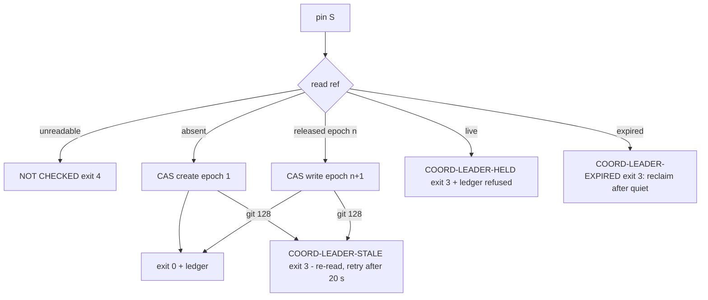
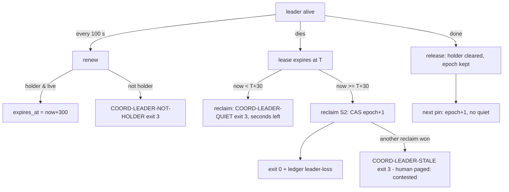
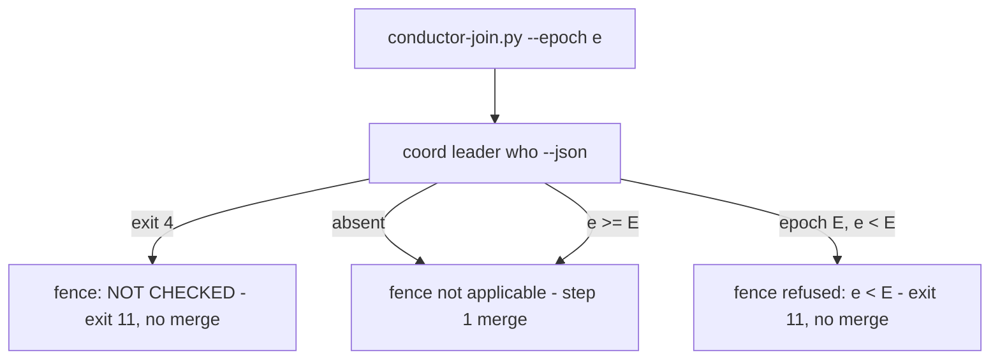

# Spec: Leader designation in a git ref

- **Status:** Draft
- **Tier (cost-of-error):** **T2** — a wrong leader decision is silent (two Coordinators each believe they lead, each joins) and its first visible symptom is a merge that destroys another track's work; the fence at the join is the last control before that.
- **Author(s) / date:** Product Strategist (lead) + Domain Researcher + Data & Persistence Architect + Security & Identity Architect (peers), 2026-09-19. Adversaries at the gate: Test Architect (hard veto), Simplifier (soft veto), Data & Persistence Architect (model veto), Security (hard veto). **Fan-out 0: every persona was enacted inline by the one authoring agent** — see the gate record for what that means for the author-never-clears rule.
- **Supersedes / related:** refines `docs/proposals/owner-coordinator-subagent-coordination.md` §3.3 invariants 1, 2 and 4, §4 "Leader designation", §5.3 S3 steps 2 and 6, build-plan row P2, decisions D2, D3, D13; carries out the decision note `note-20260919-leadership-in-a-ref-not-the-ledger` (promote it to an ADR when this spec is accepted, as the note asks). Sibling of `spec-agent-coordination` (the layer this sits in).

> **Grounding trace (V15):** `spec-leader-designation` → `refines` → `proposal-owner-coordinator-subagent-coordination` (§3.3, §4, §5.3, P2, D2/D3/D13) → `relates-to` → `note-20260919-leadership-in-a-ref-not-the-ledger` (the call and the three spikes) → `depends-on` → `adr-0007-coordination-substrate` (append-only JSONL per session, `merge=union`, no daemon) → `relates-to` → `kb-multi-agent-coordination-data` ("Executed spikes" SPK-1..3; "Practitioner constants"; "Invariants" 1–4, 7). Code read, not recalled: `pack/scripts/coord-core.py` (`append_event`, `_git`, `cmd_session`, `cmd_metrics`, `cmd_doctor`, `EXIT = {allow 0, deny 3, not_checked 4}`, the identity gate in `main`), `pack/scripts/conductor-join.py` (steps 1–10, `Join.run` raising `SystemExit(step)`, `self_test`). Baseline read in the sibling `ai-de` repository (read-only): 206 session ledgers, **zero** `leader`-kind ledger lines (grep over `.agents/log/*.jsonl`, 2026-09-19); the leader is a human-named conductor in prose (`docs/collaboration/session-contracts.md` §10: "runs as Owner + Conductor … liveness in `.agents/sessions/claude-conductor.md`"). No orphan or stale node found; the note's "promote to an ADR when P2 is specified" is an open action, recorded here.

---

## Part A — Functional specification
*Owner: Product Strategist.*

### Problem

In scenario S3 (several harnesses, each self-contained, one leader) the pack has **no machine-held statement of who leads**. Today the leader is named in prose (ai-de `session-contracts.md` §10) and every session reads it by reading the document. The consequences are measured:

| Measurement | Value | Source |
|---|---|---|
| ai-de session ledgers · `leader` ledger lines | 206 · **0** | grep, 2026-09-19 [Verified] |
| Two `leader-claim` lines for the same epoch, union-merged | merge exit 0, **both survive** | SPK-3 [Verified by execution] |
| `git update-ref <ref> <new> <old>` with a stale `<old>` | exit 128, ref unchanged | SPK-1 [Verified]; re-executed 2026-09-19 over a **blob** object: create-with-zeros 0 · swap-correct 0 · swap-stale 128 · create-while-present 128 · delete-stale 1 · delete-correct 0 · blob survives `gc --prune=now` (git 2.54.0) |
| `push --force-with-lease=<ref>:<expect>` with a stale expect **and** `--force` | exit 0 — the lease is overridden | SPK-2 [Verified] |
| Sessions started with no end recorded (ai-de) | 183 of 318 (58%) | `data-and-constants.md` [Verified there] |

So a leader recorded in the ledger cannot be *refused* — two claims both land — and a leader recorded in prose cannot be *read by a script*. The 58% never-ended sessions say a leader will die without saying so, so the designation must lapse on its own and be reclaimable. Stated without a solution: **a fleet of independent sessions needs one answer to "who leads, as of which epoch?" that a competing writer cannot also win, that a script can read, that lapses when its holder dies, and that a join can be fenced on.**

### Target users & personas

- **The human operator** — pins one Coordinator as leader at the start of an S3 run (proposal §5.3 step 2) and is paged when a reclaim is contested. Wants one command, one answer, and to be told when the ref cannot be read rather than shown "no leader".
- **The Coordinator seat (leader)** — renews on a timer, releases at the end, reads the epoch before every join and passes it to the join script.
- **A second Coordinator** — after the leader dies, reclaims after the quiet period with a strictly higher epoch and re-establishes the in-flight table before acting (§5.3 step 6).
- **The join script** (`conductor-join.py`) — a machine reader: refuses a plan carrying an epoch lower than the ref's.
- **`coord doctor` / `coord metrics` readers** — the operator's view of the leader state and of how often leadership was lost, reclaimed and contested.

### Core scenario

An S3 run on one machine. The human pins `claude-conductor` (epoch 1, TTL 300 s). The leader renews every 100 s. Its laptop sleeps; the lease expires; 30 s later a Codex Coordinator reclaims (epoch 2) and re-reads the in-flight table. The sleeping leader wakes, tries to renew — refused, it is no longer the holder — and its queued join, carrying epoch 1, is refused by the fence before the merge. The ledger holds every transition; the ref holds the one current answer.

### In scope / Out of scope (explicit non-goals)

**In scope.** The five verbs over `refs/coord/leader`; the epoch; the lease constants (D13) in one code constants block; the quiet period; the ledger record of every transition and every refusal; the join fence (`--epoch`); leader state in `coord doctor`; leader-loss, reclaim-latency and contested-pin counts in `coord metrics`; the doctrine section CO-L; the two coordination skills reading and passing the epoch.

**Out of scope (non-goals).** Election of any kind (D3; reopen trigger: leader-loss stalls > 1/week measured after P2). Pushing the ref to a remote (cross-machine S3 — the invariant "never `--force` with `--force-with-lease`" is enforced now by a grep test so the remote path cannot later regress it; the push itself is a later item). Automatic step-down on clock skew (§5.3 failure table row 2 — recorded as a residual). Re-establishing the in-flight table after a reclaim (a skill stage, P3/P8). The message layer (P4), the board (P6), the profiler readers (P8). Any change to path leases (D4).

### Conceptual domain model (DM1/DM4 — settled before Parts B and C)

- **Bounded context:** *Coordination — leadership*, inside the coordination layer (ADR-0007). It shares the *session* identity with the ledger and nothing else.
- **Ubiquitous language:** **Designation** — the statement "session *S* leads as of epoch *E* until *T*". **Leader / holder** — the session named by a live designation. **Epoch** — a whole number that advances by exactly one on every change of holder and never on renewal; the fencing token (etcd's creation revision, Chubby's sequencer). **Lease** — the window `[pinned_at, expires_at)`; **TTL** its length; **renew** extends it for the holder only. **Expired** — a designation whose lease has ended without a release (an involuntary loss). **Released** — a designation its holder ended on purpose. **Quiet period** — the interval after an *expiry* during which no one may reclaim (Consul lock-delay). **Reclaim** — taking a lapsed designation with epoch + 1. **Contested** — a pin or reclaim refused because a live designation existed. **Fence** — the join's refusal of a plan whose epoch is lower than the ref's. **NOT CHECKED** — the state reported when the ref cannot be read; never rendered as "no leader" (R4).
- **Entities vs value objects:** the **Designation** is the one entity (identity: the ref `refs/coord/leader`, which exists at most once per repository). **Epoch**, **Lease window**, **Holder identity** (session · host · tree) are value objects. A **Leader ledger record** (`type: leader`) is an append-only fact about a transition or a refusal; it has a stable id and is never edited.
- **Aggregate:** *Designation* is its own aggregate root. **Its one invariant: at most one live designation exists per repository, and its epoch is strictly monotonic — every change of holder advances the epoch by exactly one, and no two writers can both advance it.** The compare-and-swap cell is the only thing that can hold that invariant (SPK-3: the ledger cannot); the ledger *records* what the cell decided.
- **History rule:** the ref is the current state (a Type-1 overwrite by CAS); the ledger is the append-only history. Derived, never stored twice: `coord who`, `doctor` and the join all read the ref; `metrics` reads the ledger. Two definitions of "who leads" would be the defect signature this spec exists to remove.

### User stories & acceptance criteria (testable)

**US-1 — Pin (the human designates).** *As the operator I run `coord leader pin <session>` so one Coordinator leads.*
```gherkin
Given refs/coord/leader is absent
When I run coord leader pin claude-conductor
Then the ref holds {leader: claude-conductor, epoch: 1, pinned_at, expires_at = pinned_at + 300, host, tree}
And the exit code is 0 and a ledger line {type: leader, action: pin, epoch: 1, outcome: ok} is appended

Given a live designation for claude-conductor (now < expires_at)
When another session runs coord leader pin codex-coordinator
Then the exit code is 3, the ref is byte-for-byte unchanged, the epoch is unchanged
And a ledger line {type: leader, action: pin, outcome: refused, code: COORD-LEADER-HELD} is appended

Given a designation that has expired (now >= expires_at, not released)
When I run coord leader pin <any>
Then the exit code is 3 with the remedy "reclaim after the quiet period"  # pin never bypasses the quiet period

Given a released designation (holder cleared, epoch n)
When I run coord leader pin <session>
Then the ref holds epoch n + 1 and the exit code is 0            # a voluntary hand-over needs no quiet period

Given the ref changed between my read and my write (a stale old value)
When my compare-and-swap runs
Then git refuses (exit 128), the command exits 3, and the ref holds the other writer's value  # SPK-1
```
**US-2 — Two concurrent pins (the invariant under contention).**
```gherkin
Given refs/coord/leader is absent
When two sessions run coord leader pin concurrently (two processes or threads)
Then exactly one exits 0 and the other exits 3, and the ref holds epoch 1 exactly once
```
**US-3 — Who (any reader).** *As any session or the join script I run `coord leader who [--json]`.*
```gherkin
Given a live designation
When I run coord leader who --json
Then stdout is the ref's JSON plus {state: live, expires_in: <seconds>} and the exit code is 0

Given the ref is absent, expired, or released
Then stdout names the state (absent | expired | released) with the epoch if any, exit code 3

Given the ref cannot be read (git fails, or the blob is not valid JSON)
Then stdout is "leader NOT CHECKED <reason>" and the exit code is 4 — never "absent"
```
**US-4 — Renew (holder only).**
```gherkin
Given a live designation held by S and AGENT_SESSION = S
When I run coord leader renew
Then expires_at = now + 300, the epoch is unchanged, exit 0, a ledger line {action: renew} is appended

Given AGENT_SESSION != the holder, or the designation is expired or released
When I run coord leader renew
Then the exit code is 3, the ref is unchanged, a ledger line {action: renew, outcome: refused} is appended
```
**US-5 — Release (holder only).**
```gherkin
Given a designation held by S (live or expired) and AGENT_SESSION = S
When I run coord leader release
Then the ref holds {leader: null, epoch: unchanged, released_at: now, ...} and the exit code is 0
And a ledger line {action: release} is appended                # the ref is never deleted by a verb; the epoch survives

Given AGENT_SESSION != the holder
Then exit 3 and the ref is unchanged
```
**US-6 — Reclaim (after expiry + quiet period, epoch + 1).**
```gherkin
Given a designation that expired at T and now >= T + 30
When I run coord leader reclaim <session>
Then the ref holds {leader: <session>, epoch: previous + 1, ...}, exit 0, ledger {action: reclaim, previous_epoch, expired_at}

Given a designation that expired at T and now < T + 30
Then exit 3 with code COORD-LEADER-QUIET and the seconds remaining; the ref is unchanged

Given a live designation
Then exit 3 with code COORD-LEADER-HELD (a contested reclaim), recorded in the ledger

Given the ref is absent
Then exit 3 with the remedy "nothing to reclaim - pin"
```
**US-7 — The join fence.** *As the Coordinator I pass the epoch my plan carries; the join refuses a stale one.*
```gherkin
Given refs/coord/leader carries epoch 2
When conductor-join.py runs with --epoch 1
Then it stops BEFORE the merge with a named step line "leader fence" and exit code 11, and no merge commit exists

Given the ref carries epoch 2
When conductor-join.py runs with --epoch 2, or with no --epoch (it reads 2 at its start)
Then the fence passes and step 1 (the merge) runs

Given the ref is absent
Then the fence logs "no leader designated - fence not applicable" and the join proceeds   # S2 has no leader

Given the ref cannot be read
Then the join stops at the fence with exit 11 and "NOT CHECKED" — never proceeds on an unread fence
```
**US-8 — Doctor and metrics.**
```gherkin
When I run coord doctor
Then one line reads "leader           <holder> epoch <n> expires in <s> s" | "none designated" | "NOT CHECKED <reason>"
And NOT CHECKED counts as a problem (doctor exits 1)

When I run coord metrics [--json]
Then it reports leader_loss (reclaims whose previous state was expired), reclaim_latency_seconds (median of reclaimed_at - expired_at) and contested_pins (pins and reclaims refused with COORD-LEADER-HELD)
And over a ledger with no leader records it prints "no leader events recorded", never 0 as a measurement
```
**US-9 — The `--force` invariant (SPK-2).**
```gherkin
When a test greps every git invocation coord-core.py builds
Then no argument equals "--force" or starts with "--force=" outside a "--force-with-lease" token   # `install --force` is an argparse flag, not a git argument
```

### Non-functional requirements (ISO/IEC 25010 checklist)

| Quality | Requirement | Verification |
|---|---|---|
| Functional correctness | The aggregate invariant holds under two concurrent writers (US-2) and a stale old (US-1 last case) | red-first tests in `tests/docs_explorer/test_coord_leader.py` |
| Reliability — fail safe | Every read failure → NOT CHECKED (exit 4 / doctor problem / fence refusal); never a plausible "absent" | US-3, US-7, US-8 |
| Reliability — recoverability | A dead leader is reclaimable after `expires_at + 30 s` with no human step; the ledger reconstructs the history | US-6 |
| Performance | Each verb is one `rev-parse`, one `cat-file`, at most one `hash-object` and one `update-ref`, each under the existing 30 s git timeout; the fence adds one `who` call to the join | design |
| Portability | Same behaviour from any worktree (refs are shared across worktrees; the ref is written in the primary `.git`); UTF-8 on every subprocess; LF on every text write; no shell string with `${VAR}:refs/...` unquoted (zsh hazard) | the three portability lints + `test_coord_leader.py` |
| Maintainability | The four constants live in **one** block in `coord-core.py` and are cited, not restated, in prose; the doctrine names them as "read from the code" | grep in the test |
| Security (integrity, not access) | Anyone with the checkout can write the ref — as with every ledger file. This is an **integrity** control against accidental double-leadership, not an access control (same posture as `coord-core` NFR-S2); the ledger records who wrote what | STRIDE below |
| Observability | Every transition and every refusal is a ledger line with `session`, `host`, `tree`, `epoch`, `at`; `metrics` derives the three measures; `doctor` shows the state | US-8 |
| Compatibility | Existing `coord` verbs and the join's steps 1–10 are unchanged; the fence is an additional step with its own exit code (11) so no existing exit code changes meaning | `conductor-join.py --self-test` still 0; `test_coord_core.py`, `test_coord_enforcement.py` green |

### Boundary set

`refs/coord/leader` (a blob, JSON) · `.agents/log/<session>.jsonl` lines with `type: leader` · `coord leader pin|who|renew|release|reclaim` · `coord doctor` "leader" line · `coord metrics` three fields · `conductor-join.py --epoch <n>` and exit 11 · `pack/knowledge/agent-coordination.md` §CO-L · `prepare-for-coordination` Stage 7/9 (record the leader; `coord leader pin` in the order of operations) · `execute-with-coordination` Stage 6 (`coord leader who` then `--epoch`) · both skills' `runs_as: Coordinator` frontmatter and the CO-S0 dispatchable-stop sentence (the P8 crossing, fixed by the plan).

### Comparables & user evidence (sourced)

| Comparable | What it does for this problem | Confidence |
|---|---|---|
| Kubernetes `Lease` (client-go leaderelection) | lease duration 15 s / renew 10 s / retry 2 s; `lease > renew > retry`; identity + `acquireTime` + `renewTime` in one object updated by resourceVersion CAS | Verified (`data-and-constants.md` [QLE-5]) |
| etcd `concurrency.Election` | the leader key's **creation revision** is the fencing token; a lower token is refused by the resource | Verified ([QLE-21]) |
| Consul sessions | `lock-delay` 15 s default: after a lock is invalidated nobody may acquire it for the delay, so an in-flight writer finishes or dies | Verified ([QLE-10]) — the source of the 30 s quiet period (×2) |
| Chubby | sequencer handed to the resource; grace period 45 s | Verified ([QLE-9]) |
| Jepsen etcd | ~18% of acknowledged updates lost under a 2 s TTL with a 5 s pause — a lease is a hint; the fence at the resource is the exclusion | Verified ([QLE-6]) |
| Git itself | `update-ref <ref> <new> <old>` and `--force-with-lease=<ref>:<expect>` are CAS cells; the three spikes | Verified by execution (SPK-1..3; re-run over a blob 2026-09-19) |
| **User evidence** — ai-de | a human names the conductor in `session-contracts.md` prose; 206 sessions, 0 leader ledger lines; 58% of sessions never record an end, so a leader will die silently | Verified (read this session) |
| User evidence — this repo | `sp-0009`: one Coordinator, four tracks, the join serialised by hand; nothing prevented a second coordinator from joining | Verified (`coordination-p2-p8.md` "Multiplier stated") |

### Applicable governance lenses

| Lens | Applies | Answer |
|---|---|---|
| Quality attributes | yes | the NFR table |
| Threat model | yes | STRIDE-lite: **Spoofing** — any session can pin any name; mitigated only by the ledger record (integrity posture, NFR-S). **Tampering** — a hand-written ref (`git update-ref` by a human) is accepted; the JSON is validated on read and an invalid blob is NOT CHECKED, never a silent leader. **Repudiation** — every transition is a ledger line with session/host/tree. **DoS** — a session can pin and never release; the TTL bounds it to 300 s + 30 s. **Elevation** — none: leadership grants no lease (`coord claim` still grants, §5.3 step 5). |
| Privacy | yes, trivially | `host` is the harness name (`claude|codex|copilot|grok|agy`), `tree` is `primary|worktree`; no hostname, no user name beyond the session id already in the ledger. No new personal data. |
| Accessibility | no UI | N/A — terminal output; no colour-only meaning |
| Performance | yes | four git calls per verb; the fence adds one to the join |
| Release / rollback | yes | no migration; rollback = `git update-ref -d refs/coord/leader` by hand, which the next `who` reports as *absent* (not NOT CHECKED, because the read succeeded) |
| Observability | yes | US-8 |

### AI-integrated allocation

N/A — no model step. The verbs are deterministic stdlib Python over git plumbing (LOA: deterministic tier throughout).

---

## Part B — UX specification (in CLI terms)
*Owner: UX Researcher / IA. The surface is a command line used by humans and by scripts; "UX" here is the verb set, the flows and the output contract.*

### Personas & jobs-to-be-done (deepened)
- **Operator:** *pin one leader and see who leads* — one verb each, no flags required (`--ttl` optional, capped like path leases).
- **Leader Coordinator:** *renew on a timer without thinking about it* — `renew` is idempotent for the holder and the doctrine says "every 100 s".
- **Second Coordinator:** *take over safely* — `reclaim` tells them how long the quiet period has left instead of failing bare.
- **Script (join):** *one JSON, one exit code* — `who --json`; 0 / 3 / 4 map to live / not live / not checked, the same triple `coord check` uses.

### Information architecture
`coord leader <verb>` — one noun, five verbs: `pin <session> [--ttl N] [--reclaim]`, `who [--json]`, `renew`, `release`, `reclaim <session>`. The leader line in `doctor` and the three fields in `metrics` are the only other places the word appears. Output vocabulary reuses the layer's codes: `COORD-LEADER-HELD`, `COORD-LEADER-QUIET`, `COORD-LEADER-NOT-HOLDER`, `COORD-LEADER-EXPIRED`, `COORD-LEADER-ABSENT`, `COORD-LEADER-STALE` (CAS lost), `COORD-LEADER-NOT-CHECKED`; each refusal prints `because` and `remedy` lines like `coord session` does.

### User flows (happy + alternate + error + recovery)





### Wireframe-level structure (Skeleton)
Terminal only. `who` prints one line per field (`leader`, `epoch`, `state`, `expires in`, `host`, `tree`) or the JSON; refusals print the code, `because`, `remedy`, in that order — the same skeleton `COORD-WORKTREE-OCCUPIED` uses today.

### UX acceptance criteria (falsifiable)
- Every refusal names a remedy; a refusal with no `remedy` line is a defect.
- `reclaim` inside the quiet period prints the seconds remaining (a number, not "later").
- `who` never needs `AGENT_SESSION` (a read is not gated on identity — like `worktree list`).
- Exit codes are exactly the layer's triple (0 / 3 / 4) plus the join's 11; no verb introduces a fifth.

---

## Part C — UI specification

**N/A — no visual UI.** The surface is a terminal command and a script exit code; the operator HTML (audit explorer / board) is P6's and does not render leader state in this item (a seam request to P6 if the maintainer wants it).

---

## Flagged risks & residual unknowns

- **[Flagged] Clock skew across machines.** The lease uses wall time from the writing process; on one machine this is one clock. Cross-machine S3 (the ref pushed) is out of scope; the proposal's step-down-on-skew rule stays unbuilt and is named as the reopen trigger.
- **[Inferred] `update-ref` over a blob is safe from `gc`.** Re-executed today: the blob survives `gc --prune=now` because the ref reaches it. Holds while the ref is a normal loose/packed ref; `git worktree prune` and `reflog expire` do not touch `refs/coord/*`.
- **[Flagged] Two sessions in one machine sharing `AGENT_SESSION`.** Then `renew` from either passes the holder check. The session model already assumes one id per process (WT3); not new here.
- **[Inferred] The quiet period is not applied to a voluntary release.** Consul's lock-delay exists for an *invalidated* holder that may still be writing; a holder that released knows it is done. If a released leader's in-flight join is ever observed after its release, apply the quiet period to release too (a one-constant change).
- **Residual:** the ref is writable by hand; the control is integrity, not access (same as every file in `.agents/`).

---

## Gate record

`GATE specify · 2026-09-19 · fan-out 0 — the one authoring agent enacted every peer and every adversary inline and records that fact here: the Test Architect's hard veto and the Data & Persistence Architect's model veto below were NOT cleared by a separate reviewer; they are recorded as findings folded in, and the Coordinator's verification of the exit evidence (E16) is the independent read this spec has not yet had. Verdict: PASS-WITH-CONDITIONS (advisory until a reviewer other than the author reads it).`

| # | Adversary · finding | Disposition |
|---|---|---|
| 1 | **Test Architect (hard):** "US-1 'pin on an expired designation exits 3' — what stops pin from silently becoming reclaim and bypassing the quiet period?" | Made explicit: pin refuses on `expired` with the remedy; only `reclaim` / `pin --reclaim` advances over an expiry, and only after the quiet period. Test `test_pin_refuses_expired_without_reclaim`. |
| 2 | **Test Architect (hard):** "Release 'clears' — if release deletes the ref, the next pin restarts at epoch 1 and the fence lets a stale epoch-2 plan through." | Resolved by the model: release writes `leader: null` and keeps the epoch; a verb never deletes the ref. Recorded as a decision (`note-20260919-leader-release-keeps-the-epoch`). Test `test_pin_after_release_advances_epoch`. |
| 3 | **Test Architect (hard):** "'two concurrent pins ⇒ exactly one epoch advances' — threads in one interpreter share the module; prove it across processes." | US-2 says two processes *or* threads; the test runs two subprocesses on a barrier, and the assertion is on the ref (epoch 1 once) not on the exit codes alone. |
| 4 | **Test Architect (hard):** "the fence's 'no --epoch defaults to the epoch at start' passes trivially." | Kept, because the contract fixes it; the *test* passes an explicit lower epoch, and the doctrine tells the Coordinator to pass the plan's epoch. Recorded as a residual (the default is a convenience, not the control). |
| 5 | **Simplifier (soft):** "five verbs and a flag (`pin --reclaim`) for one state machine." | `pin --reclaim` is the same code path as `reclaim` (the contract names both); no sixth verb, no `--force`. |
| 6 | **Simplifier (soft):** "reclaim latency needs a median; a median over one event is noise." | `metrics` prints the count and the median together and "no leader events recorded" over an empty corpus (R4). |
| 7 | **Data & Persistence Architect (model veto):** "two definitions of 'who leads' — the ref and the last ledger line." | The invariant section names the ref as the only current state; the ledger is history; `metrics` is the only reader of the ledger for leader facts. Cleared in model terms; the design must not add a third. |
| 8 | **Security (hard):** "anyone can pin anyone." | Accepted as the integrity posture the whole layer already has (coord-core NFR-S2); recorded in the threat model, not hidden. No veto. |
| 9 | **Domain Researcher:** "exit code for delete-with-stale-old is 1 not 128 (observed today)." | No verb deletes the ref, so the code path is not built; recorded so a future rollback verb does not assume 128. |

**Conditions carried into `/design-slice`:** (a) the CAS is `update-ref <ref> <new> <old>` with `<old>` = 40 zeros for creation — no `-d`, no `--force` anywhere; (b) the fence is a step with its own exit code (11) before the merge; (c) constants in one block; (d) NOT CHECKED propagates to doctor's exit code and the fence.

## Status

| | |
|---|---|
| **Completed** | Grounding (proposal, note, ADR-0007, KB constants, coord-core / conductor-join read, ai-de baseline), the blob CAS spike re-executed, Part A with the domain model and nine stories, Part B in CLI terms, Part C N/A, gate record |
| **Remaining** | `/design-slice` → `docs/design/leader-designation.md`; `/implement` red-first; a reviewer other than the author reads the gate |
| **Best next action** | `/design-slice` on this spec |
