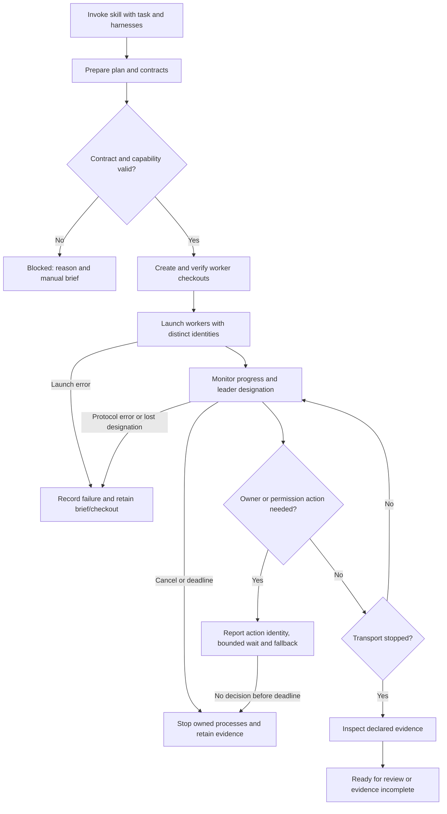

# Launch and monitor a multi-harness coordination plan

**Status: specified; opt-in ACP/native-Agy pilot selected by design.** Cost-of-error tier T2.
The requested workflow is specify → design-slice → implement. This specification records
the launch behavior; the separately requested ACP specification and spikes determine which
transport can meet it. No adapter is qualified by this document alone.

## A. Functional specification

### Problem and core scenario

The user currently relays startup instructions and messages manually to Grok and Agy.
They want to ask either Claude or Codex to start multi-harness work and have the routine
setup performed consistently. Existing `execute-with-coordination` supports native
sub-agents and manually pasted briefs. Existing `coord mail dispatch` runs a headless
command but does not constitute a managed coordination lifecycle.

**User evidence:** the operator's 2026-09-20 request reports manual session coordination
for Agy and Grok and frequent switching between Claude and Codex as leader. **Verified
source evidence:** `pack/commands/execute-with-coordination/SKILL.md` declares `--agents`
and `--brief`; `pack/scripts/coord-mail.py:cmd_dispatch` copies the parent environment and
checks exit code plus structured output; `pack/scripts/coord-core.py:cmd_leader` assigns
leadership by session identity, with the host as metadata.

Core scenario: an authorized Owner on Claude or Codex invokes the skill for a repository
task. The skill creates or reads a coordination plan, prepares explicit track contracts,
and asks the deterministic runner to open isolated sessions on the requested harnesses.
The Owner sees which tracks launched, their progress, and any action required. A completed
transport turn is reported separately from verified track evidence. The Owner rules on
decisions and uses the existing integration gate when tracks are ready.

### Users and jobs

| User | Job |
|---|---|
| Human operator | Start coordinated work without repeating setup or relaying every turn |
| Owner on Claude or Codex | Delegate within a plan, receive evidence and rule on decisions |
| Worker on Grok, Agy, Claude or Codex | Receive an explicit identity, checkout, contract and return path |
| Future session | Recover what ran and why a track stopped without guessing from process exit |

### Scope and alternatives

In scope: extend the existing skill with a launch mode, validate a concrete launch
contract, prepare worktrees, launch qualified harness transports, bound and monitor their
lifetimes, preserve leader identity, and record results. Manual briefs remain a supported
outcome when a required capability is unavailable. An already-open initiating Grok or Agy
session can invoke the same deterministic entry point; leader designation is independent
of the worker harness selection.

Out of scope: a cloud broker, autonomous elections, automatically resolving Owner decisions,
changing global permissions, credential management, arbitrary attachment to an existing TUI,
automatic merging or pushing, and replacing the existing mail, request or leader stores.
Session loading is optional and advertised only after a probe of the selected transport.

Candidates to evaluate: a shared Agent Client Protocol client plus a narrow Agy adapter;
native headless transports; existing manual briefs. The independent ACP spike tests
creation, repeated prompts, progress, permissions, cancellation, completion and instruction
or hook preservation before design selects a candidate. The similarly named Agent
Communication Protocol/A2A service approach is outside this local launch requirement.

### Domain model

Bounded context: **coordination execution**, using existing Session, Track, Leader
Designation, Request and Ruling identities.

| Concept | Kind | Meaning and invariant |
|---|---|---|
| Launch contract | Immutable value | One approved plan execution's worker identities, bounds, briefs and expected evidence |
| Run | Entity | One launch attempt; a given run identity cannot silently launch twice |
| Worker attempt | Entity | One session in one non-primary checkout, linked to its run and transport session |
| Capability observation | Value | One versioned transport's measured behavior in a stated environment; unknown is explicit |
| Execution event | Append-only fact | One observed lifecycle transition; never an inferred permission grant or completed task |
| Track receipt | Value | References to the returned commit/artifacts and independent verification outcome |

Aggregate: **Run**, whose invariant is that each admitted worker attempt has a distinct
session and checkout, belongs to the declared leader epoch, and receives no broader
authority than its contract. Existing leader CAS remains authoritative for who leads;
the runner is not a second leader election or designation store.

Durable grain: one fact is exactly one observed execution transition for one run/worker.
History is append-only. Configuration identity and version are immutable per attempt;
changing them creates a new attempt. Status, counts and elapsed time are derived from
facts. Elapsed durations and byte counts are additive across disjoint attempts; current
active count is a snapshot and is not additive over time; success rate is a derived ratio.
Token usage/spend remains `not recorded` unless the transport actually supplies it, with
cumulative measurements distinguished from per-turn measurements. The design must reuse
the existing append-only audit writer rather than introduce a competing durable ledger.

### Acceptance criteria

**AC1 — Validate before launch.** Given an empty, malformed or incomplete contract, a
duplicate worker identity, missing deadline/fallback, invalid path or undispatchable brief,
launch refuses with the offending field and a remedy before starting any model process.
An unknown capability is not treated as enforced. Unsupported required capability returns
a blocked result and the manual brief needed to continue.

**AC2 — Worktree isolation.** Given a valid contract, each worker receives its own branch
and worktree based on the invoking checkout's resolved commit. The actual git inventory
is read back. The runner refuses reuse of another session's checkout, writes in the primary
checkout, or launch from a parent whose worktree cannot be resolved or whose index contains
unresolved merge entries. Uncommitted planning documents alone are not a refusal: the
resolved base commit and exact admitted contract/brief bytes must be bound to the run.
It does not install shared git
configuration from a linked worktree and never deletes worktrees as failure cleanup.

**AC3 — Identity propagation.** Given a parent whose environment already contains an
identity, each child observes its assigned `AGENT_SESSION`, host and work-item identity,
and its assigned cwd. Child and parent identities differ. A worker cannot become the
leader merely by inheriting the parent's environment. No output or user-facing event
includes credential values.

**AC4 — Harness-neutral leadership.** Given either a Claude or Codex Owner, the same launch
and monitor behavior applies. A live designation for another session is respected. While
monitoring, the current holder's lease is renewed through the existing protocol within
its renewal interval. Failed renewal or changed epoch prevents further work dispatch and
reports the reason; it cannot quietly renew or release a successor's designation.

**AC5 — Session control.** Given a qualified transport, creation and dispatch return an
identified worker attempt; progress is observable; a subsequent authorized prompt uses the
documented session mechanism. Required permissions are handled through the transport's
documented protocol. An unavailable permission decision is surfaced with a stable pending
action identity, a finite wait and an explicit fallback; it never becomes automatic
unrestricted approval. A denial-only first version that requires a new attempt under an
explicitly selected policy is acceptable, but must not claim interactive permission
brokerage. Effective policy is recorded rather than inferred from a mode's name.
Instruction and hook
preservation are reported per capability rather than inferred from transport support.

**AC6 — Bounded failure.** Given a stalled process, malformed output, output flood,
authentication failure, permission refusal, cancellation or deadline, the runner produces
a named terminal or blocked outcome and retains the contract's fallback. Owned subprocesses
are reaped within the documented cleanup deadline. It neither kills unrelated sessions nor
retries a potentially side-effecting prompt automatically. Cancellation does not claim to
roll back edits already made.

**AC7 — Completion evidence.** Given exit zero or a successful protocol stop with missing
required artifacts, the result says transport complete and evidence incomplete. A track is
ready for Owner review only when its declared evidence has been read from its assigned
checkout and verified against the contract's explicit verifier kinds. Verifiers do not
execute commands supplied by worker output. Paths, symlinks and commit ancestry must not
substitute a different artifact for the one the contract names. Structural verification
does not claim semantic acceptance; that remains the Owner's review. A worker's free-text
`done`, a mail acknowledgement
or JSON parse success is insufficient. The integration gate remains the existing join path.

**AC8 — Recovery and duplicate launch.** Given a repeated run identity or interrupted run,
the runner reports recorded attempts and remaining work before any new process is started.
It does not replay prompts automatically or turn absent process telemetry into success.
Starting a new attempt is explicit and retains the prior attempt's evidence.

**AC9 — Observe normal operation.** Every attempt emits a run/session correlation identity,
transport identity/version when recorded, start/end or last-observed time, outcome/reason,
elapsed time, output volume and budget disposition. Unknown usage/cost is explicit. The
operator can distinguish no workers, running, blocked, transport-complete, evidence-missing,
ready-for-review, failed and cancelled states without reading model prose.

**AC10 — Shipped skill integration.** The launch instructions are present on every generated
skill surface and lead to the shipped script. A new Grok/Agy session or the initiating
Claude/Codex session can follow those instructions. The default and manual modes retain
their documented meaning. Tests invoke the installed script from a real linked checkout,
and skill contract regression checks catch source/install drift.

### Quality, security and release requirements

Python stdlib is the preferred deterministic implementation, conforming to the pack.
No fixed performance target is claimed before measurement. Finite per-attempt wall-clock
and output bounds are mandatory; a slow agent cannot block leader renewal or cancellation.
Credentials remain with installed harnesses. Optional adapter installation must be explicit
and versioned; missing adapters are reported. No silent download occurs during launch.

| Boundary / STRIDE risk | Required control and negative proof |
|---|---|
| Spoofed child/leader identity | Explicit child environment; competing leader and inherited-env tests |
| Tampered contract or path escape | Validate and bind admitted contract; reject traversal/symlink escape and missing briefs |
| Repudiation or false completion | Append-only correlated facts; read artifacts; missing-evidence test |
| Secret disclosure | No environment dumps or raw credential-bearing output in durable facts; sentinel test |
| Output flood or stuck process | Finite bytes/time and owned-child cleanup; flood/hang/cancel probes |
| Elevation through permission callback | No blanket approval or global setting changes; denied-permission probe |

Privacy: store identifiers and bounded operational metadata, not raw conversations or
authentication material, unless an operator explicitly selects diagnostic capture. CLI
accessibility: plain text reasons plus machine-readable output; no color-only states.
Rollback: remove the opt-in launch mode and its new script; preserve existing run records,
worker branches and artifacts. Incident detection: named failure outcome; diagnose from
run and worker IDs; mitigate by stopping owned processes and continuing from the retained
brief and checkout.

Governance lenses: traceability, reliability, identity/trust boundaries, privacy, CLI UX,
resource budgets, rollback, observability, optional adapter supply chain and incident
readiness all apply as specified above. Visual UI and model-content quality evaluation
are N/A: the extension controls execution and validates evidence, not the quality of the
delegated feature's semantic output.

## B. CLI UX specification

The skill presents one concrete launch contract before execution, showing the designated
leader, selected harnesses, worktrees, capabilities, bounds and fallbacks. The deterministic
entry point validates that contract, launches admitted workers and reports progress and
action-required states. Machine output is structured and contains no mixed prose. Every
refusal includes a stable reason and a concrete remedy; a partial launch lists each affected
worker individually.

Concrete command names, input schema and output schema are design decisions deferred until
the ACP capability evidence is available. The same UX vocabulary applies regardless of
which harness is Owner. Existing-session loading is displayed only when supported and
verified; there is no implied attachment to an open terminal.

## C. Visual UI specification

N/A — no new graphical product surface. The separately requested HTML ACP specification is
a readable document rendition, not the runner's product UI.

## Verification plan and open gates

Testing Strategy union: D0–D4, D6–D7, A1, A3–A4 and A6; provider/consumer contracts use
actual transport schemas. Hermetic tests use real temporary git repositories and local
protocol fixtures; live spikes are separate from deterministic CI. The matrix must cover
each supported adapter version with denied permissions and cancellation as well as success.
Mutation/fault checks target identity override, epoch loss, output bounds and false completion.

Independent review, 2026-09-20: ACP sub-agent acting as Test Architect, Security, Data and
Simplifier returned PASS-WITH-CONDITIONS. Conditions addressed here: bounded permission
wait and identified action; objective parent-index conflict check rather than refusal on
all uncommitted changes; explicit evidence verifier kinds and path/commit integrity; and
cancel/error/deadline UX edges. The reviewer recommended no editor filesystem/terminal
implementation, provider inventory, MCP proxy, arbitrary session loading or daemon recovery.
The independent reviewer confirmed these conditions closed (PASS, 2026-09-20).

Open gates: implementation review; generated-surface checks; integrated bundle gates.
Compatibility is scoped to the measured profiles and does not clear production hook/policy
qualification. Existing leader, worktree, request and mail tests are reuse candidates,
not evidence that a new composition already works.
