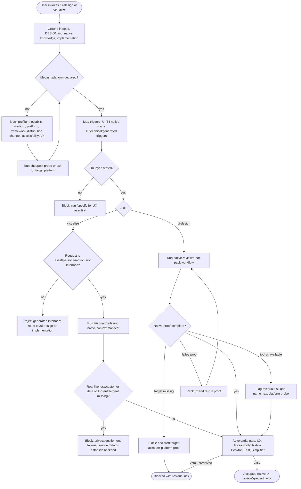

# Spec: Native app UI skill extension

- **Status:** Accepted
- **Tier (cost-of-error):** T1 — pack capability and public methodology change; user-facing design quality and accessibility affected, but no runtime code or data migration in this spec.
- **Author(s) / date:** Copilot CLI / 2026-08-26
- **Supersedes / related:** Depends on `docs/knowledge/native-client-ui-design/`; updates downstream design for `/ui-design` and `/visualize`.

## Part A — Functional specification

### Problem

[Verified] The existing `/ui-design` and `/visualize` skills already support "native desktop" as a trigger, but their concrete flow and output artifacts are optimized for web-style surfaces: `DESIGN.md`, dependency-free HTML mockups, static/source UI craft detection, web-oriented asset rendering, and generic medium guidance. The newly collected native-client evidence shows that WPF, WinUI, Avalonia, macOS and Linux desktop surfaces require native proof that a web mockup cannot provide: accessibility trees, keyboard traversal, XAML/native resource bindings, high-contrast themes, per-monitor DPI, windowing behavior, OS integration and packaging/signing trust gates (`kb-native-client-ui-design`).

The problem is not "make WPF look like the web UI process." The problem is: **make native client UI work first-class in the existing skill workflow without forking the pack's UI doctrine or weakening the web path.**

### Target users & personas

- **Primary user:** a developer or agent using AI-Forward to create, review or elevate a native client surface, especially WPF/WinUI/Avalonia.
- **Secondary user:** the Native Desktop Developer persona, UX Researcher/IA, UX & Accessibility, Test Architect and Release Engineer reviewing native UI work.
- **Job-to-be-done:** when a UI task targets a native app, the user needs the skill to ask for the platform contract and produce proof obligations that match native runtime behavior, not only a web-rendered preview.

### Core scenario

A maintainer invokes `/ui-design` on an existing WPF settings window that feels web-shaped and inaccessible. The skill grounds in the spec, `DESIGN.md`, native-client knowledge base, and actual XAML; declares `medium: native desktop`, `platform: Windows`, `framework: WPF`; maps the native trigger; reviews keyboard traversal, UI Automation names, high-contrast resources, DPI behavior, window/dialog patterns and signing/distribution risk; and produces a ranked UI review plan with native proof rows. If `/visualize` is later used for imagery, it generates only fixture images or direction-board mood assets and never attempts to generate a WPF window screenshot as the interface.

### In scope / Out of scope

- **In:**
  - Extend `/ui-design` requirements so native desktop surfaces have explicit medium/platform/framework declarations.
  - Add native-client trigger behavior for the first slice: WPF, WinUI and Avalonia. macOS, GNOME and KDE remain declared-platform extensions when a run cites their HIG/proof source.
  - Require a native proof pack for UI Automation/accessibility tree, keyboard traversal, theme/high-contrast, high-DPI/windowing, OS integration, performance and packaging/signing.
  - Require native token mapping from `DESIGN.md` into XAML/resource/style systems.
  - Extend `/visualize` scope wording so generated assets can support native apps but generated images never become the native interface.
  - Label any cited public repository exemplar with license/reuse posture.
- **Out (non-goals):**
  - Implementing the skill changes in this spec.
  - Choosing a single WPF/WinUI/Avalonia UI automation library for all projects.
  - Building a XAML linter or native craft detector.
  - Creating platform-specific design systems or native app templates.
  - Requiring public repository exemplars for every native run.
  - Legal approval for non-standard or copyleft repos.

### Conceptual model scope

This spec does not introduce a persisted product domain or data model. It introduces workflow vocabulary and invariants for a skill-instruction change. The bounded context is **AI-Forward UI workflow customization**.

**Ubiquitous language:**

- **Surface:** a human-facing UI under review or creation.
- **Medium:** the delivery medium (web, native desktop, mobile, CLI, voice, embedded).
- **Platform contract:** the authoritative OS/HIG/runtime obligations for the medium.
- **Native proof pack:** the evidence bundle that proves native behavior beyond screenshots.
- **Design-language token:** a product design decision recorded in `DESIGN.md`.
- **Native resource binding:** a platform resource/style mapping that realizes a design-language token.
- **Generated visual asset:** an image/persona/motion artifact displayed by the UI, never the UI itself.

**Invariants:**

| Concept | Invariant |
|---|---|
| Native-triggered skill run | A skill run that declares a native client medium includes native proof-pack obligations before it can report PASS. |
| Native proof pack | Every accepted native proof row has `claim`, `failing input or condition`, `oracle`, `evidence`, `confidence`, `red-observed status`, and `residual risk`; unresolved platform claims remain Flagged. |
| Generated visual asset | Generated assets may be committed only as content displayed by the UI, with manifest, alt text, provenance and budget; no generated asset may be the interface itself. |

### User stories & acceptance criteria

**US-1 — As a native-app maintainer, I want `/ui-design` to recognize native client surfaces so that review covers platform behavior, not only visual polish.**
- **Given** a `/ui-design` task declares or detects `medium: native desktop` **When** the skill maps triggered standards **Then** it includes the native-client trigger, platform HIG, Native Desktop Developer lens, and the native proof-pack rows.
- **Given** a native surface is reviewed **When** the report reaches the gate **Then** PASS is impossible unless keyboard traversal, accessibility tree, theme/high-contrast, DPI/windowing and OS integration are either Verified or explicitly Flagged with residual risk.
- **Given** a native surface is intended for release **When** the report reaches the gate **Then** PASS is impossible unless Windows signing/SmartScreen posture or macOS signing/notarization posture is Verified or explicitly Flagged as a Release Engineer escalation.
- **Given** a task is WPF, WinUI or Avalonia **When** token discipline is checked **Then** the expected target is XAML/resource/style binding, not CSS variables.

**US-2 — As a UX reviewer, I want the existing UX/UI layer discipline preserved so that native support does not fork the methodology.**
- **Given** a native UI task **When** `/ui-design` begins **Then** it still requires a settled UX layer before the visual surface, a direction brief before artifacts, complete state inventory, and rubric findings.
- **Given** a native proof row conflicts with a web-oriented artifact such as the HTML mockup **When** the skill reports the outcome **Then** the HTML mockup is treated as direction evidence only and native runtime proof remains required.

**US-3 — As a developer using `/visualize`, I want generated imagery to support native apps without becoming fake UI.**
- **Given** a native app needs personas, onboarding imagery, icons-as-content, or a direction board **When** `/visualize` runs **Then** the asset rules are the same as web: entitlement established, no real likeness/customer data, committed files, manifest, alt text, cost and disclosure.
- **Given** the user asks `/visualize` to generate a native app screen, WPF window, control panel, chart, menu or icon set **When** the skill classifies the request **Then** it rejects that as generated interface and routes to `/ui-design` or manual/native implementation.

**US-4 — As a pack maintainer, I want any cited native UI exemplar named with license posture so downstream agents can learn from public repos safely.**
- **Given** a comparable is included in the skill prompt or spec **When** it is used as a reference **Then** the artifact records whether it is MIT/permissive, reference-only, GPL, or Flagged/non-standard.
- **Given** a repo is GPL or license `NOASSERTION` **When** the skill mentions it **Then** it is marked reference-only and never a reusable source.

**US-5 — As a Test Architect, I want native UI acceptance criteria to be falsifiable so they can become tests.**
- **Given** a native UI proof row **When** it is added to the review artifact **Then** it states the failing input or observable condition that would make the claim false.
- **Given** an accessibility claim says a control is accessible **When** the proof is reviewed **Then** the evidence is an accessibility-tree/UIA/Appium/platform-inspector result, not a screenshot.

### Non-functional requirements (ISO/IEC 25010 checklist)

| Attribute | Requirement |
|---|---|
| Performance efficiency | Native UI review must include a measurable platform performance budget where the target has runtime UI costs: cold start, UI-thread responsiveness, layout passes/virtualization, animation smoothness, DPI changes. |
| Reliability | The skills must degrade to Flagged/blocked when native proof cannot run; they must not report a clean web/mockup result as native PASS. |
| Security | Generated assets and platform integration must not upload real likenesses/customer data or add OS integrations without least-privilege review. |
| Usability | Native support must preserve UX layer flow integrity and use platform conventions by default; deviations need rationale. |
| Compatibility | The first slice covers Windows WPF/WinUI/Avalonia; macOS/GNOME/KDE are covered only when a run declares those platforms and cites their HIG/proof sources. |
| Maintainability | Native additions must extend existing trigger tables and proof-pack patterns, not create a separate UI workflow. |
| Portability | Cross-platform frameworks must declare per-platform deltas and verify each target platform's accessibility/runtime behavior. |

### Boundary set

- **Empty:** native task lacks platform/framework declaration; skill must ask the run to establish it or mark it Flagged, not assume web.
- **Max/dense:** data grid, file manager or settings shell with large lists; proof must include virtualization/layout budget.
- **Malformed:** generated asset request contains "generate WPF screen"; `/visualize` must reject as generated interface.
- **Hostile/privacy:** user supplies a real person's image or customer screenshot for persona/asset generation; hard veto.
- **Concurrent:** cross-platform native target claims one Avalonia proof covers Windows/macOS/Linux; proof must be per target or Flagged.
- **Error/recovery:** native automation tool not available in CI; spec must require residual risk and the cheapest next probe.

### Native proof-pack minimum schema

Every native proof row produced by `/ui-design` or consumed downstream must include:

| Field | Requirement |
|---|---|
| Claim | The specific native behavior asserted. |
| Failing input or condition | The user action, OS setting, platform state or package state that would make the claim false. |
| Oracle | What observation distinguishes pass from fail. |
| Evidence | Tool output, inspector result, recording, test name or package/signing check. |
| Red-observed status | Whether the check has been seen fail on an unfixed surface, or is explicitly "planned" before implementation. |
| Confidence | Verified / Inferred / Flagged. |
| Residual risk | What target/platform/path remains uncovered. |

Minimum required rows for a native desktop surface:

| Claim | Failing input or condition | Oracle |
|---|---|---|
| Platform HIG is honored | Target platform declared but required menu/window/dialog/shortcut conventions omitted | Reviewer can map each declared target to a HIG checklist result or Flagged deviation. |
| Keyboard traversal works | User completes the core flow without a pointer, including dialogs and recovery states | Recording or automated test shows traversal order, focus trap/restore, default/cancel actions and shortcut map. |
| Accessibility tree is correct | A non-text/custom/icon control lacks name/role/state/pattern or focus event | UIA/NSAccessibility/AT-SPI/Appium/Accessibility Insights shows the expected properties. |
| Theme/high-contrast works | OS switches Light/Dark/HighContrast or platform equivalent | Runtime resource-bound UI updates; contrast remains usable; no static/raw token breaks the theme. |
| DPI/windowing works | Window moves between mixed-DPI monitors, resizes, restores, minimizes or opens auxiliary windows | Text/icons remain crisp; window state and custom title/chrome behavior match platform expectations. |
| Large native lists remain responsive | Dense list/grid exceeds visible viewport by an order of magnitude | Virtualization remains enabled; scroll/input does not block the UI thread beyond the stated budget. |
| OS integration is scoped | File association, URL scheme, tray/dock/menu extra, notification, startup item or update channel is present | Integration uses platform mechanism, least privilege, discoverable controls and reversible settings. |
| Distribution trust is handled | Native artifact is unsigned, untrusted, unnotarized or has unknown SmartScreen/Gatekeeper posture | Windows signing/SmartScreen or macOS signing/notarization status is Verified, or release risk is escalated to Release Engineer. |

### Comparables & evidence

| Claim | Source | Confidence |
|---|---|---|
| Native app review needs platform contracts beyond web mockups. | `kb-native-client-ui-design` headline findings 1-10 | **Verified/Inferred as labeled** |
| Windows native UI should use Fluent/Windows design and WinUI 3 for new modern Windows desktop apps unless project constraints justify WPF/etc. | Microsoft Learn Windows design and WinUI 3, cited in native knowledge [S1], [S6] | **Verified** |
| Native accessibility must be proven through UI Automation/automation peers or equivalent platform accessibility APIs. | Windows accessibility/WPF/Avalonia docs cited in native knowledge [S4], [S5], [S16] | **Verified** |
| Public native UI exemplars are available under MIT, but GPL/non-standard licenses must be reference-only when cited. | `comparables.md` license table | **Verified** |
| `/ui-design` currently maps native UI only as UI-T4 and still centers output on web-style HTML mockups and source/static craft detectors. | Opened `pack/commands/ui-design/SKILL.md` | **Verified** |
| `/visualize` already forbids generated interfaces and generates only assets; the native extension should keep that invariant. | Opened `pack/commands/visualize/SKILL.md` | **Verified** |

### Applicable governance lenses

- [x] Quality attributes / NFRs — native UI quality attributes now include platform conformance and native runtime proof.
- [x] Threat model (STRIDE) — applies where generated assets, OS integration or app signing/distribution are changed.
- [x] Privacy & data governance — applies to generated personas/images and screenshots/customer data.
- [x] Accessibility — core requirement; native proof goes through accessibility APIs, keyboard and high contrast.
- [x] Performance budget — native-specific layout, virtualization, DPI and UI-thread responsiveness.
- [x] Release / rollback / migration — signing/notarization/MSIX/SmartScreen and update channels are release gates.
- [x] Observability — UI review artifacts must record proof rows and residual risk; no runtime telemetry changes in this spec.

### AI-integrated allocation

- **LOA archetype:** N/A for this specification. The future skills remain agent workflows, but no new AI-integrated product surface is specified here.
- **Tier allocation:** Generative critique is not proof. Native PASS requires deterministic/platform evidence or a Flagged residual risk; future lint/proof tooling choices are deferred to `/design`.

## Part B — UX specification

This change is user-facing because it changes how developers and personas use the `/ui-design` and `/visualize` skills.

### Personas & jobs-to-be-done

| Persona | Context | Job-to-be-done |
|---|---|---|
| Native app maintainer | Has WPF/WinUI/Avalonia/macOS UI needing review or elevation | Get native-specific UX/UI findings with platform proof, not a web-style critique. |
| Pack maintainer | Extends AI-Forward skill instructions | Add native support without splitting UI doctrine or weakening existing web guidance. |
| Reviewer persona | Native Desktop Developer, UX & Accessibility, Test Architect, Release Engineer | Know exactly which native proof rows to demand and what clears the gate. |

### Information architecture

The skill extension should group knowledge by workflow decision, not by framework tutorial:

1. **Medium declaration** — platform/framework/distribution/accessibility API.
2. **Trigger mapping** — how the skill detects native client UI and which standards fire.
3. **Native direction evidence** — platform HIG and native comparables.
4. **Native design system mapping** — `DESIGN.md` tokens -> ResourceDictionary/ThemeResource/DynamicResource/Avalonia styles.
5. **Native proof pack** — accessibility tree, keyboard, theme/high contrast, DPI/windowing, performance, OS integration, signing.
6. **Visual asset constraints** — generated imagery/personas/motion as content only.
7. **Gate and output artifacts** — review/spec/design artifacts with proof rows and residual risk.

Labels that should seed the glossary or command text: **native proof pack**, **medium declaration**, **platform contract**, **native resource binding**, **accessibility tree**, **generated visual asset**.

### User flows

### Wireframe-level structure

For the spec and future skill output, the user-facing structure is textual:

- **Section 1: Native medium declaration**
  - platform(s), framework, distribution channel, accessibility API, HIG source.
- **Section 2: Native trigger map**
  - native trigger plus technical/AI/generated triggers.
- **Section 3: Native evidence**
  - platform HIG, comparables, current implementation files opened, source confidence.
- **Section 4: Native proof pack**
  - table of claim, oracle, evidence, confidence, residual risk.
- **Section 5: Gate verdict**
  - PASS/BLOCK, vetoes, next probe.

### UX acceptance criteria

- Every native UI skill run has a visible **medium declaration** before critique begins.
- Every native review artifact groups findings by **platform contract** and **native proof row**, not only by visual dimension.
- Every native `/visualize` run has a visible classification that separates **asset content** from **generated interface**.
- Every blocked or Flagged native run names the cheapest next probe, such as "run Accessibility Insights FastPass" or "verify mixed-DPI behavior."

## Part C — UI specification

**N/A — this spec does not introduce a new visual UI.** It changes markdown skill instructions and review artifact content. The future native-app surfaces being reviewed by those skills will each carry their own Part C/UI archetype and platform-specific UI criteria.

### UI Archetype Signature

N/A — no new visual surface. Future native surfaces choose their archetype in their own spec/design.

### Medium(s) & platform guidelines

- **Primary medium:** markdown skill/spec artifacts and CLI output.
- **Native target media governed by the spec:** Windows WPF/WinUI/Avalonia, macOS native apps, GNOME/KDE where declared.
- **Authoritative platform guidelines:** Windows Fluent/WinUI docs, Apple HIG, GNOME HIG, KDE HIG, Avalonia docs, plus pack UI standards.

### Visual intent & tokens

- The skill artifacts remain markdown-first and should use the existing Docs Explorer/design-language conventions.
- Future native review artifacts should prefer dense, scan-friendly tables with stable labels and confidence tags.
- No new product token system is required in this spec. `/design` should decide whether native artifacts need a `DESIGN.md` template extension.

### Key screens & complete component states

There is no new application screen in this spec. Future `/ui-design` native outputs must specify states for the reviewed native surface:

- control states: default, hover, focus, active, disabled, loading, empty, error, success, overflow;
- native states: active/inactive window, light/dark/high-contrast, keyboard-only, screen-reader, mixed-DPI, minimized/restored, signed/unsigned install.

### Motion, copy, accessibility & performance

- **Motion:** no new motion in the skill spec; future native reviews must include motion/reduced-motion checks where native UI uses transitions/animations.
- **Copy:** skill copy should use "native proof pack" and "platform contract" consistently.
- **Accessibility:** native proof rows are mandatory for UI Automation/accessibility tree, keyboard and high contrast.
- **Performance:** native proof rows include layout churn, UI virtualization, UI-thread responsiveness, DPI changes and startup where relevant.

### AI-UX

N/A — this spec does not add model-facing UI. If `/ui-design` reviews a native AI surface, existing HAX/Shape-of-AI requirements still apply and native proof rows apply on top.

### UI acceptance criteria

- A native UI review artifact includes a native proof-pack table with at least the rows listed in `kb-native-client-ui-design-data`.
- A native `/visualize` artifact never contains generated UI text/controls and labels visual assets as content fixtures.
- Skill documentation names the exact platform guideline source required for the target.
- A native proof claim cannot be marked Verified from a screenshot alone when the claim is accessibility, keyboard, theme, DPI, windowing or signing.

## Flagged risks & residual unknowns

| Risk | Confidence | Cheapest next probe |
|---|---|---|
| Apple notarization details are not fully extracted in the native knowledge base. | **Flagged** | Re-open Apple Developer notarization docs and cite exact current requirements before implementing macOS release gates. |
| CI-friendly WPF/WinUI UI automation tool is not chosen. | **Flagged** | Spike Accessibility Insights CLI/UIA client/FlaUI/Appium against a tiny WPF and WinUI sample. |
| XAML token linting is not implemented. | **Flagged** | Add `/design` task to define deterministic XAML/resource lint rules before `/implement`. |
| Native archetype catalog rows do not yet exist. | **Flagged** | Run `/design` to decide whether catalog rows are needed; do not add them until a concrete native surface requires them. |

## Specification proof pack

| Claim | Evidence | Oracle / failing condition | Red observed | Confidence | Residual risk |
|---|---|---|---|---|---|
| The spec is grounded in native-client evidence. | Links to `kb-native-client-ui-design`; graph validation verifies the link. | Delete or break the `kb-native-client-ui-design` link; graph validation reports a dangling link or review finds the spec ungrounded. | Planned: graph validation after authoring. | **Verified after validation** | Native knowledge may need refresh by review date. |
| Acceptance criteria are falsifiable. | US-1 through US-5 use Given/When/Then with observable outcomes. | A criterion lacks an observable `Then`, failing input, or named proof surface. | Red observed by Test Architect review: original draft lacked proof-row falsifiers. | **Verified** | Exact automation tool remains Flagged for `/design`. |
| Native proof rows require real oracles. | Minimum schema and required rows above. | A native proof row omits failing input/condition or can pass from a screenshot alone. | Red observed by Test Architect review: original draft blocked for missing row oracle/red-observed fields. | **Verified** | Future implementation must enforce with templates/tooling. |
| UX flow covers unhappy paths. | Mermaid flow includes missing medium, unsettled UX, generated-interface rejection, privacy/entitlement failure, proof unavailable, missing target proof, failed proof, veto block. | A named boundary case lacks a branch to block/recover/probe. | Red observed by UX Researcher/IA review: original flow omitted several named unhappy paths. | **Verified** | Future skill docs must keep the flow current. |
| Scope is smallest correct. | Visual archetype and DDD tables removed; exemplars made optional; first slice narrowed to WPF/WinUI/Avalonia. | Spec requires catalog rows, tooling, or broad platform support before a concrete surface needs them. | Red observed by Simplifier review: original draft contained those oversized elements. | **Verified** | Native archetype/tooling decisions remain for `/design`. |

## Gate record

`GATE specify · 2026-08-26 · reviewers: Simplifier, Test Architect, UX Researcher/IA, Native Desktop Developer (external subagent reviews) · criteria after revision: all three layers present or N/A with reason; native knowledge cited; acceptance criteria falsifiable; UX flow covers alternate/error/recovery; Part C correctly N/A for no new visual UI; proof-pack attached · verdict: PASS-WITH-CONDITIONS · vetoes: original Test/UX/Simplifier/Native blockers resolved in this revision; flagged implementation/tooling choices deferred to /design.`

## Handoff

→ `/design` to design the exact pack edits: update `/ui-design`, `/visualize`, possibly `ui-design-craft.md`, `ui-visual-assets.md`, UI archetype catalog rows, and native proof/lint tooling.

→ `/implement` only after `/design` settles the XAML/native proof tooling choices.
