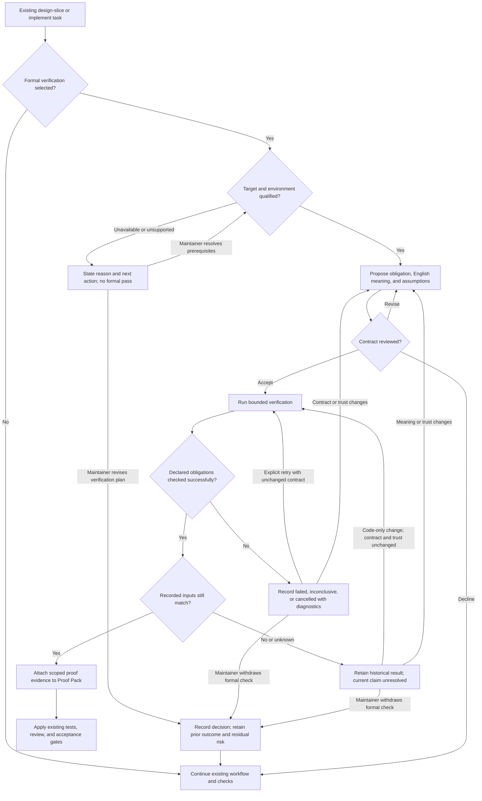

# Spec: Optional formal verification and Proof Pack evidence

- **Status:** Proposed; awaiting Tim Mallalieu's review. Not authorized for implementation.
- **Tier:** T1 for this pack extension; adopting projects retain their own risk tier.
- **Author / date:** GitHub Copilot for @lucioctinoco, 2026-09-14.
- **Baseline:** AI-Forward revision 70, commit `17666d35927e2bf9374b45644ca03d13102837ef`.
- **Related:** [Authoring plan and review record](../plans/optional-formal-verification-spec.md).

## Review Brief

### Customer Value: A Concrete Illustration

**Illustrative customer story [Inferred], not a reported incident:**

> As a customer running a database in an Azure VM, I want malformed I/O requests
> to be rejected safely, so one bad request does not interrupt my workload.

Imagine a request whose data spans three memory pages but whose memory list
contains only two. The validator should reject it. If it mistakenly accepts
the request, the next processing step could try to read a nonexistent third
entry and fail. This is a failure scenario to prevent, not a claim that the
current OpenVMM implementation accepts it.

[Verified by source inspection] OpenVMM has a concrete boundary for this kind
of assurance: `validate_gpa_ranges` validates encoded memory ranges, while
`MultiPagedRangeIter::next` relies on earlier validation for its arithmetic,
indexing, slicing, and range construction [S7]. A useful proposed guarantee is:

> If validation accepts a memory-range list, the next step can walk that
> unchanged list without running past its bounds or overflowing its calculations.

[Inferred benefit] An engineer later changes this code for performance. Tests
may miss an unusual combination of sizes and offsets. A formal check asks
whether the guarantee still holds for all inputs covered by the contract. A
regression that violates it cannot receive a successful proof. This gives the
engineer and reviewer stronger evidence before release, supporting the
customer's reliability goal.

**Limit [Flagged]:** this would establish one request-processing property, not
prove disk correctness, authorize the referenced memory addresses, or guarantee
VM availability. No OpenVMM proof or reduction in customer incidents has been
demonstrated. Valid-input acceptance must also be checked; rejecting every
request would not meet the intended need.

### Proposed Capability

Add an optional way to substantiate selected correctness claims with an existing
formal verifier. AI-Forward continues to clarify intent, design, implement,
review, and collect evidence. It does not become a theorem prover or a Rust
application.

The first delivery supports suitable Rust code through Verus, integrates with
the existing `/design-slice` and `/implement` flows, and records the result in
the existing Proof Pack. Non-Rust and non-opted-in work continues unchanged.
One synthetic descriptor-validation example demonstrates the complete path.
Existing tests and reviewer gates are not waived in this first delivery.

**Decisions requested from Tim:** approve or revise the opt-in boundary, the
Verus-first scope, the evidence requirements below, and the worked-example
choice. This spec does not select new commands, storage schemas, or a verifier
wrapper; those are downstream design decisions.

**Recommendation for the worked-example decision [Inferred]:** prefer a bounded
OpenVMM validation-to-iteration pilot on the actual executable logic, subject to
toolchain feasibility and maintainer review. The illustration above explains
that candidate's value; it does not replace the synthetic demonstration required
by FV-16 or authorize production changes. Tim must approve any scope revision.

## Part A - Functional Specification

### Problem and Evidence

[Verified] The current Proof Pack connects claims to evidence, an oracle,
confidence, and residual risk. The implementation workflow and Testing Strategy
mainly operationalize that evidence through tests and review [S1-S3].

[Inferred] For a small, stable, correctness-critical component, repeatedly
reviewing edge cases may be less effective than establishing a precise invariant
with a verifier. The missing capability is a consistent way to select that
option and report what was actually established, without treating a successful
tool invocation or an agent's statement as proof of the entire feature.

[Verified] The contributor proposed optional verification for bounded Azure
Core components, and Tim requested a spec to experiment with. [Flagged] No
production adopter, cost saving, or end-to-end Verus integration has been
established by that conversation.

### Users and Core Scenario

- **Developer:** starts with an English requirement and wants help identifying
  a precise, valuable claim, without becoming a proof-language specialist.
- **Test Architect and Rust Developer:** establish the contract, produce the
  implementation and proof assistance, and distinguish checked facts from assumptions.
- **Maintainer/reviewer:** decides whether the formal property matches intent,
  whether its trust boundary is acceptable, and what still needs tests.
- **Pack maintainer:** adds this capability without new requirements for unrelated projects.

A Rust-library maintainer asks AI-Forward to strengthen a descriptor validator.
During `/design-slice`, the agent identifies a bounded claim: an accepted
descriptor refers to a payload inside the supplied buffer, without overflowing
index arithmetic. It translates that claim into a proposed contract, explains
the translation in English, and surfaces assumptions for review. After the
scope is approved and Verus is available in an approved environment, `/implement`
checks the real selected Rust implementation. The resulting Proof Pack states
the property, result, inputs checked, and remaining integration risks. A later
source or specification change prevents the old result being reused as current evidence.

### Scope and Non-Goals

**In scope for the first delivery:**

- Optional selection and qualification of Verus for a suitable Rust target.
- Requirement-to-property traceability and explicit human review of consequential assumptions.
- Reproducible verifier execution and evidence reporting for a declared scope.
- Distinct unsuccessful, incomplete, unsupported, unavailable, and not-run outcomes.
- Freshness checks before verification evidence is used at an acceptance gate.
- Claude Code and GitHub Copilot workflow parity, with on-demand guidance.
- One runnable synthetic example, including a deliberately incorrect implementation.

**Out of scope:**

- Implementation of this feature before Tim reviews this spec.
- Rewriting AI-Forward or non-Rust adopting projects into Rust.
- Translating arbitrary English specifications automatically without review.
- Proving prompt quality, an entire distributed system, or unmodeled infrastructure behavior.
- A new orchestrator, mandatory reviewer council, proof service, or generalized multi-verifier framework.
- Lean, Aeneas, Kani, or TLA+ execution adapters in the first delivery.
- Automatic tool installation, public-playground uploads of repository code, or elevated execution.
- Production changes to OpenVMM, Guest Proxy Agent, or an internal host agent.
- Removing existing tests or granting automatic proof-based exemptions from the Testing Strategy.

### Conceptual Domain Model

**Bounded context:** claim-scoped verification evidence inside the existing
AI-Forward engineering workflow. The Proof Pack remains the reviewable record;
this feature does not introduce a separate source of product requirements.

| Concept | Kind and Meaning |
|---|---|
| Requirement | Existing product intent, owned by the adopting repository. |
| Proof obligation | Identifiable, precise property linked to a requirement. |
| Verification scope | Value describing the actual checked implementation, contract, dependencies, configuration, and exclusions. |
| Verification attempt | Entity recording one requested check and, if launched, its actual verifier invocation against one scope. |
| Trust assumption | Explicit premise or unverified boundary on which the claim depends. |
| Evidence record | Outcome and supporting artifacts attached to the existing Proof Pack. |

The aggregate root is a **verification attempt**: its outcome, scope, assumptions,
and evidence must agree about the same execution. Its invariant is that no
attempt can be presented as a current formal pass unless the intended obligations
were checked successfully, its trust boundary is accepted, and its recorded
inputs still match the inputs being accepted. A passing attempt does not approve
the product requirement or imply feature completion.

Historical execution outcome and current applicability are separate facts. An
old successful run remains a historical success when its inputs change, but is
no longer eligible as current evidence. The design phase chooses representation
and storage details; there is no prescribed database or serialization schema here.

An attempt may end before invocation, for example when Verus is unavailable.
It must record that no invocation occurred and why; command, tool version,
measured execution duration, and checker output are absent where not observed,
never invented to complete a report.

### User Stories and Acceptance Criteria

The IDs below are stable anchors for downstream design and tests. Criteria are
requirements for the future capability, not claims that it already exists.

#### US-1 - Select Verification Without Imposing It

As a developer, I want a justified option to use formal verification, not a new
mandatory stage for every change.

- **FV-01:** **Given** a normal `/design-slice` or `/implement` run without
  opt-in, including a non-Rust repository, **When** it runs, **Then** it neither
  invokes/probes/installs Verus nor adds mandatory formal artifacts or reviewer
  sessions; the existing workflow and checks remain available unchanged.
- **FV-02:** **Given** a proposed proof candidate, **When** the agent recommends
  it, **Then** it names the requirement, property, actual target language/code,
  intended scope, uncovered behavior, and why tests alone may be insufficient.
  A maintainer can decline and continue the existing workflow.
- **FV-03:** **Given** a non-Rust target or unsupported Rust feature/dependency,
  **When** Verus is considered, **Then** the limitation is reported explicitly;
  a Rust reimplementation is not silently substituted as evidence for the original code.

#### US-2 - Review the Property Before Treating It as an Oracle

As a maintainer, I want to understand what the proposed contract means and what
it assumes before an agent attempts to satisfy it.

- **FV-04:** **Given** an English requirement, **When** a proof obligation is
  proposed, **Then** it has an English restatement, requirement reference,
  explicit preconditions/assumptions, at least one allowed and one rejected
  behavior where applicable, and a named reviewer. Missing intent is surfaced,
  not silently resolved by excluding difficult inputs.
- **FV-05:** **Given** an agreed obligation, **When** a correction changes its
  meaning, weakens a postcondition, strengthens a precondition, or adds trust,
  **Then** the change is exposed for renewed review and cannot be accepted as
  merely fixing an implementation. A vacuous or contradictory contract is a
  review blocker, even if a verifier accepts it.
- **FV-06:** **Given** assumptions or unverified bodies, **When** the proof
  scope is accepted, **Then** the trusted toolchain/library baseline and any
  project-introduced trust are recorded. Unreviewed `assume`, external bodies,
  disabled checking, or equivalent shortcuts cannot clear the formal-evidence
  gate. This is not a claim that the verifier has no trusted computing base.

#### US-3 - Run the Checker and Report an Honest Outcome

As a developer, I want verifier results that distinguish a checked property
from an invocation that failed, skipped work, or checked something else.

- **FV-07:** **Given** an opted-in, supported scope and an available qualified
  Verus version, **When** verification completes, **Then** the result includes
  the actual command/configuration, version, checked obligations, source and
  contract identity, captured diagnostics, exit outcome, and measured duration.
  A pass requires successful checking of the declared obligations, not just
  process exit zero or an agent-written summary.
- **FV-08:** **Given** a counterexample or unmet verification condition,
  **When** a run completes, **Then** the result is `failed`, the diagnostic is
  retained, and the affected formal claim is not accepted. The spec is not
  automatically weakened to obtain a pass.
- **FV-09:** **Given** any other execution condition, **When** reporting the
  result, **Then** the following distinctions remain visible. Zero checked
  obligations and missing/malformed/incompatible result data are never passes.

| Outcome | Meaning and Recovery |
|---|---|
| `passed` | Declared obligations checked successfully under the recorded scope; review trust and freshness before acceptance. |
| `failed` | A declared obligation or safety check did not verify; inspect diagnostics and correct code/proof or review the specification. |
| `inconclusive` | Timeout, resource exhaustion, crash, indeterminate result, or insufficient evidence; no correctness conclusion. |
| `unavailable` | Qualified verifier/toolchain is absent; give setup guidance without installing it automatically. |
| `unsupported` | Target or selected configuration cannot be checked by the supported integration; narrow the scope explicitly or choose other evidence. |
| `cancelled` | User stopped the attempt; preserve available diagnostics, never report a pass. |
| `not-run` | No invocation took place; plans and hypothetical results are not execution evidence. |

An opted-in run blocked by these conditions remains unresolved unless the
maintainer explicitly changes the verification plan. That decision is recorded;
it does not erase a failure or convert non-proof into proof.

#### US-4 - Attach Evidence That Cannot Silently Go Stale

As a reviewer, I want the Proof Pack to state precisely what a successful run
established and whether it still applies to this change.

- **FV-10:** **Given** a verification attempt, **When** its evidence is attached,
  **Then** it uses the existing Proof Pack rather than a competing acceptance
  ledger, and distinguishes formal proof from test observations and unverified
  claims. Every formal row includes the obligation, checked scope, trust
  assumptions, result, reproducible invocation, evidence location, and residual risk.
  For a pre-invocation outcome, unavailable execution-only fields are explicitly
  marked not recorded with a reason; the row cannot claim that code was checked.
- **FV-11:** **Given** a successful run followed by a change to its covered
  implementation, contract, relevant dependency/toolchain, or verification
  configuration, **When** acceptance consumes that evidence, **Then** it is
  labeled `stale` and cannot satisfy the current obligation. If equality to
  the recorded inputs cannot be established, applicability is `unknown`, not
  `current`. A timestamp or branch name alone is insufficient identity.
- **FV-12:** **Given** a result for one function, module, target platform, or
  separate model, **When** it is summarized, **Then** its scope is preserved.
  It cannot become a claim about a whole crate, another language implementation,
  production deployment, or distributed system without further evidence.

#### US-5 - Preserve Existing Safety and Delivery Requirements

As a pack adopter, I want this option to strengthen evidence without silently
relaxing my existing testing, review, or permission requirements.

- **FV-13:** **Given** a formally passed obligation, **When** `/implement`
  reaches its gate, **Then** all existing triggered Testing Strategy directives,
  integration checks, and required approvals still apply. Test substitution is
  deferred to a separately reviewed policy change, not inferred from a proof.
- **FV-14:** **Given** a verifier run, **When** it is launched, **Then** it
  uses the repository's approved execution environment and bounded resources.
  It does not upload source/proofs to public services, install tooling, acquire
  credentials, or elevate privileges without separate explicit authorization.
  Untrusted build inputs and macros receive the same execution restrictions as code.
- **FV-15:** **Given** a successful or failed proof result, **When** a reviewer
  assesses it, **Then** the verifier determines obligation validity and the
  existing reviewer roles determine specification adequacy and accepted trust.
  No additional default multi-model council or automatic review loop is introduced.

#### US-6 - Demonstrate and Distribute the Capability

As Tim and future adopters, we want a small runnable example and honest
installation evidence before relying on this capability.

- **FV-16:** **Given** the worked example in an approved, qualified environment,
  **When** its documented checks run, **Then** the correct Rust descriptor
  validator passes and a deliberate implementation defect fails against the
  unchanged contract. The evidence names both outcomes. The example is labeled
  synthetic and does not claim verification of OpenVMM code.
- **FV-17:** **Given** a missing verifier, interrupted run, zero-obligation
  result, or covered-input change in an acceptance fixture, **When** the
  capability handles it, **Then** it produces the specified non-pass or stale
  outcome. A stubbed output-parser test is not a substitute for FV-16's live run.
- **FV-18:** **Given** a pack install for Claude Code or GitHub Copilot,
  **When** the formal path is selected, **Then** each supported surface reaches
  the same qualification, review, reporting, and recovery requirements. Lack of
  permission to run a tool is reported, not silently bypassed. Guidance is loaded
  on demand rather than adding the verifier manual to every session's context.

### Worked Example Boundary

Use a small synthetic wire-descriptor validator over a supplied buffer. The
English contract states valid payload ranges, allowed alignment, empty-input
behavior, and error behavior. A successful result must identify only an in-bounds
range and must not rely on overflowing length/offset arithmetic. An invalid
descriptor must be rejected rather than constructing a supposedly valid range.

The design phase settles the concrete descriptor shape and keeps the production
example and verification target identical. It must include a deliberately
incorrect length/boundary check. It does not need a VM, host integration, shared
memory concurrency, filesystem access, or external services. Memory allocation,
mapping, and downstream I/O outside the selected scope remain excluded.

### Non-Functional Requirements and Governance

| Attribute / Lens | Required Observable Behavior |
|---|---|
| Functional suitability | Each formal claim maps to FV-04/FV-10 evidence and a declared scope; no whole-feature pass is inferred. |
| Performance and resources | Zero Verus invocations when disabled. Each opted-in attempt has a finite configured deadline and records actual elapsed time; timeout cannot produce `passed`. |
| Reliability | Missing tools, skipped work, malformed results, and interrupted evidence writes remain non-passes; prior records are not overwritten as current success. |
| Security | No privilege expansion; reviewed trust boundary and repository-controlled toolchain; source content cannot dictate new shell commands or acceptance rules. |
| Privacy | No new source upload or credential collection. Diagnostic artifacts follow the adopting repository's existing access and retention rules. |
| Usability/accessibility | Plain-text state, reason, and next action are available without color, a special IDE, or interpretation of a numeric exit code. |
| Compatibility | Existing non-formal workflows and gates remain intact; target Rust/Cargo settings take precedence over unrelated .NET examples. |
| Portability | The design documents and exercises at least one qualified OS/Verus/toolchain combination; other combinations are explicitly unqualified, not implicitly supported. |
| Maintainability | Reuse existing roles, scripts, templates, and upstream verifier tooling. Pack source/install parity, revision metadata, and affected evals follow `/extendaibundle`. |
| Observability | Record result, reason, duration, checked scope, and evidence location on the normal path; absent measurements say not recorded. |
| Release/rollback | Opt-in capability can be disabled without changing existing test/review gates or invalidating historical records; future rollout must not silently enable it. |

**Boundary cases for the future validation plan:** empty selection; arithmetic
limits and malformed descriptors; unsupported dependencies; missing tools;
false or vacuous contracts; unreviewed trust escapes; misleading empty success
output; timeouts/cancellation; changed inputs during or after checking; two
attempts writing evidence concurrently; execution permission denied; unavailable
evidence files. Each must map to the relevant criterion above in `/design-slice`.
Concurrent execution is not required in v1: explicitly refusing an overlapping
attempt is acceptable, but mixing its inputs or overwriting another attempt's
evidence as success is not.

### Sources and Confidence Ledger

Confidence here describes the source observation, not formal proof of this feature.
Remote links identify the consulted references; the Verus version for a future
implementation remains to be qualified.

| ID | Evidence or Comparable | Confidence / Limit |
|---|---|---|
| S1 | [Current Proof Pack](../../pack/templates/proof-pack.template.md) | Verified by source inspection: claim/evidence/oracle/residual-risk structure exists. |
| S2 | [Current implementation workflow](../../pack/commands/implement/SKILL.md) and [stage details](../../pack/commands/implement/reference/flow.md) | Verified by source inspection: existing TDD and review obligations must be preserved. |
| S3 | [Testing Strategy](../../pack/knowledge/testing-strategy.md) | Verified by source inspection: triggered directives are mandatory; this proposal grants no waiver. |
| S4 | [Verus modes](https://verus-lang.github.io/verus/guide/modes.html) and [contracts](https://verus-lang.github.io/verus/guide/requires_ensures.html) | Verified documentation: specification/proof code is ghost code; contracts constrain executable Rust. Not evidence that an arbitrary crate is supported. |
| S5 | [Verus overview and limitations](https://verus-lang.github.io/verus/guide/) | Verified documentation: supported Rust subset and trusted verifier/compiler boundaries remain. |
| S6 | [GSD verification freshness implementation](https://github.com/open-gsd/gsd-core/blob/c0b2a05d2f310adc0a1f35fd71fbc9f28f4e4977/src/verification.cts) | Verified source precedent for covered-input digests; freshness alone is not correctness. No GSD dependency is proposed. |
| S7 | [OpenVMM GPA-range library](https://github.com/microsoft/openvmm/blob/a66e4f8345d304f78cd2059a80d72c77f3265086/vm/devices/vmbus/vmbus_ring/src/gparange.rs) | Verified source motivation: consumers rely on validation invariants. Candidate only; no defect or Verus proof is claimed. |
| S8 | [Azure GPA authorization rules](https://github.com/Azure/GuestProxyAgent/blob/9327f0a294bc1e923e5f983c0815a532e70d3065/proxy_agent/src/proxy/authorization_rules.rs) | Verified source motivation for policy invariants; production applicability and proof scope would require owner review. |
| S9 | [Pack extension procedure](../../pack/commands/extendaibundle/SKILL.md) | Verified source: canonical pack edits, parity, revision, and validation obligations already exist. |
| S10 | Contributor's small capacity-check experiment in the official Verus playground, 2026-09-14 | Observed in this conversation: strict comparison failed its postcondition; corrected comparison reported 2 verified, 0 errors. Educational evidence only, not the descriptor pilot or reproducible CI qualification. |

**AI-integrated allocation:** reuse the existing host agent for requirement
clarification and proof assistance, and existing reviewer roles for meaning and
trust. Verifier execution, input identity, and result handling are deterministic
mechanics, not tasks for an LLM judge. No new model SDK, provider, or model
selection policy is required by this spec.

## Part B - UX Specification

### Jobs, Information Architecture, and Interaction

The primary experience is the existing developer conversation and reviewable
Markdown artifacts, not a new dashboard. Users should not need to know Verus
syntax to accept or reject the proposed English meaning of an obligation.

Information is grouped in this order:

1. **Candidate:** requirement, proposed property, fit, exclusions, and decision to opt in.
2. **Contract review:** English meaning, formal statement, examples, assumptions, reviewer.
3. **Attempt:** environment qualification, execution status, diagnostics, and recovery.
4. **Evidence:** obligation-specific result and current/stale/unknown applicability in Proof Pack.

### User Flow

The diagram describes user choices, not permission for unbounded automatic
retry. Every attempt is bounded and automatic correction, if used, follows an
explicit finite policy chosen during design. No unsuccessful path silently
continues as formally verified.
Withdrawing a formal check is a recorded change to the verification plan, not a
formal pass or a waiver of an independently mandatory repository gate. Existing
acceptance rules still decide whether the change can proceed.

### Report Structure and UX Acceptance

A plain-text result starts with **outcome / obligation / applicability**, then
shows the checked inputs and assumptions, evidence links, limitations, and one
next action. Formal validity and product acceptance are separate labels. The
existing Proof Pack may hold these fields directly or reference a detailed
artifact; schema choice is left to design.

- **UX-01 (US-1/2):** Before approving an obligation, the maintainer can see
  the English interpretation and excluded cases together without opening verifier internals.
- **UX-02 (US-3/4):** A failed, unavailable, stale, unknown, or not-run result
  is recognizable from text alone and includes a reason and recovery action.
- **UX-03 (US-4/5):** Every displayed pass is qualified by its obligation and
  scope; no summary converts it into approval of the entire change.
- **UX-04 (US-6):** Claude Code and Copilot flows produce equivalent evidence
  meaning even if their host tool names or prompts differ.

## Part C - UI Specification

**N/A - no new visual UI, IDE feature, dashboard, or custom rendering surface.**
Use the existing host's conversation and Markdown presentation. Part B applies
to that text interaction, including accessible status and error reporting. A
future dedicated UI would require its own reviewed specification.

## Flagged Risks and Decisions for Tim

| Question / Risk | Proposed Boundary and Next Evidence |
|---|---|
| Does Tim want a runnable first delivery or guidance only? | Proposed: runnable Verus example plus evidence handling. Confirm before design. |
| Which host/OS/Verus version is the first qualified combination? | Flagged: choose and exercise it in `/design-slice`; no local toolchain qualification was performed for this spec. |
| How will actual checked scope and trust be established from Verus? | Flagged design spike: inspect the selected version's output and trust mechanisms; do not promise a universal parser or an escape-free scan based on token matching. |
| Can agents reliably propose useful properties? | Inferred benefit, not proven. Evaluate false/vacuous contracts and human review burden alongside success cases. |
| How much review work does the option replace? | Unknown. First delivery measures effort and correctness signals; it does not remove tests or claim savings. |
| Will the example justify an Azure Core pilot? | Unknown. OpenVMM and GPA are follow-up candidates only; involve owners and use the real implementation before claiming coverage. |

## Gate Record and Handoff

- **Authoring:** Product, domain/evidence, conceptual-model, and text-UX lenses
  applied using AI-Forward's `/specify` template and standards.
- **Independent spec review:** Both bounded review seats passed. One consolidated
  correction was independently rechecked; findings and dispositions are recorded
  in the linked authoring plan. This establishes spec readiness, not verifier success.
- **Human acceptance:** Pending Tim's review. No implementation, toolchain
  installation, commit, push, or PR is authorized by this document.

After Tim accepts or edits this specification, use this handoff in his preferred
AI-Forward-enabled IDE:

> Use AI-Forward's /design-slice on docs/specs/optional-formal-verification.md.
> Treat Tim's accepted revision as the requirements authority. Design the
> smallest Verus-first implementation and a reproducible descriptor-validation
> example. Keep non-opted-in workflows unchanged and preserve all existing test
> and review gates. Qualify the verifier/toolchain and prove the pass, failure,
> unavailable, incomplete, and stale-result paths. Stop at the reviewed design
> before /implement; use /extendaibundle for subsequent pack wiring and validation.