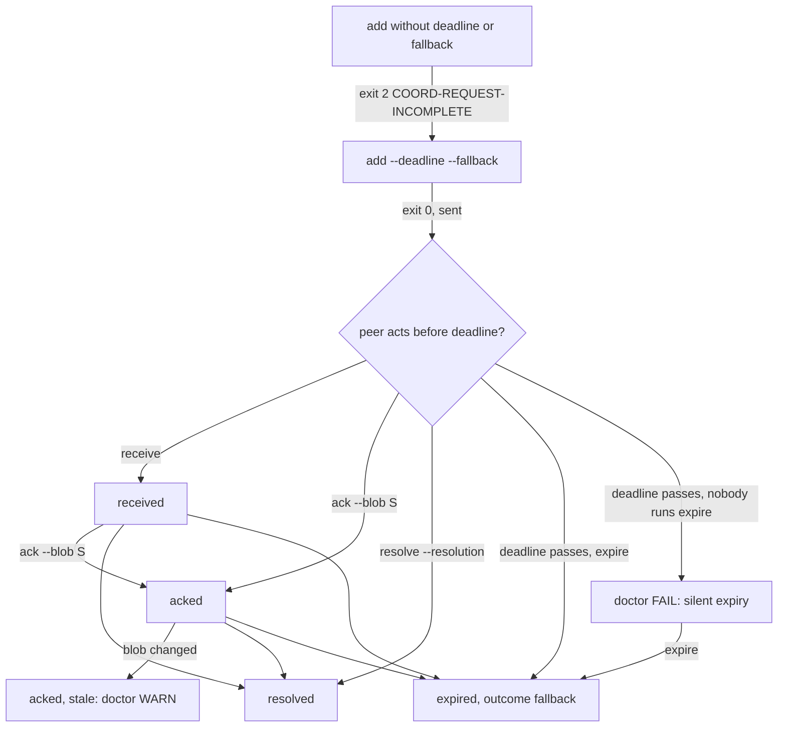

# Spec: Typed seam requests with a termination variant

- **Status:** Draft
- **Tier (cost-of-error):** **T2** — a seam request with no deadline is the measured shape behind ai-de's 28% unresolved requests and MAST's 12.4% termination-unaware failures: a track waits on a peer that never answers, and nothing errors.
- **Author(s) / date:** Product Strategist (lead) + Domain Researcher + Data & Persistence Architect (peers), 2026-09-19. Adversaries at the gate: Test Architect (hard veto), Simplifier (soft veto), Data & Persistence Architect (model veto). **Fan-out 0: every persona was enacted inline by the one authoring agent (the Python Developer, Peer Mode)** — the author-never-clears rule is therefore satisfied only by the gate record below being re-read by the Coordinator at the join, and this is stated rather than hidden.
- **Supersedes / related:** refines `docs/proposals/owner-coordinator-subagent-coordination.md` §3.3 invariant 7 (deadline + fallback, ACK pinned to a blob), §4 "Seam request (typed)", §7 row P1, D5. Sibling of `spec-agent-coordination` (the layer) and `spec-message-layer` (P4: a request may cite a mail id by `--ref`; no new store).

> **Grounding trace (V15):** `spec-typed-seam-requests` → `refines` → `proposal-owner-coordinator-subagent-coordination` (§3.3/7, §4, P1, D5) → `relates-to` → `kb-multi-agent-coordination-data` ("seam requests: add / resolve → unresolved 577 / 324 → ~253 (28%)"; "MAST … termination-unaware 12.4%"; "Path lease TTL default / cap 300 s / 900 s"; "Leader lease … retry 20 s"; invariant 10 "a cross-harness request without a deadline and a recorded fallback is incomplete") → `depends-on` → `adr-0007-coordination-substrate`. Code read, not recalled: `pack/scripts/coord-core.py` (`cmd_request` — `add --to --contract --reason [--from-role] [--path]`, `list --status open|resolved|all`, `resolve <id> --resolution`; `fold_requests` with statuses `open|resolved`; `append_record`; the requests store `.agents/requests.jsonl`; `EXIT = {allow 0, deny 3, not_checked 4}`; the leader constants block D13; `cmd_doctor`, `cmd_metrics`; `make_event`/`append_event`/`fold`/`overlaps`), `pack/scripts/coord_ids.py` (`new_id(scheme, ts_ms=None)` — **no monotonic stamp here**; it lives in `coord-mail.py:_next_ms`), `pack/scripts/audit-log.py` (`next_id` → `coord_ids.new_id` when importable, sequential `al-NNNN` otherwise), `pack/scripts/pack-doctor.py` (`_result(name, status, detail, fix)`; `check_mail`), `tests/docs_explorer/test_coord_core.py::test_request_workflow_add_list_resolve_is_append_only`. **Conflict surfaced (not overridden):** that existing test adds a request with neither deadline nor fallback and asserts exit 0 and status `open`; this spec's US-1 refuses exactly that. Filed as `req-01M2XGPYW5ZNC39094ZCM0WHRW` to the Coordinator. The primary checkout's `.agents/requests.jsonl` does not exist at the time of writing (checked: `wc` → no such file), so "today's untyped rows" is a backward-compatibility requirement, not an observed corpus.

---

## Part A — Functional specification
*Owner: Product Strategist.*

### Problem
A seam request is how one track asks another for something it does not own (a contract, a file edit, a decision). Today `coord request add` records free text and `resolve` closes it; nothing says *by when*, nothing says *what happens if nobody answers*, and an ACK is a sentence rather than a fact about what was read. The measured consequence: 28% of ai-de's 901 request events never reached a resolution, and the requesting track's only options were to wait or to guess. The termination variant is missing from the object itself.

### Target users & personas
- **The Sub-Agent (requester).** Blocked on a seam; needs to know when it may stop waiting and what it may do instead.
- **The Sub-Agent (peer, addressee).** Must acknowledge *what it read*, so a later change to that artifact is visible as a stale ack rather than a silent disagreement.
- **The Coordinator.** Arbitrates; needs one list of what is open, what is past its deadline, what fell back, and what is stale — from `doctor` and `metrics`, not from reading JSONL.

### Core scenario
Track A needs a contract from track B. A adds a request with a 900 s deadline and the fallback "stub the projection and mark `assume:`". B receives it, reads the design blob, acks pinned to that blob's sha. B resolves within the deadline — or does not, and A's `coord request expire` records `outcome: fallback` with the fallback text and A proceeds. Either way the request is terminal by its deadline and the ledger says why.

### In scope / Out of scope (explicit non-goals)
- **In:** the typed `add`; the five states; `receive`, `ack --blob`, `resolve`, `expire`; the ledger row per transition; `doctor` FAIL/WARN lines; `metrics` counts; backward compatibility for untyped rows; `claim --except` and the overlapping-lease doctor WARN (class CTX-R's named control); the ID-A sweep (`coord_ids.new_id` monotonic; every pack-minted id through it).
- **Out (non-goals):** a daemon or watcher that expires requests on its own (D9: `expire` is a verb the requester or Coordinator runs; the kick ladder is P3); the mail store (P4 — a request cites a mail id by `--ref`, read-only); heartbeats/liveness (P3); the doctrine doc (P0); `audit-log.py` changes (read-only here — its allocator path is *reported*); a second store of any kind.

### Conceptual domain model (DM1/DM4 — settled before Parts B and C)
- **Bounded context:** coordination substrate (ADR-0007) — the same context as leases and the leader; a request is the third kind of intent fact.
- **Ubiquitous language:** *request* (the aggregate), *deadline* (an instant, `deadline_at`, after which the request must be terminal), *fallback* (the recorded action the requester takes at the deadline), *blob* (the git blob sha of the artifact a party wrote against or read), *ack* (the addressee's statement "I read blob X"), *stale ack* (the acked blob is no longer the artifact's current blob), *resolution* (the addressee's terminal answer), *outcome* (how a request became terminal: `resolution` or `fallback`), *untyped request* (a row from before this spec, with no deadline/fallback — listed, never expired, never failed).
- **Entities vs value objects:** the **Request** is the entity (identity `req-…`); deadline, fallback text, blob sha, resolution text and outcome are value objects; transitions are immutable facts (append-only rows).
- **Aggregate:** **Request** (root: the request id). **The one invariant it protects: every typed request reaches a terminal state by its deadline — by a resolution, or by its own recorded fallback — never by silence.** A transition is only ever appended; the state is a fold over the rows. Leases are a separate aggregate; a request may *cite* a path or a blob but never holds a lease.
- **State machine:** `sent → received → acked → resolved`, and from any non-terminal state `→ expired` (outcome `fallback`) once `now ≥ deadline_at`. `resolve` is allowed from `sent`, `received` or `acked` (a peer may answer without the ceremony); `ack` requires a blob; `receive` is optional (a doorbell may deliver straight to `ack`).

### User stories & acceptance criteria (testable)

**US-1 — A request without a termination variant is refused.**
```gherkin
Given AGENT_SESSION is set
When I run `coord request add --to peer "need the projection contract"` with no --deadline or no --fallback
Then the exit code is 2
And stderr names the reason `COORD-REQUEST-INCOMPLETE` and the missing flag
And .agents/requests.jsonl gains no row
```
**US-2 — A typed request records its deadline instant.**
```gherkin
When I run `coord request add --to peer --deadline 900 --fallback "stub it" "need the contract"`
Then exit 0 and stdout is JSON with id (req-…) and status "sent"
And the stored row carries deadline_at = at + 900 (one stored quantity; the seconds are the input, not a second field), fallback "stub it", text, to, from
And the session ledger gains one row with type "request", action "add", the id and deadline_at
And with no --deadline the DEFAULT is not silently applied — omission is refused (US-1); the default constant REQUEST_DEADLINE = 900 exists for callers that pass `--deadline default`
```
**US-3 — An ack is pinned to a blob, and a changed blob renders it stale.**
```gherkin
Given a request that names --path docs/x.md and the file's current blob sha is S1
When the peer runs `coord request ack <id> --blob S1`
Then the request is "acked" with ack_blob S1 and `list --json` shows stale false
When docs/x.md changes (current blob S2)
Then `list` shows the request stale true and `coord doctor` prints a WARN naming it
And `ack` without --blob is refused, exit 2, `COORD-REQUEST-ACK-NO-BLOB`
And a request with no path shows stale "not recorded" — never false
```
**US-4 — Expiry records the fallback, never silence.**
```gherkin
Given a typed request whose deadline_at has passed and which is sent, received or acked
When I run `coord request expire` (no id)
Then every such request gains a row kind "request-expire" with outcome "fallback" and the fallback text copied into it
And stdout lists each expired id with its fallback; exit 0 (also 0 when nothing was due, printing "0 expired")
And `expire <id>` on one request that is not yet due exits 3 `COORD-REQUEST-NOT-DUE`; on a terminal one exits 3 `COORD-REQUEST-TERMINAL`
```
**US-5 — Doctor fails a silent expiry and warns on untyped rows.**
```gherkin
Given a typed request past its deadline with no resolve and no expire row
When I run `coord doctor`
Then the requests line reads FAIL with the id and the count, and doctor exits 1
Given only rows without deadline_at/fallback
Then doctor prints a WARN counting them as untyped and exits 0 on their account
And an absent store prints "requests  not recorded (no .agents/requests.jsonl)" — not "0 problems"
```
**US-6 — Metrics count, and say "not recorded" over nothing.**
```gherkin
When I run `coord metrics --json`
Then it carries requests_unresolved_by_deadline, requests_fallback_taken, requests_stale_acks
And over an empty or absent store each is "not recorded", never 0
```
**US-7 — A directory lease can except a peer's files (CTX-R).**
```gherkin
When session A runs `coord claim --path pack/commands --wi WI-1 --except pack/commands/x/SKILL.md`
Then the claim event carries except ["pack/commands/x/SKILL.md"]
And session B's `coord check pack/commands/x/SKILL.md` is allowed (exit 0)
And session B's `coord check pack/commands/y/SKILL.md` is refused (exit 3)
```
**US-8 — Doctor warns on overlapping live leases.**
```gherkin
Given two live leases from two sessions whose paths overlap and neither excepts the other
When I run `coord doctor`
Then a WARN line names both sessions and the overlapping path (doctor's exit is unchanged by a WARN)
```
**US-9 — Every pack-minted id is strictly ordered within a process (ID-A).**
```gherkin
When 1,000 ids are minted per prefix (req, mail, al, cl, wt) in a burst
Then the sequence is strictly increasing in string order and has no duplicate
And an explicit ts_ms (as coord-mail passes) is honoured as given
```
**US-10 — Backward compatibility.** Rows in `.agents/requests.jsonl` written before this spec (no `deadline_at`) list with status `untyped` (or `resolved` if resolved), are never expired, never counted unresolved-by-deadline, and never fail doctor.

### Non-functional requirements (ISO/IEC 25010 checklist)
- **Functional suitability:** the ten stories above; every transition a row; no second store.
- **Reliability:** append-only; a damaged row makes `request` NOT CHECKED (exit 4), as today. Stale detection reads the file and hashes it in-process (git's blob formula) — no subprocess on the list path.
- **Performance:** the requests fold is O(rows); the blob hash is one file read per acked request with a path; no measurable change to `check` (requests are not folded there).
- **Portability:** `encoding="utf-8"` on every open and subprocess; `newline="\n"` on text writes; no machine paths; the three portability lints exit 0.
- **Usability (CLI):** every refusal is a named code on its own line with a remedy; no colour is load-bearing.
- **Security:** request text and fallback are interpolated through `_safe` before rendering (they are read by another model — STRIDE B4 elevation, as for refusals). `--ref` is recorded, not dereferenced.
- **Maintainability:** one constants block `REQUEST_DEADLINE = 900`, `REQUEST_RETRY = 20` beside the leader's (D13), tuned from `metrics`, cited by name in doctrine.

### Boundary set
`cmd_request` (verbs) → `fold_requests` (state) → `.agents/requests.jsonl` (store) → session ledger `log/<session>.jsonl` (`type: request` rows) → `cmd_doctor` / `pack-doctor.py check_requests` (readers) → `cmd_metrics` (counts) → `coord_ids.new_id` (identity) → `overlaps`/`fold`/`check` (`--except`) → `test_coord_requests_typed.py`, `test_coord_ids_order.py`.

### Comparables & user evidence (sourced)
| Claim | Source | Confidence |
|---|---|---|
| 28% of seam requests never resolved (253 of 901 events) | KB data-and-constants row "seam requests"; ai-de `.agents/requests.jsonl` | Verified (KB row read) |
| MAST termination-unaware 12.4% | KB row [AC-25] | Verified (KB row read) |
| ai-de handshake "not waiting on Codex" as the fallback shape | proposal §5, KB invariant 10 | Verified (read) |
| Kubernetes leases: retry 2 s, ×20 for a sleeping fleet → 20 s | KB [QLE-5]; D13 | Verified (read) |
| Git's blob hash = sha1("blob <len>\0" + content) | git object format (Pro Git §10.2) | Inferred — confirmed by the design's spike against `git hash-object` |

### Applicable governance lenses
Quality attributes (above) · threat model (B4 interpolation; `--ref` not dereferenced; no path outside the repo is read for staleness — `_relativise`/repo root) · privacy: none (session ids and text authored by agents) · accessibility: text-only CLI · release/rollback: additive rows and optional flags; an old reader ignores new fields; rollback is deleting no data · observability: `metrics` gains three measures; every transition is on the ledger.

### AI-integrated allocation
None — deterministic CLI; the readers are agents but no model runs inside.

## Part B — UX specification (in CLI terms)
*Owner: UX Researcher / IA (enacted inline).*

### Personas & jobs-to-be-done
Requester: "record what I need, by when, and what I do otherwise". Addressee: "say what I read, then answer". Coordinator: "see what is silent, stale or fallen back without opening a file".

### Information architecture
`coord request` — `add` · `receive <id>` · `ack <id> --blob` · `resolve <id> --resolution` · `expire [<id>]` · `list [--status sent|received|acked|resolved|expired|untyped|open|all] [--json]`. `open` = every non-terminal state (sent/received/acked/untyped). `coord claim --except`. `coord doctor` gains `requests` and `lease overlap` lines. `coord metrics` gains three lines.

### User flows


### UX acceptance criteria (falsifiable)
- A refused `add` names the missing flag in one line and writes nothing.
- `list` renders state, deadline (as `in 120s` / `overdue 30s`), stale, and outcome in one row per request; `--json` carries the same fields.
- `expire` with nothing due prints `0 expired` and exits 0 — an empty run is distinguishable from a failed one.

## Part C — UI specification
**N/A — command-line tool with no visual surface;** the operator HTML board (P6) reads the same rows and is out of scope here.

## Flagged risks & residual unknowns
- **R1 (Flagged):** the existing test `test_request_workflow_add_list_resolve_is_append_only` conflicts with US-1/US-2 (status `open` → `sent`); resolved by the Coordinator at the join (`req-01M2XGPYW5ZNC39094ZCM0WHRW`).
- **R2 (Inferred):** the monotonic stamp in `coord_ids.new_id` is per process; two processes minting in one millisecond still order by the random part. The cross-process property (collision-freedom) is unchanged; strict order is a per-issuer promise, as for mail.
- **R3 (Flagged):** `audit-log.py` is read-only for this track; its `al-`/`cl-` ids go through `coord_ids.new_id` **only when the import succeeds and `COORD_LEGACY_IDS` is unset** — the sequential fallback is outside the monotonic guarantee. Reported, not changed.

## Gate record
| Adversary | Attack | Outcome |
|---|---|---|
| Simplifier (soft veto) | "`receive` is ceremony — a doorbell delivers to ack." | Kept as *optional*: it is one row and the state the proposal names; `ack` from `sent` is allowed. No veto. |
| Simplifier | "`REQUEST_RETRY` is unused by P1." | Accepted as a *named constant only* (D13 says one block; P3's kick ladder consumes it). Marked `simplify:` in code. |
| Test Architect (hard veto) | "Stale over a request without a path asserts nothing." | Fixed: `not recorded`, never `false`; US-3 last clause. |
| Test Architect | "Metrics over an empty store must not read 0." | US-6: `not recorded`. |
| Data & Persistence Architect | "`deadline_s` and `deadline_at` are two definitions of one quantity." | Store `deadline_at` only (US-2). |
| Data & Persistence Architect | "Is the aggregate boundary right — does a request hold a lease?" | No: it cites a path/blob; leases are a separate aggregate. |
| Author self-check | Fan-out 0 means the adversaries were the author. | Stated; the Coordinator re-reads this table at the join. |

**Verdict:** PASS-WITH-CONDITIONS — condition R1 (the existing test) is the Coordinator's at the join.

## Status
| | |
|---|---|
| **Completed** | Grounding traversal; conflict surfaced; ten stories; model; gate record |
| **Remaining** | `/design-slice` → `docs/design/typed-seam-requests.md`; `/implement` |
| **Best next action** | design-slice: the Request aggregate's rows and the stale computation |
